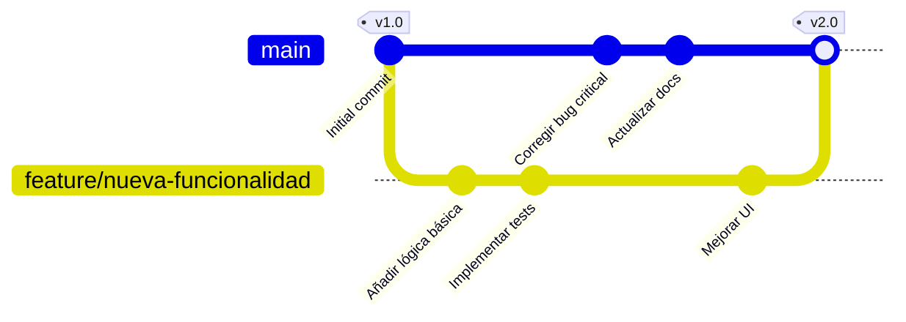
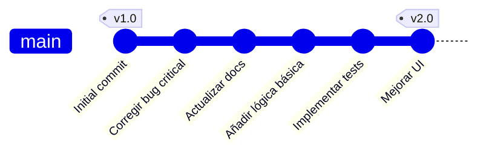
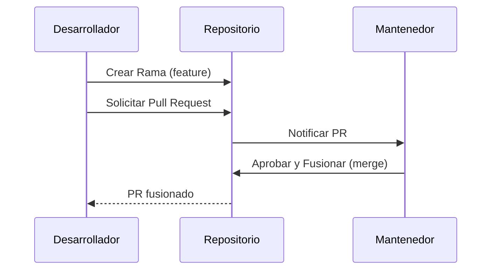
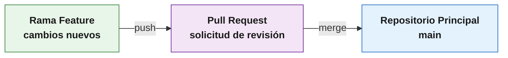

# Trabajando con Git y GitHub

---

## Git Branch (Ramas)

### ¿Qué es una rama (branch)?

Una **rama** es simplemente un camino donde está nuestro código. Técnicamente, es un **apuntador** a donde van los commits que realizamos.

```
main ──●──●──●──●──
              ↑
         (último commit)
```

### Rama principal: `main`

Cuando inicializamos Git, se genera automáticamente la rama **main**, donde se guardarán los nuevos commits.

---

### Comandos para trabajar con ramas

#### Ver todas las ramas del proyecto

```bash
git branch
```

**Salida:**
```
* main
```

> El asterisco `*` indica la rama en la que te encuentras actualmente.

#### Crear una nueva rama

```bash
git branch nombre-rama
```

> **Nota:** Después de crear la rama, **no** cambias automáticamente a ella. Sigues en la rama original.

#### Cambiar de rama

```bash
git checkout nombre-rama
```

#### Crear y cambiar a la nueva rama en un solo paso

```bash
git checkout -b nombre-rama
```

---

### ¿Cuándo crear una nueva rama?

| Situación | Recomendación |
|-----------|---------------|
| Nueva funcionalidad | Crear rama específica |
| Corrección de errores | Crear rama de hotfix |
| Experimentación | Crear rama de prueba |
| Trabajo en equipo | Cada desarrollador en su rama |

---

## Git Stash - Guardar cambios temporalmente

### ¿Qué es `git stash`?

Es un comando que permite **reservar o "apartar"** las modificaciones que estamos haciendo en nuestra rama actual para realizar una tarea emergente.

### Comandos de Stash

#### Guardar cambios temporalmente

```bash
git stash
```

Los cambios "desaparecen" del directorio actual, pero se guardan en un área paralela.

#### Ver los cambios guardados

```bash
git stash list
```

#### Recuperar los cambios guardados

```bash
git stash pop
```

### Uso recomendado

> ## 📦 ¿Cuándo usar `git stash`?
> 
> ### ✅ Cuándo SÍ usar:
> - Resolver un problema urgente
> - Te interrumpen mientras trabajas
> - No quieres hacer un commit incompleto
> 
> ### ❌ Cuándo NO usar:
> - No como reemplazo de commits
> - No para guardar cambios por largos períodos

> **Recomendación:** Usar `git stash` en casos puntuales donde necesites de forma urgente solucionar problemas detectados mientras trabajas en una nueva versión.

---

## Git Rebase - Historial más limpio

### ¿Qué problema resuelve?

En equipos de desarrollo, múltiples desarrolladores trabajan en paralelo, generando muchas ramas y commits que dificultan la lectura del historial.

### Comando

```bash
git rebase
```

**Antes del rebase:**


**Después del rebase:**


### Beneficios de `git rebase`

- Historial más limpio
- Menos ramas
- Menos commits distribuidos
- Mejor lectura del historial general

---

## GitHub Pages

### ¿Qué es GitHub Pages?

GitHub Pages es un servicio de **alojamiento de sitio estático** que:

- Toma archivos HTML, CSS y JavaScript directamente desde un repositorio en GitHub
- Opcionalmente ejecuta los archivos a través de un proceso de compilación
- Publica un sitio web

> *Fuente: Documentación de GitHub*

### Características

| Característica | Descripción |
|----------------|-------------|
| **Gratuito** | Sin costo para sitios públicos |
| **Fácil** | Publicación con solo configurar la rama |
| **Rápido** | Sitios estáticos de alto rendimiento |
| **Dominio propio** | URL personalizada: `username.github.io` |

---

## Demostración: Implementando GitHub Pages

### Paso 1: Crear un repositorio

Crea un repositorio con el nombre `prueba-ghpages` (o `username.github.io` para el sitio principal).

![Creación del repositorio]

### Paso 2: Clonar el repositorio

```bash
git clone https://github.com/username/username.github.io
```

### Paso 3 y 4: Acceder al repositorio y abrir en VS Code

```bash
cd username.github.io
code .
```

### Paso 5: Crear el archivo `index.html`

```html
<!DOCTYPE html>
<html>
<head>
    <title>Pruebas de Github Pages</title>
</head>
<body>
    <h1>Pruebas de Github Pages</h1>
</body>
</html>
```

### Paso 6: Subir los cambios

```bash
git add --all
git commit -m "Initial commit"
git push -u origin main
```

### Paso 7: Configurar GitHub Pages

1. Ve a **Settings** (Configuraciones)
2. En el panel izquierdo, busca **Pages**

### Paso 8: Configurar la rama

1. Selecciona la rama `main`
2. Haz clic en **Save**

### Paso 9: Obtener la URL

Espera unos segundos/minutos y GitHub te entregará un enlace de acceso:

```
https://username.github.io/nombre-repositorio/
```

---

## Demostración: Práctica de Pull Request

### ¿Qué es un Pull Request?

Un **Pull Request** es una acción disponible en GitHub que permite a un desarrollador solicitar la revisión y aprobación de sus cambios.

### Flujo de trabajo con Pull Request



### Instrucciones para la práctica

1. **El/la docente** crea un repositorio e invita a los estudiantes como colaboradores

2. **Un estudiante** clona el repositorio y crea una rama distinta a `main`:
   ```bash
   git checkout -b feature/nueva-funcionalidad
   ```

3. **El estudiante** añade una nueva funcionalidad (archivo HTML o CSS)

4. **El estudiante** sube los cambios a la rama creada:
   ```bash
   git add .
   git commit -m "Añade nueva funcionalidad"
   git push origin feature/nueva-funcionalidad
   ```

5. **El/la docente** revisa los cambios y entrega feedback

6. **Si los cambios son aprobados**, el/la docente realiza el merge de la nueva rama

---

## Resumen

En esta unidad hemos aprendido:

### Terminal y comandos
- Comandos principales para navegar y manipular archivos

### Git y control de versiones
- Importancia de versionar nuestro código
- Recursos locales y remotos para gestionar proyectos

### Ramas (branches)
- Creación y gestión de ramas
- Trabajo en paralelo sin afectar el código principal

### Herramientas clave
| Herramienta | Uso |
|-------------|-----|
| `git branch` | Gestionar ramas |
| `git stash` | Guardar cambios temporalmente |
| `git rebase` | Limpiar el historial |
| `git push` | Subir cambios |
| `git pull` | Bajar cambios |
| **GitHub Pages** | Publicar sitios estáticos |
| **Pull Request** | Solicitar revisión de cambios |

### Beneficios de estas herramientas
- Resguardar nuestro progreso
- Hacer pruebas de concepto sin impactar el código principal
- Trabajar en equipos con responsabilidades diversas