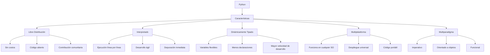

# Introducción a Python

## Notas del relator

Felicitaciones por completar el _Módulo 2 - Fundamentos de desarrollo web front end_.

En el módulo anterior aprendiste a utilizar el lenguaje de programación Javascript nada más para utilizar jQuery con el objetivo de seleccionar elementos de una página web y cambiar su contenido o sus propiedades mediante eventos.

>Considera en un futuro no lejano aprender más sobre Javascript del lado del cliente como un lenguaje de programación que tiene el potencial suficiente para implementar lógica compleja sobre tus sitios web.

---

## Python y su relevancia en este bootcamp

>Aprenderás Python para utilizar un framework de desarrollo web llamado Django

Por esta razón, dedicaremos dos módulos consecutivos a entender sus propiedades, consultar su documentación y practicar su uso en varios ejercicios, abordando también temas como la algoritmia, el pensamiento lógico y el diseño de soluciones computacionales de baja complejidad.

---

## Lenguaje de programación Python, un enfoque útil

Al igual que Javascript, Python facilita la creación de archivos fuente con instrucciones que el computador ejecutará para resolver un problema.

### Python: un lenguaje de libre distribución

Puedes usar Python **gratis**, para lo que quieras (incluso lucrar $$$), sin pagar licencias ni pedir permiso a nadie.

Imagina que Python es como una **receta de pizza** que alguien compartió en internet. No solo puedes usarla gratis, sino que también puedes:
- Modificar la receta a tu gusto
- Compartir tu versión mejorada
- Vender pizzas hechas con esa receta

La única condición es que, si mejoras la receta, también la compartas con la comunidad (eso es lo que hace el "código abierto").

**Lo importante es que:**
- No necesitas ahorrar para comprar una licencia costosa
- Si encuentras un error o mejoras algo, puedes ayudar a millones de personas
- Puedes ver exactamente cómo funciona Python por dentro

---

### Python: un lenguaje interpretado

Python ejecuta tu código **línea por línea**, a medida que lo necesitas, sin tener que hacer una "traducción completa" previa a lenguaje de máquina.

Imagina que necesitas traducir un discurso del español al inglés, entonces tendremos dos situaciones:

**Lenguaje compilado (como C o Java)**: 
- Traduces **todo el discurso** por escrito antes de darlo (esto es la "compilación")
- Luego lo lees frente al público
- Si te equivocaste en la traducción, tienes que rehacer todo el proceso

**Lenguaje interpretado (como Python y Javascript)**: 
- Tienes un **traductor en vivo** a tu lado (esto es el "intérprete")
- Vas hablando frase por frase, y el traductor va traduciendo sobre la marcha
- Si dices algo mal, te das cuenta inmediatamente y lo corriges

**Ventajas**
✅ Puedes experimentar y corregir errores rápidamente. Ideal para aprender y prototipar.
✅ Depuras sobre la marcha. No necesitas esperar a que termine una compilación larga para saber si funciona.
✅ Puedes modificar el código en tiempo de ejecución. Útil para pruebas y entornos interactivos (ej: Jupyter Notebooks).

**Desventaja**
❌ Tus programas pueden ejecutarse más lentos que en C o Java, pero para la mayoría de aplicaciones (web, datos, scripts, automatización y aprendizaje) es suficiente.

#### Ejemplo práctico

> Programa que muestra en la consola (CLI) cuatro mensajes distintos cualesquiera.

Prueba 1: En lenguaje C (compilado)

```c
#include <stdio.h>

int main(){
  printf("Mensaje 1\n");
  printf("Mensaje 2\n");
  print("Mensaje 3\n"); // Error
  printf("Mensaje 4\n");
  return 0;
}
```

Mensaje del compilador:
```
main.c: In function 'main':
main.c:6:3: error: implicit declaration of function 'print'; did you mean 'printf'? [-Wimplicit-function-declaration]
    6 |   print("Mensaje 3\n"); // Error
      |   ^~~~~
      |   printf
```

>[!NOTE]
>La compilación es una etapa previa a la ejecución, si no se compila el archivo fuente (como en este ejemplo), entonces no se ejecutará el programa.

Prueba 2: En lenguaje Python (interpretado)
```python
print("Mensaje 1\n");
print("Mensaje 2\n");
printf("Mensaje 3\n"); # Error
print("Mensaje 4\n");
```

Salida (ejecución):
```
Mensaje 1

Mensaje 2

Traceback (most recent call last):
  File "c:/Users/user/Desktop/RTD-25-01-13-0053-4/modulo03/clase15-python-introducción/main.py", line 3, in <module>
    printf("Mensaje 3\n"); # Error
    ^^^^^^
NameError: name 'printf' is not defined. Did you mean: 'print'?
```

Observa que las líneas 1 y 2 del código Python sí se ejecutaron, pese a que la tercera línea de código generó un error que finalizó el programa.

---

## 3. Dinámicamente Tipado

### ¿Qué significa?
Las variables en Python **no tienen un tipo fijo**. Puedes guardar un número, luego un texto, y luego una lista en la misma variable sin problemas.

### Analogía 📦
Imagina que las variables son como **cajas de cartón**:

**Tipado estático (como Java)**: 
- Tienes cajas etiquetadas con "solo números", "solo texto", "solo fechas"
- Si intentas meter un texto en la caja de números, el sistema te lo impide
- Necesitas saber de antemano qué vas a guardar

**Tipado dinámico (como Python)**: 
- Tienes cajas sin etiquetar
- Puedes guardar lo que quieras en cualquier momento
- La caja se adapta a lo que le pongas

### Ejemplo práctico
```python
# En Python, esto es totalmente válido
mi_variable = 42          # Ahora es un número
mi_variable = "Hola"      # Ahora es un texto
mi_variable = [1, 2, 3]   # Ahora es una lista
```

### Ventajas
✅ **Menos código que escribir**: No necesitas declarar tipos
✅ **Más flexible**: Puedes adaptar tus variables sobre la marcha
✅ **Ideal para prototipos**: Pruebas ideas rápidamente sin preocuparte por tipos

### Desventaja
❌ **Puede causar errores sutiles**: Si esperas un número y te llega un texto, el programa puede fallar en tiempo de ejecución

### Consejo para trainees 💡
Aunque Python no te exija declarar tipos, **siempre usa nombres descriptivos** para tus variables. En lugar de `x = 42`, usa `edad_usuario = 42`. ¡Tu yo del futuro te lo agradecerá!

---

## 4. Multiplataforma

### ¿Qué significa?
Puedes escribir código Python en **Windows, Mac o Linux**, y funcionará igual en todos ellos sin cambios (o con cambios mínimos).

### Analogía 🌍
Imagina que aprendes a cocinar y tienes un **libro de recetas universal**:

- No importa si tu cocina tiene una estufa eléctrica (Windows), de gas (Mac) o inducción (Linux)
- La receta funciona igual en todas
- Solo necesitas ajustar pequeños detalles (como la temperatura exacta)

### ¿Por qué es importante?
- **Trabajas en cualquier equipo**: Puedes programar en tu Mac en casa y en tu PC en el trabajo
- **Despliegue flexible**: Puedes subir tu aplicación a cualquier servidor
- **Menos problemas**: No tienes que reescribir código para diferentes sistemas operativos

### Excepción a la regla
Algunas librerías muy específicas (como las que controlan hardware) pueden no ser multiplataforma, pero el 99% de lo que harás sí lo será.

---

## 5. Multiparadigma

### ¿Qué significa?
Python te permite programar de **diferentes estilos**, y puedes mezclarlos según necesites.

### Analogía 🛠️
Python es como una **navaja suiza** para programar:

**Paradigma Imperativo** (el más básico):
- Como una **lista de instrucciones paso a paso**
- "Haz esto, luego esto, luego esto otro"
- Ideal para scripts simples

**Paradigma Orientado a Objetos** (el más popular en la industria):
- Como un **juego de Lego** donde cada pieza es un "objeto"
- Las piezas tienen propiedades (como color y tamaño) y acciones (como encajar con otras)
- Ideal para proyectos grandes y complejos

**Paradigma Funcional** (el más avanzado):
- Como una **cadena de montaje** donde cada estación transforma el producto
- Los datos fluyen y se transforman sin cambiar nada original
- Ideal para procesamiento de datos

### Ejemplo práctico

**Imperativo** (paso a paso):
```python
# Suma todos los números
numeros = [1, 2, 3, 4, 5]
total = 0
for num in numeros:
    total = total + num
print(total)
```

**Orientado a Objetos** (como piezas Lego):
```python
class Calculadora:
    def __init__(self):
        self.total = 0
    
    def sumar(self, num):
        self.total = self.total + num
        return self.total

calc = Calculadora()
print(calc.sumar(5))  # 5
print(calc.sumar(10)) # 15
```

**Funcional** (cadena de montaje):
```python
# Pura transformación de datos
from functools import reduce
numeros = [1, 2, 3, 4, 5]
total = reduce(lambda x, y: x + y, numeros)
print(total)  # 15
```

### ¿Por qué es importante?
✅ **Puedes elegir el estilo adecuado** para cada problema
✅ **Aprendes conceptos fundamentales** que aplican a otros lenguajes
✅ **Te prepara para el mundo real**, donde usarás diferentes paradigmas

---

## 6. Administración: Python Software Foundation y Licencia Open Source

### ¿Qué significa?
Hay una **organización sin fines de lucro** (Python Software Foundation) que:
- Protege el lenguaje
- Administra el desarrollo
- Organiza eventos y conferencias

Y todo el código está disponible para que cualquiera lo vea, use y modifique (licencia de código abierto).

### Analogía 🏛️
Imagina que Python es un **parque público**:

- La **Python Software Foundation** es como el **consejo municipal** que cuida el parque
- La **licencia open source** significa que cualquiera puede:
  - Usar el parque (y sus bancos, columpios, etc.)
  - Proponer mejoras
  - Construir cosas nuevas en él

### ¿Por qué es importante?
- **Estabilidad**: Hay un equipo dedicado a mantener Python
- **Comunidad activa**: Millones de personas colaboran, reportan errores y crean soluciones
- **Futuro asegurado**: No desaparecerá porque una empresa decida cerrarlo

---

## Resumen Visual



---

## Ejercicio Práctico para Trainees 🎯

Abre tu terminal de Python y prueba estas ideas:

```python
# 1. Demuestra que es interpretado (ejecuta línea por línea)
print("Línea 1")
print("Línea 2")
# Si escribes algo mal, solo falla esa línea

# 2. Demuestra que es dinámicamente tipado
variable = 10
print(f"Variable es: {variable} (tipo: {type(variable)})")
variable = "Hola"
print(f"Variable es: {variable} (tipo: {type(variable)})")
variable = [1, 2, 3]
print(f"Variable es: {variable} (tipo: {type(variable)})")

# 3. Demuestra que es multiplataforma
import sys
print(f"Estás ejecutando esto en: {sys.platform}")
# Esto funciona en Windows, Mac y Linux
```

---

## Conclusión

Python no es solo un lenguaje más; es una **herramienta diseñada para humanos**. Cada una de estas características está pensada para:

1. **Reducir la fricción** al aprender a programar
2. **Aumentar la productividad** del desarrollador
3. **Facilitar la colaboración** entre equipos
4. **Resolver problemas reales** de forma elegante

Como trainee, estás aprendiendo en el lenguaje que más empresas están usando hoy en día. Y estas características son precisamente las que lo han convertido en el favorito de la industria.

**¿Tienes dudas sobre algún punto?** ¡Pregunta en clase! Recuerda: en programación, la única pregunta tonta es la que no se hace. 💪

---

*¡Sigue así, futuro Pythonista! 🐍*