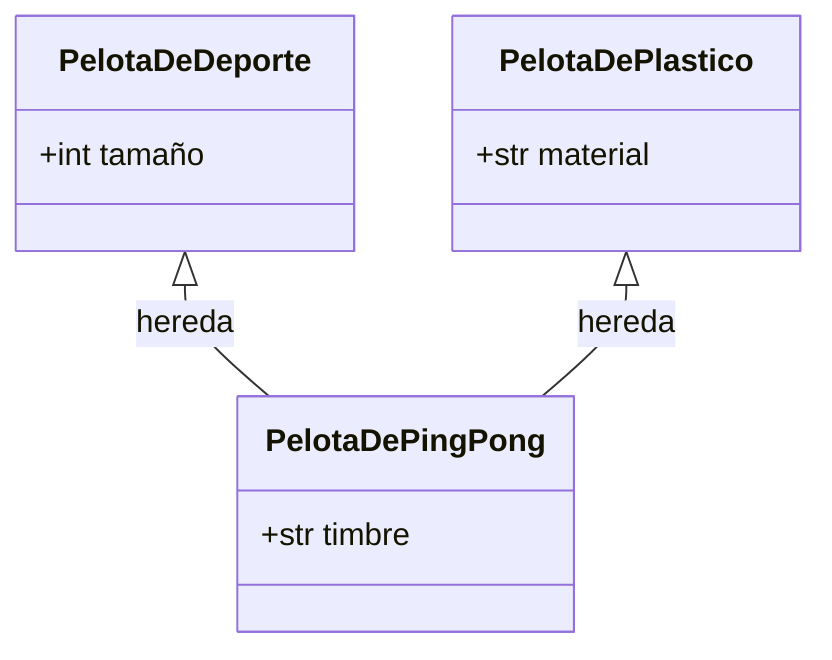
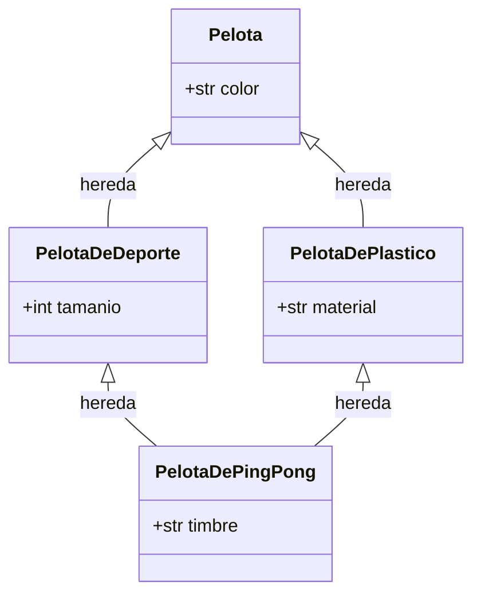

# Problema de Herencia múltiple en forma de diamante

En el ejemplo de Herencia Múltiple anterior, las clases padre `PelotaDeDeporte` y `PelotaDePlastico` no eran hijas de otra clase:



Pero si la tuvieran ¿qué sucedería con el mismo código?

Se tiene entonces lo siguiente:
```python
class Pelota:
    def __init__(self, color: str):
        print(f"-> Inicializando la base Pelota (Color: {color})")
        self.color = color

class PelotaDeDeporte(Pelota):
    def __init__(self, tamanio: int, color: str):
        # Llamada manual a la base
        Pelota.__init__(self, color) 
        print("Creando pelota de deporte")
        self.tamanio = tamanio

class PelotaDePlastico(Pelota):
    def __init__(self, material: str, color: str):
        # Llamada manual a la base
        Pelota.__init__(self, color) 
        print("Creando pelota de plástico")
        self.material = material

class PelotaDePingPong(PelotaDeDeporte, PelotaDePlastico):
    def __init__(self, timbre: str, tamanio: int, material: str, color: str):
        # Llamadas manuales secuenciales
        PelotaDeDeporte.__init__(self, tamanio, color)
        PelotaDePlastico.__init__(self, material, color)
        print("Creando pelota de ping pong")
        self.timbre = timbre

# Instanciación
pdpp = PelotaDePingPong(timbre="POWERTI", tamanio=4, material="plástico", color="Blanco")
```

Su correspondiente diagrama de clases es la siguiente:


## El problema

Sucede que al construir un objeto de la clase hija `PelotaDePingPong`:

```python
PelotaDePingPong(timbre="POWERTI", tamanio=4, material="plástico", color="Blanco")
```

Se invoca a su método constructor:

```python
class PelotaDePingPong(PelotaDeDeporte, PelotaDePlastico):
    def __init__(self, timbre: str, tamanio: int, material: str, color: str):
        # Llamadas manuales secuenciales
        PelotaDeDeporte.__init__(self, tamanio, color)
        PelotaDePlastico.__init__(self, material, color)
        print("Creando pelota de ping pong")
        self.timbre = timbre
```

Dentro de ese método se ejecuta la instrucción `PelotaDeDeporte.__init__(self, tamanio, color)`, llamando al método constructor del padre `PelotaDeDeporte`:

```python
class PelotaDeDeporte(Pelota):
    def __init__(self, tamanio: int, color: str):
        # Llamada manual a la base
        Pelota.__init__(self, color) 
        print("Creando pelota de deporte")
        self.tamanio = tamanio
```

Dicho método invoca al método de su ancestro: el constructor de la clase `Pelota`:

```python
class Pelota:
    def __init__(self, color: str):
        print(f"-> Inicializando la base Pelota (Color: {color})")
        self.color = color
```

En resumen, la pila de ejecución es la siguiente:
```
PelotaDePingPong.__init__ --> PelotaDeDeporte.__init__ --> Pelota.__init__
```

Sin embargo, el problema ocurre después de resolver esa pila de ejecución, es decir, al ejecutar la instrucción `PelotaDePlastico.__init__(self, material, color)`, puesto que una nueva pila de ejecución invocará nuevamente al método constructor de la clase `Pelota`:

```
PelotaDePingPong.__init__ --> PelotaDePlástico.__init__ --> Pelota.__init__
```

>[!IMPORTANT]
>`PelotaDeDeporte` y `PelotaDePlástico` son clases hijas de la clase `Pelota` y ambas invocan su método constructor para funcionar

Esto representa un desperdicio de recursos, redundancia y *sobreescritura destructiva*

### Sobreescritura destructiva
Es posible que en el futuro se edite el código para que `PelotaDeDeporte` y `PelotaDePlastico` modificaran el atributo color de formas distintas durante su inicialización. Entonces la última clase en ser llamada manualmente (`PelotaDePlastico`) borraría por completo y sin avisar el trabajo que hizo la primera.

```python

class Pelota:
    def __init__(self, color: str):
        self.color = color

class PelotaDeDeporte(Pelota):
    def __init__(self, tamanio: int, color: str):
        Pelota.__init__(self, color) 
        # Modificación legítima: Las pelotas de deporte usan colores fosforescentes para visibilidad
        self.color = self.color + " Fosforescente"
        print(f"[Deporte] Color establecido en: {self.color}")
        self.tamanio = tamanio

class PelotaDePlastico(Pelota):
    def __init__(self, material: str, color: str):
        Pelota.__init__(self, color) 
        # Modificación legítima: El plástico al moldearse queda con acabado brillante
        self.color = self.color + " Brillante"
        print(f"[Plástico] Color establecido en: {self.color}")
        self.material = material

class PelotaDePingPong(PelotaDeDeporte, PelotaDePlastico):
    def __init__(self, timbre: str, tamanio: int, material: str, color: str):
        # LLAMADAS MANUALES SECUENCIALES
        PelotaDeDeporte.__init__(self, tamanio, color)
        PelotaDePlastico.__init__(self, material, color)
        self.timbre = timbre

# Instanciamos una pelota que inicialmente queremos que sea de color "Blanco"
pdpp = PelotaDePingPong(timbre="POWERTI", tamanio=4, material="plástico", color="Blanco")

print(f"\n>>> RESULTADO FINAL EN MEMORIA - Color de la pelota: '{pdpp.color}'")
```

## Solución: uso de `super().__init__(**kwargs)`

La versión con `super().__init__(**kwargs)` es la siguiente:
```python
class Pelota:
    def __init__(self, color: str, **kwargs):
        # Base final antes de 'object'. Limpia el parámetro color.
        super().__init__(**kwargs)
        self.color = color

class PelotaDeDeporte(Pelota):
    def __init__(self, tamanio: int, **kwargs):
        # super() delega al siguiente en el MRO (PelotaDePlastico)
        super().__init__(**kwargs)
        # Se ejecuta al regresar en la cadena: modifica el color base
        self.color = self.color + " Fosforescente"
        print(f"[Deporte] Color modificado a: {self.color}")
        self.tamanio = tamanio

class PelotaDePlastico(Pelota):
    def __init__(self, material: str, **kwargs):
        # Al ser el último intermedio, sube directamente a Pelota
        super().__init__(**kwargs)
        # Se ejecuta al regresar de Pelota: añade su acabado
        self.color = self.color + " Brillante"
        print(f"[Plástico] Color modificado a: {self.color}")
        self.material = material

class PelotaDePingPong(PelotaDeDeporte, PelotaDePlastico):
    def __init__(self, timbre: str, **kwargs):
        # Inicia el viaje cooperativo por el MRO
        super().__init__(**kwargs)
        print("Creando pelota de ping pong")
        self.timbre = timbre

# Instanciación
pdpp = PelotaDePingPong(timbre="POWERTI", tamanio=4, material="plástico", color="Blanco")

print(f"\n>>> RESULTADO FINAL EN MEMORIA - Color de la pelota: '{pdpp.color}'")

```

### Ruteo de la solución

Al contrario de lo que se suele pensar, en Python super() no significa "llama a mi padre directo". Significa: "Busca la siguiente clase en la lista del MRO".

>[!NOTE]
>Es convencional explicar que `super()` hace referencia a una clase padre en términos de Herencia Simple, momento en el que se deconoce la Herencia Múltiple y el MRO.

Por lo tanto, el flujo de ejecución de los constructores ocurre en cadena como un "pase de estafeta":

- `PelotaDePingPong.__init__` se ejecuta y llama a `super()`. Python mira el MRO y ve que la siguiente clase es `PelotaDeDeporte`.
  
  **¿Cómo se explica entonces?**

  Se ingresan los argumentos `timbre="POWERTI", tamanio=4, material="plástico", color="Blanco"` en la instanciación de la clase `PelotaDePingPong` y son recibidos por los parámetros `timbre` y `**kwargs`. Entonces los datos se procesan en el cuerpo del método de la siguiente manera:

    ```python
    PelotaDePingPong(timbre="POWERTI", tamanio=4, material="plástico", color="Blanco")
    ```

    llama a `PelotaDePingPong.__init__`:
    ```python
    class PelotaDePingPong(PelotaDeDeporte, PelotaDePlastico):
        def __init__(self, timbre: str, **kwargs):
            # Inicia el viaje cooperativo por el MRO
            super().__init__(**kwargs) # **kwargs = **{"material":"plástico", "color":"Blanco"}
            print("Creando pelota de ping pong")
            self.timbre = timbre # timbre = "POWERTI"
    ```

    el método `super().__init__(**kwargs)` recibe el diccionario `kwargs` y lo desempaqueta como parámetros:

    ```python
    class PelotaDePingPong(PelotaDeDeporte, PelotaDePlastico):
        def __init__(self, timbre: str, **kwargs):
            ## kwargs = {"material":"plástico", "color":"Blanco"}
            super().__init__(**kwargs) # **kwargs = **{"material":"plástico", "color":"Blanco"}
            ## Equivale a:
        ## super().__init__(material="plástico", color="Blanco")
    ```

>[!IMPORTANT]
>```python
>diccionario = {"nombre":"Juan Pablo", "apellido":"Astorga"}
>mi_funcion(diccionario) # {"nombre":"Juan Pablo", "apellido":"Astorga"}
>```
>
>Es distinto de:
>```python
>diccionario = {"nombre":"Juan Pablo", "apellido":"Astorga"}
>mi_funcion(**diccionario) # nombre = "Juan Pablo", apellido: "Astorga"
>```

La idea es la misma en los siguientes pasos:

- `PelotaDeDeporte.__init__` se ejecuta. Si no tuviera `super()`, la cadena se rompería aquí. Pero como sí lo tiene, Python mira el MRO y ve que la siguiente clase es `PelotaDePlastico`. ¡A pesar de que `PelotaDeDeporte` no hereda de `PelotaDePlastico`!
- `PelotaDePlastico.__init__` se ejecuta, llama a `super()`, el cual apunta a la clase nativa `object.__init__` (que no hace nada) y la cadena de subida termina.

**En síntesis**

En cuanto a `**kwargs`, como cada constructor necesita parámetros diferentes (tamanio, material, timbre), los constructores usan el empaquetado de diccionarios `**kwargs`.
- Cada clase "atrapa" el parámetro que le interesa de los argumentos y le pasa el resto (los "copresidentes" del diccionario) a la siguiente clase en el MRO mediante `super()`.
- Al final de la cadena de subida, el diccionario queda vacío, por lo que `object.__init__()` se ejecuta sin errores.