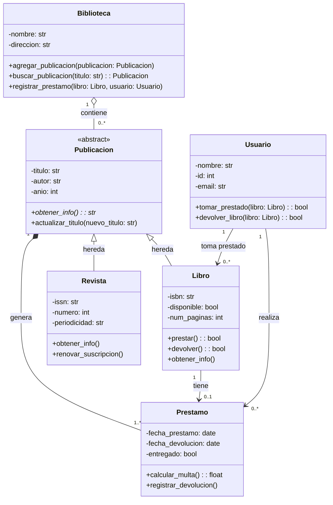
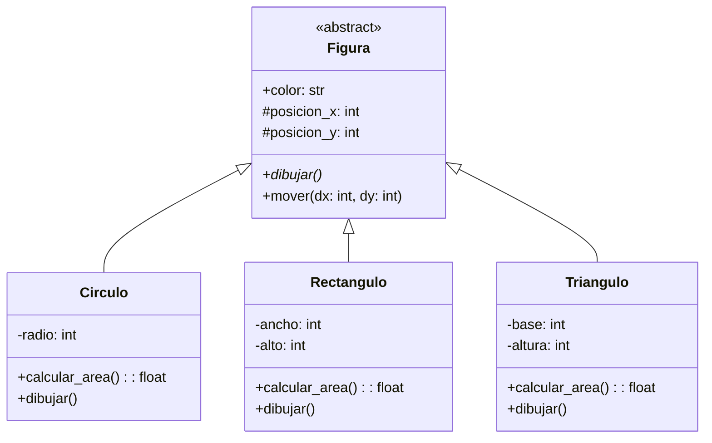
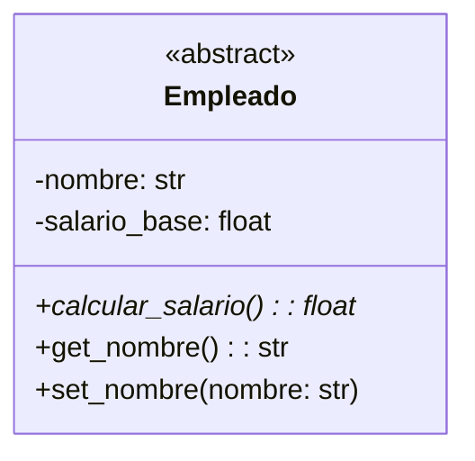
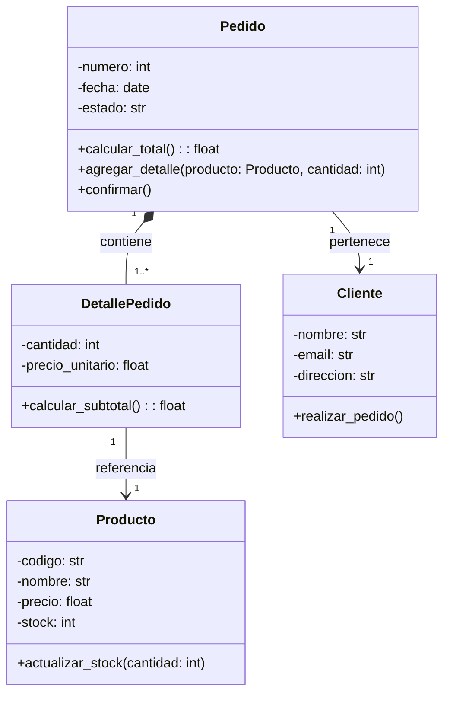
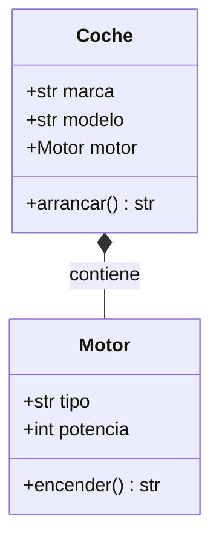
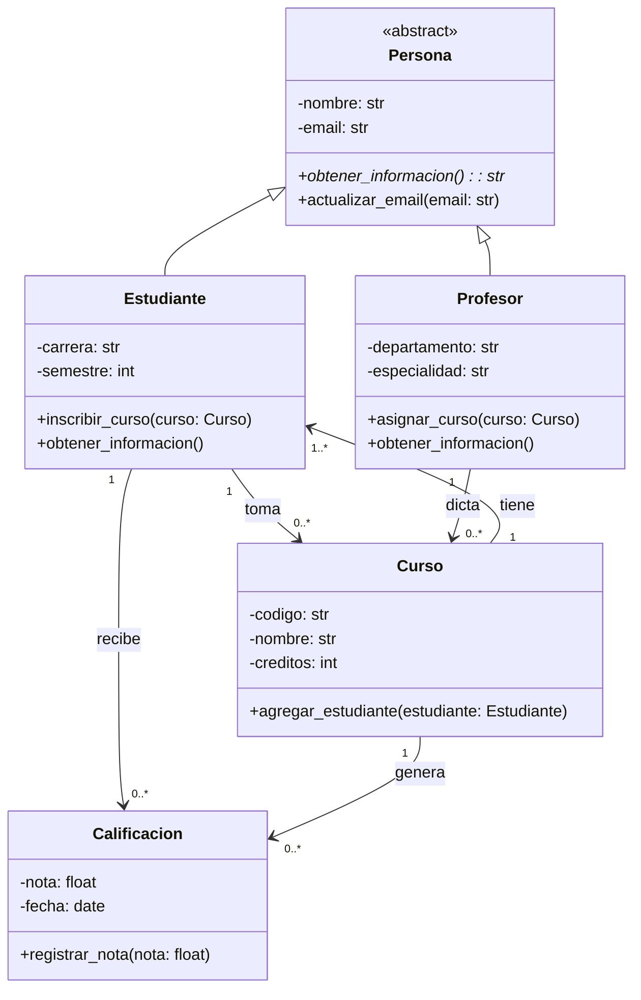

# Cuestionario: Diagramas de Clases en UML

---

## Pregunta 1

**¿Cuál es el propósito principal de un diagrama de clases en el desarrollo de software?**

A) Mostrar la interfaz de usuario y la navegación entre pantallas

B) Documentar los requisitos funcionales del sistema en lenguaje natural

C) Especificar el orden de ejecución de los métodos en tiempo de ejecución

D) Representar la estructura estática del sistema mostrando clases, atributos, métodos y relaciones

<details>
<summary><strong>Ver respuesta</strong></summary>

**Respuesta correcta: D**

**Justificación:** El diagrama de clases es una representación gráfica de la estructura estática de un sistema orientado a objetos. Muestra las clases que componen el sistema, sus atributos y métodos, así como las relaciones entre ellas (herencia, composición, colaboración). Su propósito es visualizar la arquitectura del sistema antes de implementarlo.

</details>

---

## Pregunta 2

**Dado el siguiente diagrama de clases, ¿qué relación existe entre las clases `Biblioteca` y `Publicacion`?**



**¿Qué tipo de relación existe entre `Biblioteca` y `Publicacion`?**

A) Composición: `Publicacion` no puede existir sin `Biblioteca`

B) Herencia: `Publicacion` es una especialización de `Biblioteca`

C) Agregación: `Publicacion` puede existir independientemente de `Biblioteca`

D) Colaboración: `Biblioteca` usa temporalmente `Publicacion`

<details>
<summary><strong>Ver respuesta</strong></summary>

**Respuesta correcta: C**

**Justificación:** La relación entre Biblioteca y Publicacion es una **agregación** (representada por el rombo vacío `o--`). Esto indica que las publicaciones pueden existir independientemente de la biblioteca. Una publicación puede ser creada sin pertenecer a una biblioteca específica, puede ser transferida entre bibliotecas, y si la biblioteca desaparece, las publicaciones continúan existiendo. La multiplicidad "0..*" confirma que una biblioteca puede tener cero o muchas publicaciones.

</details>

---

## Pregunta 3

**En un diagrama de clases UML, ¿qué símbolo se utiliza para representar una relación de herencia?**

A) Una flecha sólida con punta de triángulo blanco

B) Una línea sólida con un rombo negro en un extremo

C) Una flecha punteada con punta negra

D) Una línea sólida con un rombo vacío en un extremo

<details>
<summary><strong>Ver respuesta</strong></summary>

**Respuesta correcta: A**

**Justificación:** La herencia en UML se representa con una flecha sólida que tiene una punta con forma de triángulo blanco (hueco), que apunta hacia la clase padre. La opción B es composición (rombo negro), C es colaboración (flecha punteada), y D es agregación (rombo vacío).

</details>

---

## Pregunta 4

**Dado el siguiente diagrama de clases de un sistema de figuras geométricas, ¿cuál es la afirmación correcta sobre las operaciones?**



A) `calcular_area()` es un método heredado de `Figura`

B) `mover()` es un método abstracto que debe ser implementado por las clases hijas

C) `dibujar()` es un método concreto en `Figura` que heredan las clases hijas

D) `dibujar()` es un método abstracto que debe ser implementado por las clases hijas

<details>
<summary><strong>Ver respuesta</strong></summary>

**Respuesta correcta: D**

**Justificación:** En el diagrama, `dibujar()` tiene un asterisco (*) al final, lo que indica que es un método abstracto. Además, la clase `Figura` está marcada como `<<abstract>>`. Los métodos abstractos deben ser implementados por las clases hijas. `calcular_area()` no está en la clase padre (no es heredado), y `mover()` es un método concreto en la clase padre (no tiene asterisco).

</details>

---

## Pregunta 5

**Dado el siguiente fragmento de diagrama de clases, ¿cuál sería la implementación correcta de la clase `Empleado` en Python?**



A) 
```python
class Empleado:
    def __init__(self, nombre, salario_base):
        self.nombre = nombre
        self.salario_base = salario_base
    
    def calcular_salario(self):
        raise NotImplementedError()
```

B) 
```python
from abc import ABC

class Empleado(ABC):
    def __init__(self, nombre, salario_base):
        self.__nombre = nombre
        self.__salario_base = salario_base
    
    def calcular_salario(self):
        pass
```

C) 
```python
from abc import ABC, abstractmethod

class Empleado(ABC):
    def __init__(self, nombre, salario_base):
        self.__nombre = nombre
        self.__salario_base = salario_base
    
    @abstractmethod
    def calcular_salario(self) -> float:
        pass
    
    @property
    def nombre(self) -> str:
        return self.__nombre
    
    @nombre.setter
    def nombre(self, nombre: str) -> None:
        self.__nombre = nombre
```

D) 
```python
class Empleado:
    def __init__(self, nombre, salario_base):
        self.nombre = nombre
        self.salario_base = salario_base
    
    def calcular_salario(self):
        return self.salario_base
```

<details>
<summary><strong>Ver respuesta</strong></summary>

**Respuesta correcta: C**

**Justificación:** La opción C implementa correctamente la clase abstracta con:
- Herencia de `ABC` para definir clase abstracta
- Decorador `@abstractmethod` para `calcular_salario()`
- Atributos privados con el doble guion bajo (__) para encapsulamiento
- Propiedades con `@property` para getters y setters
- Coincidencia con la notación UML (- privado, + público)

</details>

---

## Pregunta 6

**En un diagrama de clases, ¿qué indica la multiplicidad "1..*" en una relación?**

A) Uno o más objetos de la clase relacionada

B) Exactamente un objeto de la clase relacionada

C) Cero o más objetos de la clase relacionada

D) Un número específico de objetos determinado por una variable

<details>
<summary><strong>Ver respuesta</strong></summary>

**Respuesta correcta: A**

**Justificación:** La multiplicidad "1..*" indica que una instancia de la clase en un extremo de la relación puede estar asociada con uno o más objetos de la clase en el otro extremo. Es decir, el mínimo es 1 y el máximo es ilimitado (representado por el asterisco). La opción B sería "1", C sería "0..*", y D no es una notación estándar.

</details>

---

## Pregunta 7

**Dado el siguiente diagrama de clases de un sistema de pedidos, ¿qué tipo de relación existe entre `Pedido` y `DetallePedido`?**



A) Herencia: `DetallePedido` es una especialización de `Pedido`

B) Composición: `DetallePedido` no puede existir sin `Pedido`

C) Agregación: `DetallePedido` puede existir sin `Pedido`

D) Colaboración: `Pedido` usa temporalmente `DetallePedido`

<details>
<summary><strong>Ver respuesta</strong></summary>

**Respuesta correcta: B**

**Justificación:** La relación entre Pedido y DetallePedido es de composición (indicada por el rombo negro sólido). Esto significa que los detalles del pedido no pueden existir sin el pedido mismo. Si un pedido se elimina, sus detalles también deben eliminarse. El rombo está en el extremo de Pedido, indicando que Pedido es el compuesto que contiene a DetallePedido.

</details>

---

## Pregunta 8

**Dado el siguiente diagrama de clases, ¿cuál sería la implementación correcta en Python para la relación entre `Coche` y `Motor`?**



A) 
```python
class Motor:
    def __init__(self, tipo, potencia):
        self.tipo = tipo
        self.potencia = potencia
    
    def encender(self):
        return "Motor encendido"

class Coche:
    def __init__(self, marca, modelo, motor):
        self.marca = marca
        self.modelo = modelo
        self.motor = motor
```

B) 
```python
class Motor:
    def __init__(self, tipo, potencia):
        self.tipo = tipo
        self.potencia = potencia
    
    def encender(self):
        return "Motor encendido"

class Coche(Motor):
    def __init__(self, marca, modelo, tipo, potencia):
        super().__init__(tipo, potencia)
        self.marca = marca
        self.modelo = modelo
```

C) 
```python
class Coche:
    def __init__(self, marca, modelo):
        self.marca = marca
        self.modelo = modelo

class Motor:
    def __init__(self, tipo, potencia):
        self.tipo = tipo
        self.potencia = potencia
    
    def encender(self):
        return "Motor encendido"
```

D) 
```python
class Motor:
    def __init__(self, tipo, potencia):
        self.tipo = tipo
        self.potencia = potencia
    
    def encender(self):
        return "Motor encendido"

class Coche:
    def __init__(self, marca, modelo, tipo_motor):
        self.marca = marca
        self.modelo = modelo
        self.motor = Motor(tipo_motor, 150)
    
    def arrancar(self):
        return self.motor.encender()
```

<details>
<summary><strong>Ver respuesta</strong></summary>

**Respuesta correcta: D**

**Justificación:** La relación de composición indica que Motor se crea dentro de Coche (no se pasa como parámetro externo). La opción D implementa correctamente esto creando el motor dentro del constructor de Coche. La opción A es agregación (el motor se pasa desde fuera), B es herencia (incorrecta, Coche no es un Motor), y C no establece la relación correctamente.

</details>

---

## Pregunta 9

**¿Qué información proporciona la sección central de una clase en un diagrama UML?**

A) Los atributos de la clase con sus tipos y niveles de acceso

B) El nombre de la clase y sus relaciones con otras clases

C) Los métodos u operaciones que puede realizar la clase

D) Las instancias de la clase que existen en el sistema

<details>
<summary><strong>Ver respuesta</strong></summary>

**Respuesta correcta: A**

**Justificación:** En un diagrama de clases UML, el rectángulo de una clase se divide en tres secciones horizontales:
1. **Sección superior**: Nombre de la clase
2. **Sección media**: Atributos con sus tipos y niveles de acceso
3. **Sección inferior**: Métodos u operaciones

La opción A describe correctamente la sección media. La opción B corresponde a la sección superior con relaciones externas, C es la sección inferior, y D no es parte de la notación de clase.

</details>

---

## Pregunta 10

**Dado el siguiente diagrama de clases de un sistema educativo, ¿qué afirmación es correcta?**



A) `Persona` es una clase concreta que puede ser instanciada directamente

B) `obtener_informacion()` es un método abstracto que `Estudiante` y `Profesor` deben implementar

C) `obtener_informacion()` es un método que las clases hijas pueden opcionalmente sobrescribir

D) La relación entre `Curso` y `Estudiante` es de composición

<details>
<summary><strong>Ver respuesta</strong></summary>

**Respuesta correcta: B**

**Justificación:** `obtener_informacion()` tiene un asterisco (*) que indica que es un método abstracto. La clase `Persona` está marcada como `<<abstract>>`, por lo que no puede ser instanciada directamente. Los métodos abstractos deben ser implementados por todas las clases hijas concretas. Tanto `Estudiante` como `Profesor` implementan este método (se indica en sus secciones de operaciones).

</details>
