# Características de un Diagrama de Clases

## Unidad 3: Herencia y Polimorfismo

---

## Índice

1. [¿Qué es un Diagrama de Clases?](#qué-es-un-diagrama-de-clases)
2. [Software para Crear Diagramas de Clases](#software-para-crear-diagramas-de-clases)
3. [¿Para qué Sirven los Diagramas de Clases?](#para-qué-sirven-los-diagramas-de-clases)
4. [Notación UML](#notación-uml)
5. [Construcción de un Diagrama de Clases](#construcción-de-un-diagrama-de-clases)
6. [Leyendo un Diagrama de Clases](#leyendo-un-diagrama-de-clases)
7. [Ejercicio Guiado: Escribiendo un Diagrama de Clases](#ejercicio-guiado-escribiendo-un-diagrama-de-clases)
8. [Ejercicio Guiado: Código a partir de un Diagrama de Clases](#ejercicio-guiado-código-a-partir-de-un-diagrama-de-clases)
9. [Preguntas Clave](#preguntas-clave)

---

## ¿Qué es un Diagrama de Clases?

### Definición

Un **diagrama de clases** es una representación gráfica de la estructura de un programa, en él se especifican:
- Las clases que componen el programa (con sus respectivos nombres, atributos y métodos)
- Las relaciones entre ellas

### UML (Unified Modeling Language)

Los diagramas de clases se definen utilizando el **lenguaje unificado de modelado (UML)**, el cual es un lenguaje estandarizado de modelado consistente en un conjunto de diagramas integrados que permiten desarrollar y visualizar artefactos en un proyecto de software.

### Ejemplo Básico

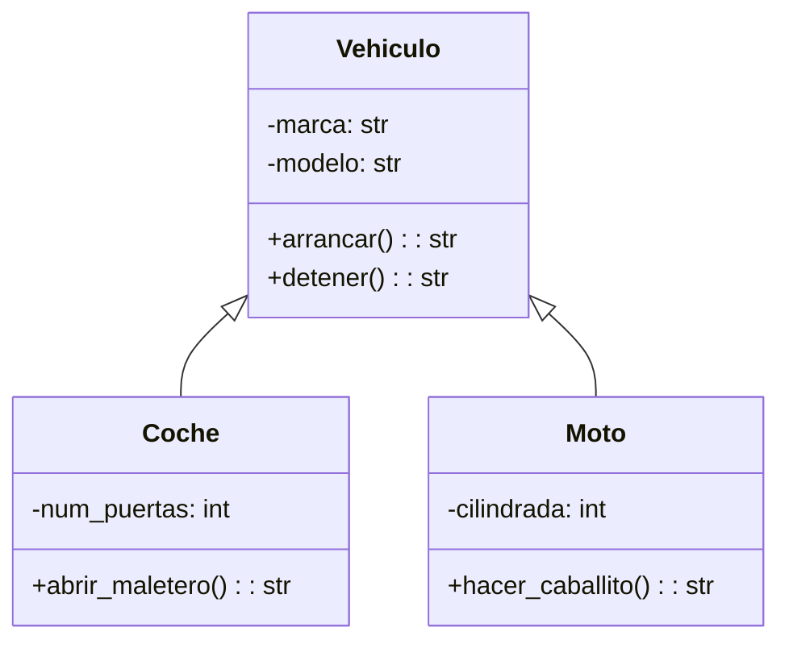

---

## Software para Crear Diagramas de Clases

### Herramientas Disponibles

| Herramienta | Tipo | Características |
|-------------|------|-----------------|
| **StarUML** | Software especializado | Completo, orientado a UML |
| **Creately** | Online | Interfaz intuitiva, colaborativo |
| **Lucidchart** | Online | Integración con otras herramientas |
| **Miro** | Online | Pizarra colaborativa, flexible |
| **Draw.io** | Online/Offline | Gratuito, integración con Google Drive |

### Consideraciones

- Algunas aplicaciones tienen limitaciones en su plan gratuito
- Para acceder a funcionalidades avanzadas se debe actualizar a un plan de pago
- **No es necesario** hacer uso de software específico para crear un diagrama de clases

---

## ¿Para qué Sirven los Diagramas de Clases?

### Propósitos Principales

1. **Panorama general**: Representar los elementos principales del programa
2. **Jerarquía**: Mostrar la jerarquía de las clases involucradas
3. **Relaciones**: Representar herencia, composición y colaboración
4. **Diseño**: Ayudar a determinar dónde aplicar relaciones
5. **Construcción**: Guiar la construcción del código
6. **Comprensión**: Entender el propósito del programa antes de construirlo

### Beneficios

- **Visualización clara** de la estructura del sistema
- **Planificación** antes de escribir código
- **Comunicación** entre miembros del equipo
- **Documentación** del diseño del sistema
- **Detección temprana** de problemas de diseño

---

## Notación UML

### Notación de Clases

Las clases se representan por un rectángulo separado en **tres secciones horizontales**:

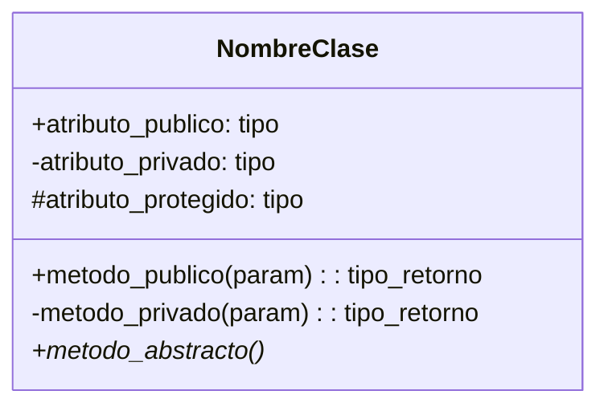

### Niveles de Acceso

| Símbolo | Significado | Descripción |
|---------|-------------|-------------|
| **+** | Público | Acceso desde cualquier clase |
| **-** | Privado | Acceso solo dentro de la clase |
| **#** | Protegido | Acceso dentro de la clase y sus subclases |
| **~** | Paquete | Acceso dentro del mismo paquete |

### Multiplicidad en Relaciones

La multiplicidad indica cuántos objetos de una clase se pueden relacionar con otra:

| Notación | Significado | Ejemplo |
|----------|-------------|---------|
| **Rango** | Mínimo..Máximo | `0..1` (cero o uno) |
| **Rango con cota** | Mínimo..* (sin límite) | `0..*` (cero o muchos) |
| **Valor** | Cantidad única | `1` (exactamente uno) |
| **Serie** | Valores específicos | `(2, 5, 7)` |

### Relaciones en UML

#### Herencia

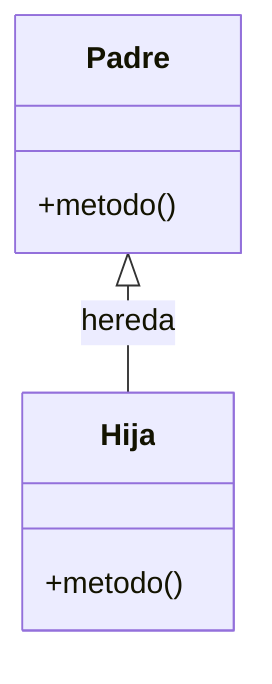

#### Composición

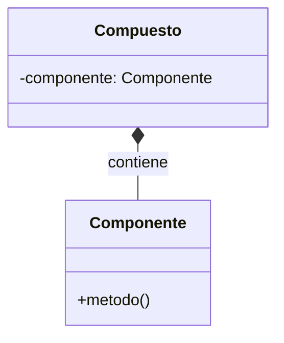

#### Agregación

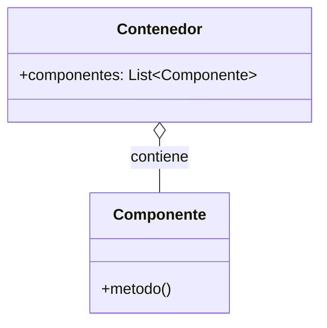

#### Colaboración

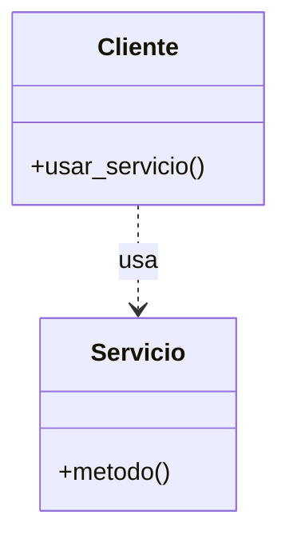

### Atributos en un Diagrama de Clases

| Elemento | Notación | Ejemplo |
|----------|----------|---------|
| **Nivel de acceso** | Antes del nombre | `+color` |
| **Tipo de dato** | Después de `:` | `+nombre: str` |
| **Atributo de clase** | Subrayado | `+forma: str` |
| **Valor por defecto** | Después de `=` | `+color = "amarillo"` |

### Métodos en un Diagrama de Clases

**Importante:** En la sección de operaciones:
- No se deben escribir getters, setters, ni métodos privados
- Se indican los comportamientos característicos de la clase
- Se debe indicar el nivel de acceso antes del nombre
- Opcionalmente, se puede agregar el tipo de retorno
- Los métodos abstractos se escriben en cursiva

---

## Construcción de un Diagrama de Clases

### Ejemplo Completo

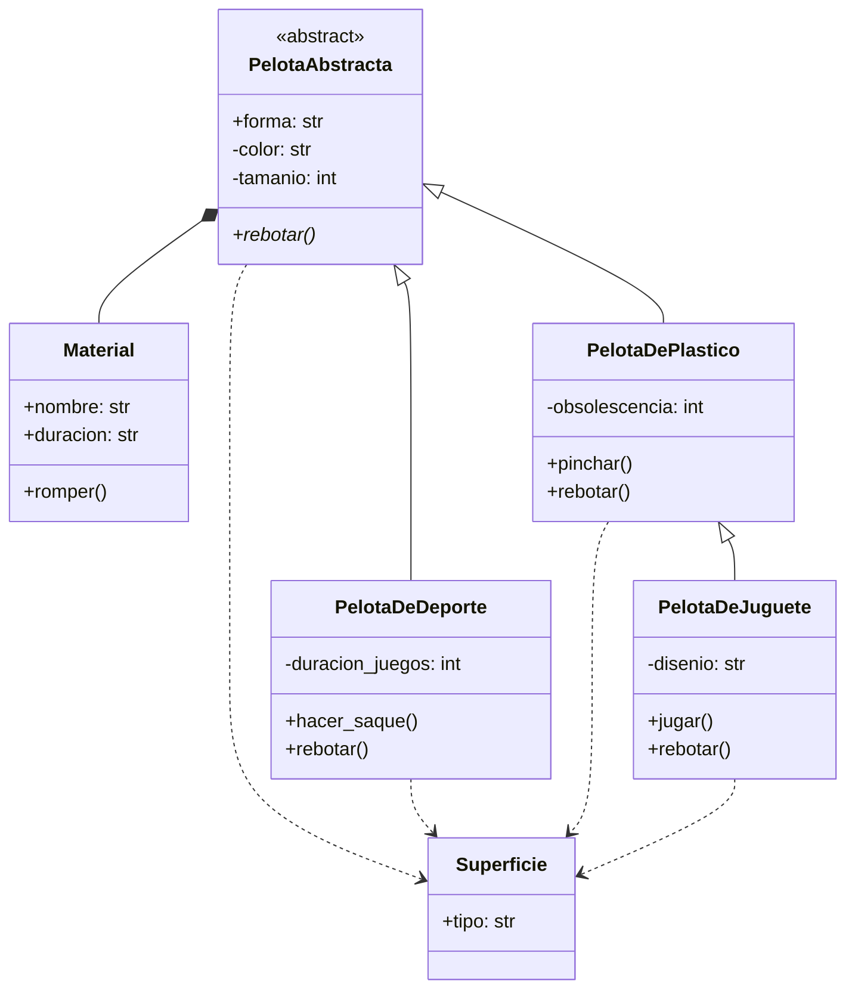

### Relaciones en el Ejemplo

1. **Herencia**: PelotaAbstracta → PelotaDeDeporte, PelotaDePlastico, PelotaDeJuguete
2. **Composición**: PelotaAbstracta → Material (rombo negro)
3. **Colaboración**: Todas las pelotas → Superficie (flecha punteada)

---

## Leyendo un Diagrama de Clases

### Análisis del Diagrama de Pelotas

#### Parte 1: Clase Abstracta y Composición

**"La clase abstracta PelotaAbstracta es un compuesto que tiene 1 componente Material. La clase PelotaAbstracta tiene el atributo de clase forma (público), los atributos de instancia (privados) color, tamanio y forma, y el método abstracto rebotar (público). La clase Material tiene los atributos de instancia (públicos) nombre y duración, y el método (público) romper."**

#### Parte 2: Jerarquía de Herencia

**"Las clases PelotaDeDeporte, PelotaDePlastico y PelotaDeJuguete son subclases de la clase base PelotaAbstracta, heredando sus atributos. Las tres sobrescriben el método rebotar."**

**"La clase PelotaDeDeporte tiene, además de los heredados, el atributo de instancia duracion_juegos (privado) y el método hacer_saque (público). La clase PelotaDePlastico tiene, además de los heredados, el atributo de instancia obsolescencia (privado), y el método pinchar (público)."**

**"La clase PelotaDeJuguete hereda de la clase PelotaDePlastico, y tiene (además de los atributos heredados de PelotaAbstracta y de PelotaDePlastico) el atributo de instancia disenio (privado) y el método jugar (público)"**

#### Parte 3: Colaboraciones

**"Las clases PelotaDeDeporte, PelotaDePlastico y PelotaDeJuguete usan la clase Superficie (la clase Superficie colabora con ellas)."**

#### Parte 4: Herencia Múltiple

**"Las clases PelotaDeTenis, PelotaDeFutbol y PelotaDePingPong son una PelotaDeDeporte (heredan de ella), siendo además la clase PelotaDePingPong una PelotaDePlastico (hereda de ella). Estas tres últimas también usan la clase Superficie en una colaboración."**

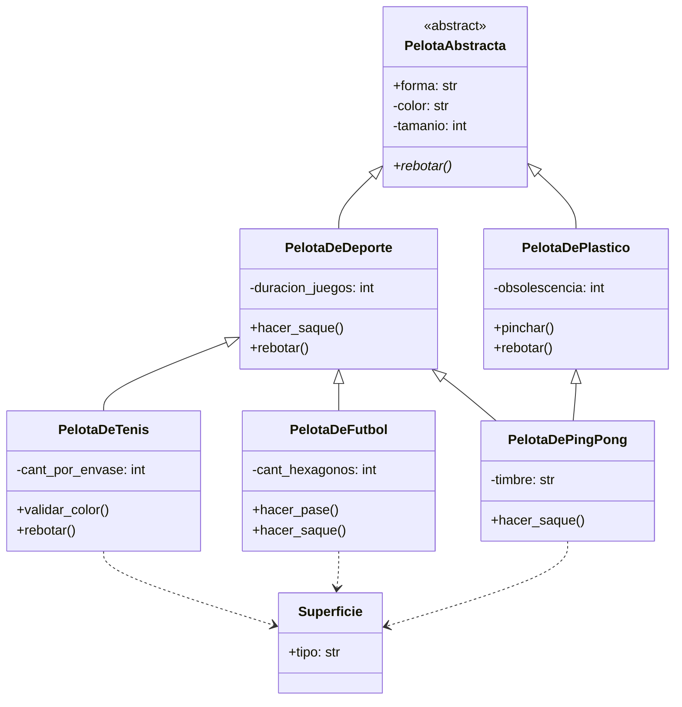

#### Parte 5: Detalles de Clases Hijas

**"La clase PelotaDeTenis, además de los atributos heredados (tanto de PelotaDeDeporte como de PelotaAbstracta), tiene el atributo de instancia (privado) cant_por_envase, el método (público) validar_color y el método rebotar (público, sobrescrito de PelotaDeDeporte)."**

**"La clase PelotaDeFutbol, además de los atributos heredados (tanto de PelotaDeDeporte como de PelotaAbstracta) tiene el atributo de instancia (privado) cant_hexagonos, y los métodos (públicos) hacer_pase, y hacer_saque (sobrescrito de PelotaDeDeporte)."**

**"La clase PelotaDePingPong tiene, además de los atributos heredados (tanto de PelotaDeDeporte, como de PelotaDePlastico y de PelotaAbstracta), el atributo de instancia timbre (privado), y el método hacer_saque (sobrescrito de PelotaDeDeporte)."**

---

## Ejercicio Guiado: Escribiendo un Diagrama de Clases

### Contexto del Problema

Formas parte del equipo de trabajo de una empresa de creación de software. Se te ha encargado crear el diagrama de clases del prototipo de una **red social** que involucra a la entidad **Usuario**.

### Requisitos del Sistema

#### Usuario
- **Creación**: Requiere correo electrónico y contraseña
- **Validaciones**: Reglas de validación para correo y contraseña (mecanismo propio del usuario)
- **Atributos**:
  - Lista de amigos (otros usuarios) - inicialmente vacía
  - Foto de perfil (con imagen por defecto)
  - Álbum de fotos (lista de fotos) - inicialmente vacío
- **Restricciones**: Los tres valores requieren procesos específicos para ser modificados

#### Relaciones del Usuario
- **Amigos**: Un usuario puede tener ningún o muchos amigos (otros usuarios)
- **Reacciones**: Puede usar una foto de otro usuario (no necesariamente amigo) para añadir una reacción
- **Fotos**: Un usuario tiene fotos (de perfil o en el álbum)

#### Fotos
- **Existencia**: Una foto no puede existir por sí misma, siempre asociada a un usuario
- **Creación**: Requiere imagen (ruta web), ancho y alto (píxeles)
- **Estado**: Se crea con 0 reacciones
- **Foto de Perfil**: Tipo especial de foto
  - Imagen por defecto: 'extras/user.png'
  - Dimensiones: 400x400 píxeles
  - Atributo adicional: recorte (lista de 4 tuplas con coordenadas)

### Paso 1: Creación de la Clase Usuario

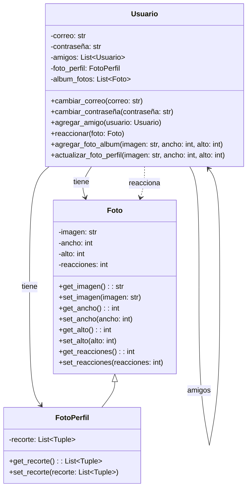

### Paso 2: Creación de la Clase Foto

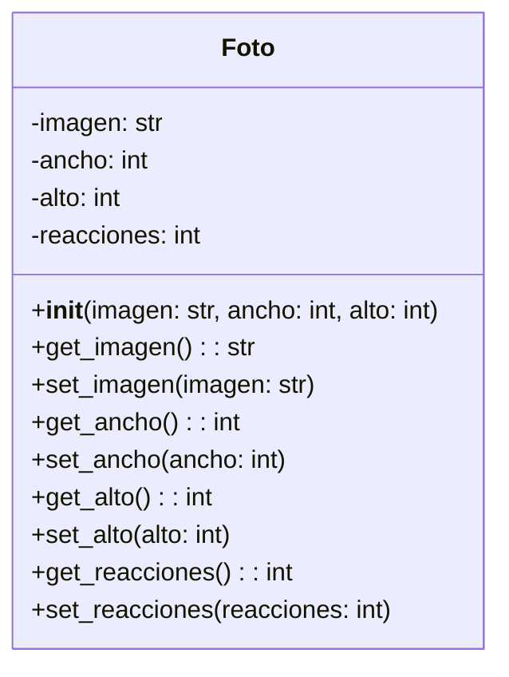

### Paso 3: Creación de la Clase FotoPerfil

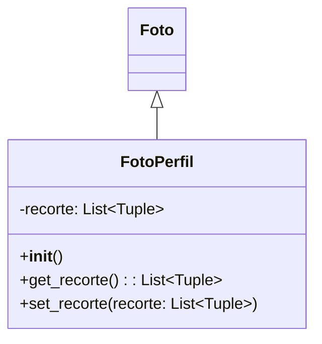

### Diagrama Completo de la Red Social

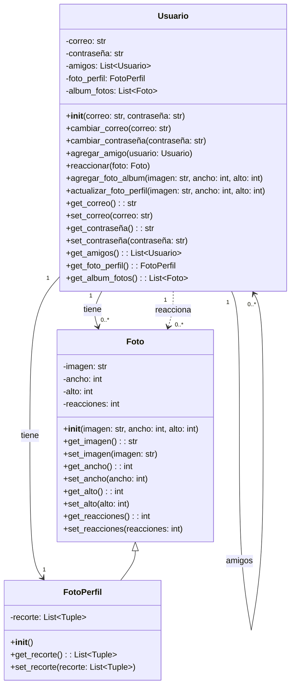

---

## Ejercicio Guiado: Código a partir de un Diagrama de Clases

### Implementación Paso a Paso

#### Paso 1: Clase Foto

```python
# archivo foto.py

class Foto():
    def __init__(self, imagen: str, ancho: int, alto: int) -> None:
        self.__imagen = imagen
        self.__ancho = ancho
        self.__alto = alto
        self.__reacciones = 0
    
    @property
    def imagen(self) -> str:
        return self.__imagen
    
    @imagen.setter
    def imagen(self, imagen: str) -> None:
        self.__imagen = imagen
    
    @property
    def ancho(self) -> int:
        return self.__ancho
    
    @ancho.setter
    def ancho(self, ancho: int) -> None:
        self.__ancho = ancho
    
    @property
    def alto(self) -> int:
        return self.__alto
    
    @alto.setter
    def alto(self, alto: int) -> None:
        self.__alto = alto
    
    @property
    def reacciones(self) -> int:
        return self.__reacciones
    
    @reacciones.setter
    def reacciones(self, reacciones: int) -> None:
        self.__reacciones = reacciones
```

#### Paso 2: Clase FotoPerfil

```python
# archivo foto.py (continuación)

class FotoPerfil(Foto):
    def __init__(self) -> None:
        super().__init__(
            "extras/user.png",
            400,
            400
        )
        self.__recorte = [
            (0, 0),
            (self.ancho, 0),
            (0, self.alto),
            (self.ancho, self.alto)
        ]
    
    @property
    def recorte(self) -> list:
        return self.__recorte
    
    @recorte.setter
    def recorte(self, recorte: list) -> None:
        self.__recorte = recorte
```

#### Paso 3: Clase Usuario

```python
# archivo usuario.py

from foto import Foto, FotoPerfil
from typing import List, Union

class Usuario():
    def __init__(self, correo: str, contraseña: str) -> None:
        self.__correo = correo
        self.__contraseña = contraseña
        self.__amigos = []
        self.__album_fotos = []
        self.__foto_perfil = FotoPerfil()
    
    @property
    def correo(self) -> str:
        return self.__correo
    
    @correo.setter
    def correo(self, correo: str) -> None:
        self.__correo = correo
    
    @property
    def contraseña(self) -> str:
        return self.__contraseña
    
    @contraseña.setter
    def contraseña(self, contraseña: str) -> None:
        self.__contraseña = contraseña
    
    @property
    def amigos(self) -> List['Usuario']:
        return self.__amigos
    
    def agregar_amigo(self, usuario: 'Usuario') -> None:
        if usuario not in self.__amigos:
            self.__amigos.append(usuario)
    
    @property
    def album_fotos(self) -> List[Foto]:
        return self.__album_fotos
    
    def agregar_foto_album(self, imagen: str, ancho: int, alto: int) -> None:
        self.__album_fotos.append(Foto(imagen, ancho, alto))
    
    @property
    def foto_perfil(self) -> FotoPerfil:
        return self.__foto_perfil
    
    def actualizar_foto_perfil(self, imagen: str, ancho: int, alto: int) -> None:
        self.__foto_perfil.imagen = imagen
        self.__foto_perfil.ancho = ancho
        self.__foto_perfil.alto = alto
    
    def reaccionar(self, foto: Union[Foto, FotoPerfil]) -> None:
        foto.reacciones += 1
```

### Diagrama vs Código: Correspondencia

| Elemento UML | Implementación Python |
|--------------|----------------------|
| `-atributo: tipo` | `self.__atributo` (privado) |
| `+atributo: tipo` | Propiedad con getter/setter |
| `+metodo(param: tipo): tipo_retorno` | `def metodo(self, param: tipo) -> tipo_retorno` |
| `<clase> *-- <componente>` | Composición (creación interna) |
| `<clase> <|-- <hija>` | Herencia `class Hija(Padre)` |
| `<<abstract>>` | `from abc import ABC, abstractmethod` |
| Método abstracto | `@abstractmethod` |

---

## Preguntas Clave

### 1. ¿Qué utilidad tiene diseñar un diagrama de clases?

**Respuesta:** Diseñar un diagrama de clases permite:
- Visualizar la estructura completa del sistema antes de escribir código
- Identificar relaciones entre clases (herencia, composición, colaboración)
- Planificar la implementación y detectar problemas de diseño tempranamente
- Comunicar el diseño entre miembros del equipo
- Documentar la arquitectura del sistema
- Servir como guía durante la implementación

### 2. ¿Cómo se representa la herencia en un diagrama de clases UML?

**Respuesta:** La herencia se representa con una flecha sólida con punta de triángulo blanco, que apunta hacia la clase padre. Las clases hijas no deben repetir los atributos y métodos heredados, solo se escriben aquellos que son sobrescritos.

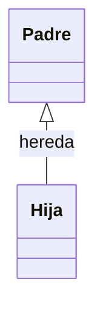

### 3. ¿Qué diferencia hay entre composición y colaboración en un diagrama de clases?

**Respuesta:** 
- **Composición**: Se representa con un rombo negro sólido en el extremo de la clase compuesta. Indica que el componente no puede existir sin el compuesto (relación fuerte).
- **Colaboración**: Se representa con una flecha punteada con punta negra. Indica que los objetos interactúan pero son independientes (relación débil).

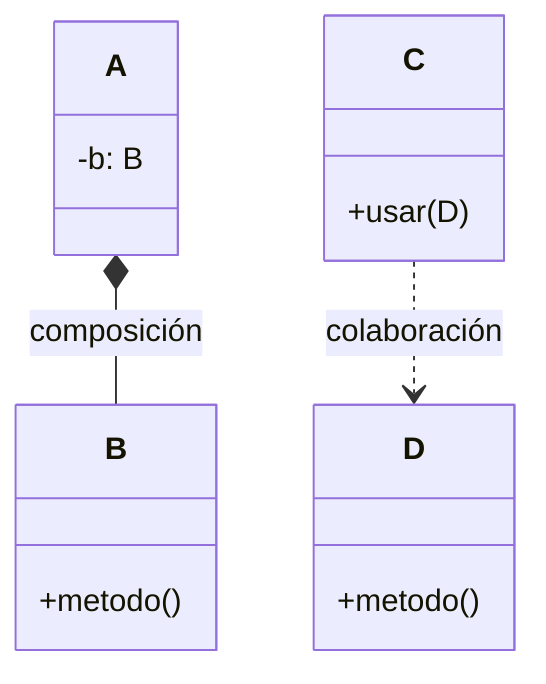

### 4. ¿Qué indica la multiplicidad en una relación UML?

**Respuesta:** La multiplicidad indica cuántos objetos de una clase pueden estar relacionados con otra. Puede ser:
- Un rango (ej: 0..1, 1..*)
- Un valor específico (ej: 1)
- Una serie de valores (ej: (2, 5, 7))

---

## Resumen

### Elementos Clave de un Diagrama de Clases

| Elemento | Representación | Propósito |
|----------|---------------|-----------|
| **Clase** | Rectángulo con 3 secciones | Definir nombre, atributos y métodos |
| **Niveles de acceso** | +, -, #, ~ | Indicar visibilidad de atributos/métodos |
| **Multiplicidad** | 0..1, 1, *, 0..* | Indicar cardinalidad en relaciones |
| **Herencia** | Flecha con triángulo blanco | Mostrar jerarquía de clases |
| **Composición** | Rombo negro sólido | Relación fuerte de contención |
| **Colaboración** | Flecha punteada | Relación débil de interacción |
| **Método abstracto** | Cursiva o `<<abstract>>` | Indicar método sin implementación |

### Proceso de Construcción

1. **Identificar clases**: Listar todas las entidades del sistema
2. **Definir atributos**: Especificar propiedades de cada clase con su tipo
3. **Definir métodos**: Especificar comportamientos característicos
4. **Establecer relaciones**: Identificar herencia, composición y colaboración
5. **Aplicar notación**: Usar símbolos UML correctos
6. **Verificar coherencia**: Asegurar que el diagrama sea consistente

### Beneficios del Diagrama de Clases

- **Planificación**: Ayuda a diseñar antes de codificar
- **Visibilidad**: Proporciona una visión global del sistema
- **Comunicación**: Facilita la discusión entre desarrolladores
- **Documentación**: Sirve como referencia del diseño
- **Mantenimiento**: Ayuda a entender el sistema existente