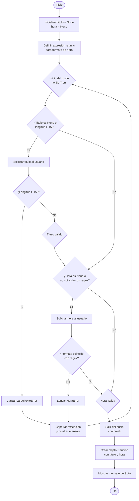

# Lógica de demo.py para programar reuniones

```mermaid
flowchart TD
    A([Inicio]) --> B[Inicializar titulo = None<br>hora = None]
    B --> C[Definir expresión regular<br>para formato de hora]
    C --> D{Inicio del bucle<br>while True}
    D --> E{¿Título es None o<br>longitud > 150?}
    E -->|Sí| F[Solicitar título al usuario]
    F --> G{¿Longitud > 150?}
    G -->|Sí| H[Lanzar LargoTextoError]
    H --> I[Capturar excepción<br>y mostrar mensaje]
    I --> D
    G -->|No| J{Título válido}
    J --> K{¿Hora es None o<br>no coincide con regex?}
    E -->|No| K
    K -->|Sí| L[Solicitar hora al usuario]
    L --> M{¿Formato coincide<br>con regex?}
    M -->|No| N[Lanzar HoraError]
    N --> I
    M -->|Sí| O{Hora válida}
    K -->|No| O
    O --> P[Salir del bucle<br>con break]
    P --> Q[Crear objeto Reunion<br>con título y hora]
    Q --> R[Mostrar mensaje de éxito]
    R --> S([Fin])
```