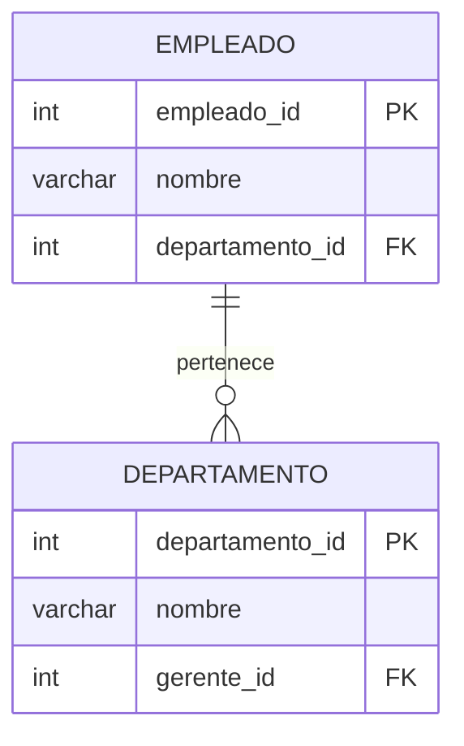
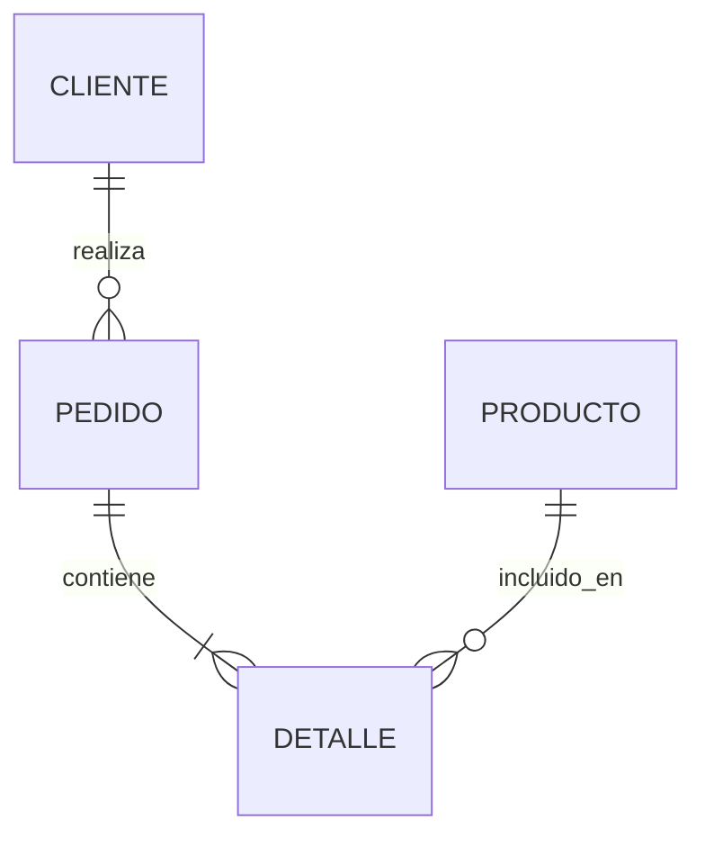
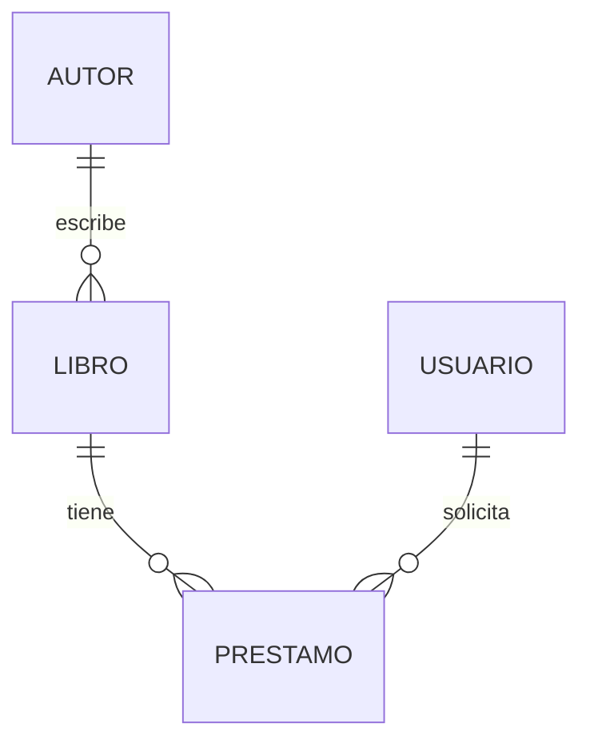
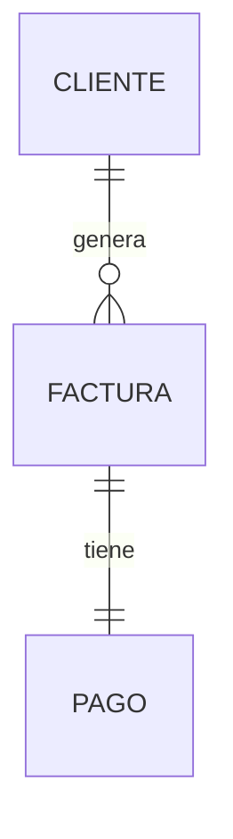

# Cuestionario Ampliado: Consultas SQL y Modelos de Datos

---

### Pregunta 1

¿Cuál es el propósito principal de una **subconsulta** en SQL?

A) Unir dos o más tablas en una sola consulta.  
B) Realizar una consulta dentro de otra consulta para filtrar o procesar datos de manera más específica.  
C) Crear una nueva tabla temporal en la base de datos.  
D) Modificar la estructura de una tabla existente.

<details>
<summary>Ver respuesta y justificación</summary>

**Respuesta correcta:** B  
**Justificación:** Una subconsulta (o consulta anidada) permite realizar una consulta interna cuyos resultados son utilizados por la consulta exterior, facilitando filtros o cálculos más complejos.
</details>

---

### Pregunta 2

Dadas las siguientes tablas:

**clientes**

| cliente_id | nombre |
|------------|--------|
| 1          | Ana    |
| 2          | Luis   |
| 3          | Carla  |

**pedidos**

| pedido_id | cliente_id | monto |
|-----------|------------|-------|
| 101       | 1          | 1500  |
| 102       | 2          | 800   |
| 103       | 2          | 1200  |

¿Cuál es el resultado de la siguiente consulta?

```sql
SELECT nombre
FROM clientes
WHERE cliente_id IN (
  SELECT cliente_id
  FROM pedidos
  WHERE monto > 1000
);
```

A) Ana, Luis  
B) Ana, Carla  
C) Luis, Carla  
D) Ana, Luis, Carla

<details>
<summary>Ver respuesta y justificación</summary>

**Respuesta correcta:** A  
**Justificación:** La subconsulta selecciona los `cliente_id` con pedidos mayores a 1000 (clientes 1 y 2). La consulta exterior devuelve los nombres de esos clientes: Ana y Luis.
</details>

---

### Pregunta 3

¿Cuál de las siguientes sentencias SQL es **correcta** para modificar una columna existente y establecerla como `NOT NULL`?

A) `ALTER TABLE empleados MODIFY email NOT NULL;`  
B) `ALTER TABLE empleados ALTER COLUMN email SET NOT NULL;`  
C) `ALTER TABLE empleados CHANGE email NOT NULL;`  
D) `UPDATE empleados SET email NOT NULL;`

<details>
<summary>Ver respuesta y justificación</summary>

**Respuesta correcta:** B  
**Justificación:** La sintaxis correcta en SQL (PostgreSQL) para cambiar una columna a `NOT NULL` es `ALTER TABLE ... ALTER COLUMN ... SET NOT NULL;`.
</details>

---

### Pregunta 4

A continuación se muestra un modelo relacional:



¿Qué afirmación es correcta respecto a este modelo?

A) Un empleado puede pertenecer a varios departamentos.  
B) Un departamento puede tener varios empleados.  
C) El campo `gerente_id` es clave primaria en la tabla `DEPARTAMENTO`.  
D) No existe relación entre `EMPLEADO` y `DEPARTAMENTO`.

<details>
<summary>Ver respuesta y justificación</summary>

**Respuesta correcta:** B  
**Justificación:** La notación `||--o{` indica que un departamento puede tener muchos empleados, mientras que un empleado pertenece a un solo departamento.
</details>

---

### Pregunta 5

¿Qué tipo de JOIN debe usarse para obtener **todos los registros** de la tabla izquierda y solo las coincidencias de la tabla derecha?

A) INNER JOIN  
B) LEFT JOIN  
C) RIGHT JOIN  
D) FULL OUTER JOIN

<details>
<summary>Ver respuesta y justificación</summary>

**Respuesta correcta:** B  
**Justificación:** El `LEFT JOIN` devuelve todas las filas de la tabla izquierda, y los valores coincidentes de la derecha. Si no hay coincidencia, los campos de la derecha son `NULL`.
</details>

---

### Pregunta 6

Dadas las tablas:

**productos**

| id | nombre     | precio |
|----|------------|--------|
| 1  | Laptop     | 800    |
| 2  | Mouse      | 25     |
| 3  | Teclado    | 45     |

**ventas**

| venta_id | producto_id | cantidad |
|----------|-------------|----------|
| 1        | 1           | 2        |
| 2        | 2           | 5        |
| 3        | 1           | 1        |

¿Qué devuelve la siguiente consulta?

```sql
SELECT nombre, SUM(cantidad) AS total_vendido
FROM productos
JOIN ventas ON productos.id = ventas.producto_id
GROUP BY nombre;
```

A) Laptop 3, Mouse 5, Teclado 0  
B) Laptop 3, Mouse 5  
C) Laptop 2, Mouse 5, Teclado 0  
D) Laptop 3, Mouse 5, Teclado NULL

<details>
<summary>Ver respuesta y justificación</summary>

**Respuesta correcta:** B  
**Justificación:** Solo los productos con ventas aparecen en el resultado. Laptop tiene 3 ventas totales, Mouse 5. Teclado no aparece porque no tiene registros en `ventas`.
</details>

---

### Pregunta 7

¿Cuál es la forma correcta de calcular el **promedio** de una columna numérica en SQL?

A) `SELECT PROMEDIO(sueldo) FROM empleados;`  
B) `SELECT AVG(sueldo) FROM empleados;`  
C) `SELECT MEAN(sueldo) FROM empleados;`  
D) `SELECT SUM(sueldo) / COUNT(*) FROM empleados;`

<details>
<summary>Ver respuesta y justificación</summary>

**Respuesta correcta:** B  
**Justificación:** La función estándar de SQL para calcular el promedio es `AVG()`.
</details>

---

### Pregunta 8

Dado el siguiente modelo:



¿Cuál de las siguientes afirmaciones es **falsa**?

A) Un cliente puede realizar varios pedidos.  
B) Un pedido puede contener varios detalles.  
C) Un producto puede estar en varios detalles.  
D) Un detalle puede pertenecer a varios pedidos.

<details>
<summary>Ver respuesta y justificación</summary>

**Respuesta correcta:** D  
**Justificación:** La relación `PEDIDO ||--|{ DETALLE` indica que un pedido contiene varios detalles, pero un detalle pertenece a un solo pedido. Por lo tanto, la afirmación D es falsa.
</details>

---

### Pregunta 9

¿Qué función de agregación usarías para **contar el número de registros** en una tabla?

A) `SUM()`  
B) `AVG()`  
C) `COUNT()`  
D) `MAX()`

<details>
<summary>Ver respuesta y justificación</summary>

**Respuesta correcta:** C  
**Justificación:** `COUNT()` se usa para contar filas o valores no nulos en una columna.
</details>

---

### Pregunta 10

Tienes las siguientes tablas:

**estudiantes**

| id | nombre  |
|----|---------|
| 1  | María   |
| 2  | Pedro   |
| 3  | Lucía   |

**cursos**

| curso_id | estudiante_id | curso      |
|----------|---------------|------------|
| 101      | 1             | Matemáticas|
| 102      | 2             | Historia   |
| 103      | 1             | Ciencias   |

¿Cuál de las siguientes consultas devuelve **todos los nombres de estudiantes** junto con los cursos que están tomando (si tienen alguno)?

A)  
```sql
SELECT nombre, curso
FROM estudiantes
LEFT JOIN cursos ON estudiantes.id = cursos.estudiante_id;
```

B)  
```sql
SELECT nombre, curso
FROM estudiantes
INNER JOIN cursos ON estudiantes.id = cursos.estudiante_id;
```

C)  
```sql
SELECT nombre, curso
FROM estudiantes
RIGHT JOIN cursos ON estudiantes.id = cursos.estudiante_id;
```

D)  
```sql
SELECT nombre, curso
FROM estudiantes
FULL OUTER JOIN cursos ON estudiantes.id = cursos.estudiante_id;
```

<details>
<summary>Ver respuesta y justificación</summary>

**Respuesta correcta:** A  
**Justificación:** `LEFT JOIN` devuelve todos los estudiantes, incluso si no tienen cursos (aparecerán con `NULL` en la columna `curso`), lo cual cumple con el requerimiento.
</details>

---

### Pregunta 11

¿Cuál de las siguientes consultas es **correcta** para agrupar ventas por cliente y mostrar el total gastado?

A)  
```sql
SELECT cliente_id, SUM(monto) FROM ventas;
```

B)  
```sql
SELECT cliente_id, SUM(monto) FROM ventas GROUP BY cliente_id;
```

C)  
```sql
SELECT cliente_id, SUM(monto) FROM ventas ORDER BY cliente_id;
```

D)  
```sql
SELECT cliente_id, SUM(monto)
FROM ventas WHERE cliente_id GROUP BY SUM(monto);
```

<details>
<summary>Ver respuesta y justificación</summary>

**Respuesta correcta:** B  
**Justificación:** `GROUP BY` es necesario para agrupar los resultados por `cliente_id` y aplicar la función de agregación `SUM` a cada grupo.
</details>

---

### Pregunta 12

Observa el siguiente modelo:



¿Qué relación existe entre `USUARIO` y `PRESTAMO`?

A) Un usuario puede tener muchos préstamos.  
B) Un préstamo puede ser solicitado por muchos usuarios.  
C) Un usuario solo puede tener un préstamo.  
D) No existe relación entre usuario y préstamo.

<details>
<summary>Ver respuesta y justificación</summary>

**Respuesta correcta:** A  
**Justificación:** La notación `||--o{` indica que un usuario puede tener varios préstamos, mientras que un préstamo pertenece a un solo usuario.
</details>

---

### Pregunta 13

¿Cuál de los siguientes tipos de JOIN devuelve **todas las filas de ambas tablas**, con `NULL` donde no haya coincidencias?

A) `INNER JOIN`  
B) `LEFT JOIN`  
C) `RIGHT JOIN`  
D) `FULL OUTER JOIN`

<details>
<summary>Ver respuesta y justificación</summary>

**Respuesta correcta:** D  
**Justificación:** `FULL OUTER JOIN` combina los resultados de `LEFT JOIN` y `RIGHT JOIN`, devolviendo todas las filas de ambas tablas y llenando con `NULL` donde no haya correspondencia.
</details>

---

### Pregunta 14

Dadas las siguientes tablas:

**empleados**

| id | nombre  | salario |
|----|---------|---------|
| 1  | Carlos  | 50000   |
| 2  | Elena   | 60000   |
| 3  | Mario   | 55000   |

**departamentos**

| id | nombre_dep | empleado_id |
|----|------------|-------------|
| 1  | Ventas     | 1           |
| 2  | IT         | 2           |

¿Qué devuelve la siguiente consulta?

```sql
SELECT empleados.nombre, departamentos.nombre_dep
FROM empleados
LEFT JOIN departamentos ON empleados.id = departamentos.empleado_id;
```

A) Carlos - Ventas, Elena - IT  
B) Carlos - Ventas, Elena - IT, Mario - NULL  
C) Carlos - Ventas, Elena - IT, Mario - (sin fila)  
D) Carlos - Ventas, Elena - IT, Mario - NULL, NULL - NULL

<details>
<summary>Ver respuesta y justificación</summary>

**Respuesta correcta:** B  
**Justificación:** `LEFT JOIN` incluye todos los empleados. Carlos y Elena tienen departamento, Mario no tiene asignado, por lo que su campo `nombre_dep` es `NULL`.
</details>

---

### Pregunta 15

¿Qué cláusula se utiliza para **filtrar grupos** después de aplicar `GROUP BY`?

A) `WHERE`  
B) `HAVING`  
C) `FILTER`  
D) `GROUP BY ... HAVING`

<details>
<summary>Ver respuesta y justificación</summary>

**Respuesta correcta:** B  
**Justificación:** `HAVING` se usa para filtrar resultados de funciones de agregación, a diferencia de `WHERE`, que filtra filas individuales antes de agrupar.
</details>

---

### Pregunta 16

Dado el siguiente modelo, ¿qué tabla contiene la **clave foránea**?



A) `CLIENTE`  
B) `FACTURA`  
C) `PAGO`  
D) Todas las anteriores

<details>
<summary>Ver respuesta y justificación</summary>

**Respuesta correcta:** C  
**Justificación:** En la relación `FACTURA ||--|| PAGO`, la tabla `PAGO` tiene la clave foránea que referencia a `FACTURA`, ya que cada pago corresponde a una factura.
</details>