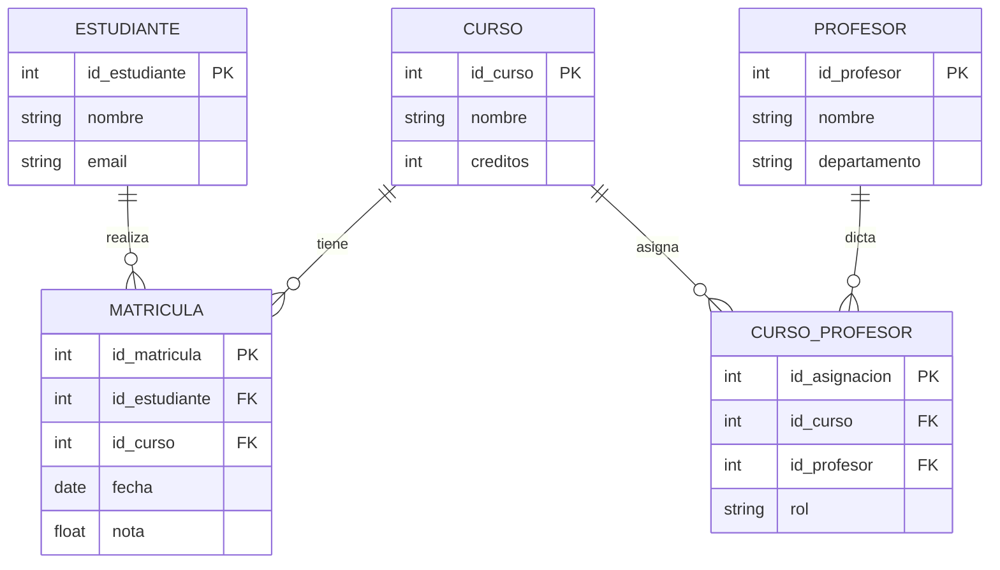
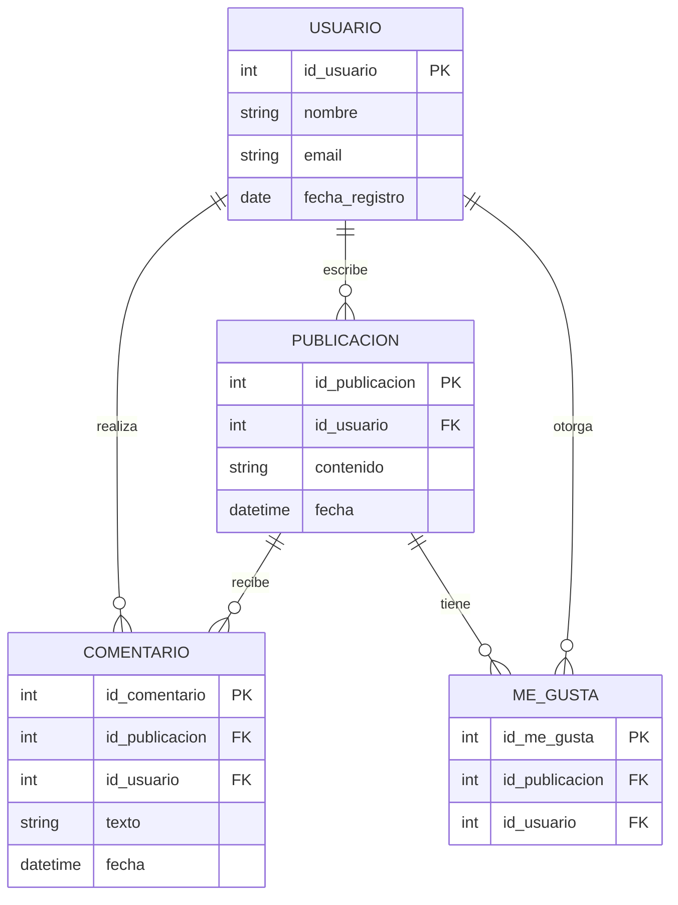

# Cuestionario: Transaccionalidad en operaciones de bases de datos

---

## Pregunta 1

**¿Cuál de las siguientes afirmaciones describe correctamente el propósito principal de las transacciones en bases de datos?**

A) Mejorar el rendimiento de las consultas SELECT mediante el almacenamiento en caché.

B) Garantizar que un conjunto de operaciones se ejecute como una unidad atómica, manteniendo la consistencia de los datos.

C) Permitir que varios usuarios consulten la base de datos simultáneamente sin bloqueos.

D) Optimizar el espacio de almacenamiento mediante la compresión de datos durante las operaciones de escritura.

<details>
<summary><strong>Ver respuesta</strong></summary>

**Respuesta correcta: B**

*Justificación:* Las transacciones son mecanismos que agrupan operaciones en unidades lógicas indivisibles (atomicidad) para preservar la consistencia de la base de datos. Las opciones A, C y D describen funcionalidades que no son el propósito principal de las transacciones: A es optimización de consultas, C es control de concurrencia (relacionado pero no el propósito principal), y D es optimización de almacenamiento.

</details>

---

## Pregunta 2

**Dado el siguiente código en PostgreSQL, ¿cuál será el estado final de la tabla `empleados` si ocurre un error en la cuarta operación?**

```sql
CREATE TABLE empleados (id SERIAL PRIMARY KEY, nombre TEXT, salario DECIMAL CHECK (salario > 0));

INSERT INTO empleados (nombre, salario) VALUES ('Ana', 50000), ('Luis', 60000);

BEGIN TRANSACTION;
UPDATE empleados SET salario = 55000 WHERE nombre = 'Ana';
UPDATE empleados SET salario = 65000 WHERE nombre = 'Luis';
INSERT INTO empleados (nombre, salario) VALUES ('Carlos', -10000);  -- Error: salario negativo
INSERT INTO empleados (nombre, salario) VALUES ('Marta', 70000);
COMMIT;
```

A) Solo Ana y Luis tendrán sus salarios actualizados; Carlos y Marta no se insertan.

B) Ningún cambio se aplica: Ana y Luis mantienen salarios originales, y no se insertan Carlos ni Marta.

C) Ana y Luis se actualizan, y Marta se inserta; Carlos genera error pero se omite.

D) Se insertan Carlos y Marta, pero Ana y Luis permanecen con salarios originales.

<details>
<summary><strong>Ver respuesta</strong></summary>

**Respuesta correcta: B**

*Justificación:* La propiedad de atomicidad garantiza que si ocurre un error en cualquier punto de la transacción (en este caso, el CHECK constraint de salario > 0 en la inserción de Carlos), todas las operaciones anteriores se revierten. Por lo tanto, los cambios en Ana y Luis también se deshacen, y ninguno de los nuevos empleados se inserta. La base de datos queda en el estado anterior al BEGIN TRANSACTION.

</details>

---

## Pregunta 3

**¿Cuál de las siguientes instrucciones en PostgreSQL inicia correctamente una transacción que permite tanto lectura como escritura y puede ser nombrada?**

A) `START TRANSACTION READ WRITE NAME transferencia;`

B) `SET TRANSACTION READ WRITE NAME transferencia;`

C) `BEGIN TRANSACTION READ WRITE; NAME transferencia;`

D) `BEGIN TRANSACTION; SET TRANSACTION READ WRITE NAME transferencia;`

<details>
<summary><strong>Ver respuesta</strong></summary>

**Respuesta correcta: A**

*Justificación:* La sintaxis correcta para iniciar una transacción con modo de lectura/escritura y nombre es `START TRANSACTION READ WRITE NAME transferencia;`. La opción B usa `SET TRANSACTION` que establece características pero no inicia la transacción; C tiene un error de sintaxis al separar en dos líneas; D ejecuta primero `BEGIN TRANSACTION` y luego cambia las características, pero no es la forma estándar de nombrarla en una sola instrucción.

</details>

---

## Pregunta 4

**Dos transacciones simultáneas intentan actualizar el saldo de una misma cuenta bancaria. La primera lee un saldo de \$1000 y planea sumar \$500. La segunda lee el mismo saldo de $1000 y planea sumar \$300. Si ambas completan sus operaciones, ¿qué propiedad ACID previene que el saldo final sea incorrecto?**

A) Atomicidad, porque cada operación debe completarse completamente.

B) Consistencia, porque el saldo siempre debe ser positivo.

C) Aislamiento, porque las transacciones no deben interferir entre sí.

D) Durabilidad, porque los cambios deben ser permanentes.

<details>
<summary><strong>Ver respuesta</strong></summary>

**Respuesta correcta: C**

*Justificación:* El aislamiento garantiza que las transacciones concurrentes se ejecuten como si fueran secuenciales. Sin un nivel de aislamiento adecuado, ambas transacciones podrían leer el saldo $1000, calcular sus respectivos incrementos y actualizar el saldo final a $1500 (sumando solo el último) en lugar de los $1800 que debería ser. El aislamiento previene condiciones de carrera mediante bloqueos o versionado.

</details>

---

## Pregunta 5

**Se requiere actualizar el estado de todos los pedidos de una tabla `pedidos` a 'completado', pero solo aquellos que tengan `fecha_entrega` menor o igual a la fecha actual. ¿Cuál código SQL genera correctamente esta actualización y verifica los cambios realizados?**

A) 
```sql
BEGIN TRANSACTION;
UPDATE pedidos SET estado = 'completado' WHERE fecha_entrega <= CURRENT_DATE;
SELECT COUNT(*) FROM pedidos WHERE estado = 'completado';
COMMIT;
```

B) 
```sql
BEGIN TRANSACTION;
UPDATE pedidos SET estado = 'completado';
ROLLBACK WHERE fecha_entrega > CURRENT_DATE;
COMMIT;
```

C) 
```sql
BEGIN TRANSACTION;
SAVEPOINT actualizacion;
UPDATE pedidos SET estado = 'completado';
UPDATE pedidos SET estado = 'pendiente' WHERE fecha_entrega > CURRENT_DATE;
ROLLBACK TO actualizacion;
COMMIT;
```

D) 
```sql
UPDATE pedidos SET estado = 'completado' WHERE fecha_entrega > CURRENT_DATE;
SELECT * FROM pedidos WHERE estado = 'completado';
```

<details>
<summary><strong>Ver respuesta</strong></summary>

**Respuesta correcta: A**

*Justificación:* La opción A utiliza correctamente `WHERE` para actualizar solo los pedidos elegibles, envuelve la operación en una transacción para asegurar la consistencia y realiza una consulta de verificación antes del commit. La opción B tiene sintaxis inválida (`ROLLBACK WHERE` no existe). La opción C actualiza todos a 'completado' y luego los que tienen fecha mayor los marca como 'pendiente', pero luego revierte al punto de guardado, deshaciendo ambas actualizaciones. La opción D actualiza los pedidos incorrectos (los que tienen fecha mayor) y no usa transacciones.

</details>

---

## Pregunta 6

**Dado el siguiente modelo relacional, identifique cuál transacción mantiene la integridad referencial al eliminar un curso:**



A) 
```sql
BEGIN TRANSACTION;
DELETE FROM MATRICULA WHERE id_curso = 101;
DELETE FROM CURSO_PROFESOR WHERE id_curso = 101;
DELETE FROM CURSO WHERE id_curso = 101;
COMMIT;
```

B) 
```sql
BEGIN TRANSACTION;
DELETE FROM CURSO WHERE id_curso = 101;
DELETE FROM MATRICULA WHERE id_curso = 101;
DELETE FROM CURSO_PROFESOR WHERE id_curso = 101;
COMMIT;
```

C) 
```sql
BEGIN TRANSACTION;
UPDATE ESTUDIANTE SET email = NULL WHERE id_estudiante IN (SELECT id_estudiante FROM MATRICULA WHERE id_curso = 101);
DELETE FROM CURSO WHERE id_curso = 101;
COMMIT;
```

D) 
```sql
BEGIN TRANSACTION;
DELETE FROM CURSO_PROFESOR WHERE id_curso = 101;
DELETE FROM MATRICULA WHERE id_curso = 101;
DELETE FROM PROFESOR WHERE id_profesor IN (SELECT id_profesor FROM CURSO_PROFESOR WHERE id_curso = 101);
COMMIT;
```

<details>
<summary><strong>Ver respuesta</strong></summary>

**Respuesta correcta: A**

*Justificación:* Para mantener la integridad referencial al eliminar un CURSO, primero deben eliminarse los registros hijos en MATRICULA y CURSO_PROFESOR que dependen del curso, y finalmente eliminar el CURSO. La opción A sigue este orden correcto. La opción B intenta eliminar el curso antes que sus referencias, violando la integridad. La opción C modifica datos de estudiantes innecesariamente y no maneja las referencias de MATRICULA y CURSO_PROFESOR. La opción D elimina profesores que podrían estar asignados a otros cursos, lo que viola la integridad referencial.

</details>

---

## Pregunta 7

**¿Cuál es el comportamiento predeterminado de PostgreSQL cuando se ejecuta una sentencia DML (INSERT, UPDATE, DELETE) sin un bloque BEGIN TRANSACTION explícito?**

A) La sentencia se ejecuta en modo READ ONLY, sin permitir modificaciones.

B) Se ejecuta una transacción implícita que finaliza automáticamente con COMMIT al completarse.

C) La sentencia queda en espera hasta que el usuario ejecute un COMMIT o ROLLBACK.

D) Se genera un error y la sentencia no se ejecuta hasta definir una transacción.

<details>
<summary><strong>Ver respuesta</strong></summary>

**Respuesta correcta: B**

*Justificación:* PostgreSQL opera en modo AUTOCOMMIT por defecto, lo que significa que cada sentencia DML se envuelve automáticamente en una transacción que se confirma (COMMIT) inmediatamente después de su ejecución exitosa. Si hay un error, se revierte automáticamente (ROLLBACK). La opción A es incorrecta porque permite modificaciones; C describe el comportamiento con BEGIN explícito; D es falso porque no se genera error.

</details>

---

## Pregunta 8

**Se requiere una transacción que realice un descuento del 15% a todos los productos de la categoría 'electrónicos', pero solo si el precio resultante no es menor a $100. ¿Cuál código cumple correctamente este requisito?**

A) 
```sql
BEGIN TRANSACTION;
UPDATE productos SET precio = precio * 0.85 WHERE categoria = 'electronicos';
UPDATE productos SET precio = 100 WHERE categoria = 'electronicos' AND precio < 100;
COMMIT;
```

B) 
```sql
BEGIN TRANSACTION;
UPDATE productos SET precio = precio * 0.85 WHERE categoria = 'electronicos' AND precio * 0.85 >= 100;
COMMIT;
```

C) 
```sql
BEGIN TRANSACTION;
UPDATE productos SET precio = precio * 0.85 WHERE categoria = 'electronicos';
SAVEPOINT antes_ajuste;
UPDATE productos SET precio = 100 WHERE categoria = 'electronicos' AND precio < 100;
ROLLBACK TO antes_ajuste;
COMMIT;
```

D) 
```sql
BEGIN TRANSACTION;
UPDATE productos SET precio = GREATEST(precio * 0.85, 100) WHERE categoria = 'electronicos';
COMMIT;
```

<details>
<summary><strong>Ver respuesta</strong></summary>

**Respuesta correcta: D**

*Justificación:* La opción D utiliza correctamente la función `GREATEST` que devuelve el valor máximo entre los dos argumentos, asegurando que el precio nunca sea menor a $100 después del descuento. La opción A primero aplica el descuento y luego ajusta los que quedaron bajo $100 a exactamente $100, pero esto sobreescribe el descuento en esos casos, no es el mismo resultado que aplicar el descuento condicional. La opción B actualiza solo los productos cuyo precio con descuento es >= $100, dejando sin modificar los que quedarían debajo. La opción C guarda un punto antes del ajuste y luego revierte al punto, deshaciendo el ajuste.

</details>

---

## Pregunta 9

**En una transacción con varios SAVEPOINT, ¿cuál instrucción revierte solo las operaciones realizadas después del punto de guardado llamado 'checkpoint_2', manteniendo los cambios anteriores?**

A) `ROLLBACK TO checkpoint_2;`

B) `ROLLBACK checkpoint_2;`

C) `SAVEPOINT ROLLBACK checkpoint_2;`

D) `ROLLBACK TO SAVEPOINT checkpoint_2;`

<details>
<summary><strong>Ver respuesta</strong></summary>

**Respuesta correcta: D**

*Justificación:* La sintaxis correcta en SQL para revertir a un punto de guardado específico es `ROLLBACK TO SAVEPOINT nombre_punto;` o simplemente `ROLLBACK TO nombre_punto;` (la versión con SAVEPOINT es más explícita y estándar en algunos sistemas). La opción A es sintácticamente incompleta aunque funciona en PostgreSQL; la opción B es sintácticamente incorrecta; la opción C tiene el orden de palabras incorrecto.

</details>

---

## Pregunta 10

**Considere el siguiente modelo relacional para una red social:**



**Si se desea eliminar a un usuario con `id_usuario = 42` que ha escrito 5 publicaciones, recibido 20 comentarios en sus publicaciones, y dado 30 me gusta, ¿cuál transacción garantiza la integridad referencial?**

A) 
```sql
BEGIN TRANSACTION;
DELETE FROM USUARIO WHERE id_usuario = 42;
DELETE FROM PUBLICACION WHERE id_usuario = 42;
DELETE FROM COMENTARIO WHERE id_usuario = 42;
DELETE FROM ME_GUSTA WHERE id_usuario = 42;
COMMIT;
```

B) 
```sql
BEGIN TRANSACTION;
DELETE FROM ME_GUSTA WHERE id_usuario = 42;
DELETE FROM COMENTARIO WHERE id_usuario = 42;
DELETE FROM PUBLICACION WHERE id_usuario = 42;
DELETE FROM USUARIO WHERE id_usuario = 42;
COMMIT;
```

C) 
```sql
BEGIN TRANSACTION;
DELETE FROM ME_GUSTA WHERE id_usuario = 42;
DELETE FROM COMENTARIO WHERE id_publicacion IN (SELECT id_publicacion FROM PUBLICACION WHERE id_usuario = 42);
DELETE FROM PUBLICACION WHERE id_usuario = 42;
DELETE FROM USUARIO WHERE id_usuario = 42;
COMMIT;
```

D) 
```sql
BEGIN TRANSACTION;
DELETE FROM COMENTARIO WHERE id_publicacion IN (SELECT id_publicacion FROM PUBLICACION WHERE id_usuario = 42);
DELETE FROM PUBLICACION WHERE id_usuario = 42;
DELETE FROM USUARIO WHERE id_usuario = 42;
COMMIT;
```

<details>
<summary><strong>Ver respuesta</strong></summary>

**Respuesta correcta: C**

*Justificación:* Para eliminar correctamente al usuario 42, se deben eliminar todas las referencias en orden: (1) ME_GUSTA otorgados por el usuario; (2) COMENTARIOS en publicaciones del usuario (porque si se eliminan las publicaciones primero, se perderían los comentarios asociados, pero deben eliminarse antes para no violar FK); (3) PUBLICACIONES del usuario; (4) finalmente el USUARIO. La opción A elimina el usuario primero, violando integridad referencial. La opción B solo elimina los comentarios del usuario, pero no los comentarios hechos a sus publicaciones. La opción D no elimina los ME_GUSTA que el usuario haya otorgado.

</details>

---

## Pregunta 11

**En una aplicación de reservas de vuelos, se ejecuta la siguiente transacción que reserva un asiento para un pasajero:**

```sql
BEGIN TRANSACTION;
-- Verificar disponibilidad
SELECT COUNT(*) FROM asientos WHERE vuelo_id = 300 AND estado = 'disponible';
-- Seleccionar un asiento específico
UPDATE asientos SET estado = 'reservado' WHERE asiento_id = 15 AND estado = 'disponible';
-- Registrar reserva en tabla reservas
INSERT INTO reservas (pasajero_id, asiento_id, vuelo_id, fecha_reserva) 
VALUES (101, 15, 300, CURRENT_DATE);
-- Confirmar
COMMIT;
```

**Si dos pasajeros ejecutan esta misma transacción simultáneamente para el mismo asiento, ¿cuál propiedad ACID es más crítica para evitar la doble reserva?**

A) Atomicidad, porque la operación debe completarse toda o ninguna.

B) Consistencia, porque el asiento debe estar siempre en un estado válido.

C) Aislamiento, porque las transacciones deben ejecutarse sin interferencia.

D) Durabilidad, porque la reserva debe persistir.

<details>
<summary><strong>Ver respuesta</strong></summary>

**Respuesta correcta: C**

*Justificación:* El aislamiento es crítico aquí porque ambas transacciones intentan leer el estado del asiento y luego actualizarlo. Sin un nivel de aislamiento adecuado (como SERIALIZABLE), la primera transacción podría leer que el asiento está disponible, la segunda también, y ambas procederían a reservarlo, generando una doble reserva. El aislamiento con bloqueos evitaría que ambas transacciones accedan al mismo recurso de manera inconsistente. Aunque la condición `WHERE estado = 'disponible'` ayuda, no es suficiente por sí sola sin un mecanismo de bloqueo adecuado.

</details>
