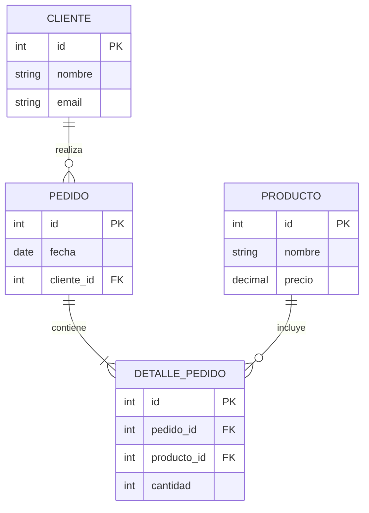
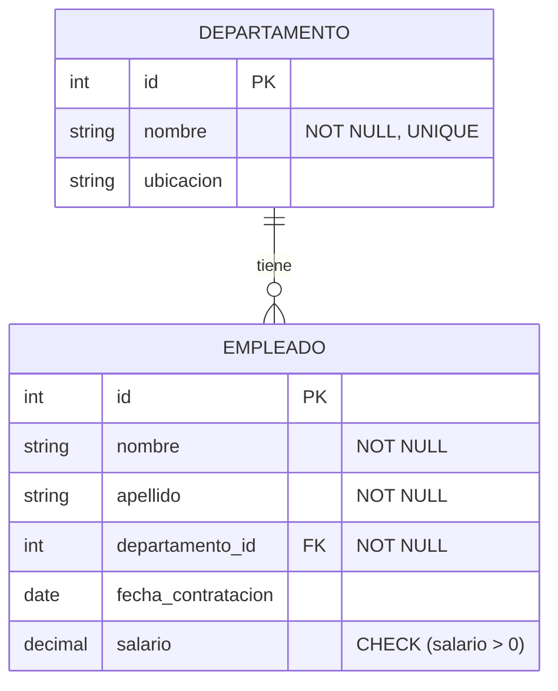

# Cuestionario: DDL y DML - Reforzamiento

## Pregunta 1
**¿Cuál de las siguientes afirmaciones sobre DDL es correcta?**

A) DDL permite únicamente la consulta de datos existentes en las tablas de una base de datos.

B) DDL se utiliza exclusivamente para manipular los registros dentro de las tablas.

C) DDL permite definir las estructuras que almacenarán los datos, así como procedimientos o funciones para consultarlos.

D) DDL es un lenguaje que solo puede ser ejecutado por usuarios sin privilegios especiales.

<details>
<summary><strong>Ver respuesta</strong></summary>

**Respuesta correcta: C**

**Justificación:** El Lenguaje de Definición de Datos (DDL) se utiliza para definir y gestionar las estructuras de la base de datos, incluyendo tablas, índices y procedimientos. No se limita solo a consultas (que son parte de DML) ni exclusivamente a la manipulación de registros, y ciertas operaciones como DROP TABLE requieren privilegios de superusuario.
</details>

---

## Pregunta 2
**Dado el siguiente código SQL:**

```sql
CREATE TABLE empleados (
    id INTEGER PRIMARY KEY,
    nombre VARCHAR(50) NOT NULL,
    email VARCHAR(100) UNIQUE,
    salario DECIMAL
);

INSERT INTO empleados (id, nombre, email, salario) 
VALUES (1, 'Ana López', NULL, 45000);

INSERT INTO empleados (id, nombre, email, salario) 
VALUES (2, 'Carlos Ruiz', 'carlos@empresa.com', 52000);

ALTER TABLE empleados ALTER COLUMN email SET NOT NULL;
```

**¿Qué resultado se obtiene al ejecutar el código anterior?**

A) La tabla se crea correctamente, los registros se insertan y la columna email se modifica a NOT NULL sin problemas.

B) La tabla se crea correctamente, los registros se insertan y se produce un error en la modificación de email porque contiene un valor nulo.

C) La tabla no se crea debido a un error en la sintaxis del CREATE TABLE.

D) Se produce un error en la segunda inserción porque el email duplica un valor existente.

<details>
<summary><strong>Ver respuesta</strong></summary>

**Respuesta correcta: B**

**Justificación:** La tabla se crea correctamente y ambas inserciones son exitosas (la primera con NULL y la segunda con un email válido). Sin embargo, al intentar modificar la columna email a NOT NULL, PostgreSQL detecta que el primer registro tiene un valor nulo y lanza un error. Para evitar esto, se debe actualizar el valor nulo primero usando UPDATE o COALESCE.
</details>

---

## Pregunta 3
**¿Cuál de las siguientes sentencias es la sintaxis correcta para agregar una nueva columna llamada "fecha_nacimiento" de tipo DATE a una tabla existente "personas"?**

A) `ALTER TABLE personas ADD fecha_nacimiento DATE;`

B) `ALTER personas ADD COLUMN fecha_nacimiento DATE;`

C) `ADD COLUMN fecha_nacimiento DATE TO TABLE personas;`

D) `ALTER TABLE personas ADD COLUMN fecha_nacimiento DATE;`

<details>
<summary><strong>Ver respuesta</strong></summary>

**Respuesta correcta: D**

**Justificación:** La sintaxis correcta en PostgreSQL para agregar una nueva columna es `ALTER TABLE nombre_tabla ADD COLUMN nombre_columna tipo_dato;`. La opción A omite la palabra clave COLUMN (aunque en algunos SGBD funciona, no es la sintaxis estándar recomendada), la B omite la palabra TABLE, y la C tiene un orden incorrecto de las palabras clave.
</details>

---

## Pregunta 4
**Una tabla "pedidos" tiene una clave foránea que referencia a la tabla "clientes". ¿Qué sucede al ejecutar `DROP TABLE clientes;`?**

A) La tabla clientes se elimina junto con todos sus registros, y la tabla pedidos queda sin referencia.

B) La tabla clientes no se puede eliminar porque existen registros en pedidos que la referencian, generando un error.

C) La tabla clientes se elimina automáticamente junto con la tabla pedidos por efecto cascada.

D) La tabla clientes se elimina y PostgreSQL crea automáticamente una nueva tabla clientes vacía.

<details>
<summary><strong>Ver respuesta</strong></summary>

**Respuesta correcta: B**

**Justificación:** Cuando existen tablas relacionadas mediante una clave foránea, PostgreSQL no permite eliminar la tabla padre (clientes) si hay registros en la tabla hija (pedidos) que la referencian, ya que violaría la integridad referencial. Se genera un error similar a: "ERROR: update or delete on table 'clientes' violates foreign key constraint".
</details>

---

## Pregunta 5
**¿Qué restricción se debe utilizar para garantizar que una columna no contenga valores duplicados y además sea el identificador único de cada registro?**

A) UNIQUE
B) PRIMARY KEY
C) NOT NULL
D) FOREIGN KEY

<details>
<summary><strong>Ver respuesta</strong></summary>

**Respuesta correcta: B**

**Justificación:** PRIMARY KEY es la restricción que garantiza valores únicos y no nulos, sirviendo como identificador único para cada registro en la tabla. Aunque UNIQUE también previene duplicados, no otorga la funcionalidad completa de identificación que proporciona PRIMARY KEY (que además incorpora NOT NULL automáticamente).
</details>

---

## Pregunta 6

**Basado en el siguiente diagrama ER:**



**¿Cuál de las siguientes afirmaciones es correcta sobre el modelo?**

A) Un cliente puede tener muchos pedidos, y un producto puede estar en muchos detalles de pedido.

B) Un pedido puede tener muchos clientes, y un detalle de pedido puede tener muchos productos.

C) Un cliente puede tener muchos pedidos, pero un producto solo puede aparecer en un detalle de pedido.

D) Cada pedido debe tener al menos un cliente, y cada producto debe estar en al menos un detalle de pedido.

<details>
<summary><strong>Ver respuesta</strong></summary>

**Respuesta correcta: A**

**Justificación:** El diagrama muestra una relación uno-a-muchos entre CLIENTE y PEDIDO (un cliente realiza muchos pedidos), y una relación muchos-a-muchos entre PRODUCTO y PEDIDO a través de DETALLE_PEDIDO (un producto puede aparecer en muchos detalles y un pedido contiene muchos productos). La opción A describe correctamente ambas relaciones.
</details>

---

## Pregunta 7
**Dado el siguiente código:**

```sql
CREATE TABLE inventario (
    id SERIAL PRIMARY KEY,
    codigo VARCHAR(20) UNIQUE NOT NULL,
    stock INTEGER CHECK (stock >= 0),
    precio DECIMAL
);

INSERT INTO inventario (codigo, stock, precio) 
VALUES ('PROD001', 10, 25.50);

INSERT INTO inventario (codigo, stock, precio) 
VALUES ('PROD002', -5, 15.75);
```

**¿Qué resultado produce la ejecución de este código?**

A) Se crea la tabla y ambos registros se insertan correctamente.

B) Se crea la tabla y ambos registros fallan por violación de restricciones.

C) Se crea la tabla, el primer registro se inserta correctamente y el segundo falla por violación de CHECK.

D) Se crea la tabla, el primer registro se inserta correctamente y el segundo falla por violación de UNIQUE.

<details>
<summary><strong>Ver respuesta</strong></summary>

**Respuesta correcta: C**

**Justificación:** La tabla se crea correctamente con su restricción CHECK que exige que stock sea >= 0. El primer registro (stock: 10) cumple con todas las restricciones y se inserta exitosamente. El segundo registro (stock: -5) viola la restricción CHECK, generando un error similar a: "ERROR: new row for relation 'inventario' violates check constraint 'inventario_stock_check'".
</details>

---

## Pregunta 8

**Dado el siguiente modelo físico-relacional (tablas con campos y restricciones):**



**¿Cuál de las siguientes sentencias DDL es correcta para implementar la relación entre DEPARTAMENTO y EMPLEADO?**

A) 
```sql
CREATE TABLE empleado (
  id INT PRIMARY KEY, 
  departamento_id INT REFERENCES departamento(id)
);
```

B) 
```sql
CREATE TABLE empleado (
  id INT PRIMARY KEY, 
  departamento_id INT FOREIGN KEY (departamento_id) REFERENCES departamento(id)
);
```

C) 
```sql
CREATE TABLE empleado (
  id INT PRIMARY KEY, 
  departamento_id INT, 
  FOREIGN KEY (departamento_id) REFERENCES departamento(id));
```

D) 
```sql
CREATE TABLE empleado (
  id INT PRIMARY KEY, 
  departamento_id INT CONSTRAINT fk_departamento FOREIGN KEY REFERENCES departamento(id)
);
```


<details>
<summary><strong>Ver respuesta</strong></summary>

**Respuesta correcta: C**

**Justificación:** La sintaxis correcta en PostgreSQL para definir una clave foránea es declarar la columna y luego agregar la restricción `FOREIGN KEY (columna) REFERENCES tabla(columna)`. La opción A es la sintaxis abreviada que también funciona, pero la C es la más clara y completa. La B usa sintaxis incorrecta, y la D también tiene errores en la sintaxis del CONSTRAINT.
</details>

---

## Pregunta 9
**Un analista de datos necesita crear una tabla "transacciones" donde cada transacción debe tener un identificador único, estar asociada a un cliente, y el monto de la transacción debe ser positivo. ¿Qué combinación de restricciones debe aplicar?**

A) PRIMARY KEY, FOREIGN KEY y CHECK

B) UNIQUE, NOT NULL y FOREIGN KEY

C) PRIMARY KEY, UNIQUE y CHECK

D) FOREIGN KEY, NOT NULL y UNIQUE

<details>
<summary><strong>Ver respuesta</strong></summary>

**Respuesta correcta: A**

**Justificación:** Para cumplir con todos los requisitos: PRIMARY KEY para el identificador único, FOREIGN KEY para asociar la transacción a un cliente, y CHECK para garantizar que el monto sea positivo. Aunque UNIQUE también garantiza unicidad, PRIMARY KEY es más apropiado para un identificador y además implica NOT NULL automáticamente.
</details>

---

## Pregunta 10
**Se tiene la siguiente tabla "productos":**

```sql
CREATE TABLE productos (
    id SERIAL PRIMARY KEY,
    nombre VARCHAR(100) NOT NULL,
    precio DECIMAL(10,2) CHECK (precio >= 0)
);
```

**¿Cuál de las siguientes instrucciones permitirá agregar exitosamente una nueva columna "categoria" que no acepte valores nulos, pero que en los registros existentes tenga el valor "Sin categoría"?**

A) 
```sql
ALTER TABLE productos
ADD COLUMN categoria VARCHAR(50);

UPDATE productos 
SET categoria = 'Sin categoría' 
WHERE categoria IS NULL;

ALTER TABLE productos
ALTER COLUMN categoria SET NOT NULL;
```

B) 
```sql
ALTER TABLE productos
ADD COLUMN categoria VARCHAR(50) NOT NULL DEFAULT 'Sin categoría';
```

C) 
```sql
ALTER TABLE productos 
ADD COLUMN categoria VARCHAR(50) DEFAULT 'Sin categoría';
```

D) 
```sql
UPDATE productos 
SET categoria = 'Sin categoría';

ALTER TABLE productos 
ADD COLUMN categoria VARCHAR(50) NOT NULL;
```

<details>
<summary><strong>Ver respuesta</strong></summary>

**Respuesta correcta: B**

**Justificación:** La opción B es la más eficiente y correcta. Agrega la columna categoria de tipo VARCHAR(50), establece que no acepte valores nulos (NOT NULL) y asigna un valor predeterminado 'Sin categoría' que se aplicará automáticamente a todos los registros existentes. La opción A también funcionaría pero requiere tres pasos. La opción C permite valores nulos, y la opción D es incorrecta porque intenta actualizar una columna que aún no existe.
</details>

---

## Pregunta 11
**Considere las siguientes afirmaciones sobre TRUNCATE y DROP TABLE:**

i. TRUNCATE elimina todos los registros de una tabla pero mantiene su estructura
ii. DROP TABLE elimina tanto los registros como la estructura de la tabla
iii. TRUNCATE reinicia automáticamente las secuencias de identidad
iv. DROP TABLE puede ejecutarse sin privilegios especiales

**¿Cuáles de las afirmaciones son verdaderas?**

A) Solo i y ii
B) i, ii y iii
C) i, iii y iv
D) Todas son verdaderas

<details>
<summary><strong>Ver respuesta</strong></summary>

**Respuesta correcta: B**

**Justificación:** Las afirmaciones i, ii y iii son correctas. TRUNCATE elimina todos los registros manteniendo la estructura (i), reinicia las secuencias de identidad automáticamente (iii), y DROP TABLE elimina tanto registros como estructura (ii). La afirmación iv es falsa porque DROP TABLE requiere ser ejecutado por un superusuario o con privilegios especiales.

>[!IMPORTANT]
>Hemos trabajado con una cuenta de superusuario (postgres) desde el inicio del módulo
>Para administrar permisos, interiorícese en el sublenguaje DCL
</details>

---

## Pregunta 12

**Dado el siguiente diagrama lógico relacional:**
<svg xmlns="http://www.w3.org/2000/svg" xmlns:xlink="http://www.w3.org/1999/xlink" version="1.1" data-diagram-type="CLASS" style="width:296px;height:366px;background:#FFFFFF;" width="296px" height="366px" viewBox="0 0 296 366" zoomAndPan="magnify" preserveAspectRatio="none" contentStyleType="text/css" data-dirplayer-ruffle-url="chrome-extension://gpgalkgegfekkmaknocegonkakahkhbc/ruffle/"><?plantuml 1.2026.7beta11?><defs/><g font-family="sans-serif" lengthAdjust="spacing"><!--class CLIENTE--><g class="entity" data-qualified-name="CLIENTE" id="ent0001" data-source-line="4"><rect x="7.33" y="7" width="111.839" height="58.594" fill="#F1F1F1" style="stroke:#181818;stroke-width:0.5;" rx="2.5" ry="2.5"/><text x="34.039" y="24.995" fill="#000" font-size="14" textLength="58.42">CLIENTE</text><line x1="8.33" y1="33.297" x2="118.169" y2="33.297" style="stroke:#181818;stroke-width:0.5;"/><text x="13.33" y="50.292" fill="#000" font-size="14" textLength="99.839">id_cliente [PK]</text><line x1="8.33" y1="57.594" x2="118.169" y2="57.594" style="stroke:#181818;stroke-width:0.5;"/></g><!--class PEDIDO--><g class="entity" data-qualified-name="PEDIDO" id="ent0002" data-source-line="8"><rect x="7" y="125.59" width="112.502" height="74.891" fill="#F1F1F1" style="stroke:#181818;stroke-width:0.5;" rx="2.5" ry="2.5"/><text x="36.252" y="143.585" fill="#000" font-size="14" textLength="53.997">PEDIDO</text><line x1="8" y1="151.887" x2="118.502" y2="151.887" style="stroke:#181818;stroke-width:0.5;"/><text x="13" y="168.882" fill="#000" font-size="14" textLength="100.502">id_pedido [PK]</text><text x="13" y="185.179" fill="#000" font-size="14" textLength="99.449">id_cliente [FK]</text><line x1="8" y1="192.481" x2="118.502" y2="192.481" style="stroke:#181818;stroke-width:0.5;"/></g><!--class DETALLE_PEDIDO--><g class="entity" data-qualified-name="DETALLE_PEDIDO" id="ent0003" data-source-line="13"><rect x="75.65" y="260.48" width="129.197" height="91.188" fill="#F1F1F1" style="stroke:#181818;stroke-width:0.5;" rx="2.5" ry="2.5"/><text x="78.65" y="278.475" fill="#000" font-size="14" textLength="123.197">DETALLE_PEDIDO</text><line x1="76.65" y1="286.777" x2="203.847" y2="286.777" style="stroke:#181818;stroke-width:0.5;"/><text x="81.65" y="303.772" fill="#000" font-size="14" textLength="100.734">id_detalle [PK]</text><text x="81.65" y="320.069" fill="#000" font-size="14" textLength="100.112">id_pedido [FK]</text><text x="81.65" y="336.366" fill="#000" font-size="14" textLength="115.104">id_producto [FK]</text><line x1="76.65" y1="343.668" x2="203.847" y2="343.668" style="stroke:#181818;stroke-width:0.5;"/></g><!--class PRODUCTO--><g class="entity" data-qualified-name="PRODUCTO" id="ent0004" data-source-line="19"><rect x="154.5" y="133.74" width="127.493" height="58.594" fill="#F1F1F1" style="stroke:#181818;stroke-width:0.5;" rx="2.5" ry="2.5"/><text x="178.465" y="151.735" fill="#000" font-size="14" textLength="79.563">PRODUCTO</text><line x1="155.5" y1="160.037" x2="280.993" y2="160.037" style="stroke:#181818;stroke-width:0.5;"/><text x="160.5" y="177.032" fill="#000" font-size="14" textLength="115.493">id_producto [PK]</text><line x1="155.5" y1="184.334" x2="280.993" y2="184.334" style="stroke:#181818;stroke-width:0.5;"/></g><!--link CLIENTE to PEDIDO--><g class="link" data-entity-1="ent0001" data-entity-2="ent0002" id="lnk5" data-source-line="23" data-link-type="crowfoot"><path d="M63.25,74.01 C63.25,91.72 63.25,88.36 63.25,107.32" style="stroke:#181818;stroke-width:1;" fill="none" id="CLIENTE-PEDIDO" codeLine="23"/><line x1="59.25" y1="70.01" x2="67.25" y2="70.01" style="stroke:#181818;stroke-width:1;"/><line x1="59.25" y1="73.01" x2="67.25" y2="73.01" style="stroke:#181818;stroke-width:1;"/><line x1="63.25" y1="74.01" x2="63.25" y2="66.01" style="stroke:#181818;stroke-width:1;"/><line x1="63.25" y1="117.32" x2="69.25" y2="125.32" style="stroke:#181818;stroke-width:1;"/><line x1="63.25" y1="117.32" x2="57.25" y2="125.32" style="stroke:#181818;stroke-width:1;"/><line x1="63.25" y1="117.32" x2="63.25" y2="125.32" style="stroke:#181818;stroke-width:1;"/><ellipse cx="63.25" cy="111.32" rx="4" ry="4" fill="none" style="stroke:#181818;stroke-width:1;"/><text x="19.25" y="91.737" fill="#000" font-size="13" textLength="43.323">realiza</text></g><!--link PEDIDO to DETALLE_PEDIDO--><g class="link" data-entity-1="ent0002" data-entity-2="ent0003" id="lnk6" data-source-line="24" data-link-type="crowfoot"><path d="M97.58,208.62 C97.58,226.83 97.58,232.86 97.58,252.07" style="stroke:#181818;stroke-width:1;" fill="none" id="PEDIDO-DETALLE_PEDIDO" codeLine="24"/><line x1="93.58" y1="204.62" x2="101.58" y2="204.62" style="stroke:#181818;stroke-width:1;"/><line x1="93.58" y1="207.62" x2="101.58" y2="207.62" style="stroke:#181818;stroke-width:1;"/><line x1="97.58" y1="208.62" x2="97.58" y2="200.62" style="stroke:#181818;stroke-width:1;"/><line x1="97.58" y1="252.07" x2="103.58" y2="260.07" style="stroke:#181818;stroke-width:1;"/><line x1="97.58" y1="252.07" x2="91.58" y2="260.07" style="stroke:#181818;stroke-width:1;"/><line x1="97.58" y1="252.07" x2="97.58" y2="260.07" style="stroke:#181818;stroke-width:1;"/><line x1="101.58" y1="250.07" x2="93.58" y2="250.07" style="stroke:#181818;stroke-width:1;"/><text x="40.58" y="226.407" fill="#000" font-size="13" textLength="56.285">contiene</text></g><!--link PRODUCTO to DETALLE_PEDIDO--><g class="link" data-entity-1="ent0004" data-entity-2="ent0003" id="lnk7" data-source-line="25" data-link-type="crowfoot"><path d="M179.68,200.67 C179.68,220.15 179.68,220.02 179.68,242.14" style="stroke:#181818;stroke-width:1;" fill="none" id="PRODUCTO-DETALLE_PEDIDO" codeLine="25"/><line x1="175.68" y1="196.67" x2="183.68" y2="196.67" style="stroke:#181818;stroke-width:1;"/><line x1="175.68" y1="199.67" x2="183.68" y2="199.67" style="stroke:#181818;stroke-width:1;"/><line x1="179.68" y1="200.67" x2="179.68" y2="192.67" style="stroke:#181818;stroke-width:1;"/><line x1="179.68" y1="252.14" x2="185.68" y2="260.14" style="stroke:#181818;stroke-width:1;"/><line x1="179.68" y1="252.14" x2="173.68" y2="260.14" style="stroke:#181818;stroke-width:1;"/><line x1="179.68" y1="252.14" x2="179.68" y2="260.14" style="stroke:#181818;stroke-width:1;"/><ellipse cx="179.68" cy="246.14" rx="4" ry="4" fill="none" style="stroke:#181818;stroke-width:1;"/><text x="180.68" y="222.477" fill="#000" font-size="13" textLength="85.814">se incluye en</text></g><?plantuml-src POzDQy9048Rlyok6lIkD1mizjPWLn513YISfijqTS73T3Ulca2RzxuqOKrElCy_xTM13g3beIt0-iYjLK2Uqx2ZM9Q4FyU01o4MEDOf5jfBlXHJO02ARlRRSlGXt-VeJVlwuNAQhT3DW9Has_agDTSknBfN5MvR9_J-zeQYifJk3c-DoE0HlAXtzWsN-iKctY-Akp43sfVjHsBQJYM_mceqlA08fozzAG7-w06s3uv8NKFikZ1nrP9zsCtjapuJijArgGd82NicPwWIGJ6TFi_dq-QkRcYI_?></g></svg>


**¿Cuál de las siguientes operaciones sería permitida y por qué?**

A) Eliminar un cliente que tiene pedidos, porque PostgreSQL permite eliminar en cascada automáticamente.

B) Eliminar un producto que está en detalles de pedido, porque la FK tiene ON DELETE RESTRICT por defecto.

C) Eliminar un pedido que tiene detalles, porque los detalles dependen del pedido y se eliminan en cascada.

D) Agregar un detalle de pedido con un id_producto que no existe en PRODUCTO.

<details>
<summary><strong>Ver respuesta</strong></summary>

**Respuesta correcta: C**

**Justificación:** En una relación de dependencia, los registros de la tabla hija (DETALLE_PEDIDO) dependen de los registros de la tabla padre (PEDIDO). Al eliminar un pedido, por defecto en PostgreSQL con ON DELETE RESTRICT, se impediría la eliminación si hay detalles. Sin embargo, la opción C es la que describe correctamente la relación lógica: los detalles pertenecen al pedido y deberían eliminarse cuando el pedido se elimina. La opción A es falsa porque no se puede eliminar un cliente con pedidos sin antes eliminar los pedidos. La opción B es falsa porque un producto en detalles no se puede eliminar. La opción D viola la integridad referencial.
</details>

---

## Pregunta 13
**¿Cuál de las siguientes sentencias es correcta para eliminar todos los registros de una tabla "facturas" manteniendo su estructura y reiniciando las secuencias de identidad?**

A) `DELETE FROM facturas;`

B) `TRUNCATE TABLE facturas;`

C) `DROP TABLE facturas;`

D) `DELETE * FROM facturas;`

<details>
<summary><strong>Ver respuesta</strong></summary>

**Respuesta correcta: B**

**Justificación:** TRUNCATE TABLE es la instrucción correcta para eliminar todos los registros de una tabla manteniendo su estructura y reiniciando las secuencias de identidad automáticamente. DELETE FROM solo elimina registros pero no reinicia secuencias. DROP TABLE elimina completamente la tabla. La opción D tiene sintaxis incorrecta.
</details>

---

## Pregunta 14
**Dado el siguiente código:**

```sql
CREATE TABLE estudiantes (
    id SERIAL PRIMARY KEY,
    nombre VARCHAR(50) NOT NULL,
    carrera VARCHAR(100),
    promedio DECIMAL CHECK (promedio >= 0 AND promedio <= 7)
);

INSERT INTO estudiantes (nombre, carrera, promedio) 
VALUES ('María González', 'Ingeniería', 6.5);

INSERT INTO estudiantes (nombre, promedio) 
VALUES ('Pedro Méndez', 4.8);

SELECT * FROM estudiantes ORDER BY id;
```

**¿Qué resultado devuelve la consulta SELECT?**

A) ERROR: La columna 'carrera' no puede ser NULL
B) ERROR: Violación de la restricción CHECK en promedio
C) 

|id | nombre            | carrera     | promedio|
|---|-------------------|-------------|----------|
|1  | María González   | Ingeniería  | 6.5|
|2  | Pedro Méndez     | NULL        | 4.8|

D) 
|id | nombre            | carrera     | promedio|
|---|-------------------|-------------|----------|
|1  | María González   | Ingeniería  | 6.5|

<details>
<summary><strong>Ver respuesta</strong></summary>

**Respuesta correcta: C**

**Justificación:** El primer INSERT es exitoso con todos los datos completos. El segundo INSERT omite el campo carrera, pero como no tiene restricción NOT NULL, se inserta con valor NULL, cumpliendo con la restricción CHECK (4.8 está entre 0 y 7). Ambos registros se insertan correctamente y la consulta SELECT devuelve los dos registros con carrera NULL para el segundo.
</details>

---

## Pregunta 15
**Un desarrollador necesita crear una tabla donde el campo "documento" debe ser único y no nulo, pero no será la clave primaria de la tabla. Además, el campo "correo" debe ser único. ¿Qué restricciones debe aplicar?**

A) NOT NULL para documento, UNIQUE para documento y UNIQUE para correo
B) PRIMARY KEY para documento y UNIQUE para correo
C) NOT NULL y UNIQUE para documento, y UNIQUE para correo
D) UNIQUE para documento y PRIMARY KEY para correo

<details>
<summary><strong>Ver respuesta</strong></summary>

**Respuesta correcta: C**

**Justificación:** El campo documento debe ser único y no nulo, pero no será clave primaria, por lo que necesita NOT NULL (por requerimiento) y UNIQUE (para garantizar unicidad). Además, correo también necesita ser UNIQUE. La opción A omite la necesidad de UNIQUE para correo, y la opción B incorrectamente hace a documento clave primaria.
</details>

---

## Pregunta 16
**Se requiere modificar una tabla "usuarios" existente para que el campo "email" no acepte valores nulos. Los registros existentes tienen algunos emails nulos. ¿Qué secuencia de instrucciones es necesaria?**

A) 
```sql
ALTER TABLE usuarios
ALTER COLUMN email SET NOT NULL;

UPDATE usuarios
SET email = 'default@empresa.com'
WHERE email IS NULL;
```

B) 
```sql
UPDATE usuarios
SET email = 'default@empresa.com'
WHERE email IS NULL;

ALTER TABLE usuarios
ALTER COLUMN email SET NOT NULL;
```

C) 
```sql
ALTER TABLE usuarios
ADD CONSTRAINT email_not_null CHECK (email IS NOT NULL);

UPDATE usuarios
SET email = 'default@empresa.com'
WHERE email IS NULL;
```

D) 
```sql
UPDATE usuarios
SET email = 'default@empresa.com';

ALTER TABLE usuarios
ADD CONSTRAINT email_not_null CHECK (email IS NOT NULL);
```

<details>
<summary><strong>Ver respuesta</strong></summary>

**Respuesta correcta: B**

**Justificación:** Para modificar una columna a NOT NULL cuando existen valores nulos, primero se deben actualizar esos valores nulos a un valor predeterminado (usando UPDATE con WHERE), y luego aplicar la restricción NOT NULL. La opción B refleja correctamente este orden. La opción A intenta aplicar NOT NULL primero y fallará. La opción C tiene el mismo problema de orden aunque usa CHECK. La opción D actualiza todos los registros, incluyendo los que ya tienen email, y aunque funcionaría, no es el enfoque estándar.
</details>