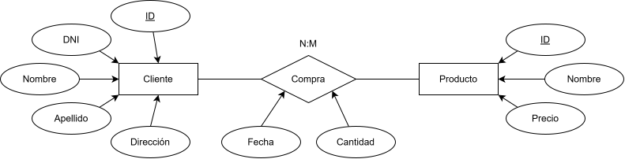
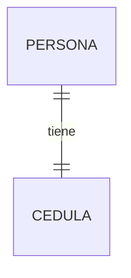
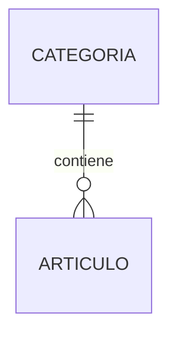
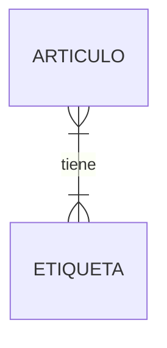
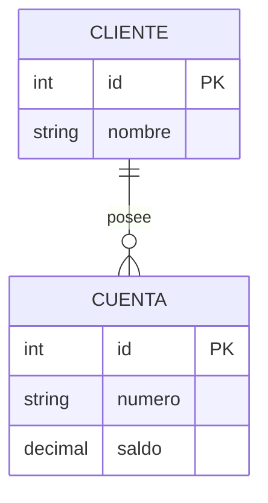
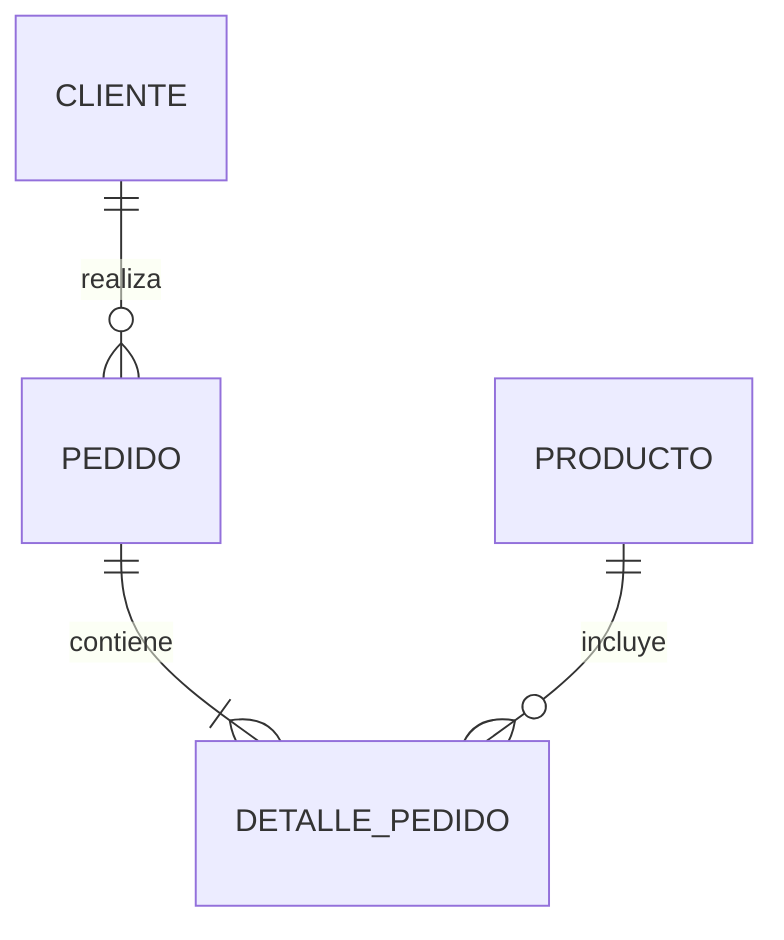
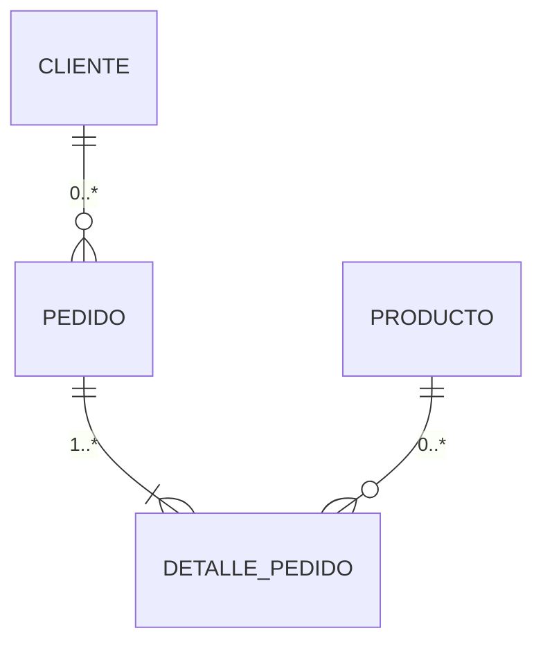
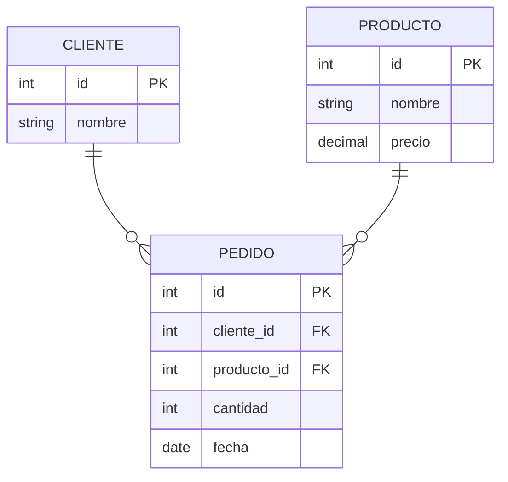
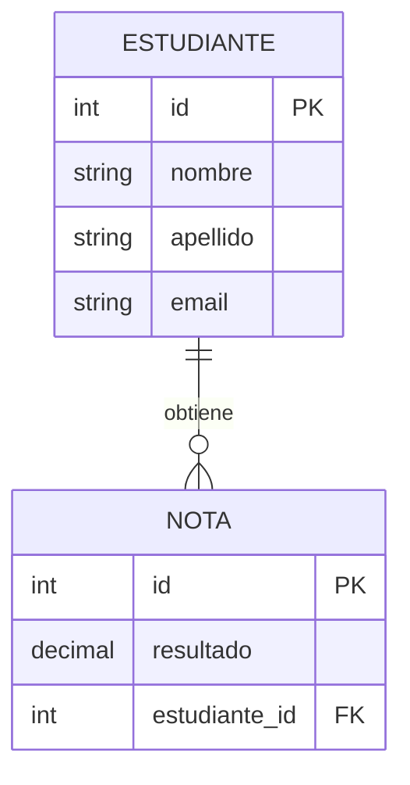

# Modelos Entidad-Relación y Relacional

## El Proceso de Abstracción en el Modelado de Datos

### Análisis de Problemas
Cuando se nos presenta un problema complejo, lo más conveniente es dividirlo en problemas más simples. Estos, a su vez, pueden ser divididos en otros más pequeños, hasta tener un conjunto de pequeños problemas que sean fáciles de atender o solucionar.

### El Modelado como Proceso de Abstracción
- Ayuda a representar las partes de un problema
- Permite representar el funcionamiento lógico de un sistema
- Proporciona una mirada amplia del problema que se está solucionando
- Es el paso previo a la construcción de la base de datos

### Toma de Requerimientos
La investigación y análisis son procesos previos antes de definir y almacenar información en una base de datos. Durante esta etapa debemos:

1. **Identificar las entidades**
2. **Agrupar entidades con sus atributos**
3. **Nombrar las relaciones** entre las entidades en caso de existir

---

## El Modelo Conceptual de Entidad-Relación

### Nomenclatura de un Modelo Conceptual


**Simbología:**
- **Entidades:** Cuadrados (Rectángulos)
- **Atributos:** Círculos (Óvalos)
- **Relaciones:** Rombos

### Ejemplo de Modelo Conceptual



---

## Tipos de Relación (Cardinalidad)

### 1. Uno a Uno (1:1)
Cada entidad de un tipo se relaciona con una única entidad de otro tipo.

**Ejemplo:** Personas y Cédulas
- Cada persona tiene solo un documento de identidad
- Cada cédula está relacionada a una persona



### 2. Uno a Muchos (1:N)
Una entidad de un tipo se relaciona con múltiples entidades de otro tipo.

**Ejemplo:** Artículos y Categorías
- Cada artículo puede tener una categoría
- En una categoría hay diversos artículos



### 3. Muchos a Muchos (N:N)
Múltiples entidades de un tipo se relacionan con múltiples entidades de otro tipo.

**Ejemplo:** Artículos y Etiquetas
- Un artículo puede tener múltiples etiquetas
- Cada etiqueta puede estar asociada a múltiples artículos



---

## Entidades Débiles y Fuertes

### Entidad Fuerte (Regular)
- Aquella que puede ser identificada unívocamente
- En sus atributos se puede definir la clave primaria
- No depende de otra entidad para existir

**Ejemplo:** Cliente - Existe aunque no tenga cuenta asociada

### Entidad Débil
- No puede existir sin participar en una relación
- No puede ser unívocamente identificada solamente por sus atributos
- Depende de otra entidad para existir

**Ejemplo:** Cuenta Bancaria - Si el cliente deja de existir, la cuenta no tendría sentido por sí misma



---

## El Modelo Relacional (Modelo Lógico)

### Definición
El modelo lógico es el siguiente paso para la representación de las entidades y atributos que se definen durante el proceso de modelado conceptual.

**Características:**
- Define entidades transaccionales y operativas
- Permite una visión más cercana al resultado final de la estructura lógica de una base de datos
- Entrega una representación gráfica de cómo fluyen los datos en un sistema

### Notación UML

En la notación UML:
- La cardinalidad se anota como **mínimo..máximo**
- Un único número indica que la cantidad es obligatoria
- El nombre de la relación va:
  - **Sobre la línea:** Para indicar la relación de izquierda a derecha
  - **Bajo la línea:** Para indicarla de derecha a izquierda

### Ejemplo de Modelo Lógico con UML



### Notación Alternativa (Crow's Foot)



---

## Reglas de Transformación

### De Modelo Conceptual a Modelo Lógico

| Elemento Conceptual | Elemento Lógico |
|---------------------|-----------------|
| Entidad (Rectángulo) | Tabla |
| Atributo (Óvalo) | Campo |
| Identificador único | Clave Primaria |

### Transformación de Relaciones N:N

Cuando existe una relación **muchos a muchos** entre dos entidades, **debe existir una tabla intermedia** que las interrelacione.



**Proceso de herencia:**
- La tabla intermedia hereda de Cliente y Producto las claves primarias
- Esta herencia genera la interrelación entre ambas tablas

---

## El Modelo Físico

### Definición
El modelo físico es responsable de representar **cómo se construirá finalmente el modelo** en nuestra base de datos.

**Incluye:**
- Estructura de las tablas
- Definición de cada atributo y su tipo de dato
- Restricciones de las columnas
- Claves primarias
- Claves foráneas
- Relaciones entre las tablas

### Ejemplo de Modelo Físico

```sql
-- Modelo físico completo
CREATE TABLE clientes (
    id INTEGER PRIMARY KEY,
    nombre VARCHAR(50) NOT NULL,
    apellido VARCHAR(50) NOT NULL,
    email VARCHAR(100) UNIQUE,
    telefono VARCHAR(15)
);

CREATE TABLE productos (
    id INTEGER PRIMARY KEY,
    nombre VARCHAR(100) NOT NULL,
    precio DECIMAL(10,2) CHECK (precio > 0),
    stock INTEGER CHECK (stock >= 0)
);

CREATE TABLE pedidos (
    id SERIAL PRIMARY KEY,
    cliente_id INTEGER NOT NULL,
    producto_id INTEGER NOT NULL,
    cantidad INTEGER CHECK (cantidad > 0),
    fecha DATE DEFAULT CURRENT_DATE,
    FOREIGN KEY (cliente_id) REFERENCES clientes(id),
    FOREIGN KEY (producto_id) REFERENCES productos(id)
);
```

---

## Normalización de Datos

### ¿Qué es la Normalización?
Proceso que elimina la redundancia de una base de datos para prevenir inconsistencias. Consta de una serie de pasos llamados **formas normales**.

### Primera Forma Normal (1FN)

**Requisitos:**
1. Cada campo o atributo debe ser **atómico** (contener un único valor)
2. No pueden haber **grupos repetitivos**
3. Debe existir un **identificador único**

#### Ejemplo: Eliminando Grupos Repetitivos

**Antes (Violación 1FN):**
| id_cliente | nombre | telefono1 | telefono2 |
|------------|--------|-----------|-----------|
| 1 | Ana | 123456 | 789012 |
| 2 | Juan | 345678 | 901234 |

**Después (1FN):**
| id_cliente | nombre |
|------------|--------|
| 1 | Ana |
| 2 | Juan |

| id_telefono | id_cliente | telefono |
|-------------|------------|----------|
| 1 | 1 | 123456 |
| 2 | 1 | 789012 |
| 3 | 2 | 345678 |
| 4 | 2 | 901234 |

### Segunda Forma Normal (2FN)

**Requisitos:**
1. Debe satisfacer la **1FN**
2. Cada atributo debe **depender completamente** de la clave primaria (no solo de una parte de ella)

#### Ejemplo: Eliminando Dependencias Parciales

**Antes (Violación 2FN):**
| id_pedido | id_cliente | nombre_cliente | producto |
|-----------|------------|----------------|----------|
| 1 | 1 | Ana | TV |
| 2 | 1 | Ana | Radio |
| 3 | 2 | Juan | TV |

**Después (2FN):**
| id_pedido | id_cliente | producto |
|-----------|------------|----------|
| 1 | 1 | TV |
| 2 | 1 | Radio |
| 3 | 2 | TV |

| id_cliente | nombre_cliente |
|------------|----------------|
| 1 | Ana |
| 2 | Juan |

### Tercera Forma Normal (3FN)

**Requisitos:**
1. Debe satisfacer la **2FN**
2. Toda entidad debe **depender directamente** de la clave primaria
3. Los atributos que dependen de manera parcial deben ser eliminados o almacenados en una nueva entidad

#### Ejemplo: Eliminando Dependencias Transitivas

**Antes (Violación 3FN):**
| id_cliente | nombre | ciudad | codigo_postal |
|------------|--------|--------|---------------|
| 1 | Ana | Santiago | 8320000 |
| 2 | Juan | Santiago | 8320000 |
| 3 | María | Valparaíso | 2340000 |

**Después (3FN):**
| id_cliente | nombre | id_ciudad |
|------------|--------|-----------|
| 1 | Ana | 1 |
| 2 | Juan | 1 |
| 3 | María | 2 |

| id_ciudad | ciudad | codigo_postal |
|-----------|--------|---------------|
| 1 | Santiago | 8320000 |
| 2 | Valparaíso | 2340000 |

---

## Desnormalización

### ¿Qué es Desnormalizar?
Proceso de **añadir redundancia** en las tablas de manera deliberada.

**Motivaciones:**
- Reducir el tiempo de consulta al implementar joins en múltiples tablas
- Maximizar la eficiencia y representación de los datos
- Simplificar ciertas consultas frecuentes

**Importante:**
- No significa ignorar el proceso de normalización
- Es un paso **posterior** a la normalización
- Puede hacer más compleja la mantención de una tabla específica

### Ejemplo de Desnormalización

**Antes (Normalizado):**
```sql
-- Tabla clientes
CREATE TABLE clientes (
    id INT PRIMARY KEY,
    nombre VARCHAR(100)
);

-- Tabla pedidos
CREATE TABLE pedidos (
    id INT PRIMARY KEY,
    cliente_id INT REFERENCES clientes(id),
    total DECIMAL(10,2)
);
```

**Después (Desnormalizado):**
```sql
-- Tabla pedidos desnormalizada
CREATE TABLE pedidos (
    id INT PRIMARY KEY,
    cliente_id INT,
    cliente_nombre VARCHAR(100), -- Redundancia deliberada
    total DECIMAL(10,2)
);
```

---

## Diccionario de Datos

### ¿Qué es el Diccionario de Datos?
Es un **repositorio de metadatos** que contiene las definiciones de los objetos de datos, descripciones y relaciones entre sí.

**Incluye:**
- Nombre de los objetos
- Descripción
- Alias
- Contenido
- Dominio
- Características lógicas y específicas de los datos

### ¿Para qué sirve?
- Permite que los analistas conozcan los detalles y descripciones de los elementos de la base de datos
- Documenta las relaciones entre objetos
- Registra permisos y usuarios asociados
- Proporciona una lista de objetos que forman parte del flujo de datos del sistema

### Ejemplo de Diccionario de Datos

| Tabla | Campo | Tipo de Dato | Restricción | Descripción |
|-------|-------|--------------|-------------|-------------|
| Cliente | id | INTEGER | PRIMARY KEY, NOT NULL | Identificador único del cliente |
| Cliente | nombre | VARCHAR(50) | NOT NULL | Nombre del cliente |
| Cliente | email | VARCHAR(100) | UNIQUE | Correo electrónico del cliente |
| Producto | id | INTEGER | PRIMARY KEY, NOT NULL | Identificador único del producto |
| Producto | precio | DECIMAL(10,2) | CHECK (precio > 0) | Precio del producto |
| Pedido | id | SERIAL | PRIMARY KEY | Identificador del pedido |
| Pedido | cantidad | INTEGER | CHECK (cantidad > 0) | Cantidad de productos |

---

## Trabajo con Archivos SQL

### Creación de Archivos SQL
Podemos crear archivos con extensión `.sql` que nos permiten escribir todos nuestros comandos SQL para poder cargarlos.

### Carga de Archivos SQL
El proceso de carga se realiza con el comando `\i`.

**Sintaxis:**
```sql
\i <nombre_archivo.sql>
```

### Ejemplo de Archivo SQL

**archivo.sql:**
```sql
-- Crear base de datos
CREATE DATABASE tienda;

-- Conectar a la base de datos
\c tienda;

-- Crear tablas
CREATE TABLE clientes (
    id SERIAL PRIMARY KEY,
    nombre VARCHAR(100) NOT NULL
);

-- Insertar datos
INSERT INTO clientes (nombre) VALUES ('Ana');
INSERT INTO clientes (nombre) VALUES ('Juan');
```

**Carga desde consola:**
```bash
psql -U usuario -d postgres -f archivo.sql
```

O dentro de psql:
```sql
\i archivo.sql
```

---

## Ejercicios Prácticos

### Ejercicio 1: Modelo Conceptual de Estudiantes y Notas

**Requisitos:**

**Entidad Estudiantes:**
- ID
- Nombre
- Apellido
- Email

**Entidad Notas:**
- ID
- Resultado

**Tarea:** Crear el modelo conceptual y luego transformarlo a modelo lógico.

#### Solución - Modelo Conceptual



#### Solución - Modelo Lógico (SQL)

```sql
CREATE TABLE estudiantes (
    id SERIAL PRIMARY KEY,
    nombre VARCHAR(50) NOT NULL,
    apellido VARCHAR(50) NOT NULL,
    email VARCHAR(100) UNIQUE
);

CREATE TABLE notas (
    id SERIAL PRIMARY KEY,
    resultado DECIMAL(5,2) CHECK (resultado >= 0 AND resultado <= 10),
    estudiante_id INTEGER NOT NULL,
    FOREIGN KEY (estudiante_id) REFERENCES estudiantes(id)
);
```

### Ejercicio 2: Aplicación de Formas Normales

**Contexto:** Se entrega un modelo de datos con redundancia donde un actor puede participar en múltiples películas y una película tiene múltiples actores.

#### Paso 1: Identificar campos repetitivos
- `Id_actor` y `Actor` se repiten por cada película

#### Paso 2: Crear tabla independiente de actores
- Crear tabla `actores` separada

#### Paso 3: Establecer relación
- Relación N:N entre películas y actores
- Crear tabla intermedia

#### Solución Final (1FN y 2FN)

```sql
-- Tabla películas (1FN)
CREATE TABLE peliculas (
    id SERIAL PRIMARY KEY,
    titulo VARCHAR(200) NOT NULL,
    año INTEGER CHECK (año > 1900)
);

-- Tabla actores (1FN)
CREATE TABLE actores (
    id SERIAL PRIMARY KEY,
    nombre VARCHAR(100) NOT NULL
);

-- Tabla intermedia (relación N:N - 2FN)
CREATE TABLE pelicula_actor (
    pelicula_id INTEGER NOT NULL,
    actor_id INTEGER NOT NULL,
    PRIMARY KEY (pelicula_id, actor_id),
    FOREIGN KEY (pelicula_id) REFERENCES peliculas(id),
    FOREIGN KEY (actor_id) REFERENCES actores(id)
);
```

---

## Resumen de Conceptos Clave

| Concepto | Descripción |
|----------|-------------|
| **Modelo Conceptual** | Representación inicial de entidades, atributos y relaciones |
| **Modelo Lógico** | Transformación de entidades a tablas con claves primarias y foráneas |
| **Modelo Físico** | Definición completa con tipos de datos y restricciones |
| **Cardinalidad** | Tipo de relación entre entidades (1:1, 1:N, N:N) |
| **Entidad Fuerte** | Puede existir independientemente |
| **Entidad Débil** | Depende de otra entidad para existir |
| **1FN** | Atributos atómicos, sin grupos repetitivos, con identificador único |
| **2FN** | Dependencia completa de la clave primaria |
| **3FN** | Dependencia directa de la clave primaria |
| **Desnormalización** | Añadir redundancia deliberadamente para optimizar consultas |
| **Diccionario de Datos** | Repositorio de metadatos y definiciones |

---

## Guía de Ejercicios y Recursos

### Herramientas Sugeridas
- **DBeaver:** Interfaz gráfica para bases de datos
- **Visual Studio Code:** Editor de código con soporte SQL
- **Herramientas de diagramas:** Para modelado conceptual y lógico

### Documentación Adicional
- Visitar documentaciones oficiales para profundizar en reglas de transformación y normalización
- Explorar más formas normales (BCNF, 4FN, 5FN) para casos avanzados