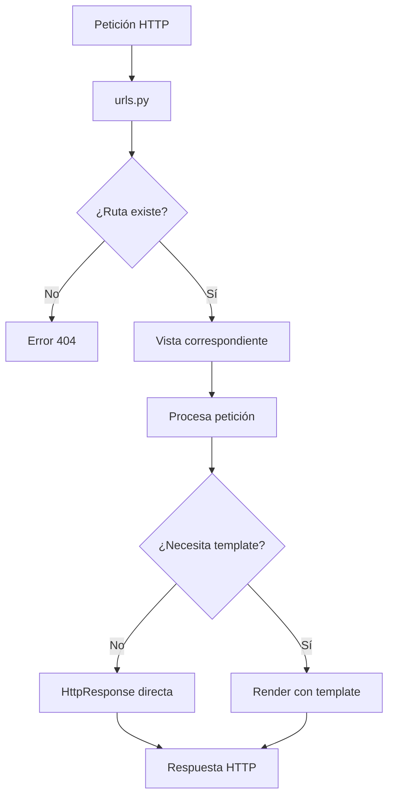
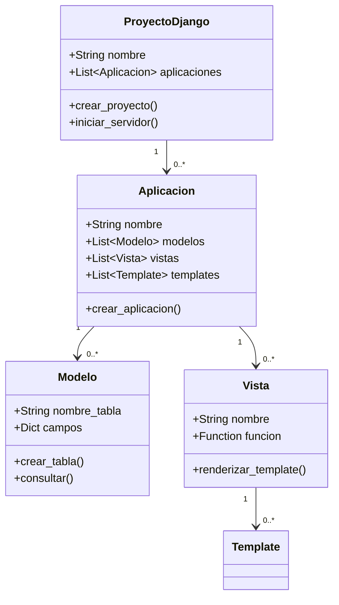

# Cuestionario Introducción a Django

---

## Pregunta 1

**¿Cuál es la principal diferencia entre el patrón MVC tradicional y el patrón MVT utilizado por Django?**

A) En MVT, el Controlador se elimina completamente del flujo de trabajo
B) En MVT, el Template reemplaza al Modelo en la capa de datos
C) En MVT, la Vista actúa como el Controlador del patrón MVC
D) En MVT, el Modelo se fusiona con el Template para crear una capa única

<details>
<summary><strong>Ver respuesta</strong></summary>

**Respuesta correcta: C**

**Justificación:** En el patrón MVT (Modelo-Vista-Template) de Django, la capa que funciona como controlador es la Vista, mientras que en MVC tradicional el Controlador es una capa separada. El Template en MVT corresponde a la capa de visualización (Vista) del MVC.

</details>

---

## Pregunta 2

**Dado el siguiente código en Django, ¿qué se mostrará en el navegador al acceder a la ruta '/saludo/Juan/'?**

```python
# urls.py
from django.urls import path
from . import views

urlpatterns = [
    path('saludo/<str:nombre>/', views.saludar),
]

# views.py
from django.http import HttpResponse

def saludar(request, nombre):
    return HttpResponse(f"Bienvenido {nombre} a Django")
```

A) Error 404 - Página no encontrada
B) "Bienvenido {nombre} a Django"
C) "Bienvenido a Django"
D) "Bienvenido Juan a Django"

<details>
<summary><strong>Ver respuesta</strong></summary>

**Respuesta correcta: D**

**Justificación:** La ruta está definida correctamente con un parámetro dinámico `<str:nombre>`. La función `saludar` recibe este parámetro y lo utiliza en el `HttpResponse` mediante un f-string, mostrando el nombre proporcionado en la URL.

</details>

---

## Pregunta 3

**¿Cuál es el propósito principal del archivo manage.py en un proyecto Django?**

A) Definir las rutas URL de la aplicación
B) Proporcionar comandos de consola para gestionar el proyecto
C) Almacenar todas las configuraciones de la base de datos
D) Contener las plantillas HTML del proyecto

<details>
<summary><strong>Ver respuesta</strong></summary>

**Respuesta correcta: B**

**Justificación:** `manage.py` es un script que proporciona una interfaz de línea de comandos para realizar diversas operaciones de gestión del proyecto Django, como ejecutar el servidor de desarrollo (`runserver`), crear aplicaciones (`startapp`), y ejecutar migraciones (`migrate`).

</details>

---

## Pregunta 4

**¿De cuáles maneras se puede conocer la versión de Django instalada en un proyecto?**

I. Revisando las URLs incluidas en los comentarios de los archivos de configuración del proyecto
II. Invocando `print(django.get_version())` desde la consola interactiva de Python o mediante `python manage.py shell`
III. Revisando el archivo `requirements.txt` anexado al proyecto

**Es(son) FALSA(S):**

A) Solo I
B) Solo II
C) Solo III
D) I y II

<details>
<summary><strong>Ver respuesta</strong></summary>

**Respuesta correcta: A**

**Justificación:** 
- La afirmación I es **FALSA**: Las URLs incluidas en comentarios de archivos de configuración no contienen información sobre la versión de Django instalada. Los comentarios son documentación y no reflejan necesariamente la versión real del framework.
- La afirmación II es **VERDADERA**: `django.get_version()` es el método estándar para obtener la versión de Django instalada, y se puede ejecutar desde la consola interactiva de Python o desde el shell de Django (`python manage.py shell`).
- La afirmación III es **VERDADERA**: El archivo `requirements.txt` documenta las dependencias del proyecto con sus versiones específicas, incluyendo la versión de Django.

</details>

---

## Pregunta 5

**¿Cuál de las siguientes afirmaciones sobre los entornos virtuales en Python es INCORRECTA?**

A) Permiten instalar diferentes versiones de una misma biblioteca en diferentes entornos
B) Pueden ser activados y desactivados según sea necesario
C) Son obligatorios para cualquier proyecto Django
D) Permiten aislar las dependencias de diferentes proyectos

<details>
<summary><strong>Ver respuesta</strong></summary>

**Respuesta correcta: C**

**Justificación:** Aunque los entornos virtuales son altamente recomendados y considerados una buena práctica en el desarrollo con Django, no son obligatorios. Django puede funcionar en el entorno global de Python, aunque esto no es recomendable por los potenciales conflictos de dependencias.

</details>

---

## Pregunta 6

**¿Qué código en urls.py permitiría acceder a la vista 'producto' con un parámetro numérico?**

A) `path('producto/<int:id>/', views.producto)`
B) `path('producto/id<int>/', views.producto)`
C) `path('producto/[0-9]/', views.producto)`
D) `path('producto/<str:id>/', views.producto)`

<details>
<summary><strong>Ver respuesta</strong></summary>

**Respuesta correcta: A**

**Justificación:** En Django, los parámetros de ruta se definen con la sintaxis `<tipo:nombre>`. Para parámetros numéricos (enteros), se utiliza `int`, por lo tanto `<int:id>` es la sintaxis correcta para capturar un número entero.

</details>

---

## Pregunta 7

**¿Qué función cumple el archivo requirements.txt en un proyecto Django?**

A) Define las rutas de las aplicaciones
B) Contiene las variables de entorno del proyecto
C) Almacena las configuraciones de la base de datos
D) Documenta y centraliza las dependencias del proyecto con sus versiones

<details>
<summary><strong>Ver respuesta</strong></summary>

**Respuesta correcta: D**

**Justificación:** `requirements.txt` es un archivo que lista todas las dependencias del proyecto con sus versiones específicas. Permite que otros desarrolladores o entornos instalen exactamente las mismas versiones de los paquetes necesarios para ejecutar el proyecto.

</details>

---

## Pregunta 8

**Considerando el siguiente diagrama de flujo para el manejo de peticiones en Django:**



**¿Qué sucede cuando se recibe una petición a una ruta que no está definida en urls.py?**

A) Se muestra la vista por defecto del proyecto
B) La petición se ignora silenciosamente
C) Se redirige automáticamente a la página de inicio
D) Se genera un error 404

<details>
<summary><strong>Ver respuesta</strong></summary>

**Respuesta correcta: D**

**Justificación:** Según el diagrama, cuando el enrutador de Django no encuentra una coincidencia para la ruta solicitada en `urls.py`, retorna un error 404 (Página no encontrada), que es el comportamiento estándar del framework.

</details>

---

## Pregunta 9

**Dado el siguiente código, ¿cuál sería la forma correcta de pasar datos dinámicos a un template?**

```python
from django.shortcuts import render

def mostrar_usuario(request, username):
    # Opciones para pasar datos al template
```

A) `return render(request, 'usuario.html', {'usuario': username})`
B) `return render(request, 'usuario.html', context=username)`
C) `return render(request, 'usuario.html', username)`
D) `return render(request, 'usuario.html', usuario=username)`

<details>
<summary><strong>Ver respuesta</strong></summary>

**Respuesta correcta: A**

**Justificación:** La función `render()` recibe un diccionario como tercer argumento para el contexto. La sintaxis correcta es pasar un diccionario donde las claves son los nombres de las variables que se usarán en el template y los valores son los datos correspondientes.

</details>

---

## Pregunta 10

**¿Cuál es la función del comando `pip freeze > requirements.txt`?**

A) Crear un nuevo entorno virtual con las dependencias
B) Eliminar todas las dependencias del proyecto actual
C) Instalar todas las dependencias listadas en requirements.txt
D) Generar un archivo con todas las dependencias instaladas y sus versiones

<details>
<summary><strong>Ver respuesta</strong></summary>

**Respuesta correcta: D**

**Justificación:** `pip freeze` lista todos los paquetes instalados en el entorno actual con sus versiones específicas. El operador `>` redirige esta salida a un archivo, creando así el archivo `requirements.txt` que documenta todas las dependencias y sus versiones exactas.

</details>

---

## Pregunta 11

**¿Cuál sería la salida en el navegador al ejecutar esta vista y acceder a la ruta correspondiente?**

```python
# views.py
from django.http import HttpResponse

def operacion(request, a, b):
    resultado = a * b + 10
    return HttpResponse(f"El resultado es {resultado}")

# urls.py
urlpatterns = [
    path('operacion/<int:a>/<int:b>/', views.operacion),
]
```

**Acceso a:** `/operacion/5/3/`

A) "El resultado es 15"
B) "El resultado es 18"
C) "El resultado es 53"
D) "El resultado es 25"

<details>
<summary><strong>Ver respuesta</strong></summary>

**Respuesta correcta: D**

**Justificación:** La URL proporciona los valores a=5 y b=3. La función realiza la operación: 5 * 3 + 10 = 15 + 10 = 25. El resultado se muestra mediante un f-string en el HttpResponse.

</details>

---

## Pregunta 12

**¿Por qué es importante el principio DRY (Don't Repeat Yourself) en el desarrollo con Django?**

A) Porque permite que Django funcione sin necesidad de configuraciones
B) Porque permite escribir código más rápido sin preocuparse por la estructura
C) Porque es un requisito obligatorio del framework Django
D) Porque facilita el mantenimiento y reduce errores al evitar duplicación de código

<details>
<summary><strong>Ver respuesta</strong></summary>

**Respuesta correcta: D**

**Justificación:** El principio DRY busca evitar la duplicación de código, lo que facilita el mantenimiento, reduce la probabilidad de errores, mejora la legibilidad y promueve la reutilización. Esto es especialmente importante en frameworks como Django donde la organización del código es fundamental.

</details>

---

## Pregunta 13

**Observa el siguiente diagrama de clases UML simplificado:**



**¿Qué relación existe entre un Proyecto Django y sus Aplicaciones según el diagrama?**

A) Un Proyecto solo puede tener una Aplicación
B) Un Proyecto puede tener múltiples Aplicaciones
C) Una Aplicación puede pertenecer a múltiples Proyectos
D) Las Aplicaciones son independientes del Proyecto

<details>
<summary><strong>Ver respuesta</strong></summary>

**Respuesta correcta: B**

**Justificación:** El diagrama muestra una relación de composición donde un `ProyectoDjango` contiene de cero a múltiples `Aplicacion` (0..*), lo que indica que un proyecto puede tener varias aplicaciones, cada una con sus propios modelos, vistas y templates.

</details>

---

## Pregunta 14

**¿Cuál de las siguientes opciones generaría un ERROR en un archivo urls.py de Django?**

A) `path('', views.inicio, name='inicio')`
B) `path('categoria/<str:nombre>/', categoria_view())`
C) `path('productos/', views.listar_productos)`
D) `path('usuario/<int:id>/', views.ver_usuario)`

<details>
<summary><strong>Ver respuesta</strong></summary>

**Respuesta correcta: B**

**Justificación:** En `path()`, la vista debe ser una referencia a la función (sin paréntesis) que se ejecutará cuando la ruta coincida. La opción B incluye paréntesis (`categoria_view()`), lo que intenta ejecutar la función en el momento de definir la ruta, causando un error. Las otras opciones tienen sintaxis correcta.

</details>

---

## Pregunta 15

**¿Cuál de las siguientes NO es una ventaja de utilizar entornos virtuales en proyectos Django?**

A) Flexibilidad en versiones de bibliotecas
B) Aislamiento de dependencias entre proyectos
C) Mejora del rendimiento de la aplicación
D) Reproducibilidad del entorno de desarrollo

<details>
<summary><strong>Ver respuesta</strong></summary>

**Respuesta correcta: C**

**Justificación:** Los entornos virtuales proporcionan aislamiento, reproducibilidad y flexibilidad en las dependencias, pero no mejoran directamente el rendimiento de la aplicación. El rendimiento depende de la implementación, optimización del código y la infraestructura donde se ejecuta.

</details>

---

## Pregunta 16

**Dado el siguiente código en un proyecto Django, ¿cuál sería el resultado al visitar `/libro/El Principito/`?**

```python
# urls.py
urlpatterns = [
    path('libro/<str:titulo>/', views.mostrar_libro),
]

# views.py
from django.shortcuts import render

def mostrar_libro(request, titulo):
    contexto = {
        'titulo': titulo,
        'autor': 'Saint-Exupéry',
        'año': 1943
    }
    return render(request, 'libro.html', contexto)
```

**Template libro.html:**
```html
<h1>{{ titulo }}</h1>
<p>Autor: {{ autor }}</p>
<p>Año: {{ año }}</p>
```

A) Muestra solo "El Principito" sin autor ni año
B) Muestra la información del libro por defecto del sistema
C) Muestra "El Principito" con todos los datos del contexto
D) Muestra un error porque el template no encuentra las variables

<details>
<summary><strong>Ver respuesta</strong></summary>

**Respuesta correcta: C**

**Justificación:** La vista recibe el título como parámetro de la URL, lo agrega al contexto junto con el autor y año, y renderiza el template. El template usa correctamente la sintaxis `{{ variable }}` para mostrar todos los datos del contexto.

</details>

---

## Pregunta 17

**Sobre el siguiente fragmento de código del archivo de configuraciones de un proyecto Django:**

```python
DATABASES = {
    'default': {
        'ENGINE': 'django.db.backends.sqlite3',
        'NAME': BASE_DIR / 'db.sqlite3',
    }
}
```

**¿Cuál de las siguientes afirmaciones es VERDADERA?**

I. BASE_DIR es una constante que almacena la ruta raíz dinámica del proyecto
II. El código posee un `TypeError` en la operación `BASE_DIR / 'db.sqlite3'`
III. Para actualizar la información sobre la base de datos que se va a utilizar debemos modificar el valor de `DATABASES['default']`

A) I y III
B) II y III
C) Solo I
D) Ninguna

<details>
<summary><strong>Ver respuesta</strong></summary>

**Respuesta correcta: A**

**Justificación:** 
- La afirmación I es correcta: `BASE_DIR` es efectivamente una constante definida en `settings.py` que almacena la ruta absoluta al directorio raíz del proyecto usando `Path(__file__).resolve().parent.parent`.
- La afirmación II es incorrecta: No hay `TypeError` porque `BASE_DIR` es un objeto `Path` de Python que sobrecarga el operador `/` para concatenar rutas de manera segura y multiplataforma.
- La afirmación III es correcta: Para cambiar la configuración de la base de datos, se modifica el diccionario `DATABASES['default']`, ya sea cambiando el motor (ENGINE), el nombre (NAME), usuario, contraseña, etc.

</details>

---

## Pregunta 18

**Dado el siguiente archivo `urls.py` de una aplicación Django, ¿cuál sería la URL correcta para acceder a la vista `buscar_producto`?**

```python
from django.urls import path
from . import views

urlpatterns = [
    path('productos/', views.listar_productos, name='lista'),
    path('productos/<int:id_producto>/', views.detalle_producto, name='detalle'),
    path('buscar/<str:termino>/<int:pagina>/', views.buscar_producto, name='busqueda'),
    path('categorias/<slug:slug_categoria>/', views.categoria, name='categoria'),
]
```

A) `/buscar/<str:termino>/<int:pagina>/`
B) `/buscar/laptop/1`
C) `/buscar/laptop/pagina/1/`
D) `/buscar/laptop/1/`

<details>
<summary><strong>Ver respuesta</strong></summary>

**Respuesta correcta: D**

**Justificación:** La ruta definida es `buscar/<str:termino>/<int:pagina>/`. Esto requiere:
- Un primer parámetro de tipo string (`str:termino`) que corresponde al término de búsqueda
- Un segundo parámetro de tipo entero (`int:pagina`) que corresponde al número de página
- La URL debe terminar con slash `/`

La opción D (`/buscar/laptop/1/`) cumple con todos estos requisitos: `laptop` es string, `1` es entero, y termina con `/`. La opción A es la definición de la ruta, no una URL válida. La opción B no termina con slash. La opción C tiene un formato incorrecto.

</details>

---

## Pregunta 19

**¿Cuál sería el resultado de ejecutar las siguientes líneas de código en el entorno virtual de un proyecto Django recién creado?**

```python
>>> from django.db import connection
>>> print(connection.settings_dict['NAME'])
```

**Considerando que no se han realizado migraciones y la base de datos aún no existe:**

A) Se genera un error porque la base de datos no existe físicamente
B) Se imprime `sqlite3`
C) No se ejecuta porque falta importar `settings`
D) Se imprime el nombre de la base de datos definida en `settings.py`

<details>
<summary><strong>Ver respuesta</strong></summary>

**Respuesta correcta: D**

**Justificación:** `connection.settings_dict['NAME']` accede a la configuración de la base de datos definida en `settings.py` en el momento de la conexión, sin necesidad de que la base de datos exista físicamente. La conexión se establece cuando se ejecuta la consulta, no al importar el módulo. Por lo tanto, devuelve el valor configurado para `NAME` en la variable `DATABASES`.

</details>

---

## Pregunta 20

**Un desarrollador está trabajando en un proyecto Django con múltiples aplicaciones. Observa que al ejecutar `python manage.py runserver`, Django muestra advertencias sobre migraciones pendientes. ¿Qué acción DEBE realizar para solucionar este problema de manera correcta?**

A) Eliminar todas las migraciones y crear nuevas desde cero
B) Modificar el archivo `settings.py` para deshabilitar las migraciones
C) Ignorar las advertencias y continuar con el desarrollo
D) Ejecutar `python manage.py makemigrations` seguido de `python manage.py migrate`

<details>
<summary><strong>Ver respuesta</strong></summary>

**Respuesta correcta: D**

**Justificación:** Las advertencias de migraciones pendientes indican que hay cambios en los modelos que aún no han sido aplicados a la base de datos. El flujo correcto es:
1. `makemigrations`: Crea los archivos de migración basados en los cambios detectados en los modelos
2. `migrate`: Aplica esas migraciones a la base de datos

Las otras opciones son incorrectas porque ignorar las advertencias puede causar errores, eliminar migraciones puede perder el historial de cambios, y deshabilitar migraciones no es recomendable ya que es una característica fundamental de Django.

</details>

---

## Pregunta 21

**¿Cuál de las siguientes afirmaciones describe correctamente la relación entre un proyecto Django y las aplicaciones que lo componen?**

A) Cada proyecto Django solo puede contener una aplicación, pero esta puede tener múltiples vistas
B) Las aplicaciones deben estar siempre en el directorio raíz del proyecto
C) Las aplicaciones son módulos independientes que pueden ser reutilizados en diferentes proyectos
D) Un proyecto Django es una aplicación especial que contiene todas las demás aplicaciones

<details>
<summary><strong>Ver respuesta</strong></summary>

**Respuesta correcta: C**

**Justificación:** Una de las filosofías clave de Django es la reutilización. Las aplicaciones en Django son módulos autocontenidos que cumplen una funcionalidad específica y pueden ser:
- Reutilizadas en diferentes proyectos
- Compartidas con la comunidad
- Empaquetadas y distribuidas

La afirmación A es incorrecta porque un proyecto puede tener múltiples aplicaciones. La B es incorrecta porque las aplicaciones pueden estar en diferentes ubicaciones. La D es incorrecta porque un proyecto es un contenedor de configuraciones, no una aplicación especial.

</details>

---

## Pregunta 22

**¿Cuál de las siguientes opciones es la forma CORRECTA de importar y usar el módulo `render` en Django?**

A) 
```python
from django import render
return render(request, 'template.html')
```

B) 
```python
from django.shortcuts import render
return render(request, 'template.html')
```

C) 
```python
import django.shortcuts
return django.shortcuts.render(request, 'template.html')
```

D) 
```python
import render from django.shortcuts
return render(request, 'template.html')
```

<details>
<summary><strong>Ver respuesta</strong></summary>

**Respuesta correcta: B**

**Justificación:** La sintaxis correcta para importar la función `render` en Django es `from django.shortcuts import render`. Esta es la forma más común y recomendada. La opción A es incorrecta porque `render` no está directamente en el módulo `django`. La opción C es técnicamente funcional pero verbose. La opción D tiene la sintaxis de importación invertida (debería ser `from django.shortcuts import render`).

</details>

---

## Pregunta 23

**Dado el siguiente código que intenta crear una vista con contexto dinámico, ¿qué mostrará el template al acceder a `/usuario/admin/`?**

```python
# views.py
from django.shortcuts import render

def perfil_usuario(request, username):
    roles = ['admin', 'editor', 'lector']
    permisos = {
        'admin': ['crear', 'editar', 'eliminar'],
        'editor': ['editar'],
        'lector': []
    }
    
    context = {
        'usuario': username.upper(),
        'rol': 'admin' if username == 'admin' else 'usuario',
        'permisos': permisos.get(username, [])
    }
    
    return render(request, 'perfil.html', context)
```

**Template perfil.html:**
```html
<h2>Usuario: {{ usuario }}</h2>
<p>Rol: {{ rol }}</p>
<p>Permisos: {{ permisos|join:", " }}</p>
```

A) 
```
Usuario: ADMIN
Rol: usuario
Permisos: 
```

B) 
```
Usuario: admin
Rol: admin
Permisos: admin
```

C) 
```
Usuario: ADMIN
Rol: admin
Permisos: ['crear', 'editar', 'eliminar']
```

D) 
```
Usuario: ADMIN
Rol: admin
Permisos: crear, editar, eliminar
```

<details>
<summary><strong>Ver respuesta</strong></summary>

**Respuesta correcta: D**

**Justificación:** 
- `username` es "admin" y se convierte a mayúsculas con `.upper()`, resultando en "ADMIN"
- La condición `username == 'admin'` es verdadera, por lo que `rol` es 'admin'
- `permisos.get('admin', [])` devuelve `['crear', 'editar', 'eliminar']`
- El filtro `join:", "` convierte la lista en una cadena separada por comas

Por lo tanto, el resultado es el mostrado en la opción D.

</details>

---

## Pregunta 24

**Dada la siguiente vista basada en función:**

```python
from django.http import HttpResponse

def derechos_reservados(request):
    return HttpResponse('© 2026, www.misitio.cl')
```

**¿Cuál es su Class-based view equivalente?**

A)
```python
from django.http import HttpResponse
from django.views import View

class DerechosReservados(View):
    def post(self, request):
        return HttpResponse('© 2026, www.misitio.cl')
```

B)
```python
from django.http import HttpResponse
from django.views import View

class DerechosReservados(View):
    def dispatch(self, request):
        return HttpResponse('© 2026, www.misitio.cl')
```

C)
```python
from django.http import HttpResponse
from django.views import View

class DerechosReservados(View):
    def get(self, request):
        return HttpResponse('© 2026, www.misitio.cl')
```

D)
```python
from django.http import HttpResponse
from django.views import View

class DerechosReservados(View):
    def render(self, request):
        return HttpResponse('© 2026, www.misitio.cl')
```

<details>
<summary><strong>Ver respuesta</strong></summary>

**Respuesta correcta: C**

**Justificación:** La vista basada en función maneja peticiones GET (que es el método HTTP por defecto al acceder a una URL en el navegador). En una Class-based view (CBV) que hereda de `View`, el método que maneja peticiones GET se llama `get()`. La opción C implementa correctamente este método con el mismo comportamiento que la función original.

La opción A es incorrecta porque `post()` maneja peticiones POST, no GET. La opción B es incorrecta porque `dispatch()` es un método interno que determina qué método HTTP manejar, no se usa directamente para la respuesta. La opción D es incorrecta porque `render()` no es un método estándar de `View`.

</details>

---

## Pregunta 25

**¿Cuál de los siguientes `path()` son configuraciones válidas para la vista `derechos_reservados` basada en función y su respectiva versión basada en clases?**

A)
```python
# Para FBV
path('derechos/', views.derechos_reservados())

# Para CBV
path('derechos/', views.DerechosReservados)
```

B)
```python
# Para FBV
path('derechos/', views.derechos_reservados)

# Para CBV
path('derechos/', views.DerechosReservados.view())
```

C)
```python
# Para FBV
path('derechos/', views.derechos_reservados, name='derechos')

# Para CBV
path('derechos/', views.DerechosReservados.as_view(), name='derechos')
```

D)
```python
# Para FBV
path('derechos/', views.derechos_reservados)

# Para CBV
path('derechos/', views.DerechosReservados.as_view())
```

<details>
<summary><strong>Ver respuesta</strong></summary>

**Respuesta correcta: C**

**Justificación:** 
- Para **FBV** (Function-Based View): Se pasa la referencia a la función sin paréntesis: `views.derechos_reservados`
- Para **CBV** (Class-Based View): Se debe usar el método de clase `as_view()` que retorna una función callable: `views.DerechosReservados.as_view()`

La opción C es la más completa porque incluye el parámetro `name`, que es una buena práctica. La opción D también es sintácticamente correcta pero menos completa. Las opciones A y B son incorrectas porque la FBV no debe llevar paréntesis, la CBV necesita `as_view()`, y `view()` no existe como método en View.

</details>

---

## Pregunta 26

**¿Qué debe hacer el usuario final de nuestro proyecto (cuando se encuentre desplegado) si quiere navegar hacia la página de derechos reservados de nuestro sitio?**

A) Conocer el nombre de la función `derechos_reservados` y escribirla en la barra de direcciones
B) Escribir en el navegador la URL exacta configurada en `urls.py` para esa vista
C) Hacer clic en un enlace que el desarrollador debe proporcionar en alguna parte de la interfaz
D) Ambas B y C son correctas

<details>
<summary><strong>Ver respuesta</strong></summary>

**Respuesta correcta: D**

**Justificación:** El usuario final puede acceder a la página de derechos reservados de dos maneras:
- **Directamente**: Escribiendo la URL exacta configurada en `urls.py` (opción B)
- **Indirectamente**: A través de enlaces o botones en la interfaz web que el desarrollador ha implementado (opción C)

El usuario no necesita conocer el nombre de la función (opción A), ya que esto es un detalle de implementación interno. Ambas formas (C y D) son correctas y complementarias en una aplicación web real.

</details>

---

## Pregunta 27

**Para mejorar la interfaz de usuario de la página de derechos reservados, se ha decidido crear una plantilla `derechos_reservados.html` con datos estáticos. ¿Cómo hago posible que la vista en forma de función utilice este recurso?**

A)
```python
from django.shortcuts import render

def derechos_reservados(request):
    return render(request, 'derechos_reservados.html')
```

B)
```python
from django.http import HttpResponse
from django.template import Template

def derechos_reservados(request):
    template = Template('<html>...</html>')
    return HttpResponse(template.render())
```

C)
```python
from django.template import loader

def derechos_reservados(request):
    template = loader.get_template('derechos_reservados.html')
    return HttpResponse(template.render())
```

D) Ambas A y C son correctas

<details>
<summary><strong>Ver respuesta</strong></summary>

**Respuesta correcta: D**

**Justificación:** Django ofrece múltiples formas de renderizar templates:

- **Opción A**: Usa la función `render()` de `django.shortcuts`, que es la forma más común y simplificada. Automáticamente carga el template, lo renderiza y devuelve un `HttpResponse`.

- **Opción C**: Usa el `loader` de templates de manera más explícita, cargando el template y luego renderizándolo. Esta es la forma "más verbosa" pero igualmente válida.

- La opción B es funcional pero no es práctica para templates almacenados en archivos, ya que define el HTML directamente en el código Python, lo cual no es recomendable.

Ambas opciones A y C son correctas, por lo que la respuesta D es la adecuada.

</details>

---

## Pregunta 28

**Se ha decidido insertar un elemento HTML en la plantilla `derechos_reservados.html` para mostrar fecha y hora de ingreso a esa página. ¿Cuál es el procedimiento lógico que se debe realizar en el proyecto Django para lograr que esto sea posible?**

A) Crear una variable de contexto en la vista que contenga la fecha y hora actual, y pasarla al template mediante el diccionario de contexto
B) Modificar directamente la plantilla HTML para que contenga un script de JavaScript que obtenga la fecha y hora del cliente
C) Usar la etiqueta de template `` directamente en el HTML
D) Agregar un filtro personalizado en Django que inyecte automáticamente la fecha y hora en todas las plantillas

<details>
<summary><strong>Ver respuesta</strong></summary>

**Respuesta correcta: C**

**Justificación:** Django proporciona etiquetas de template para manejar fechas y horas sin necesidad de crear contexto en la vista. La etiqueta `` permite mostrar la fecha y hora actual del servidor directamente en el template.

**Análisis de las opciones:**
- **A**: Es funcional pero innecesariamente compleja para este caso específico. Sería correcta si se necesitara procesar la fecha antes de mostrarla.
- **B**: Funcional pero no es el enfoque de Django, mezcla lógica de presentación (JavaScript) con el template, y además muestra la hora del cliente, no del servidor.
- **C**: Es la forma más simple, directa y apropiada en Django para mostrar fecha/hora actual en un template.
- **D**: Sobredimensionado y excesivo para una simple fecha/hora.

</details>

---

## Pregunta 29

**En el contexto de la configuración de templates en Django, ¿cuál es el propósito principal de la clave `'APP_DIRS': True`?**

A) Permite que Django compile automáticamente los templates de cada aplicación en producción
B) Permite que Django cree automáticamente la carpeta `templates` en cada aplicación que se instale
C) Permite que Django sincronice los templates entre diferentes aplicaciones para mantener consistencia
D) Permite que Django busque templates en el directorio `templates` de cada aplicación dentro de `INSTALLED_APPS`

<details>
<summary><strong>Ver respuesta</strong></summary>

**Respuesta correcta: D**

**Justificación:** 
El parámetro `'APP_DIRS': True` es una configuración que le indica a Django que debe incluir en su proceso de búsqueda los directorios `templates` de todas las aplicaciones que están registradas en `INSTALLED_APPS`.

**Análisis de las opciones:**
- **A**: Incorrecta porque no tiene relación con compilación en producción
- **B**: Incorrecta porque Django no crea carpetas automáticamente
- **C**: Incorrecta porque no sincroniza nada entre aplicaciones
- **D**: Correcta, describe exactamente el propósito

</details>

---

## Pregunta 30

**Dada la siguiente configuración en el archivo `settings.py` de un proyecto Django:**

```python
TEMPLATES = [
    {
        'BACKEND': 'django.template.backends.django.DjangoTemplates',
        'DIRS': ['templates'],
        'APP_DIRS': True,
        'OPTIONS': {
            'context_processors': [
                'django.template.context_processors.request',
                'django.contrib.auth.context_processors.auth',
                'django.contrib.messages.context_processors.messages',
            ],
        },
    },
]
```

**¿Cuál de las siguientes afirmaciones sobre la búsqueda de templates es CORRECTA?**

A) Django buscará primero en el directorio `templates` definido en `DIRS` y luego en la carpeta `templates` de cada aplicación instalada
B) Django buscará primero en la carpeta `templates` de cada aplicación y luego en el directorio `templates` definido en `DIRS`
C) Django buscará únicamente en el directorio `templates` definido en `DIRS`, ignorando los templates dentro de las aplicaciones
D) Django buscará únicamente en las carpetas `templates` de las aplicaciones, ignorando el directorio `DIRS`

<details>
<summary><strong>Ver respuesta</strong></summary>

**Respuesta correcta: A**

**Justificación:** La configuración establece dos formas de localizar templates:
- `'DIRS': ['templates']`: Define un directorio a nivel de proyecto para almacenar templates globales
- `'APP_DIRS': True`: Permite que Django busque también en la carpeta `templates` de cada aplicación instalada

El orden de búsqueda por defecto en Django es:
1. Directorios definidos en `DIRS` (en el orden listado)
2. Directorio `templates` de cada aplicación (en el orden de `INSTALLED_APPS`)

Por lo tanto, la opción A es correcta: Django buscará primero en `templates` a nivel de proyecto y luego en las aplicaciones.

</details>

---

## Pregunta 31

**Suponiendo que tienes un proyecto Django con las siguientes características:**
- El directorio `templates/` a nivel de proyecto contiene `base.html`
- La aplicación `blog` tiene `templates/blog/articulo.html` que extiende `base.html`

**¿Qué sucederá al renderizar `articulo.html` con `render(request, 'blog/articulo.html')`?**

A) Django buscará `base.html` en el directorio global `templates` porque está definido en `DIRS` antes que las aplicaciones
B) Django mostrará un error porque `base.html` no se encuentra en la misma carpeta que `articulo.html`
C) Django buscará `base.html` directamente en el directorio global `templates` ya que `APP_DIRS: True` permite que las plantillas hereden de templates globales
D) Django buscará `base.html` primero en el directorio `templates` de la aplicación `blog` y, al no encontrarlo, lo buscará en el directorio global `templates`

<details>
<summary><strong>Ver respuesta</strong></summary>

**Respuesta correcta: A**

**Justificación:** 
- La configuración tiene `'APP_DIRS': True`, lo que permite que los templates de las aplicaciones extiendan templates de otros directorios
- El orden de búsqueda es: primero `DIRS` (directorio global) y luego cada aplicación en orden de `INSTALLED_APPS`
- Cuando `articulo.html` usa ``, Django buscará `base.html` en el mismo orden de búsqueda
- Por lo tanto, encontrará `base.html` en el directorio global `templates` antes de buscar en las aplicaciones

La opción A es correcta porque el orden de búsqueda da prioridad a `DIRS` antes que a las aplicaciones.

</details>

---

## Pregunta 32

**Considera la siguiente modificación en la configuración:**

```python
TEMPLATES = [
    {
        'BACKEND': 'django.template.backends.django.DjangoTemplates',
        'DIRS': [BASE_DIR / 'templates_globales'],
        'APP_DIRS': False,
        # ... resto de la configuración
    },
]
```

**Teniendo dos aplicaciones `blog` y `tienda`, cada una con su carpeta `templates`. ¿Qué afirmación es VERDADERA?**

A) Django mostrará un error porque `APP_DIRS: False` requiere que se especifique al menos una ruta en `DIRS`
B) Django buscará templates en las aplicaciones pero no en `templates_globales`
C) Django buscará templates en `templates_globales` y en las carpetas de ambas aplicaciones
D) Django buscará templates únicamente en `templates_globales`, ignorando las aplicaciones

<details>
<summary><strong>Ver respuesta</strong></summary>

**Respuesta correcta: D**

**Justificación:** 
- `'DIRS': [BASE_DIR / 'templates_globales']` define un directorio global para templates
- `'APP_DIRS': False` DESACTIVA la búsqueda automática en las carpetas `templates` de las aplicaciones

Con esta configuración, Django SOLO buscará templates en `templates_globales`. No se mostrará error porque `DIRS` está definido correctamente con una ruta válida.

La opción D es correcta. Las opciones A y B son falsas porque `APP_DIRS: False` desactiva la búsqueda en aplicaciones. La opción C es falsa porque no busca en las aplicaciones.

</details>

---

