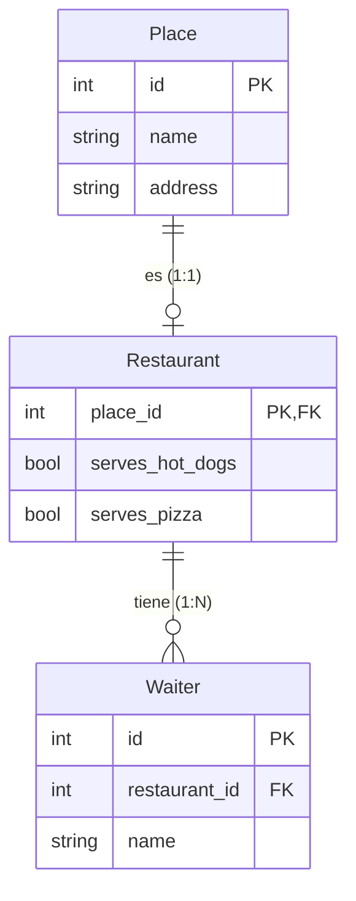
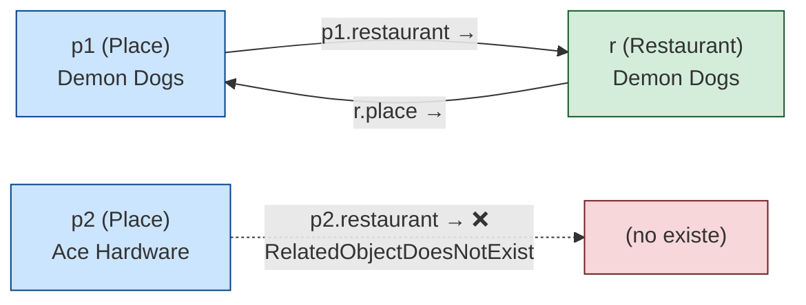
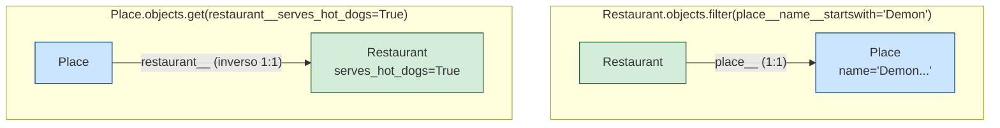
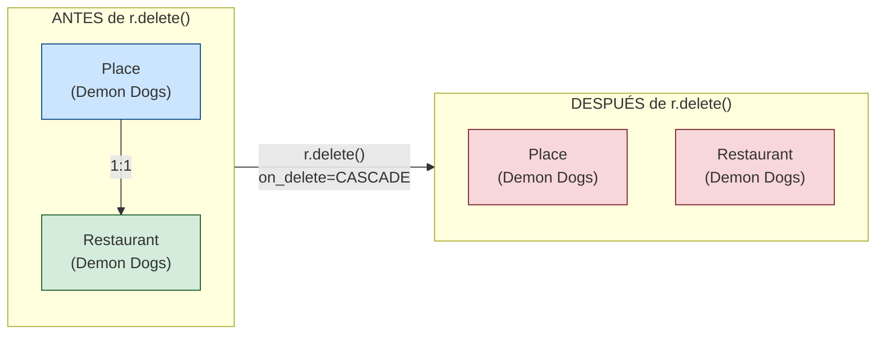
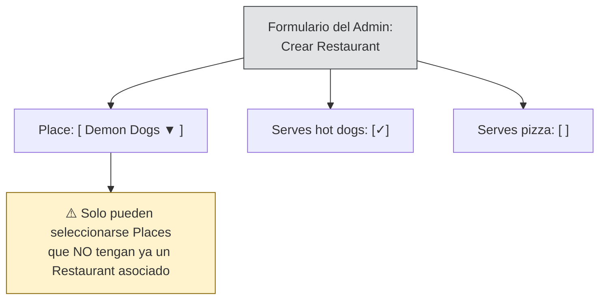

# Ejemplos de relaciones uno a uno

>[!IMPORTANT]
>Este artículo es una adaptación de la documentación oficial de Django.
>Los diagramas y la traducción fueron generados por Deepseek

Para definir una relación uno a uno, utiliza [`OneToOneField`](https://docs.djangoproject.com/en/6.1/ref/models/fields/#django.db.models.OneToOneField).

En este ejemplo, un lugar (**Place**) puede ser un restaurante (**Restaurant**):

```python
from django.db import models


class Place(models.Model):
    name = models.CharField(max_length=50)
    address = models.CharField(max_length=80)

    def __str__(self):
        return f"{self.name} the place"


class Restaurant(models.Model):
    place = models.OneToOneField(
        Place,
        on_delete=models.CASCADE,
        primary_key=True,
    )
    serves_hot_dogs = models.BooleanField(default=False)
    serves_pizza = models.BooleanField(default=False)

    def __str__(self):
        return "%s the restaurant" % self.place.name


class Waiter(models.Model):
    restaurant = models.ForeignKey(Restaurant, on_delete=models.CASCADE)
    name = models.CharField(max_length=50)

    def __str__(self):
        return "%s the waiter at %s" % (self.name, self.restaurant)
```

A continuación se muestran las operaciones que puedes realizar con las API de Python relacionadas.

---

## Diagrama de la relación



---

## Creación de objetos

Primero, crea un par de objetos `Place`:

```python
>>> p1 = Place(name="Demon Dogs", address="944 W. Fullerton")
>>> p1.save()
>>> p2 = Place(name="Ace Hardware", address="1013 N. Ashland")
>>> p2.save()
```

Crea un objeto `Restaurant`. Pasa el objeto "padre" y establece `primary_key=True`. Esto crea una relación uno a uno entre los dos objetos.

```python
>>> r = Restaurant(place=p1, serves_hot_dogs=True, serves_pizza=False)
>>> r.save()
```

---

## Acceso a los objetos relacionados

Se puede acceder a un restaurante desde su lugar:

```python
>>> r.place
<Place: Demon Dogs the place>
```

Y a un lugar desde su restaurante (si existe):

```python
>>> p1.restaurant
<Restaurant: Demon Dogs the restaurant>
```

Ten en cuenta que obtendrás un objeto `RelatedObjectDoesNotExist` si intentas acceder al restaurante desde un lugar que no tiene uno:

```python
>>> p2.restaurant
Traceback (most recent call last):
    ...
Place.restaurant.RelatedObjectDoesNotExist: Place has no restaurant.
```

Esto también se puede manejar con [`hasattr()`](https://docs.python.org/3/library/functions.html#hasattr "\(en Python v3.13\)"):

```python
>>> hasattr(p2, "restaurant")
False
```

### Diagrama de acceso



---

## Consultas (Queries)

Las consultas funcionan igual que con los modelos normales. Ten en cuenta que al consultar un `Restaurant`, se puede acceder a los atributos del `Place` relacionado:

```python
>>> Restaurant.objects.all()
<QuerySet [<Restaurant: Demon Dogs the restaurant>]>

>>> Restaurant.objects.filter(place__name__startswith="Demon")
<QuerySet [<Restaurant: Demon Dogs the restaurant>]>

>>> Restaurant.objects.exclude(place__address__contains="Ashland")
<QuerySet [<Restaurant: Demon Dogs the restaurant>]>
```

Esto también funciona a la inversa:

```python
>>> Place.objects.get(pk=1)
<Place: Demon Dogs the place>

>>> Place.objects.get(restaurant__place__name__startswith="Demon")
<Place: Demon Dogs the place>

>>> Place.objects.get(restaurant__serves_hot_dogs=True)
<Place: Demon Dogs the place>
```

### Diagrama de consultas



---

## Eliminación de objetos

Eliminar un objeto `Restaurant` elimina el `Place` asociado (a menos que el campo [`OneToOneField`](https://docs.djangoproject.com/en/6.1/ref/models/fields/#django.db.models.OneToOneField) tenga `on_delete=models.SET_NULL`):

```python
>>> r = Restaurant.objects.get(pk=1)
>>> r.delete()
```

### Diagrama de eliminación en cascada



---

## Relaciones uno a uno en el admin

El admin es un `ModelAdmin` normal: no hay nada especial sobre las relaciones uno a uno. Sin embargo, cuando se crea un `Restaurant` en el admin, se debe seleccionar un `Place`, y el `Place` no puede ser ya un `Restaurant` (porque es una relación uno a uno).

### Diagrama del admin



---

## Relaciones uno a uno inversas

Las relaciones `OneToOneField` también funcionan en la dirección inversa. Para obtener el `Place` desde un `Restaurant`, simplemente accede al campo:

```python
>>> r.place
<Place: Demon Dogs the place>
```

Y si quieres obtener el `Restaurant` desde un `Place`:

```python
>>> p1.restaurant
<Restaurant: Demon Dogs the restaurant>
```

Puedes eliminar un `Restaurant` sin eliminar el `Place` asociado cambiando el `on_delete`:

```python
place = models.OneToOneField(
    Place,
    on_delete=models.CASCADE,
    primary_key=True,
)
```

---

## ¿Qué sigue?

Ahora que sabes cómo funcionan las relaciones uno a uno, puedes explorar:

- [Relaciones muchos a uno](https://docs.djangoproject.com/en/6.1/topics/db/examples/many_to_one/)
- [Relaciones muchos a muchos](https://docs.djangoproject.com/en/6.1/topics/db/examples/many_to_many/)
- [Referencia de `OneToOneField`](https://docs.djangoproject.com/en/6.1/ref/models/fields/#django.db.models.OneToOneField)
