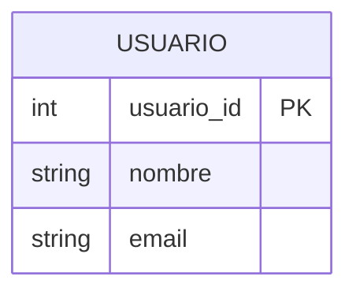
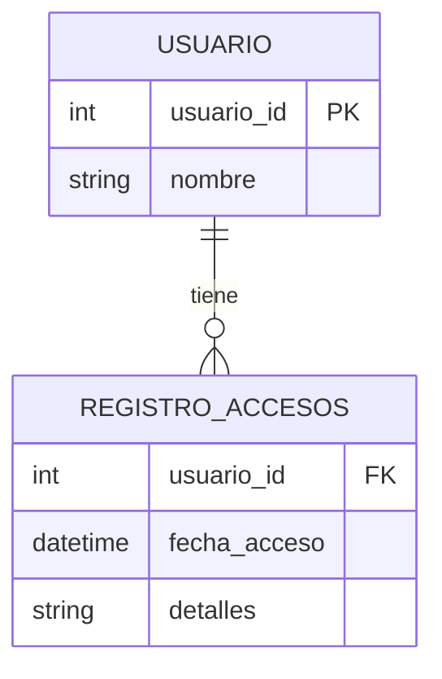
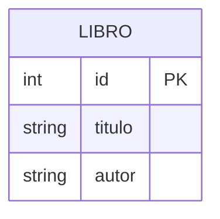
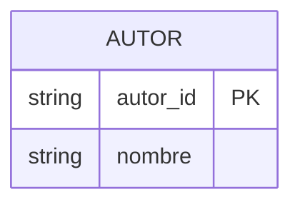
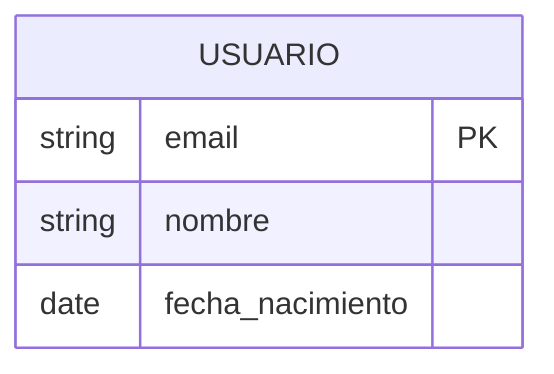
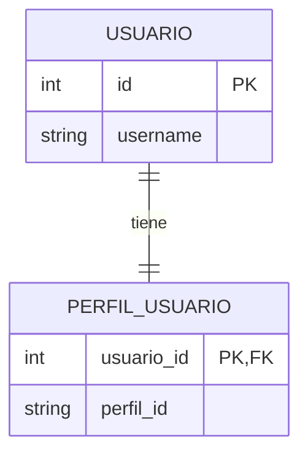
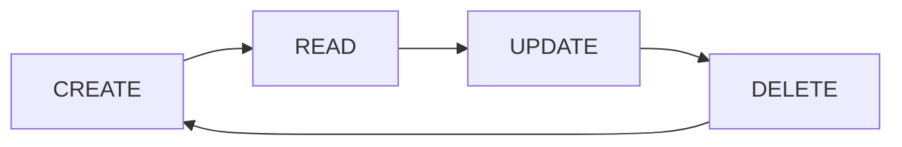
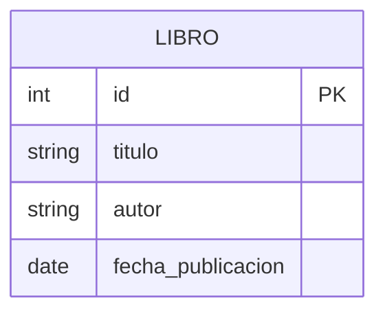

# Modelos de datos y el ORM de Django: Manejo de claves primarias

>[!IMPORTANT]
Adptado de: *{desafio} latam_*

---

## Índice de contenidos

1. [¿Qué aprenderás en esta sesión?](#1-qué-aprenderás-en-esta-sesión)
2. [Django, definición de la llave primaria](#2-django-definición-de-la-llave-primaria)
3. [Clave Primaria Simple](#3-clave-primaria-simple)
4. [Clave Primaria Compuesta](#4-clave-primaria-compuesta)
5. [Automatización por Defecto](#5-automatización-por-defecto)
6. [Claves Primarias Personalizadas](#6-claves-primarias-personalizadas)
7. [Claves Primarias en Columnas Únicas](#7-claves-primarias-en-columnas-únicas)
8. [Llaves primarias en columnas múltiples](#8-llaves-primarias-en-columnas-múltiples)
9. [Operaciones CRUD al modelo](#9-operaciones-crud-al-modelo)
10. [Ejercicio guiado: Gestión de una Biblioteca con Django](#10-ejercicio-guiado-gestión-de-una-biblioteca-con-django)
11. [Resumen](#11-resumen)
12. [Próxima sesión](#12-próxima-sesión)

---

## 1. ¿Qué aprenderás en esta sesión?

Definirás llaves primarias, simples y compuestas en modelos para representar un problema acorde al framework Django.

---

## 2. Django, definición de la llave primaria

### Conceptos iniciales

Una **clave o llave Primaria** es un campo o conjunto de campos en una tabla de base de datos que identifica de manera única cada fila de esa tabla. La clave primaria garantiza que no haya dos filas con el mismo valor en este campo o conjunto de campos, asegurando la integridad y la unicidad de cada registro.

### Importancia del uso de claves primarias en Python Django

- **Unicidad:** Asegura que cada registro sea único, evitando duplicidades en la tabla.
- **Integridad Referencial:** Sirve como referencia para las claves foráneas en otras tablas, permitiendo relacionar tablas de forma coherente y segura.
- **Rendimiento de Consultas:** Mejora la eficiencia en la búsqueda y organización de los datos, facilitando operaciones como el JOIN, SELECT, UPDATE y DELETE.

---

## 3. Clave Primaria Simple

En una tabla `Usuarios`, el campo `usuario_id` puede ser una clave primaria que identifica a cada usuario de forma única.

```python
class Usuario(models.Model):
    usuario_id = models.AutoField(primary_key=True)
    nombre = models.CharField(max_length=100)
    email = models.EmailField(unique=True)
```

Aquí, `usuario_id` es una clave primaria autoincrementable que Django maneja automáticamente.

### Diagrama de la clave primaria simple



---

## 4. Clave Primaria Compuesta

Considera una tabla `RegistroAccesos` donde cada acceso se identifica de forma única por una combinación de `usuario_id` y `fecha_acceso`.

Django no soporta directamente claves primarias compuestas, pero se puede simular esta funcionalidad usando `unique_together` en `Meta`.

En este caso, la combinación de `usuario` y `fecha_acceso` garantiza que los registros de acceso sean únicos para cada usuario en una fecha y hora específicas.

```python
class RegistroAccesos(models.Model):
    usuario = models.ForeignKey(Usuario, on_delete=models.CASCADE)
    fecha_acceso = models.DateTimeField()
    detalles = models.TextField()

    class Meta:
        unique_together = (('usuario', 'fecha_acceso'),)
```

### Diagrama de la clave primaria compuesta simulada



> La combinación `(usuario_id, fecha_acceso)` actúa como clave primaria compuesta.

---

## 5. Automatización por Defecto

Django asigna automáticamente una clave primaria a cada modelo si no se especifica una. Este campo se llama `id` y es un `IntegerField` que se autoincrementa.

```python
from django.db import models

class Libro(models.Model):
    titulo = models.CharField(max_length=100)
    autor = models.CharField(max_length=100)

# Django automáticamente añade:
# id = models.AutoField(primary_key=True)
```

**`id` como Clave Primaria:** En este ejemplo, aunque no se especifica un campo `id`, Django lo crea automáticamente para asegurar que cada `Libro` tenga un identificador único.

### Diagrama de la clave primaria automática



---

## 6. Claves Primarias Personalizadas

En ocasiones, puede ser necesario definir una clave primaria específica para un modelo, ya sea para cumplir con requisitos del dominio de la aplicación o por preferencias de diseño de la base de datos.

```python
from django.db import models

class Autor(models.Model):
    autor_id = models.CharField(max_length=10, primary_key=True)
    nombre = models.CharField(max_length=100)
```

Aquí, el campo `autor_id` se define como la clave primaria en lugar del campo `id` automático de Django.

### Consideraciones

- **Unicidad y No Nulidad:** El campo definido como clave primaria debe ser único y no nulo.
- **Tipos de Campo:** Se puede utilizar casi cualquier tipo de campo de Django como clave primaria, no solo `AutoField`.

### Diagrama de la clave primaria personalizada



---

## 7. Claves Primarias en Columnas Únicas

### Conceptos fundamentales

- Una clave primaria en columna única es un campo dentro de un modelo de Django que identifica de manera única cada registro en la base de datos.
- Debe ser única y no nula para garantizar la identificación inequívoca de cada fila.

### Importancia en Django

- Django, por defecto, crea un campo `id` como clave primaria autoincrementable para cada modelo, a menos que se especifique de otra manera.
- Es esencial para operaciones de base de datos como buscar, actualizar o eliminar registros específicos.

### Ejemplo de Modelo con Clave Primaria en Columna Única

Modelo `Usuario` con Clave Primaria Personalizada:

```python
from django.db import models

class Usuario(models.Model):
    email = models.EmailField(primary_key=True)
    nombre = models.CharField(max_length=100)
    fecha_nacimiento = models.DateField()
```

Aquí, el campo `email` se utiliza como clave primaria en lugar del `id` generado automáticamente por Django.

### Explicación del Código

- **`EmailField(primary_key=True)`:** Define el campo `email` como clave primaria, asegurando que cada `Usuario` sea único en función de su dirección de correo electrónico.
- **Unicidad:** Al usar el `email` como clave primaria, nos aseguramos de que no se puedan crear dos usuarios con el mismo correo electrónico.
- **Tipo de Campo:** `EmailField` valida automáticamente que el valor ingresado tenga un formato de correo electrónico válido.

### Ventajas de Usar Claves Primarias en Columnas Únicas

- **Simplicidad:** Facilita el acceso y la gestión de los registros al usar un identificador natural (como el correo electrónico para un usuario).
- **Eficiencia:** Mejora la eficiencia en las operaciones de búsqueda y relación cuando el campo clave es intrínsecamente único y significativo para el negocio.

### Diagrama de la clave primaria en columna única



---

## 8. Llaves primarias en columnas múltiples

### Estrategias de Implementación

- **Uso de `unique_together` en `Meta`:** Esta opción se usa para forzar la unicidad en la combinación de múltiples campos en un modelo.
- **Relaciones `ForeignKey` o `OneToOneField` con `unique=True`:** Se pueden crear relaciones que, en la práctica, funcionen como claves primarias compuestas.

### Ejemplo: Simulación con `unique_together`

```python
class Registro(models.Model):
    usuario = models.ForeignKey(Usuario, on_delete=models.CASCADE)
    fecha = models.DateField()
    accion = models.CharField(max_length=100)

    class Meta:
        unique_together = (('usuario', 'fecha', 'accion'),)
```

### Ejemplo de Implementación con `ForeignKey` y `unique=True`

Modelo `PerfilUsuario`:

```python
from django.db import models
from django.conf import settings

class PerfilUsuario(models.Model):
    usuario = models.OneToOneField(
        settings.AUTH_USER_MODEL,
        on_delete=models.CASCADE,
        primary_key=True
    )
    perfil_id = models.CharField(max_length=100, unique=True)
```

Aunque el modelo `PerfilUsuario` tiene un campo `perfil_id` único, la verdadera clave primaria aquí es el campo `usuario`, que es una relación `OneToOne` con el modelo de usuario de Django. Esto garantiza que cada usuario tenga un solo perfil asociado, simulando el efecto de una clave primaria compuesta junto con `perfil_id`.

### Diagrama de la clave primaria compuesta con OneToOneField



---

## 9. Operaciones CRUD al modelo

### ¿Qué es CRUD?

- **CRUD** es un acrónimo para las operaciones básicas que se realizan en las bases de datos: **Crear (Create)**, **Leer (Read)**, **Actualizar (Update)** y **Borrar (Delete)**.
- Estas operaciones forman la base de cualquier aplicación que interactúe con una base de datos, permitiendo a los usuarios gestionar los datos almacenados.

### Importancia en el Desarrollo Web

- **Interacción con Datos:** CRUD es fundamental para el desarrollo de aplicaciones web dinámicas, permitiendo a los usuarios interactuar con información almacenada de manera eficiente y efectiva.
- **Fundamento de la Funcionalidad:** Desde blogs hasta redes sociales y sistemas de gestión, todas las aplicaciones web dependen de operaciones CRUD para su funcionalidad principal.

### Simplificación de CRUD con Django

- El **ORM** (Object-Relational Mapping) de Django abstrae las operaciones CRUD, permitiendo a los desarrolladores trabajar con objetos Python en lugar de SQL directo.
- Django automatiza y proporciona seguridad en procesos CRUD, previniendo errores comunes como la inyección SQL.

### Ejemplos de Operaciones CRUD en Django

- **Crear:**
  ```python
  nuevo_usuario = Usuario.objects.create(nombre='Juan', email='juan@example.com')
  ```
- **Leer:**
  ```python
  usuario = Usuario.objects.get(id=1)
  ```
- **Actualizar:**
  ```python
  usuario.email = 'nuevo_email@example.com'
  usuario.save()
  ```
- **Borrar:**
  ```python
  usuario.delete()
  ```

### Ventajas de Usar Django para CRUD

- **Rapidez en el Desarrollo:** Django permite implementar funcionalidades CRUD rápidamente con menos código.
- **Mantenimiento Sencillo:** El enfoque en objetos de Django facilita la actualización y el mantenimiento del código relacionado con la base de datos.

### Diagrama del flujo CRUD



---

## 10. Ejercicio guiado: Gestión de una Biblioteca con Django

Vamos a desarrollar una funcionalidad completa para una aplicación de biblioteca que gestione libros. Este ejercicio abarcará todas las operaciones CRUD (Crear, Leer, Actualizar, Borrar) utilizando Django ORM.

En esta actividad, cada estudiante trabajará en un proyecto Django para crear una aplicación llamada `biblioteca`, que permitirá la gestión de libros. Cada libro tiene un título, un autor, y una fecha de publicación. Deben realizar operaciones CRUD sobre los libros, comenzando por la creación de un nuevo libro, seguido de la lectura de sus detalles, la actualización de su información y, finalmente, la eliminación del libro de la base de datos.

### A considerar, configuración Inicial

- Asegúrate de tener Django instalado y crea un nuevo proyecto Django si aún no lo has hecho.
- Dentro de tu proyecto Django, crea una nueva aplicación llamada `biblioteca`.
- Define un modelo `Libro` con los siguientes campos: `titulo`, `autor`, y `fecha_publicacion`.

### Paso 1: Creación de Libros (personalizar tu libro)

- Inicia el shell de Django con el comando `python manage.py shell`.
- Importa el modelo `Libro` de tu aplicación.
- Crea un nuevo libro usando el siguiente comando:

```python
nuevo_libro = Libro.objects.create(
    titulo="Aprendiendo Django",
    autor="Juan Pérez",
    fecha_publicacion="2024-01-01"
)
```

### Paso 2: Lectura de Libros

- Utiliza el método `.get()` para recuperar el libro basado en su título o autor.

```python
libro = Libro.objects.get(titulo="Aprendiendo Django")
```

### Paso 3: Actualización de Libros

- Selecciona un libro existente y actualiza su título o autor.

```python
libro = Libro.objects.get(titulo="Aprendiendo Django")
libro.titulo = "Django Avanzado"
libro.save()
```

### Paso 4: Eliminación de Libros

Elimina un libro específico de la base de datos.

```python
libro = Libro.objects.get(titulo="Django Avanzado")
libro.delete()
```

### Diagrama del modelo Libro



---

## 11. Resumen

En esta sesión, profundizamos en cómo Django gestiona los datos a través de su ORM, con un enfoque especial en las claves primarias y las operaciones CRUD. Aquí está lo esencial:

- **Claves Primarias en Django:** Django automáticamente asigna una clave primaria (`id`) a cada modelo, pero también permite la personalización de esta mediante la definición explícita en el modelo.
- Exploramos la definición de claves primarias en columnas únicas y discutimos cómo simular claves primarias compuestas utilizando `unique_together` o relaciones como `ForeignKey` con `unique=True`.

### Operaciones CRUD

- **Crear:** Demostramos cómo crear un nuevo objeto en la base de datos instanciando el modelo y utilizando el método `.save()`.
- **Leer:** Vimos cómo recuperar objetos usando `.get()` para una búsqueda específica o `.filter()` para un conjunto de resultados.
- **Actualizar:** Actualizamos objetos cambiando sus atributos y guardando los cambios.
- **Borrar:** Eliminamos objetos de la base de datos con el método `.delete()`.

---

## 12. Próxima sesión…

**Desarrollo de la guía de ejercicios “Modelos de datos y el ORM de Django”**

---

{desafio} latam_

**Academia de talentos digitales**