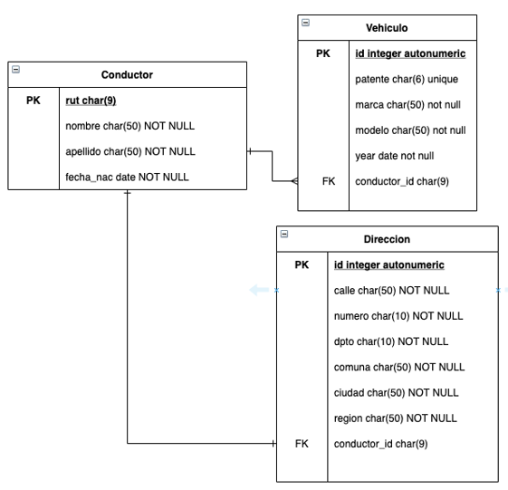
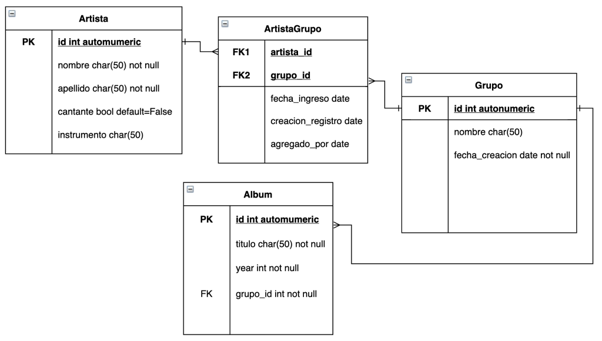

# Guía de ejercicios - Modelos de datos y el ORM de Django

¡Hola! Te damos la bienvenida a esta nueva guía de estudio.

## ¿En qué consiste esta guía?

La siguiente guía de estudio tiene como objetivo practicar y ejercitar los contenidos que hemos visto en clase.

¡Vamos con todo!

## Tabla de contenidos

- ¡Manos a la obra! - Ejercicio Propuesto 1
- ¡Manos a la obra! - Ejercicio Propuesto 2
- Solucionario Ejercicios propuestos
  - Solución Ejercicio Propuesto 1
  - Solución Ejercicio Propuesto 2
- Preguntas de cierre

---

## ¡Manos a la obra! - Ejercicio Propuesto 1

Se solicita la creación de un proyecto Django, con una aplicación llamada `registro_conductores`, el cual nos permitirá registrar el conductor de un vehículo, con su dirección y los vehículos que posee.

En models tendremos 3 modelos:

**Conductor / Vehículo / Dirección**, los cuales deben basarse en lo expuesto en la siguiente imagen.

(Para efectos prácticos, se considerará que solo existe un conductor por dirección).



- La relación entre el cliente y la dirección y el cliente y el vehículo se debe eliminar en cascada.
- Se deben utilizar los siguiente elementos:
  - `ForeignKey`
  - `OneToOneField`
- Se debe crear un archivo `services.py` en la aplicación que debe contener las siguientes acciones:
  - `crear_conductor`
  - `agregar_direccion_a_conductor`
  - `agregar_un_vehiculo`
  - `eliminar_vehiculo`
  - `eliminar_conductor`
- Luego de ejecutar cada acción, se debe imprimir por pantalla el contenido de los modelos.

---

## ¡Manos a la obra! - Ejercicio Propuesto 2

Se solicita la creación de un proyecto Django, con una aplicación llamada `registro_de_artistas`, el cual nos permitirá registrar el artista, asociarlo a un grupo musical y a sus álbumes.

Este modelo parte de la premisa que un artista puede pertenecer a distintos grupos musicales y un grupo musical puede tener un número indefinido de álbumes, por lo tanto un álbum puede tener N músicos.

Se deberá guiar por el modelo propuesto en la siguiente imagen.



Luego de generar los modelos, debemos crear una serie de servicios en el archivo `registro_de_artistas\services.py`

- `crear_artista`
- `crear_grupo`
- `relacion_artista_grupo`
- `agregar_album`
- `obtiene_artista`
- `obtiene_grupo`
- `artista_pertenece_a_grupos`
- `artista_participa_albumes`
- `grupo_albumes`

> **TIP:** En las funciones en que creamos un objeto, sería una buena práctica para este ejemplo, retornar el elemento creado, con el fin de obtener los índices para crear los otros registros.

---

## Solucionario Ejercicios propuestos

### Solución Ejercicio Propuesto 1

Creamos un virtual environment y un proyecto.

```bash
python -m venv .\venv
.\venv\Scripts\activate.bat
pip install django
django-admin startproject ejercicio01
cd ejercicio01
python manage.py startapp registro_conductor
```

Registramos la aplicación en `settings.py` y generamos los modelos correspondientes en `registro_conductor/models.py`

```python
from django.db import models

class Conductor(models.Model):
    rut = models.CharField(max_length=9, primary_key=True)
    nombre = models.CharField(max_length=50, null=False, blank=False)
    apellido = models.CharField(max_length=50, null=False, blank=False)
    fecha_nac = models.DateField(null=False, blank=False)

class Direccion(models.Model):
    calle = models.CharField(max_length=50, null=False, blank=False)
    numero = models.CharField(max_length=10, null=False, blank=False)
    dpto = models.CharField(max_length=50, null=True, blank=True)
    comuna = models.CharField(max_length=50, null=False, blank=False)
    ciudad = models.CharField(max_length=50, null=False, blank=False)
    region = models.CharField(max_length=50, null=False, blank=False)
    conductor = models.OneToOneField("Conductor", null=False, blank=False, on_delete=models.CASCADE)

class Vehiculo(models.Model):
    patente = models.CharField(max_length=6, null=False, blank=False)
    marca = models.CharField(max_length=50, null=False, blank=False)
    modelo = models.CharField(max_length=50, null=False, blank=False)
    year = models.DateField(null=False, blank=False)
    conductor = models.ForeignKey("Conductor", null=False, blank=False, on_delete=models.CASCADE)
```

Aplicamos las migraciones correspondientes:

```bash
(venv) → ejercicio01 python manage.py makemigrations
Migrations for 'registro_conductors':
  registro_conductors/migrations/0001_initial.py
    - Create model Conductor
    - Create model Vehiculo
    - Create model Direccion

(venv) → ejercicio01 python manage.py migrate
Operations to perform:
  Apply all migrations: admin, auth, contenttypes, registro_conductor, sessions
Running migrations:
  Applying contenttypes.0001_initial... OK
  Applying auth.0001_initial... OK
  Applying admin.0001_initial... OK
  Applying admin.0002_logentry_remove_auto_add... OK
  Applying admin.0003_logentry_add_action_flag_choices... OK
  Applying contenttypes.0002_remove_content_type_name... OK
  Applying auth.0002_alter_permission_name_max_length... OK
  Applying auth.0003_alter_user_email_max_length... OK
  Applying auth.0004_alter_user_username_ops... OK
  Applying auth.0005_alter_user_last_login_null... OK
  Applying auth.0006_require_contenttypes_0002... OK
  Applying auth.0007_alter_validators_add_error_messages... OK
  Applying auth.0008_alter_user_username_max_length... OK
  Applying auth.0009_alter_user_last_name_max_length... OK
  Applying auth.0010_alter_group_name_max_length... OK
  Applying auth.0011_update_proxy_permissions... OK
  Applying auth.0012_alter_user_first_name_max_length... OK
  Applying registro_conductor.0001_initial... OK
  Applying sessions.0001_initial... OK
(venv) → ejercicio01
```

Creamos el archivo `ejercicio01\registro_conductor\services.py`

```python
from .models import Conductor, Direccion, Vehiculo
from datetime import date

def imprimir_modelos():
    conductores = Conductor.objects.all()
    for c in conductores:
        print(f"[{c.rut}]: {c.nombre} {c.apellido} - {c.fecha_nac}")
        if hasattr(c, "direccion"):
            d = c.direccion
            print(f"direccion: {d.calle} {d.numero} / {d.comuna} / {d.ciudad} / {d.region}")
        if hasattr(c, "vehiculo_set"):
            vehiculos = c.vehiculo_set.all()
            for v in vehiculos:
                print(f"Vehiculo: {v.marca} / {v.modelo} / {v.patente} / {v.year}")

def crear_conductor(rut, nombre, apellido, fecha_nac):
    if not rut.isdigit() and not isinstance(fecha_nac, date):
        print("por favor validar los datos del conductor")
        return
    conductor = Conductor(
        rut=rut,
        nombre=nombre,
        apellido=apellido,
        fecha_nac=fecha_nac
    )
    conductor.save()
    imprimir_modelos()

def obtener_conductor(rut):
    return Conductor.objects.get(rut=rut)

def crear_direccion(conductor, calle, numero, dpto, comuna, ciudad, region):
    direccion = Direccion(
        conductor=conductor,
        calle=calle,
        numero=numero,
        dpto=dpto,
        comuna=comuna,
        ciudad=ciudad,
        region=region
    )
    direccion.save()
    imprimir_modelos()

def agregar_un_vehiculo(conductor, patente, marca, modelo, year):
    vehículo = Vehículo(
        conductor=conductor,
        patente=patente,
        marca=marca,
        modelo=modelo,
        year=year
    )
    vehículo.save()
    imprimir_modelos()

def eliminar_vehiculo(vehiculo):
    Vehiculo.objects.get(id=vehiculo.id).delete()
    imprimir_modelos()

def eliminar_conductor(conductor):
    Conductor.objects.get(rut=conductor.rut).delete()
```

### Solución Ejercicio Propuesto 2

Creamos un virtual environment y un proyecto.

```bash
python -m venv .\venv
.\venv\Scripts\activate.bat
pip install django
django-admin startproject ejercicio02
cd ejercicio01
python manage.py startapp registro_de_artistas
```

Creamos los modelos según la imagen 12.

```python
from django.db import models

class Artista(models.Model):
    nombre = models.CharField(max_length=50, blank=False, null=False)
    apellido = models.CharField(max_length=50, blank=False, null=False)
    cantante = models.BooleanField(default=False)
    instrumento = models.CharField(max_length=50)

class Grupo(models.Model):
    nombre = models.CharField(max_length=50, blank=False, null=False)
    fecha_creacion = models.DateField(blank=False, null=False)
    artistas = models.ManyToManyField(
        "Artista",
        through="ArtistaGrupo",
        related_name="grupos"
    )

class ArtistaGrupo(models.Model):
    artista = models.ForeignKey("Artista", on_delete=models.DO_NOTHING)
```

Aplicamos las migraciones correspondientes:

```bash
(venv) → ejercicio02 python manage.py makemigrations
Migrations for 'registro_de_artistas':
  registro_de_artistas/migrations/0001_initial.py
    - Create model Artista
    - Create model Grupo
    - Create model ArtistaGrupo
    - Create model Album

(venv) → ejercicio02 python manage.py migrate
Operations to perform:
  Apply all migrations: admin, auth, contenttypes, registro_de_artistas, sessions
Running migrations:
  Applying contenttypes.0001_initial... OK
  Applying auth.0001_initial... OK
  Applying admin.0001_initial... OK
  Applying admin.0002_logentry_remove_auto_add... OK
  Applying admin.0003_logentry_add_action_flag_choices... OK
  Applying contenttypes.0002_remove_content_type_name... OK
  Applying auth.0002_alter_permission_name_max_length... OK
  Applying auth.0003_alter_user_email_max_length... OK
  Applying auth.0004_alter_user_username_ops... OK
  Applying auth.0005_alter_user_last_login_null... OK
  Applying auth.0006_require_contenttypes_0002... OK
  Applying auth.0007_alter_validators_add_error_messages... OK
  Applying auth.0008_alter_user_username_max_length... OK
  Applying auth.0009_alter_user_last_name_max_length... OK
  Applying auth.0010_alter_group_name_max_length... OK
  Applying auth.0011_update_proxy_permissions... OK
  Applying auth.0012_alter_user_first_name_max_length... OK
  Applying registro_de_artistas.0001_initial... OK
  Applying sessions.0001_initial... OK
(venv) → ejercicio02
```

Creamos los servicios solicitados.

```python
from registro_de_artistas.models import Artista, Album, ArtistaGrupo, Grupo
from datetime import date

def crear_artista(nombre, apellido, cantante=False, instrumento=""):
    artista = Artista(
        nombre=nombre, apellido=apellido, cantante=cantante, instrumento=instrumento
    )
    artista.save()
    return artista

def crear_grupo(nombre, fecha_creacion):
    if not isinstance(fecha_creacion, date):
        print("fecha con formato invalido, por favor, \
        ingresar en este formato. date(2000, 02, 28")
        return None
    grupo = Grupo(nombre=nombre, fecha_creacion=fecha_creacion)
    grupo.save()
    return grupo

def relacion_artista_grupo(artista, grupo, fecha_ingreso=None, agregado_por=None):
    if not isinstance(fecha_ingreso, date):
        print("fecha con formato invalido, por favor, \
        ingresar en este formato. date(2000, 02, 28")
        return None
    artista_relacion_grupo = ArtistaGrupo(
        artista=artista,
        grupo=grupo,
        fecha_ingreso=fecha_ingreso,
        agregado_por=agregado_por
    )
    artista_relacion_grupo.save()
    return artista_relacion_grupo

def agregar_album(grupo, titulo, year):
    album = Album(
        grupo=grupo, titulo=titulo, year=year
    )
    album.save()
    return album

def obtiene_artista(nombre, apellido):
    return (
        Artista.objects
        .filter(nombre=nombre)
        .filter(apellido=apellido).first()
    )

def obtiene_grupo(nombre):
    return (
        Grupo.objects
        .filter(nombre=nombre).first()
    )

def artista_pertenece_a_grupos(artista):
    if hasattr(artista, "grupos"):
        return artista.grupos.all()
    else:
        return None

def artista_participa_albumes(artista):
    """si el artista no tiene el atributo grupos, retorna None"""
    if not hasattr(artista, "grupos"):
        return None

    """Si por cada grupo al que pertenece el artista, no tiene el atributo album_set
    el ciclo continua."""
    encontrado = []
    for g in artista.grupos.all():
        if not hasattr(g, "albumes"):
            continue
        albums = g.albumes.all()
        datos = {
            "grupo": g.nombre,
            "albumes": albums
        }
        encontrado.append(datos)
    return encontrado

def grupo_albumes(grupo):
    if not hasattr(grupo, "albumes"):
        return None
    encontrado = []
    for a in grupo.albumes.all():
        encontrado.append(a)
    return encontrado
```

---

## Preguntas de cierre

- ¿Qué elemento de django utilizamos para la relación Muchos a Muchos?
- ¿Cuál es el procedimiento para crear una tabla intermedia con campos extra?
- ¿Para qué nos sirve el parámetro through en una relación?
- ¿Para qué nos sirve el parámetro related_name en una relación?

---

www.desafiolatam.com