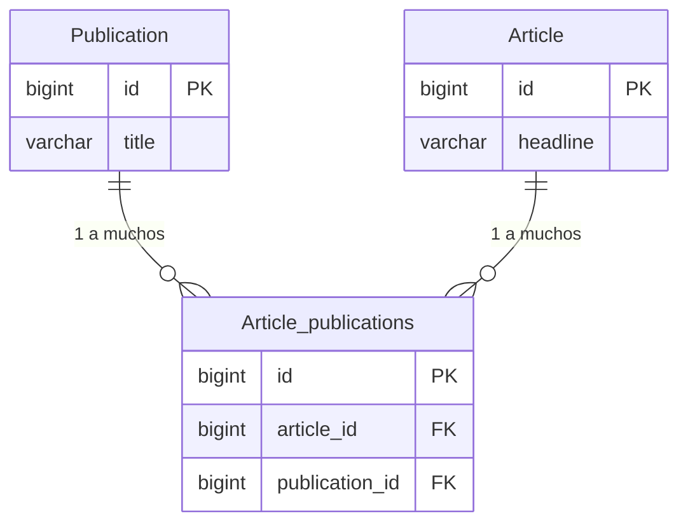
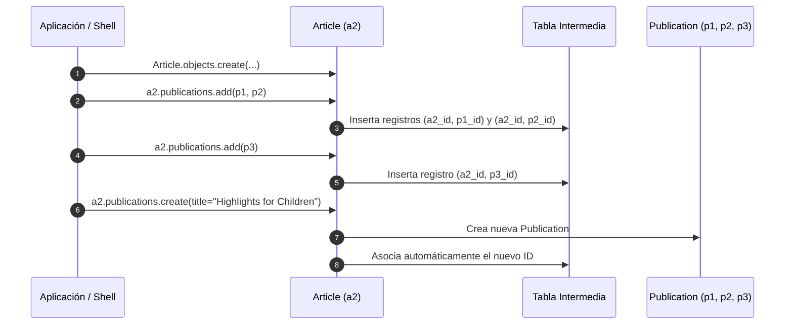
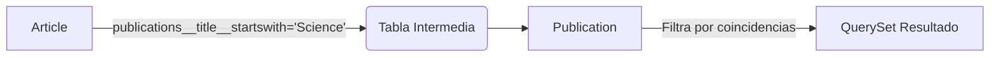
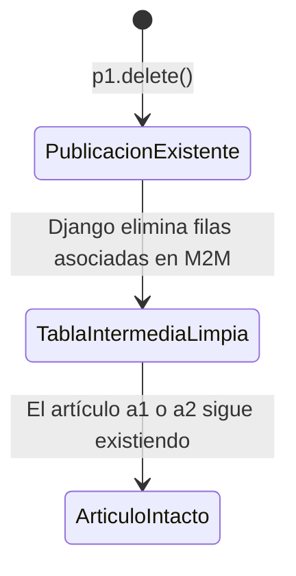

# Guía Estudiantil: Relaciones Muchos a Muchos (*Many-to-Many*) en Django

Esta guía traduce y complementa los conceptos lectivos clave descritos en la documentación oficial de **Django (sección Relaciones Mucho a Muchos)**.

---

## 1. Concepto y Definición de Modelos

Una relación **Muchos a Muchos (*Many-to-Many*)** se utiliza cuando un registro de la Tabla A puede estar asociado con múltiples registros de la Tabla B, y viceversa. En Django se define mediante el campo `models.ManyToManyField`.

### Ejemplo

Un artículo (`Article`) puede ser publicado en varias publicaciones (`Publication`), y una publicación contiene varios artículos.

```python
from django.db import models

class Publication(models.Model):
    title = models.CharField(max_length=30)

    class Meta:
        ordering = ["title"]

    def __str__(self):
        return self.title

class Article(models.Model):
    headline = models.CharField(max_length=100)
    publications = models.ManyToManyField(Publication)

    class Meta:
        ordering = ["headline"]

    def __str__(self):
        return self.headline

```

---

## 2. Diagrama Entidad-Relación y Estructura en Base de Datos

En la base de datos relacional, Django crea automáticamente una **tabla intermedia** (*join table*) para conectar ambas entidades.



---

## 3. Operaciones Principales en la Shell de Django

### 3.1 Creación e Requisito de Guardado (`save()`)

Para relacionar objetos M2M, **el objeto principal debe estar guardado previamente en la base de datos** (debe poseer una clave primaria `id`).

```python
# Crear publicaciones
p1 = Publication.objects.create(title="The Python Journal")
p2 = Publication.objects.create(title="Science News")
p3 = Publication.objects.create(title="Science Weekly")

# Intentar asociar sin guardar el artículo genera un error:
a1 = Article(headline="Django lets you build web apps easily")
# a1.publications.add(p1)  --> ValueError: '<Article...>' needs to have a value for field 'id'

# Guardar primero
a1.save()
a1.publications.add(p1)  # OK!

```

---

### 3.2 Flujo de Asignación de Relaciones (`add`, `create`)



```python
# Agregar múltiples instancias en una sola llamada
a2 = Article.objects.create(headline="NASA uses Python")
a2.publications.add(p1, p2)
a2.publications.add(p3)

# Agregar un duplicado no genera un error ni duplica la relación
a2.publications.add(p3)

# Crear y asociar en un solo paso
new_pub = a2.publications.create(title="Highlights for Children")

```

---

### 3.3 Consultas Directas e Inversas

* **Consulta Directa (desde el modelo que define `ManyToManyField`):**
```python
a2.publications.all()
# <QuerySet [<Publication: Highlights for Children>, <Publication: Science News>, ...]>

```


* **Consulta Inversa (usando `_set` por defecto):**
Dado que el campo `publications` está definido en `Article`, el modelo `Publication` accede mediante el manager inverso `article_set`:
```python
p1.article_set.all()
# <QuerySet [<Article: Django lets you build web apps easily>, <Article: NASA uses Python>]>

```


---

### 3.4 Filtros y Búsquedas Cruzadas (*Lookups across relationships*)

Podemos filtrar registros cruzando la relación M2M usando la notación con doble guion bajo (`__`).



```python
# Buscar artículos según ID de publicación
Article.objects.filter(publications__id=1)
Article.objects.filter(publications=p1)

# Filtros por atributos del modelo relacionado
Article.objects.filter(publications__title__startswith="Science")

# NOTA: Cuando una búsqueda coincide con múltiples registros relacionados,
# se recomienda usar .distinct() para evitar duplicados en el QuerySet.
Article.objects.filter(publications__title__startswith="Science").distinct()

# Conteo considerando distinct
Article.objects.filter(publications__title__startswith="Science").distinct().count()

# Búsqueda Inversa
Publication.objects.filter(article__headline__startswith="NASA")
Publication.objects.filter(article=a1)

```

---

### 3.5 Métodos de Gestión de Relaciones (`remove`, `set`, `clear`)

Django proporciona métodos flexibles para manipular el conjunto de relaciones sin necesidad de borrar los objetos en sí:

```python
a4 = Article.objects.create(headline="NASA finds intelligent life on Earth")
p2.article_set.add(a4)

# 1. REMOVE: Desasocia elementos específicos (desde cualquiera de los dos lados)
a4.publications.remove(p2)
# o desde el lado inverso:
p2.article_set.remove(a5)

# 2. SET: Reemplaza todas las relaciones existentes por un nuevo conjunto
a4.publications.set([p3])

# 3. CLEAR: Elimina TODAS las relaciones asociadas a la instancia
p2.article_set.clear()       # Desasocia todos los artículos de p2
a4.publications.clear()      # Desasocia todas las publicaciones de a4

```

---

### 3.6 Comportamiento ante la Eliminación de Registros (`delete`)

La eliminación de una instancia en una relación M2M elimina automáticamente las entradas asociadas en la tabla intermedia, pero **no** elimina los objetos del otro lado de la relación.



```python
# Al eliminar una publicación:
p1.delete()

# El artículo a1 sigue existiendo, pero su relación con p1 ya no está presente
a1 = Article.objects.get(pk=1)
a1.publications.all()  # <QuerySet []>

# Eliminación masiva (Bulk delete)
Publication.objects.filter(title__startswith="Science").delete()
# Las referencias en la tabla intermedia se eliminan en cascada sin afectar los artículos.

```

---

## 4. Resumen de Métodos del Manager M2M

| Método | Descripción | Ejemplo |
| --- | --- | --- |
| `.add(*objs)` | Asocia una o más instancias existentes. | `a1.publications.add(p1, p2)` |
| `.create(**kwargs)` | Crea un nuevo objeto relacionado y lo asocia directamente. | `a1.publications.create(title="Tech")` |
| `.remove(*objs)` | Elimina las asociaciones con los objetos indicados. | `a1.publications.remove(p1)` |
| `.set(iterable)` | Reemplaza el conjunto completo de relaciones. | `a1.publications.set([p2, p3])` |
| `.clear()` | Elimina todas las relaciones M2M de la instancia. | `a1.publications.clear()` |
| `.all()` | Devuelve un `QuerySet` con todos los objetos relacionados. | `a1.publications.all()` |
| `.filter(...)` | Permite hacer filtros sobre las propiedades del modelo relacionado. | `a1.publications.filter(title__icontains="science")` |