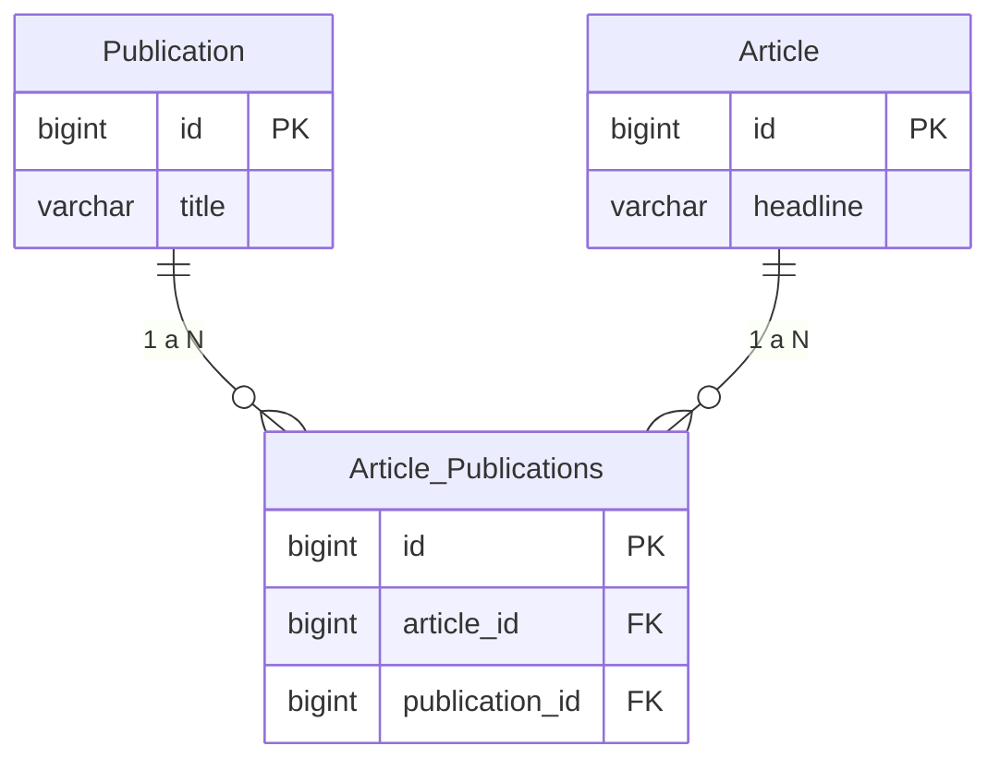
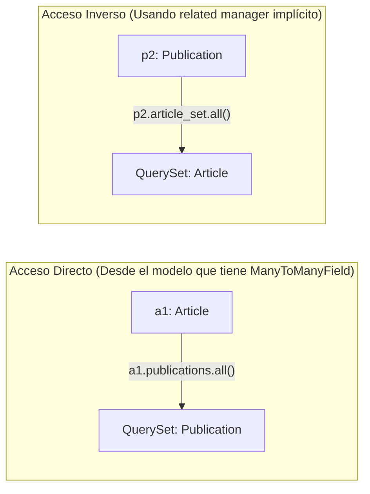
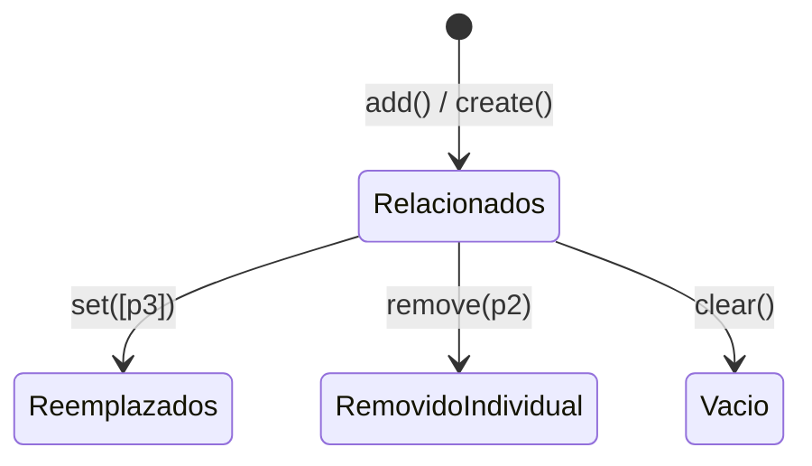

# Guía de Estudio: Relaciones Muchos a Muchos (`ManyToManyField`) en Django

Esta guía orienta en el uso y manipulación de relaciones de tipo **Muchos a Muchos** (*Many-to-Many*) utilizando el ORM de Django. A través de este modelo, aprenderás a definir campos relacionales, operar mediante la API de Python y realizar consultas bidireccionales de forma eficiente.

---

## Índice

1. Definición del Modelo y Conceptos Clave
2. Estructura en Base de Datos (Diagrama Entidad-Relación)
3. Operaciones Básicas con la API de Python
    * Creación y Guardado Previo
    * Asociación de Objetos (`add` y `create`)
    * Acceso Bidireccional (`publications` vs `article_set`)


4. Consultas y Filtros Avanzados
5. Desvinculación, Reemplazo y Limpieza
6. Eliminación en Cascada de Relaciones
7. Resumen de Métodos del Related Manager

---

## 1. Definición del Modelo y Conceptos Clave

Para definir una relación muchos a muchos, se utiliza el campo `models.ManyToManyField`.

En este ejemplo de referencia, **un Artículo (`Article`) puede ser publicado en múltiples Publicaciones (`Publication`)**, y **una Publicación (`Publication`) contiene múltiples Artículos (`Article`)**.

```python
from django.db import models

class Publication(models.Model):
    title = models.CharField(max_length=30)

    class Meta:
        ordering = ["title"]

    def __str__(self):
        return self.title


class Article(models.Model):
    headline = models.CharField(max_length=100)
    publications = models.ManyToManyField(Publication)

    class Meta:
        ordering = ["headline"]

    def __str__(self):
        return self.headline

```

> **Nota para estudiantes:** El campo `ManyToManyField` se define solo en **uno** de los dos modelos (en este caso, en `Article`), pero Django crea automáticamente el acceso en ambas direcciones.

---

## 2. Estructura en Base de Datos (Diagrama Entidad-Relación)

A nivel de base de datos relacional, una relación muchos a muchos no se puede representar directamente con una clave foránea en una sola tabla. Django crea automáticamente una **tabla intermedia** (*junction table* o *bridge table*) para gestionar los enlaces.



---

## 3. Operaciones Básicas con la API de Python

A continuación se muestran ejemplos prácticos de las operaciones que se pueden realizar desde la *shell* de Django (`python manage.py shell`).

### Creación y Guardado Previo

Primero, creamos e instanciamos algunas publicaciones:

```python
>>> p1 = Publication(title="The Python Journal")
>>> p1.save()
>>> p2 = Publication(title="Science News")
>>> p2.save()
>>> p3 = Publication(title="Science Weekly")
>>> p3.save()

```

Creamos un artículo:

```python
>>> a1 = Article(headline="Django lets you build web apps easily")

```

#### ⚠️ Regla de Oro: El objeto debe guardarse antes de asociarlo

Si intentas asociar un objeto `Article` a una `Publication` antes de guardarlo en la base de datos, Django arrojará un error `ValueError`:

```python
>>> a1.publications.add(p1)
Traceback (most recent call last):
...
ValueError: "<Article: Django lets you build web apps easily>" needs to have a value for field "id" before this many-to-many relationship can be used.

```

**Solución:** Guardar el artículo primero para que se le asigne una clave primaria (`id`).

```python
>>> a1.save()
>>> a1.publications.add(p1)  # ¡Ahora funciona correctamente!

```

---

### Asociación de Objetos (`add` y `create`)

Podemos agregar múltiples elementos a la vez utilizando `.add()`:

```python
>>> a2 = Article(headline="NASA uses Python")
>>> a2.save()
>>> a2.publications.add(p1, p2)
>>> a2.publications.add(p3)

```

* **Sin duplicados:** Agregar el mismo elemento por segunda vez no duplicará la relación en la base de datos:
```python
>>> a2.publications.add(p3)  # No genera duplicados

```


* **Validación de tipo:** Intentar agregar un tipo de objeto incorrecto lanzará un `TypeError`:
```python
>>> a2.publications.add(a1)
Traceback (most recent call last):
...
TypeError: 'Publication' instance expected

```


* **Creación y asociación directa (`create`):** Es posible crear una `Publication` y asociarla al `Article` en un solo paso:
```python
>>> new_publication = a2.publications.create(title="Highlights for Children")

```


---

### Acceso Bidireccional (`publications` vs `article_set`)

El acceso a la relación funciona en ambos sentidos:



#### Acceso Directo (Desde `Article` hacia `Publication`):

```python
>>> a1.publications.all()
<QuerySet [<Publication: The Python Journal>]>

>>> a2.publications.all()
<QuerySet [<Publication: Highlights for Children>, <Publication: Science News>, <Publication: Science Weekly>, <Publication: The Python Journal>]>

```

#### Acceso Inverso (Desde `Publication` hacia `Article`):

Se utiliza el sufijo por defecto `_set` (nombre_del_modelo_set):

```python
>>> p2.article_set.all()
<QuerySet [<Article: NASA uses Python>]>

>>> p1.article_set.all()
<QuerySet [<Article: Django lets you build web apps easily>, <Article: NASA uses Python>]>

>>> Publication.objects.get(id=4).article_set.all()
<QuerySet [<Article: NASA uses Python>]>

```

---

## 4. Consultas y Filtros Avanzados

Se pueden realizar búsquedas (*lookups*) cruzando la relación con la sintaxis del doble guión bajo (`__`):

```python
# Buscar artículos que pertenezcan a la publicación con ID = 1
>>> Article.objects.filter(publications__id=1)
<QuerySet [<Article: Django lets you build web apps easily>, <Article: NASA uses Python>]>

>>> Article.objects.filter(publications=p1)
<QuerySet [<Article: Django lets you build web apps easily>, <Article: NASA uses Python>]>

# Filtro por texto en el título de la publicación
>>> Article.objects.filter(publications__title__startswith="Science")
<QuerySet [<Article: NASA uses Python>, <Article: NASA uses Python>]>

```

> **Consejo:** Nota cómo la consulta anterior devuelve resultados duplicados si un artículo coincide con más de una publicación que empieza por *"Science"*. Para eliminar duplicados en la consulta, utiliza `.distinct()`:

```python
>>> Article.objects.filter(publications__title__startswith="Science").distinct()
<QuerySet [<Article: NASA uses Python>]>

# El método count() también respeta el uso de distinct()
>>> Article.objects.filter(publications__title__startswith="Science").count()
2
>>> Article.objects.filter(publications__title__startswith="Science").distinct().count()
1

# Filtros con operador IN
>>> Article.objects.filter(publications__in=[p1, p2]).distinct()
<QuerySet [<Article: Django lets you build web apps easily>, <Article: NASA uses Python>]>

```

### Consultas Inversas

También es posible filtrar publicaciones según atributos de sus artículos asociados:

```python
>>> Publication.objects.filter(article__headline__startswith="NASA")
<QuerySet [<Publication: Highlights for Children>, <Publication: Science News>, <Publication: Science Weekly>, <Publication: The Python Journal>]>

>>> Publication.objects.filter(article=a1)
<QuerySet [<Publication: The Python Journal>]>

```

### Exclusión de Elementos

Para excluir registros que contengan cierta relación:

```python
>>> Article.objects.exclude(publications=p2)
<QuerySet [<Article: Django lets you build web apps easily>]>

```

---

## 5. Desvinculación, Reemplazo y Limpieza

Django proporciona métodos para modificar la tabla intermedia sin eliminar los objetos principales.



### Remoción de un elemento específico (`remove`)

```python
# Desde el lado del campo directo:
>>> a4.publications.remove(p2)

# Desde el lado inverso:
>>> p2.article_set.remove(a5)

```

### Reemplazo completo de la lista de relaciones (`set`)

El método `.set()` reemplaza todo el conjunto de relaciones existentes por una nueva lista:

```python
>>> a4.publications.all()
<QuerySet [<Publication: Science News>]>

# Reemplaza todas las publicaciones asociadas por solo [p3]
>>> a4.publications.set([p3])
>>> a4.publications.all()
<QuerySet [<Publication: Science Weekly>]>

```

### Limpiar todas las relaciones (`clear`)

Elimina todas las asociaciones en la tabla intermedia relacional para ese objeto:

```python
# Vaciar desde el lado inverso
>>> p2.article_set.clear()
>>> p2.article_set.all()
<QuerySet []>

# Vaciar desde el lado directo
>>> a4.publications.clear()
>>> a4.publications.all()
<QuerySet []>

```

---

## 6. Eliminación en Cascada de Relaciones

Cuando un objeto de cualquiera de los dos extremos es eliminado de la base de datos (`.delete()`), las entradas correspondientes en la **tabla intermedia** se eliminan automáticamente, pero el objeto del otro extremo **permanece intacto**.

```python
# Si eliminamos una publicación (p1):
>>> p1.delete()

# La publicación ya no existe:
>>> Publication.objects.all()
<QuerySet [<Publication: Highlights for Children>, <Publication: Science News>, <Publication: Science Weekly>]>

# El artículo sigue existiendo, pero ya no tiene a p1 en sus relaciones:
>>> a1 = Article.objects.get(pk=1)
>>> a1.publications.all()
<QuerySet []>

```

Lo mismo ocurre al eliminar en masa (*bulk delete*):

```python
# Eliminación en masa de publicaciones que comienzan por "Science"
>>> Publication.objects.filter(title__startswith="Science").delete()

# Los artículos permanecen pero sus referencias a esas publicaciones se han limpiado
>>> Article.objects.all()
<QuerySet [<Article: Django lets you build web apps easily>, <Article: NASA finds intelligent life on Earth>, <Article: NASA uses Python>, <Article: Oxygen-free diet works wonders>]>

```

---

## 7. Resumen de Métodos del Related Manager

En la siguiente tabla se resumen los métodos disponibles en los objetos administradores de relaciones muchos a muchos (`publications` o `article_set`):

| Método | Descripción | Ejemplo de Uso |
| --- | --- | --- |
| `.add(obj1, obj2, ...)` | Asocia uno o varios objetos a la relación. | `a1.publications.add(p1, p2)` |
| `.create(**kwargs)` | Crea un nuevo objeto del modelo destino y lo asocia inmediatamente. | `a1.publications.create(title="Nueva")` |
| `.remove(obj1, obj2, ...)` | Desvincula uno o varios objetos especificados. | `a1.publications.remove(p1)` |
| `.clear()` | Remueve todas las asociaciones relacionales del objeto. | `a1.publications.clear()` |
| `.set([lista_objetos])` | Reemplaza las relaciones actuales por una nueva lista dada. | `a1.publications.set([p2, p3])` |
| `.all()` | Retorna un `QuerySet` con todos los objetos vinculados. | `a1.publications.all()` |
| `.filter(**kwargs)` | Filtra los objetos asociados según un criterio. | `a1.publications.filter(title__icontains="science")` |