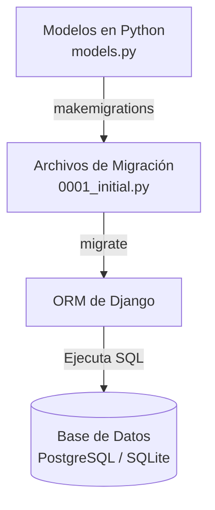
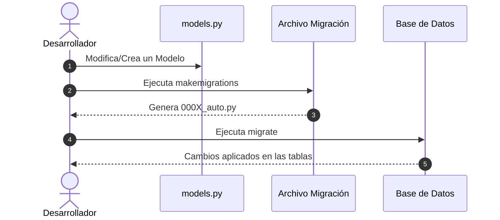

# Guía de Estudio: Migraciones en el ORM de Django

Esta guía de lectura y referencia técnica orienta a los estudiantes en la comprensión, generación y aplicación de **migraciones** en Django, explicando su rol en la evolución del esquema de base de datos, los comandos clave del ORM y un ejercicio práctico paso a paso.

---

## Índice

1. [Objetivos de Aprendizaje](https://www.google.com/search?q=%231-objetivos-de-aprendizaje)
2. [Introducción a las Migraciones](https://www.google.com/search?q=%232-introducci%C3%B3n-a-las-migraciones)
    - [¿Qué es una migración?](https://www.google.com/search?q=%23qu%C3%A9-es-una-migraci%C3%B3n)
    - [El ORM y el Sistema de Migraciones](https://www.google.com/search?q=%23el-orm-y-el-sistema-de-migraciones)
3. [Problemas que Resuelven las Migraciones](https://www.google.com/search?q=%233-problemas-que-resuelven-las-migraciones)
4. [Flujo de Trabajo y Comandos Clave](https://www.google.com/search?q=%234-flujo-de-trabajo-y-comandos-clave)
    - [Generación de Migraciones (`makemigrations`)](https://www.google.com/search?q=%23generaci%C3%B3n-de-migraciones-makemigrations)
    - [Aplicación de Migraciones (`migrate`)](https://www.google.com/search?q=%23aplicaci%C3%B3n-de-migraciones-migrate)
    - [Inspección y Diagnóstico (`sqlmigrate` y `showmigrations`)](https://www.google.com/search?q=%23inspecci%C3%B3n-y-diagn%C3%B3stico-sqlmigrate-y-showmigrations)


5. [Buenas Prácticas en Entornos de Desarrollo y Producción](https://www.google.com/search?q=%235-buenas-pr%C3%A1cticas-en-entornos-de-desarrollo-y-producci%C3%B3n)
6. [Ejercicio Guiado Paso a Paso](https://www.google.com/search?q=%236-ejercicio-guiado-paso-a-paso)
    - [Paso 1: Creación del Entorno Virtual y Proyecto](https://www.google.com/search?q=%23paso-1-creaci%C3%B3n-del-entorno-virtual-y-proyecto)
    - [Paso 2: Creación y Registro de la Aplicación](https://www.google.com/search?q=%23paso-2-creaci%C3%B3n-y-registro-de-la-aplicaci%C3%B3n)
    - [Paso 3: Aplicación de Migraciones Iniciales](https://www.google.com/search?q=%23paso-3-aplicaci%C3%B3n-de-migraciones-iniciales)
    - [Paso 4: Inspección del Modelo `User` con `_meta` API](https://www.google.com/search?q=%23paso-4-inspecci%C3%B3n-del-modelo-user-con-_meta-api)
    - [Paso 5: Operaciones CRUD sobre Usuarios en la Shell](https://www.google.com/search?q=%23paso-5-operaciones-crud-sobre-usuarios-en-la-shell)

7. [Resumen y Preguntas de Autoevaluación](https://www.google.com/search?q=%237-resumen-y-preguntas-de-autoevaluaci%C3%B3n)

---

## 1. Objetivos de Aprendizaje

Al finalizar esta guía, serás capaz de:

* **Comprender** el concepto de migración en Django y el problema estructural que resuelve en la gestión de bases de datos relacionales.
* **Utilizar** el comando `makemigrations` para registrar las alteraciones del modelo de datos en archivos de migración versionados.
* **Ejecutar** el comando `migrate` para aplicar cambios en el esquema de la base de datos de manera controlada y segura.
* **Inspeccionar** metadatos de los modelos y realizar consultas básicas mediante la Shell interactiva de Django.

---

## 2. Introducción a las Migraciones

### ¿Qué es una migración?

Una **migración** en Django es un archivo en código Python generado automáticamente que describe los cambios necesarios para aplicar o revertir alteraciones en el esquema de una base de datos.

Tales cambios abarcan:

* Creación de nuevas tablas.
* Modificación o adición de campos/columnas existentes.
* Eliminación de tablas o restricciones de integridad.

Las migraciones permiten que el esquema físico de la base de datos evolucione al mismo tiempo que el código de la aplicación, preservando los datos existentes.

### El ORM y el Sistema de Migraciones

El ORM de Django actúa como puente entre las clases de Python y las tablas SQL. La interacción ocurre del siguiente modo:



* **Actualización del Esquema:** Refleja en SQL los cambios realizados en el archivo `models.py`.
* **Preservación de Datos:** Modifica la estructura de las tablas sin eliminar la información almacenada.
* **Automatización y Consistencia:** Garantiza la sincronización del esquema entre distintos entornos (desarrollo, pruebas y producción).

---

## 3. Problemas que Resuelven las Migraciones

El sistema de migraciones aborda varios retos esenciales durante el ciclo de vida del desarrollo de software:

| Desafío / Problema | Solución que aporta Django |
| --- | --- |
| **Evolución del Esquema:** Modificar tablas manualmente en SQL es complejo y propenso a errores. | Permite modificar el esquema de forma versionada y controlada mediante archivos Python. |
| **Sincronización entre Entornos:** Discrepancias en la estructura de BD entre la computadora del desarrollador y el servidor de producción. | Mantiene un mecanismo estandarizado donde la ejecución de `migrate` réplica el mismo estado en cualquier entorno. |
| **Colaboración en Equipo:** Conflictos entre cambios hechos por distintos programadores. | Cada cambio se guarda en un archivo secuencial en el directorio `migrations/`, facilitando su fusión (*merge*) en Git. |
| **Rollbacks y Recuperación:** Necesidad de deshacer un cambio problemático. | Permite revertir el esquema a estados anteriores mediante un número de migración específico. |
| **Automatización:** Ejecución manual de scripts `.sql` repetitivos. | Django genera y aplica las instrucciones SQL requeridas automáticamente. |

---

## 4. Flujo de Trabajo y Comandos Clave

El flujo de trabajo básico para modificar la base de datos se resume en tres etapas:



### Generación de Migraciones (`makemigrations`)

Busca cambios en los modelos de las aplicaciones registradas y crea los archivos `.py` correspondientes dentro de la carpeta `migrations/` de cada app.

* **Generar migraciones para todas las apps:**
```bash
python manage.py makemigrations
```

* **Generar migraciones para una app específica:**
```bash
python manage.py makemigrations <app_name>
```

### Aplicación de Migraciones (`migrate`)

Aplica las migraciones pendientes en la base de datos.

* **Aplicar todas las migraciones pendientes:**
```bash
python manage.py migrate
```
* **Aplicar migraciones de una app específica:**
```bash
python manage.py migrate <app_name>
```

* **Revertir o ir a una migración específica:**
```bash
python manage.py migrate <app_name> <migration_number>
```

### Inspección y Diagnóstico (`sqlmigrate` y `showmigrations`)

* **Ver el estado de las migraciones (marcadas con `[X]` si fueron aplicadas):**
```bash
python manage.py showmigrations
```

* **Ver la sentencia SQL que se ejecutará en la BD sin aplicarla:**
```bash
python manage.py sqlmigrate <app_name> <migration_name>
```

---

## 5. Buenas Prácticas en Entornos de Desarrollo y Producción

1. **Pruebas previas:** Pruebe las migraciones en entornos locales o de *staging* antes de ejecutarlas en servidores de producción.
2. **Respaldos (Backups):** Realice una copia de seguridad de la base de datos antes de aplicar migraciones críticas en producción.
3. **Documentación:** Mantenga un seguimiento de los archivos de migración incorporados en el control de versiones (Git).

---

## 6. Ejercicio Guiado Paso a Paso

A continuación, crearemos un proyecto desde cero para aprender a inicializar la base de datos e interactuar con el modelo de usuarios incorporado por Django (`User`).

### Paso 1: Creación del Entorno Virtual y Proyecto

Abre tu terminal y ejecuta los siguientes comandos:

```bash
# Crear el entorno virtual
python -m venv .\venv

# Activar el entorno virtual (Windows)
.\venv\Scripts\activate.bat

# Instalar Django
pip install django

# Crear el proyecto de Django
django-admin startproject proyecto_capitulo_2
cd proyecto_capitulo_2
```

### Paso 2: Creación y Registro de la Aplicación

Crea una app denominada `testadl`:

```bash
python manage.py startapp testadl
```

A continuación, abre `proyecto_capitulo_2/settings.py` y añade `'testadl'` dentro de la lista `INSTALLED_APPS`:

```python
INSTALLED_APPS = [
    'django.contrib.admin',
    'django.contrib.auth',
    'django.contrib.contenttypes',
    'django.contrib.sessions',
    'django.contrib.messages',
    'django.contrib.staticfiles',
    'testadl',  # App recién registrada
]
```

### Paso 3: Aplicación de Migraciones Iniciales

Como no hemos definido modelos propios aún, no se requiere `makemigrations`. Sin embargo, aplicaremos las migraciones correspondientes a las apps del sistema (Administrador, Autenticación, Sesiones):

```bash
python manage.py migrate
```

### Paso 4: Inspección del Modelo `User` con `_meta` API

Inicia la Shell interactiva de Django:

```bash
python manage.py shell
```

A través de la API `_meta`, podemos examinar la estructura y los campos del modelo `User`:

```python
from django.contrib.auth.models import User

# Obtener todos los campos disponibles en el modelo User
campos = User._meta.get_fields()
for c in campos:
    print(c.name)
```

**Campos principales impresos por la pantalla:**
* `id`
* `username`
* `first_name`
* `last_name`
* `email`
* `password`
* `is_staff`
* `is_active`
* `date_joined`, entre otros.

### Paso 5: Operaciones CRUD sobre Usuarios en la Shell

Dentro de la misma sesión en la Shell, crearemos dos usuarios y realizaremos consultas filtradas:

```python
# 1. Crear usuario 1
u1 = User(username='jdoe', first_name='John', last_name='Doe', email='jdoe@mail.com')
u1.save()

# 2. Crear usuario 2
u2 = User(username='ltorvalds', first_name='Linus', last_name='Torvalds', email='ltorvalds@mail.com')
u2.save()

# 3. Listar todos los usuarios
users = User.objects.all()
for user in users:
    print(user)
# Salida esperada:
# jdoe
# ltorvalds

# 4. Eliminar al usuario 'jdoe'
User.objects.filter(username='jdoe').delete()

# 5. Confirmar que solo queda el usuario 'ltorvalds'
users = User.objects.all()
for user in users:
    print(user)
# Salida esperada:
# ltorvalds
```

---

## 7. Resumen y Preguntas de Autoevaluación

### Resumen de Puntos Clave

* **Migraciones:** Registro de modificaciones estructurales en los modelos traducidas a comandos SQL para mantener la integridad de la BD.
* **`makemigrations`:** Examina los modelos y genera archivos de migración dentro de la carpeta `migrations/`.
* **`migrate`:** Aplica las migraciones pendientes en la base de datos.
* **`showmigrations` / `sqlmigrate`:** Herramientas útiles para revisar el estado y la sintaxis SQL de cada migración.

### Preguntas para Reflexionar

1. **¿Qué sucede si modificas un modelo en `models.py` pero olvidas ejecutar `makemigrations` antes de hacer `migrate`?**
2. **¿Por qué es preferible usar migraciones en lugar de modificar las tablas ejecutando SQL directo en el motor de base de datos?**
3. **¿Cuál es el rol del archivo `0001_initial.py` generado en la primera ejecución de `makemigrations`?**