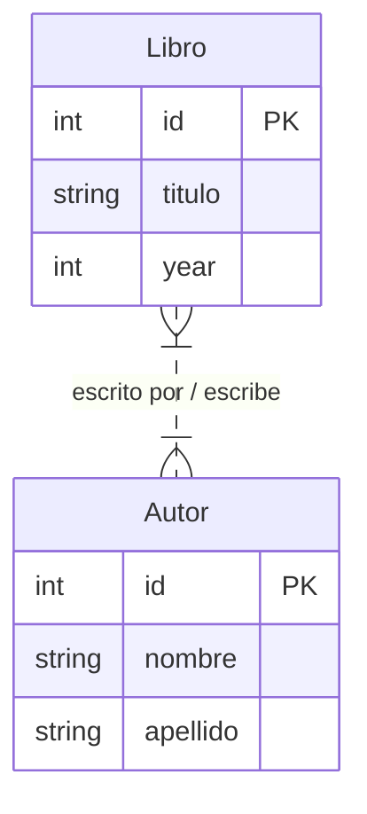
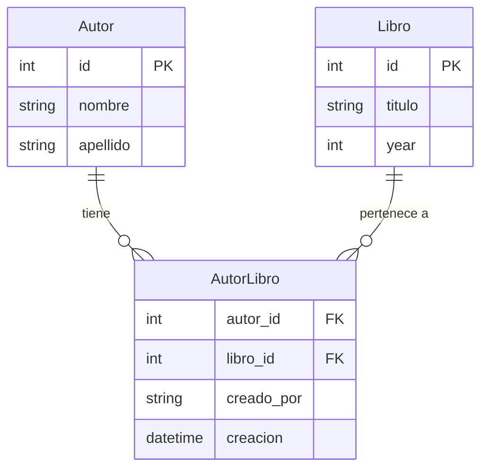

# Guía de Estudio: Manejo de Relaciones Muchos a Muchos (Many-to-Many) en el ORM de Django

Esta guía de lectura y referencia técnica está diseñada para orientar a los estudiantes en la comprensión e implementación práctica de **relaciones Muchos a Muchos (*Many-to-Many*)** utilizando el ORM de Django, abarcando desde el concepto teórico hasta la definición de modelos personalizados de relación (*through models*) y consultas avanzadas.

---

## Índice

- [Guía de Estudio: Manejo de Relaciones Muchos a Muchos (Many-to-Many) en el ORM de Django](#guía-de-estudio-manejo-de-relaciones-muchos-a-muchos-many-to-many-en-el-orm-de-django)
  - [Índice](#índice)
  - [1. Objetivos de Aprendizaje](#1-objetivos-de-aprendizaje)
  - [2. Introducción a la Relación Muchos a Muchos (Many-to-Many)](#2-introducción-a-la-relación-muchos-a-muchos-many-to-many)
    - [¿Qué es una relación Muchos a Muchos?](#qué-es-una-relación-muchos-a-muchos)
    - [Caso de uso: Libros y Autores](#caso-de-uso-libros-y-autores)
  - [3. Implementación Básica con `ManyToManyField`](#3-implementación-básica-con-manytomanyfield)
    - [Definición de Modelos](#definición-de-modelos)
    - [El parámetro `related_name`](#el-parámetro-related_name)
  - [4. Entidades Intermedias Personalizadas (Modelo `through`)](#4-entidades-intermedias-personalizadas-modelo-through)
    - [¿Por qué utilizar un modelo intermedio personalizado?](#por-qué-utilizar-un-modelo-intermedio-personalizado)
    - [Definición del modelo intermedio y parámetro `through`](#definición-del-modelo-intermedio-y-parámetro-through)
    - [Ventajas y Desventajas](#ventajas-y-desventajas)
  - [5. Ejercicio Guiado Paso a Paso](#5-ejercicio-guiado-paso-a-paso)
    - [Paso 1: Configuración inicial de la App](#paso-1-configuración-inicial-de-la-app)
    - [Paso 2: Declaración de Modelos en `models.py`](#paso-2-declaración-de-modelos-en-modelspy)
    - [Paso 3: Creación de Autores y Libros en la Shell](#paso-3-creación-de-autores-y-libros-en-la-shell)
    - [Paso 4: Asociación de Relaciones vía `add()`](#paso-4-asociación-de-relaciones-vía-add)
    - [Paso 5: Actualización de Campos en la Tabla Intermedia](#paso-5-actualización-de-campos-en-la-tabla-intermedia)
    - [Paso 6: Asociación Directa Instanciando el Modelo Intermedio](#paso-6-asociación-directa-instanciando-el-modelo-intermedio)
  - [6. Resumen y Preguntas de Autoevaluación](#6-resumen-y-preguntas-de-autoevaluación)
    - [Resumen de Puntos Clave](#resumen-de-puntos-clave)
    - [Preguntas para reflexionar](#preguntas-para-reflexionar)
  - [7. Próximos Pasos: Introducción a las Migraciones](#7-próximos-pasos-introducción-a-las-migraciones)
  - [Adaptado de:](#adaptado-de)

---

## 1. Objetivos de Aprendizaje

Al finalizar este capítulo, serás capaz de:

* **Implementar** relaciones Muchos a Muchos (*Many-to-Many*) dentro del modelo de datos de Django para resolver necesidades de negocio complejas. 
* **Utilizar** la clase `models.ManyToManyField` adecuadamente, comprendiendo el rol del parámetro `related_name`. 
* **Diseñar y construir** modelos de relación intermedios personalizados utilizando el atributo `through` para almacenar metadatos adicionales de la relación. 
* **Manipular y consultar** registros relacionados desde la shell interactiva de Django mediante métodos como `add()`, `filter()` e instanciación directa del modelo de intersección. 

---

## 2. Introducción a la Relación Muchos a Muchos (Many-to-Many)

### ¿Qué es una relación Muchos a Muchos?
Una relación **Many-to-Many** (muchos a muchos) describe una cardinalidad en bases de datos relacionales donde **un registro de la Tabla A puede asociarse con múltiples registros de la Tabla B** y, de forma recíproca, **un registro de la Tabla B puede estar vinculado a múltiples registros de la Tabla A**. 

### Caso de uso: Libros y Autores
Un ejemplo clásico es la relación entre **Libros** y **Autores**: 
* Un **Libro** puede ser escrito en coautoría por **varios autores**. 
* Un **Autor** puede haber escrito **varios libros** a lo largo de su carrera. 



---

## 3. Implementación Básica con `ManyToManyField`

Django facilita la creación de relaciones muchos a muchos abstractamente a través del campo `models.ManyToManyField`. 

### Definición de Modelos

```python
from django.db import models

class Libro(models.Model):
    titulo = models.CharField(max_length=100, null=False, blank=False)
    year = models.IntegerField(null=False, blank=False)

    def __str__(self):
        return self.titulo

class Autor(models.Model):
    nombre = models.CharField(max_length=50, null=False, blank=False)
    apellido = models.CharField(max_length=50, null=False, blank=False)
    libros = models.ManyToManyField(Libro, related_name="autores")

    def __str__(self):
        return f"{self.nombre} {self.apellido}"
```

### El parámetro `related_name`
* El primer argumento de `ManyToManyField` especifica el modelo con el cual se establece la relación (`Libro`). 
* El parámetro **`related_name="autores"`** permite acceder a la relación inversa desde una instancia de `Libro` escribiendo `libro.autores.all()`. 
* *Nota:* Si no se especifica `related_name`, Django genera por defecto un administrador inverso usando la sintaxis `<nombre_modelo>_set` (ej. `libro.autor_set.all()`). 

---

## 4. Entidades Intermedias Personalizadas (Modelo `through`)

### ¿Por qué utilizar un modelo intermedio personalizado?
En aplicaciones reales, a menudo se requiere almacenar metadatos o información adicional sobre la relación misma. Por ejemplo: 
* Fecha en que se estableció la asociación. 
* Usuario o sistema que creó la relación. 
* Rol del autor en el libro (ej. Autor principal, Coautor, Editor).

### Definición del modelo intermedio y parámetro `through`

Cuando se requiere este comportamiento, se define una **tabla intermedia explícita** usando dos `ForeignKey` y se le indica al `ManyToManyField` que la utilice mediante la propiedad `through`: 



### Ventajas y Desventajas

| Ventajas | Desventajas |
| :--- | :--- |
| **Atributos personalizados:** Permite almacenar información valiosa en la misma relación.  | **Pasos extra en población:** Al usar `.add()`, los campos adicionales no se completan automáticamente y deben actualizarse posteriormente.  |
| **Mayor flexibilidad:** Otorga control completo sobre la estructura SQL de la tabla pivote.  | **Instanciación manual:** Requiere crear explícitamente el objeto intermedio si se desea asignar todos los atributos desde el inicio.  |

---

## 5. Ejercicio Guiado Paso a Paso

Sigue detenidamente los siguientes pasos para construir el proyecto e interactuar con la shell de Django. 

### Paso 1: Configuración inicial de la App
1. Crea un nuevo proyecto Django o ingresa a tu entorno de trabajo. 
2. Crea la app `cap02p2`: 
   ```bash
   python manage.py startapp cap02p2
   ```
3. Registra `'cap02p2'` en la lista `INSTALLED_APPS` dentro de `settings.py`. 

### Paso 2: Declaración de Modelos en `models.py`

Edita el archivo `cap02p2/models.py`: 

```python
from django.db import models

class Libro(models.Model):
    titulo = models.CharField(max_length=100, null=False, blank=False)
    year = models.IntegerField(null=False, blank=False)

    def __str__(self):
        return self.titulo

class Autor(models.Model):
    nombre = models.CharField(max_length=50, null=False, blank=False)
    apellido = models.CharField(max_length=50, null=False, blank=False)
    libros = models.ManyToManyField(Libro, related_name="autores", through="AutorLibro")

    def __str__(self):
        return f"{self.nombre} {self.apellido}"

class AutorLibro(models.Model):
    autor = models.ForeignKey(Autor, on_delete=models.CASCADE)
    libro = models.ForeignKey(Libro, on_delete=models.CASCADE)
    creado_por = models.CharField(max_length=50, null=False, blank=False)
    creacion = models.DateTimeField(auto_now_add=True)
```

Aplica las migraciones iniciales a la base de datos: 
```bash
python manage.py makemigrations
python manage.py migrate
```

---

### Paso 3: Creación de Autores y Libros en la Shell

Abre la shell interactiva de Django: 
```bash
python manage.py shell
```

Ejecuta los siguientes comandos para poblar las entidades base: 

```python
from cap02p2.models import Autor, Libro, AutorLibro

# 1. Crear 4 Autores
autor1 = Autor.objects.create(nombre="Joe", apellido="Rogan")
autor2 = Autor.objects.create(nombre="David", apellido="Blaine")
autor3 = Autor.objects.create(nombre="Lex", apellido="Fridman")
autor4 = Autor.objects.create(nombre="Jack", apellido="Dorsey")

# 2. Crear 2 Libros
libro1 = Libro.objects.create(titulo="Libro entretenido cap1", year=2020)
libro2 = Libro.objects.create(titulo="Libro entretenido cap2", year=2021)
```

---

### Paso 4: Asociación de Relaciones vía `add()`

Asocia `autor1` y `autor3` al `libro1` usando la relación inversa `autores.add(...)`: 

```python
libro1.autores.add(autor1)
libro1.autores.add(autor3)
```

---

### Paso 5: Actualización de Campos en la Tabla Intermedia

Debido a que utilizamos `.add()`, los registros creados en `AutorLibro` tendrán el campo `creado_por` vacío o por defecto. Procedemos a consultarlos y actualizarlos: 

```python
# Inspeccionar y actualizar la relación con autor1
relacion1 = AutorLibro.objects.filter(autor=autor1, libro=libro1).first()
print(relacion1.creado_por)  # Imprime valor inicial (vacío)
print(relacion1.creacion)    # Ej: 2021-07-31 04:47:11.434076+00:00

# Asignar auditoría y guardar
relacion1.creado_por = "Admin01"
relacion1.save()
print(relacion1.creado_por)  # Salida: Admin01

# Inspeccionar y actualizar la relación con autor3
relacion2 = AutorLibro.objects.filter(autor=autor3, libro=libro1).first()
relacion2.creado_por = "Admin01"
relacion2.save()
print(relacion2.creado_por)  # Salida: Admin01
```

---

### Paso 6: Asociación Directa Instanciando el Modelo Intermedio

Una alternativa más eficiente para poblar datos extra desde el momento de instanciación es crear directamente el objeto de la tabla intermedia (`AutorLibro`): 

```python
# Relacionar autor2 y autor4 con libro2 mediante instanciación directa
relacion1_l2 = AutorLibro(autor=autor2, libro=libro2, creado_por="Admin02")
relacion1_l2.save()

# Verificar autores en libro2
print(libro2.autores.all())
# Salida: <QuerySet [<Autor: David Blaine>]>

# Relacionar autor4 al libro2
relacion2_l2 = AutorLibro(autor=autor4, libro=libro2, creado_por="Admin02")
relacion2_l2.save()

# Verificar listado completo de autores en libro2
print(libro2.autores.all())
# Salida: <QuerySet [<Autor: David Blaine>, <Autor: Jack Dorsey>]>
```

---

## 6. Resumen y Preguntas de Autoevaluación

### Resumen de Puntos Clave
* Una relación **Many to Many** denota una cardinalidad en la que múltiples registros de la Tabla A se asocian a múltiples registros de la Tabla B. 
* En Django, se implementa mediante `models.ManyToManyField`. 
* El atributo `through` permite vincular una tabla intermedia personalizada para almacenar campos descriptivos (ej. fechas de asignación, usuarios, roles). 

### Preguntas para reflexionar
1. **¿Qué beneficios nos brinda el uso de relaciones entre objetos en el ORM en comparación a escribir SQL manual?** 
2. **¿En qué escenario de negocio elegirías implementar un modelo intermedio `through` en lugar de un `ManyToManyField` simple?** 
3. **Si se elimina un `Autor` que tiene una relación en `AutorLibro`, ¿qué ocurre con el registro intermedio si usamos `on_delete=models.CASCADE`?** 

---

## 7. Próximos Pasos: Introducción a las Migraciones

En el siguiente tema abordaremos el ciclo de vida de las **migraciones en Django**:

* **Concepto de Migración:** Comprenderás el propósito de las migraciones como un sistema de control de versiones para el esquema de la base de datos. 
* **Uso de `makemigrations`:** Aprenderás a empaquetar los cambios realizados en `models.py` en archivos de migración reproducibles. 
* **Uso de `migrate`:** Aplicarás las modificaciones pendientes sobre la base de datos de forma segura. 

## Adaptado de:
 Modelos de datos y el ORM de Django: Manejo de relaciones en el ORM de Django (Parte II), Unidad 2, Material de presentación de curso, 2021.
