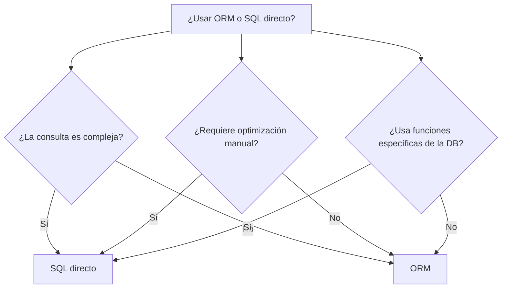
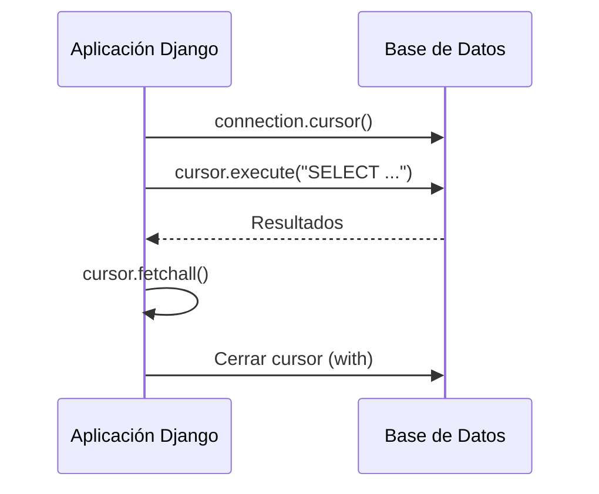
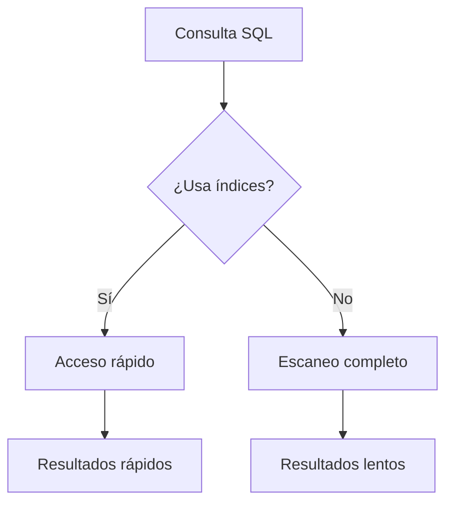
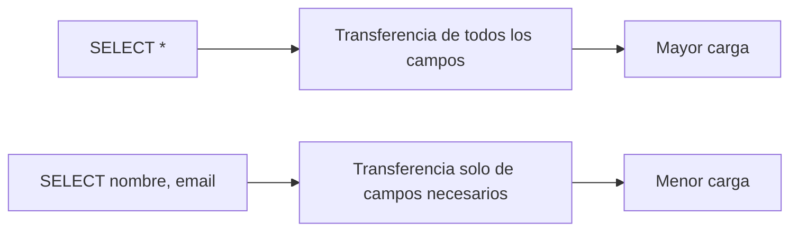
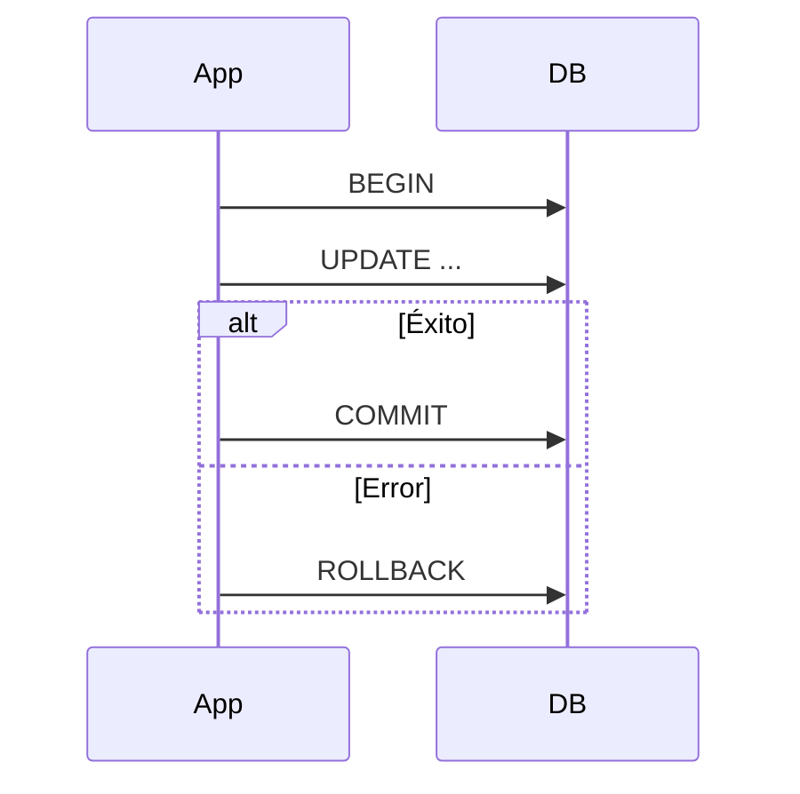
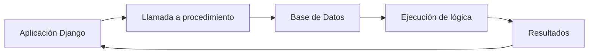

# Modelos de datos y el ORM de Django: Sentencias SQL (Partes I y II)

---

## Índice

- [Modelos de datos y el ORM de Django: Sentencias SQL (Partes I y II)](#modelos-de-datos-y-el-orm-de-django-sentencias-sql-partes-i-y-ii)
  - [Índice](#índice)
  - [¿Cuándo dejar de usar el ORM de Django?](#cuándo-dejar-de-usar-el-orm-de-django)
  - [Introducción a Sentencias SQL en Django](#introducción-a-sentencias-sql-en-django)
    - [¿Por qué recurrir a SQL puro?](#por-qué-recurrir-a-sql-puro)
    - [¿Cuándo usar SQL puro?](#cuándo-usar-sql-puro)
  - [Ejecutando queries SQL directamente](#ejecutando-queries-sql-directamente)
    - [Uso de `cursor.execute()`](#uso-de-cursorexecute)
    - [Consideraciones y mejores prácticas](#consideraciones-y-mejores-prácticas)
  - [Mapeando campos de consultas al modelo](#mapeando-campos-de-consultas-al-modelo)
    - [Proceso de mapeo](#proceso-de-mapeo)
    - [Ejemplo práctico](#ejemplo-práctico)
    - [Consideraciones](#consideraciones)
  - [Búsquedas de índice](#búsquedas-de-índice)
    - [¿Qué son los índices?](#qué-son-los-índices)
    - [Beneficios en el uso de índices](#beneficios-en-el-uso-de-índices)
    - [Consideraciones al usar índices](#consideraciones-al-usar-índices)
    - [Utilizando índices en consultas SQL con Django](#utilizando-índices-en-consultas-sql-con-django)
    - [Estrategias de optimización](#estrategias-de-optimización)
  - [Exclusión de campos del modelo](#exclusión-de-campos-del-modelo)
    - [Técnicas de exclusión](#técnicas-de-exclusión)
    - [Ejemplo de consulta SQL optimizada](#ejemplo-de-consulta-sql-optimizada)
  - [Añadiendo anotaciones](#añadiendo-anotaciones)
    - [Uso de funciones SQL para anotaciones](#uso-de-funciones-sql-para-anotaciones)
    - [Ejemplo práctico de anotación SQL](#ejemplo-práctico-de-anotación-sql)
  - [Ejercicio: Análisis de Ventas](#ejercicio-análisis-de-ventas)
  - [Pasando parámetros a `raw()`](#pasando-parámetros-a-raw)
    - [Uso de `raw()` en Django](#uso-de-raw-en-django)
    - [Precauciones al usar `raw()`](#precauciones-al-usar-raw)
    - [Ejemplo: Selección condicional](#ejemplo-selección-condicional)
    - [Ejemplo: Unión de múltiples tablas](#ejemplo-unión-de-múltiples-tablas)
  - [Ejecutando SQL personalizado directamente](#ejecutando-sql-personalizado-directamente)
    - [SELECT personalizado con `cursor.execute()`](#select-personalizado-con-cursorexecute)
    - [INSERT, UPDATE, DELETE con SQL personalizado](#insert-update-delete-con-sql-personalizado)
    - [Manejo de transacciones en operaciones de escritura](#manejo-de-transacciones-en-operaciones-de-escritura)
  - [Conexiones y cursores](#conexiones-y-cursores)
    - [Manejo de conexiones en Django](#manejo-de-conexiones-en-django)
    - [Obtención de una conexión](#obtención-de-una-conexión)
    - [Uso de cursores para ejecutar SQL](#uso-de-cursores-para-ejecutar-sql)
    - [¿Qué es un cursor?](#qué-es-un-cursor)
  - [Invocación a procedimientos almacenados](#invocación-a-procedimientos-almacenados)
    - [Introducción a procedimientos almacenados en Django](#introducción-a-procedimientos-almacenados-en-django)
    - [Beneficios en Django](#beneficios-en-django)
    - [Ejecutando procedimientos almacenados con cursores](#ejecutando-procedimientos-almacenados-con-cursores)
    - [Manejando resultados y parámetros de salida](#manejando-resultados-y-parámetros-de-salida)
  - [Cuestionario de cierre](#cuestionario-de-cierre)
  - [Resumen](#resumen)

## ¿Cuándo dejar de usar el ORM de Django?

El ORM de Django es poderoso, pero hay situaciones en las que el SQL directo es más adecuado:

- **Rendimiento:** Consultas complejas que pueden optimizarse manualmente.
- **Funcionalidades específicas de la DB:** Características avanzadas no disponibles en el ORM.
- **Consultas complejas:** Cuando el ORM no puede expresarlas eficientemente.
- **Legibilidad:** Algunas consultas son más claras en SQL nativo.
- **Procedimientos almacenados:** Ejecución de lógica compleja encapsulada en la base de datos.



---

## Introducción a Sentencias SQL en Django

### ¿Por qué recurrir a SQL puro?

- **Rendimiento:** Optimización manual de consultas complejas.
- **Funcionalidades específicas de la DB:** Acceso a características avanzadas.
- **Consultas complejas:** Mayor flexibilidad y control.

### ¿Cuándo usar SQL puro?

- **Optimización:** Cuando el análisis de rendimiento indica que una consulta ORM puede mejorarse.
- **Funcionalidad exclusiva de la DB:** Uso de funciones y procedimientos almacenados.
- **Migraciones de datos complejas:** Manipulación detallada y precisa de registros.

---

## Ejecutando queries SQL directamente

### Uso de `cursor.execute()`

Django permite ejecutar sentencias SQL directamente a través de cursores.

```python
from django.db import connection

with connection.cursor() as cursor:
    cursor.execute("SELECT * FROM miapp_mimodelo WHERE condicion=%s", ['valor'])
    rows = cursor.fetchall()
```

**Diagrama de flujo:**



### Consideraciones y mejores prácticas

- **Prevención de inyecciones SQL:** Usar parámetros en lugar de interpolar valores.
- **Gestión de recursos:** Usar el bloque `with` para manejar cursores.
- **Pruebas rigurosas:** Probar exhaustivamente las sentencias SQL directas.

---

## Mapeando campos de consultas al modelo

### Proceso de mapeo

Convertir filas de resultados SQL en instancias de modelos Django.

### Ejemplo práctico

```python
from django.db import connection
from miapp.models import Libro

with connection.cursor() as cursor:
    cursor.execute("SELECT id, titulo, autor FROM miapp_libro WHERE autor = %s", ['Gabriel García Márquez'])
    resultados = cursor.fetchall()

libros = [Libro(id=row[0], titulo=row[1], autor=row[2]) for row in resultados]
```

**Diagrama de mapeo:**


### Consideraciones

- **Sincronización:** Los objetos creados no están sincronizados con la DB.
- **Rendimiento:** Útil para casos específicos donde el ORM no es suficiente.
- **Complejidad vs. Beneficio:** Evaluar antes de optar por mapear resultados SQL.

---

## Búsquedas de índice

### ¿Qué son los índices?

Estructuras de datos que mejoran la velocidad de búsqueda/recuperación.

### Beneficios en el uso de índices

- **Mejora del rendimiento:** Reducen el tiempo de acceso a los datos.
- **Eficiencia en consultas:** Evitan escaneos completos de tabla.
- **Optimización de la base de datos:** Fundamentales para el buen rendimiento.

### Consideraciones al usar índices

- **Uso adecuado:** Un exceso de índices puede ralentizar escrituras.
- **Selección de campos:** Indexar campos usados en `WHERE`, `JOIN` o `ORDER BY`.

### Utilizando índices en consultas SQL con Django

```python
class Libro(models.Model):
    titulo = models.CharField(max_length=100)
    autor = models.CharField(max_length=100)
    publicado = models.DateField()

    class Meta:
        indexes = [
            models.Index(fields=['autor']),
            models.Index(fields=['-publicado']),
        ]
```

Consulta optimizada:

```sql
SELECT * FROM libro WHERE autor = 'Gabriel García Márquez';
```

### Estrategias de optimización

- **Análisis de consultas:** Usar `EXPLAIN` en PostgreSQL.
- **Mantenimiento de índices:** Revisar regularmente su relevancia.



---

## Exclusión de campos del modelo

### Técnicas de exclusión

- **`defer()` en Django ORM:** Carga perezosa de campos.
- **Consultas SQL directas:** Seleccionar solo los campos necesarios.

### Ejemplo de consulta SQL optimizada

```sql
SELECT nombre, email FROM usuario;
```

**Diagrama de optimización:**



---

## Añadiendo anotaciones

### Uso de funciones SQL para anotaciones

- **Django ORM:** `annotate()`
- **SQL puro:** Funciones de agregación.

```python
Autor.objects.annotate(num_libros=Count('libro'))
```

### Ejemplo práctico de anotación SQL

```sql
SELECT categoría, AVG(paginas) as promedio_paginas FROM libro GROUP BY categoría;
```

**Diagrama de anotación:**


---

## Ejercicio: Análisis de Ventas

**Contexto:** Agrupar ventas por categoría, excluir productos descontinuados y calcular el total vendido.

**Estructura de modelos:**

- `Categoria`
- `Producto` (incluye `descontinuado`)
- `Venta` (cantidad y precio total)

**Tareas:**

1. Diseñar una consulta SQL.
2. Mapear resultados a modelos Django.
3. Discutir en clase.

**Ejemplo de consulta SQL:**

```sql
SELECT c.nombre, SUM(v.total) as total_vendido
FROM venta v
JOIN producto p ON v.producto_id = p.id
JOIN categoria c ON p.categoria_id = c.id
WHERE p.descontinuado = False
GROUP BY c.nombre;
```

**Mapeo:**

```python
from django.db import connection

with connection.cursor() as cursor:
    cursor.execute("""
        SELECT c.nombre, SUM(v.total) as total_vendido
        FROM venta v
        JOIN producto p ON v.producto_id = p.id
        JOIN categoria c ON p.categoria_id = c.id
        WHERE p.descontinuado = False
        GROUP BY c.nombre
    """)
    resultados = cursor.fetchall()
```

---

## Pasando parámetros a `raw()`

### Uso de `raw()` en Django

Permite ejecutar consultas SQL crudas.

```python
libros_raw = Libro.objects.raw('SELECT id, título FROM app_libro WHERE autor_id = %s', [autor_id])
```

### Precauciones al usar `raw()`

- **Seguridad:** Evitar inyecciones SQL usando parámetros.
- **Mantenimiento:** Puede ser más difícil de mantener que el ORM.

### Ejemplo: Selección condicional

```python
empleados = Empleado.objects.raw("""
    SELECT id, nombre, salario
    FROM empleado_empleado
    WHERE departamento_id = %s AND salario > %s
""", [departamento_id, salario_minimo])
```

### Ejemplo: Unión de múltiples tablas

```python
consulta = Libro.objects.raw("""
    SELECT l.id, l.titulo, a.nombre AS autor_nombre
    FROM libro_libro AS l
    JOIN libro_autor AS a ON l.autor_id = a.id
    WHERE a.pais = %s
""", [pais_autor])
```

**Diagrama de `raw()`:**

```mermaid
graph TD
    A[raw()] --> B[Consulta SQL cruda]
    B --> C[Parámetros seguros]
    C --> D[Iterable de modelos Django]
```

---

## Ejecutando SQL personalizado directamente

### SELECT personalizado con `cursor.execute()`

```python
from django.db import connection

with connection.cursor() as cursor:
    cursor.execute("SELECT * FROM mi_app_mi_table WHERE condicion = %s", [valor])
    resultados = cursor.fetchall()
```

### INSERT, UPDATE, DELETE con SQL personalizado

```python
with connection.cursor() as cursor:
    cursor.execute("INSERT INTO mi_app_mi_tabla (campo1, campo2) VALUES (%s, %s)", [valor1, valor2])
```

### Manejo de transacciones en operaciones de escritura

```python
from django.db import transaction

with transaction.atomic():
    with connection.cursor() as cursor:
        cursor.execute("UPDATE mi_app_mi_table SET campo = %s WHERE condicion = %s", [nuevo_valor, condicion])
```

**Diagrama de transacción:**



---

## Conexiones y cursores

### Manejo de conexiones en Django

Django gestiona automáticamente las conexiones, manteniendo un pool.

### Obtención de una conexión

```python
from django.db import connection

with connection.cursor() as cursor:
    # Operaciones
    pass
```

### Uso de cursores para ejecutar SQL

- **`cursor.execute()`:** Ejecuta la sentencia SQL.
- **`cursor.fetchall()`:** Recupera todos los resultados.

### ¿Qué es un cursor?

Interfaz que permite ejecutar operaciones SQL y recuperar resultados.

```python
from django.db import connection

with connection.cursor() as cursor:
    cursor.execute("SELECT * FROM app_mi_table WHERE condicion='valor'")
    for fila in cursor.fetchall():
        print(fila)
```

**Buenas prácticas:**

- Manejar excepciones.
- Usar `with` para cierre automático de cursores.

---

## Invocación a procedimientos almacenados

### Introducción a procedimientos almacenados en Django

Encapsulan lógica de negocios compleja en la base de datos.

### Beneficios en Django

- **Rendimiento:** Operaciones complejas en el servidor.
- **Seguridad:** Previenen inyecciones SQL.
- **Reutilización:** Lógica centralizada.

### Ejecutando procedimientos almacenados con cursores

```python
from django.db import connection

with connection.cursor() as cursor:
    cursor.callproc('calcular_total_ventas', [producto_id])
    (total_ventas,) = cursor.fetchone()
    print(f"Total de ventas: {total_ventas}")
```

### Manejando resultados y parámetros de salida

```python
with connection.cursor() as cursor:
    cursor.execute("CALL calcular_resumen_ventas(@total, @promedio);")
    cursor.execute("SELECT @total, @promedio;")
    total, promedio = cursor.fetchone()
    print(f"Total: {total}, Promedio: {promedio}")
```

**Diagrama de procedimiento almacenado:**



---

## Cuestionario de cierre

**Pregunta 1:** ¿Cuál es el propósito principal de usar sentencias SQL directas en Django?
- **B)** Mejorar el rendimiento y aprovechar características específicas de la base de datos.

**Pregunta 2:** ¿Qué método se utiliza para ejecutar consultas SQL no modificadas en Django?
- **C)** `cursor.execute()`

**Pregunta 3:** Al ejecutar un procedimiento almacenado desde Django, ¿qué método se utiliza comúnmente?
- **F)** `cursor.callproc()`

**Pregunta 4:** ¿Cuál es una buena práctica al ejecutar SQL personalizado para prevenir inyecciones SQL?
- **C)** Usar el paso de parámetros en las sentencias SQL.

**Pregunta 5:** ¿Qué se debe hacer para asegurar que los recursos como conexiones y cursores sean liberados adecuadamente después de su uso en Django?
- **H)** Utilizar el contexto `with` al obtener y usar cursores.

---

## Resumen

En este módulo exploramos el uso avanzado de sentencias SQL dentro de Django, destacando cómo complementan al ORM estándar para situaciones que requieren mayor personalización o rendimiento. Aprendimos a ejecutar consultas personalizadas utilizando `raw()` y `cursor.execute()`, enfatizando la importancia del manejo seguro de parámetros para evitar inyecciones SQL. Discutimos la relevancia de los índices para optimizar consultas y cómo invocar procedimientos almacenados para aprovechar la lógica compleja directamente en la base de datos. Además, cubrimos las mejores prácticas para el uso efectivo de conexiones y cursores, asegurando la liberación adecuada de recursos.

---

**{desafio} latam_**
*Academia de talentos digitales*