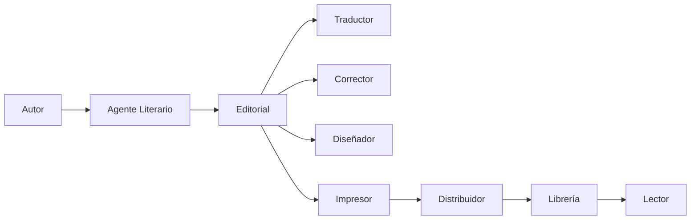
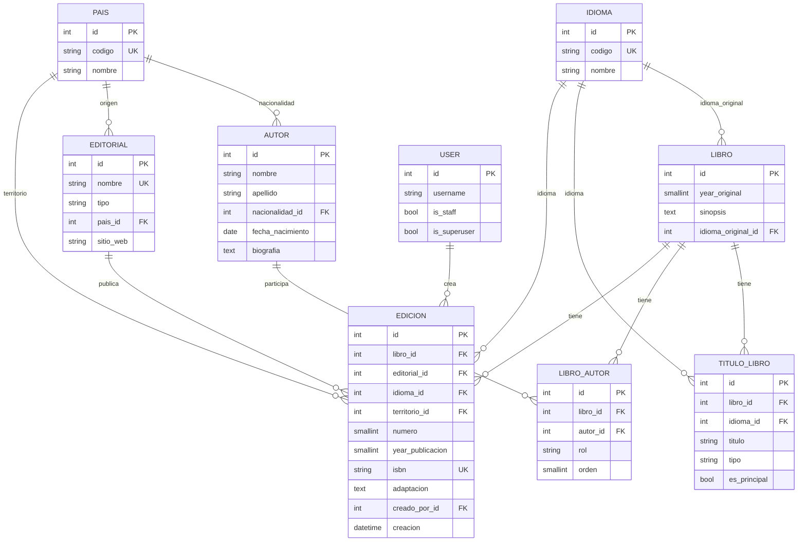

# Guía: El Modelo de Negocio Editorial y su Implementación en Django

## Índice

1. [Introducción: ¿Qué es una Editorial?](#introducción)
2. [El Ecosistema del Libro](#el-ecosistema-del-libro)
3. [Conceptos Clave del Negocio Editorial](#conceptos-clave)
4. [Del Negocio al Modelo de Datos](#del-negocio-al-modelo-de-datos)
5. [Implementación Paso a Paso en `models.py`](#implementación)
6. [Diagrama Final del Modelo](#diagrama-final)
7. [Consultas de Ejemplo](#consultas-de-ejemplo)
8. [Resumen](#resumen)

---

## Introducción: ¿Qué es una Editorial?

Una editorial no es simplemente una empresa que imprime libros. Es una **empresa cultural que gestiona derechos, produce productos comerciales y conecta autores con lectores** .

El negocio editorial se basa en un principio fundamental: **la editorial adquiere derechos de explotación sobre una obra y los convierte en productos comercializables** (libros, ediciones, traducciones) .

> **Para los estudiantes:** Piensen en una editorial como un "fondo de inversión de contenido". Arriesga capital para descubrir talento, producir libros y sostener un catálogo, apostando a que algunos títulos exitosos financien a los demás .

---

## El Ecosistema del Libro

Un libro no llega solo a manos del lector. Detrás hay **múltiples actores** que participan en diferentes etapas :



En este ecosistema, **cada actor tiene un rol específico** y **la editorial es el nodo central** que coordina la producción y gestiona los derechos .

---

## Conceptos Clave del Negocio

### 1. Autor (no es usuario del sistema)
El autor es una **entidad externa**. No inicia sesión, no tiene permisos. Es un **socio de negocio** que firma contratos con la editorial .

### 2. Libro (Obra Abstracta)
Es la **creación intelectual** del autor. No tiene editorial, ISBN ni idioma por sí mismo. Es la "idea" del libro .

### 3. Título (Alternativo por Idioma)
Una obra puede tener **múltiples títulos** según el idioma y el tipo:
- **Original**: el título en el idioma en que fue escrita.
- **Comercial**: el título con el que se comercializa en un mercado.
- **Legal**: el título registrado legalmente.
- **Alternativo**: variantes, subtítulos, etc.

El título **no vive en `Libro`**, sino en `TituloLibro`, porque una misma obra puede llamarse distinto en cada mercado .

### 4. Edición (Producto Comercial)
Es la **materialización concreta** del libro. Cada edición tiene:
- Una **editorial** que la publica
- Un **idioma** específico (traducción)
- Un **territorio** de distribución (los derechos son territoriales) 
- Un **ISBN** único (identifica el producto, no la obra) 
- Una posible **adaptación** (versión juvenil, adaptación cultural) 

> **Regla clave:** Un libro puede tener muchas ediciones. Cada edición es un producto comercial distinto con su propio contrato, ISBN y mercado .

### 5. Coautoría y Roles
Un libro puede tener **múltiples autores**, y cada uno puede tener un **rol diferente**:
- **Autor principal**: el creador original
- **Coautor**: colaborador en la creación
- **Traductor**: autor de una obra derivada (la traducción)
- **Editor**: quien prepara el texto para publicación
- **Adaptador**: quien modifica el contenido para un nuevo contexto 

### 6. Territorio
Los derechos de publicación **no son mundiales por defecto**. Un contrato especifica los **territorios** donde la editorial puede vender el libro. Por eso, un mismo libro puede tener editores diferentes en distintos países, cada uno con su propia edición .

---

## Del Negocio al Modelo de Datos

| Concepto de Negocio | Modelo Django | Relación |
|---|---|---|
| Autor | `Autor` | Entidad independiente |
| Libro (obra) | `Libro` | Tiene muchos `Autor` vía `LibroAutor` |
| Título alternativo | `TituloLibro` | Pertenece a un `Libro` y un `Idioma` |
| Editorial | `Editorial` | Publica muchas `Edicion` |
| Edición (producto) | `Edicion` | Pertenece a un `Libro`, una `Editorial`, un `Idioma`, un `Pais` |
| Idioma | `Idioma` | Catálogo |
| Territorio | `Pais` | Catálogo |
| Rol de autor | `LibroAutor.Rol` | Choices |

---

## Implementación Paso a Paso en `models.py`

### Paso 1: Catálogos (Idioma y País)

```python
from django.db import models
from django.conf import settings
from django.db.models.functions import Now
from django.core.validators import MinValueValidator, MaxValueValidator


class Idioma(models.Model):
    """Catálogo de idiomas según ISO 639."""
    codigo = models.CharField(max_length=5, unique=True)
    nombre = models.CharField(max_length=50)

    class Meta:
        ordering = ["nombre"]
        verbose_name = "Idioma"
        verbose_name_plural = "Idiomas"

    def __str__(self):
        return f"{self.codigo} - {self.nombre}"


class Pais(models.Model):
    """Catálogo de países según ISO 3166-1."""
    codigo = models.CharField(max_length=3, unique=True)
    nombre = models.CharField(max_length=100)

    class Meta:
        ordering = ["nombre"]
        verbose_name = "País"
        verbose_name_plural = "Países"

    def __str__(self):
        return self.nombre
```

**¿Por qué?** Los idiomas y territorios son **datos maestros**. Normalizarlos evita errores como `"Español"`, `"español"`, `"ES"` en el mismo sistema.

---

### Paso 2: Autor (Entidad Externa)

```python
class Autor(models.Model):
    """
    Autor externo al sistema. No es usuario.
    Firma contratos con editoriales para licenciar sus obras.
    """
    nombre = models.CharField(max_length=50)
    apellido = models.CharField(max_length=50)
    nacionalidad = models.ForeignKey(
        Pais,
        on_delete=models.SET_NULL,
        null=True,
        blank=True,
        related_name="autores",
    )
    fecha_nacimiento = models.DateField(null=True, blank=True)
    biografia = models.TextField(blank=True)

    class Meta:
        ordering = ["apellido", "nombre"]
        verbose_name = "Autor"
        verbose_name_plural = "Autores"
        constraints = [
            models.UniqueConstraint(
                fields=["nombre", "apellido"],
                name="unique_autor_nombre_apellido",
            )
        ]

    def __str__(self):
        return f"{self.nombre} {self.apellido}"
```

**¿Por qué?** El autor **no es un usuario del sistema**. No tiene credenciales. Mezclarlo con `User` sería un error de diseño .

---

### Paso 3: Editorial

```python
class Editorial(models.Model):
    """
    Editorial que publica ediciones.
    Puede ser nacional o extranjera.
    """
    class Tipo(models.TextChoices):
        NACIONAL = "NAC", "Nacional"
        EXTRANJERA = "EXT", "Extranjera"

    nombre = models.CharField(max_length=100, unique=True)
    tipo = models.CharField(
        max_length=3,
        choices=Tipo.choices,
        default=Tipo.NACIONAL,
    )
    pais = models.ForeignKey(
        Pais,
        on_delete=models.PROTECT,
        related_name="editoriales",
    )
    sitio_web = models.URLField(blank=True)

    class Meta:
        ordering = ["nombre"]
        verbose_name = "Editorial"
        verbose_name_plural = "Editoriales"

    def __str__(self):
        return f"{self.nombre} ({self.get_tipo_display()})"
```

**¿Por qué `TextChoices`?** Es la forma moderna de definir enumeraciones. Django genera automáticamente `get_tipo_display()` para mostrar el texto legible.

---

### Paso 4: Libro (Obra Abstracta)

```python
class Libro(models.Model):
    """
    Obra abstracta creada por uno o varios autores.
    Los títulos alternativos se almacenan en TituloLibro.
    """
    year_original = models.PositiveSmallIntegerField(
        validators=[MinValueValidator(1000), MaxValueValidator(2100)]
    )
    sinopsis = models.TextField(blank=True)
    idioma_original = models.ForeignKey(
        Idioma,
        on_delete=models.PROTECT,
        related_name="libros_originales",
    )
    autores = models.ManyToManyField(
        Autor,
        through="LibroAutor",
        related_name="libros",
    )

    class Meta:
        ordering = ["year_original"]
        verbose_name = "Libro"
        verbose_name_plural = "Libros"

    def __str__(self):
        titulo = self.titulo_principal()
        return f"{titulo} ({self.year_original})" if titulo else f"Libro #{self.pk}"

    def titulo_principal(self, idioma=None):
        """
        Devuelve el título principal del libro.
        Si se pasa un idioma, intenta devolver el título en ese idioma;
        si no existe, cae al título original.
        """
        qs = self.titulos.filter(es_principal=True)
        if idioma:
            titulo_idioma = qs.filter(idioma=idioma).first()
            if titulo_idioma:
                return titulo_idioma.titulo
        titulo = qs.first()
        return titulo.titulo if titulo else None
```

**¿Por qué M2M con `through`?** Porque un libro puede tener **múltiples autores** con **roles diferentes**. La M2M simple no permite almacenar el rol .

**¿Por qué no hay `titulo` en `Libro`?** Porque el título es un atributo **lingüístico y comercial** que varía por idioma y tipo. Almacenarlo en `Libro` impediría tener títulos alternativos.

---

### Paso 5: TituloLibro (Títulos Alternativos por Idioma)

```python
class TituloLibro(models.Model):
    """
    Título alternativo de un libro, por idioma y tipo.
    Permite almacenar el título original y sus traducciones
    (comercial, legal, alternativo) en distintos idiomas.
    """
    class Tipo(models.TextChoices):
        ORIGINAL = "ORI", "Original"
        COMERCIAL = "COM", "Comercial"
        LEGAL = "LEG", "Legal"
        ALTERNATIVO = "ALT", "Alternativo"

    libro = models.ForeignKey(
        Libro,
        on_delete=models.CASCADE,
        related_name="titulos",
    )
    idioma = models.ForeignKey(
        Idioma,
        on_delete=models.PROTECT,
        related_name="titulos_libro",
    )
    titulo = models.CharField(max_length=200)
    tipo = models.CharField(
        max_length=3,
        choices=Tipo.choices,
        default=Tipo.ORIGINAL,
    )
    es_principal = models.BooleanField(
        default=False,
        help_text="Marca este título como el principal para mostrar en listados.",
    )

    class Meta:
        ordering = ["libro", "idioma", "tipo"]
        verbose_name = "Título de libro"
        verbose_name_plural = "Títulos de libros"
        constraints = [
            models.UniqueConstraint(
                fields=["libro", "idioma", "tipo"],
                name="unique_libro_idioma_tipo",
            )
        ]

    def __str__(self):
        return f"{self.titulo} ({self.idioma.codigo}, {self.get_tipo_display()})"

    def save(self, *args, **kwargs):
        # Si se marca como principal, desmarcar los demás del mismo libro
        if self.es_principal:
            TituloLibro.objects.filter(
                libro=self.libro,
                es_principal=True,
            ).exclude(pk=self.pk).update(es_principal=False)
        super().save(*args, **kwargs)
```

**¿Por qué un modelo aparte?** Porque una misma obra puede tener:
- Título original en español
- Título comercial en inglés
- Título comercial en francés
- Título legal en español
- Título alternativo en portugués

Todo eso no cabe en un solo campo de `Libro`.

**¿Por qué `save()` sobrescrito?** Para garantizar que solo haya **un título principal por libro**. Si marcas uno como principal, los demás se desmarcan automáticamente.

---

### Paso 6: LibroAutor (Relación con Roles)

```python
class LibroAutor(models.Model):
    """
    Relación autor-libro con rol.
    Permite coautoría, traducción, edición y adaptación.
    """
    class Rol(models.TextChoices):
        PRINCIPAL = "PRI", "Autor principal"
        COAUTOR = "COA", "Coautor"
        TRADUCTOR = "TRA", "Traductor"
        EDITOR = "EDI", "Editor"
        ADAPTADOR = "ADA", "Adaptador"

    libro = models.ForeignKey(
        Libro,
        on_delete=models.CASCADE,
        related_name="libro_autores",
    )
    autor = models.ForeignKey(
        Autor,
        on_delete=models.CASCADE,
        related_name="autor_libros",
    )
    rol = models.CharField(
        max_length=3,
        choices=Rol.choices,
        default=Rol.PRINCIPAL,
    )
    orden = models.PositiveSmallIntegerField(
        default=1,
        help_text="Orden de aparición en la portada.",
    )

    class Meta:
        ordering = ["libro", "orden"]
        verbose_name = "Autor de libro"
        verbose_name_plural = "Autores de libros"
        constraints = [
            models.UniqueConstraint(
                fields=["libro", "autor", "rol"],
                name="unique_libro_autor_rol",
            )
        ]

    def __str__(self):
        return f"{self.autor} ({self.get_rol_display()}) - {self.libro}"
```

**¿Por qué `get_rol_display()`?** Django lo genera automáticamente para campos con `choices`. Devuelve `"Autor principal"` en lugar de `"PRI"`, mucho más legible .

---

### Paso 7: Edicion (Producto Comercial)

```python
class Edicion(models.Model):
    """
    Producto comercial concreto: libro + editorial + idioma + territorio.
    Cada edición tiene su propio ISBN y contrato.
    """
    libro = models.ForeignKey(
        Libro,
        on_delete=models.CASCADE,
        related_name="ediciones",
    )
    editorial = models.ForeignKey(
        Editorial,
        on_delete=models.PROTECT,
        related_name="ediciones",
    )
    idioma = models.ForeignKey(
        Idioma,
        on_delete=models.PROTECT,
        related_name="ediciones",
    )
    territorio = models.ForeignKey(
        Pais,
        on_delete=models.PROTECT,
        related_name="ediciones",
        help_text="Territorio donde se distribuye esta edición.",
    )
    numero = models.PositiveSmallIntegerField(default=1)
    year_publicacion = models.PositiveSmallIntegerField(
        validators=[MinValueValidator(1000), MaxValueValidator(2100)]
    )
    isbn = models.CharField(
        "ISBN",
        max_length=13,
        unique=True,
        null=True,
        blank=True,
        help_text="ISBN-13. Opcional para libros antiguos.",
    )
    adaptacion = models.TextField(
        blank=True,
        help_text="Descripción de la adaptación realizada (cultural, formato, etc.).",
    )
    creado_por = models.ForeignKey(
        settings.AUTH_USER_MODEL,
        on_delete=models.SET_NULL,
        null=True,
        related_name="ediciones_creadas",
    )
    creacion = models.DateTimeField(auto_now_add=True, db_default=Now())

    class Meta:
        ordering = ["libro", "numero"]
        verbose_name = "Edición"
        verbose_name_plural = "Ediciones"
        constraints = [
            models.UniqueConstraint(
                fields=["libro", "editorial", "idioma", "territorio", "numero"],
                name="unique_libro_editorial_idioma_territorio_numero",
            )
        ]

    def titulo_mostrar(self):
        """Devuelve el título en el idioma de esta edición, o el principal."""
        return self.libro.titulo_principal(idioma=self.idioma)

    def __str__(self):
        return (
            f"{self.titulo_mostrar()} "
            f"({self.editorial.nombre}, {self.idioma.codigo}, "
            f"{self.territorio.nombre}, ed. {self.numero})"
        )
```

**¿Por qué `isbn` con `unique=True, null=True`?** El ISBN identifica **una edición/formato específico**, no la obra abstracta. `null=True` permite múltiples ISBNs vacíos (libros antiguos) sin violar la unicidad en PostgreSQL .

**¿Por qué `creado_por`?** Auditoría. Registra **quién** y **cuándo** se creó la edición. Los usuarios del sistema (staff) son los gestores .

**¿Por qué `titulo_mostrar()`?** Resuelve el título correcto para esta edición específica, consultando `TituloLibro` con el idioma de la edición.

---

## Diagrama Final del Modelo



---

## Consultas de Ejemplo

Una vez implementado el modelo, estas son algunas consultas útiles:

### 1. Todos los libros de un autor
```python
autor = Autor.objects.get(id=1)
libros = autor.libros.all()
```

### 2. Autores de un libro con su rol
```python
libro = Libro.objects.get(id=1)
for la in libro.libro_autores.select_related("autor"):
    print(f"{la.autor} - {la.get_rol_display()}")
```

### 3. Título principal de un libro
```python
libro = Libro.objects.get(id=1)
libro.titulo_principal()                 # en el idioma original
libro.titulo_principal(idioma=idioma_en) # en inglés si existe
```

### 4. Todos los títulos de un libro
```python
libro.titulos.select_related("idioma").all()
```

### 5. Ediciones en español de un libro
```python
Edicion.objects.filter(
    libro__titulos__titulo="Cien años de soledad",
    idioma__codigo="es"
).distinct()
```

### 6. Editoriales extranjeras que publicaron un libro
```python
Editorial.objects.filter(
    tipo="EXT",
    ediciones__libro__titulos__titulo="Cien años de soledad"
).distinct()
```

### 7. Traductores de un libro
```python
LibroAutor.objects.filter(
    libro__titulos__titulo="Cien años de soledad",
    rol="TRA"
).select_related("autor")
```

### 8. Ediciones por territorio
```python
Edicion.objects.filter(territorio__codigo="ESP")
```

### 9. Título a mostrar en una edición específica
```python
edicion = Edicion.objects.get(id=1)
edicion.titulo_mostrar()  # resuelve al idioma de la edición
```

---

## Resumen

| Concepto | Implementación |
|---|---|
| **Autor** | Entidad externa, no usuario |
| **Libro** | Obra abstracta, M2M con Autor vía `LibroAutor` |
| **Título** | Modelo `TituloLibro` con idioma, tipo y `es_principal` |
| **LibroAutor** | Relación con rol (principal, coautor, traductor, etc.) |
| **Editorial** | Entidad que publica, con tipo (NAC/EXT) |
| **Idioma** | Catálogo, FK en `Libro`, `TituloLibro` y `Edicion` |
| **Territorio** | FK a `Pais` en `Edicion` |
| **Edición** | Producto comercial: libro + editorial + idioma + territorio |
| **ISBN** | En `Edicion`, `unique=True, null=True` |
| **Auditoría** | `creado_por` + `creacion` en `Edicion` |
| **Permisos** | Staff/superusuario para CRUD, resto solo lectura |

Este modelo refleja **fielmente el negocio editorial real**: autores que licencian obras, títulos que varían por idioma y tipo, editoriales que producen ediciones territoriales en distintos idiomas, con adaptaciones documentadas y trazabilidad completa.