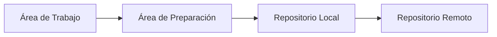
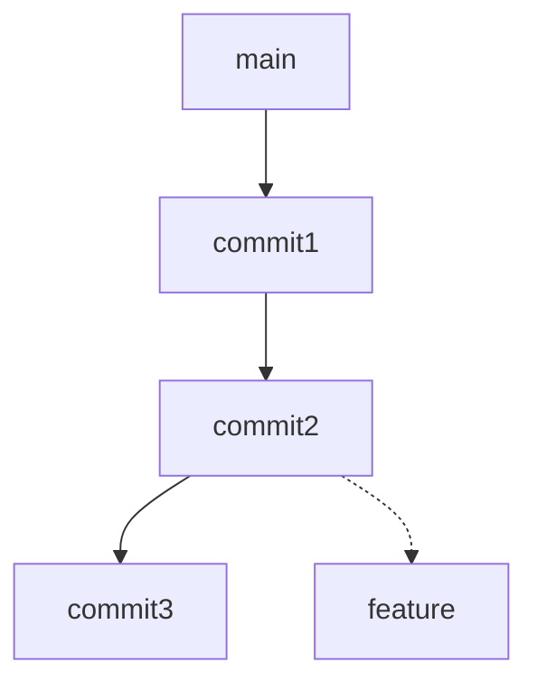

# Cuestionario de nivelación: Fundamentos de Frontend

---

## SECCIÓN 1: HTML - Estructura y Semántica (Preguntas 1-10)

### Pregunta 1
**¿Cuál de las siguientes etiquetas HTML5 se utiliza para definir el pie de página de una sección o del documento completo?**

A) `<footer>`
B) `<bottom>`
C) `<foot>`
D) `<section>`

<details>
<summary>Ver respuesta correcta</summary>


**Respuesta correcta: A**

*Justificación:* La etiqueta `<footer>` es la etiqueta semántica de HTML5 diseñada específicamente para representar el pie de página de una sección o del documento. Contiene información como copyright, enlaces a documentos relacionados o datos de contacto. `<bottom>` y `<foot>` no son etiquetas HTML válidas, y `<section>` se usa para agrupar contenido temático.
</details>

---

### Pregunta 2
**Dado el siguiente código HTML, ¿cuál será el comportamiento del enlace al hacer clic en él?**

```html
<a href="#" onclick="return false;">Haz clic aquí</a>
```

A) Navegará a la página principal del sitio.
B) No realizará ninguna acción al hacer clic.
C) Desplegará un mensaje de alerta.
D) Recargará la página actual.

<details>
<summary>Ver respuesta correcta</summary>


**Respuesta correcta: B**

*Justificación:* El atributo `href="#"` indica que el enlace apunta al inicio de la página, pero el evento `onclick="return false;"` previene el comportamiento predeterminado del navegador, evitando cualquier navegación o recarga. Esto se usa comúnmente para enlaces que solo ejecutan JavaScript.
</details>

---

### Pregunta 3
**¿Qué atributo debe utilizarse en una etiqueta `` para proporcionar una descripción de la imagen que será leída por lectores de pantalla?**

A) `title`
B) `description`
C) `alt`
D) `caption`

<details>
<summary>Ver respuesta correcta</summary>

**Respuesta correcta: C**

*Justificación:* El atributo `alt` proporciona un texto alternativo que describe la imagen. Es esencial para la accesibilidad web, ya que los lectores de pantalla lo utilizan para describir la imagen a usuarios con discapacidad visual, y también aparece cuando la imagen no se carga correctamente.
</details>

---

### Pregunta 4
**Observa el siguiente código HTML. ¿Qué elemento se mostrará en la pestaña del navegador?**

```html
<!DOCTYPE html>
<html>
<head>
    <title>Mi Sitio Web</title>
    <meta name="description" content="Descripción del sitio">
</head>
<body>
    <h1>Bienvenido</h1>
    <p>Contenido principal</p>
</body>
</html>
```

A) "Mi Sitio Web"
B) "Descripción del sitio"
C) "Bienvenido"
D) "Contenido principal"

<details>
<summary>Ver respuesta correcta</summary>

**Respuesta correcta: A**

*Justificación:* El título que se muestra en la pestaña del navegador está definido por la etiqueta `<title>` dentro del `<head>`. La etiqueta `<meta>` con `description` proporciona información para motores de búsqueda, y el contenido dentro del `<body>` es lo que se ve en la página, no en la pestaña.
</details>

---

### Pregunta 5
**¿Cuál es la función principal de la etiqueta `<meta charset="UTF-8">` en un documento HTML?**

A) Especificar el idioma de la página.
B) Definir la codificación de caracteres para soportar símbolos y tildes.
C) Establecer el título de la página.
D) Vincular una hoja de estilos externa.

<details>
<summary>Ver respuesta correcta</summary>

**Respuesta correcta: B**

*Justificación:* El atributo `charset="UTF-8"` define la codificación de caracteres del documento, permitiendo que caracteres especiales como la "ñ", tildes y otros símbolos internacionales se muestren correctamente. UTF-8 es el estándar de codificación más utilizado en la web.
</details>

---

### Pregunta 6
**¿Cuál de las siguientes etiquetas HTML NO es una etiqueta semántica de HTML5?**

A) `<header>`
B) `<article>`
C) `<div>`
D) `<section>`

<details>
<summary>Ver respuesta correcta</summary>

**Respuesta correcta: C**

*Justificación:* La etiqueta `<div>` es un contenedor genérico sin significado semántico, utilizado principalmente para agrupar elementos con fines de estilo o manipulación con JavaScript. `<header>`, `<article>` y `<section>` son etiquetas semánticas que describen su propósito y contenido.
</details>

---

### Pregunta 7
**Dado el siguiente código HTML, ¿cómo se mostrará la lista en el navegador?**

```html
<ul>
    <li>Elemento 1</li>
    <li>Elemento 2
        <ul>
            <li>Subelemento 2.1</li>
            <li>Subelemento 2.2</li>
        </ul>
    </li>
    <li>Elemento 3</li>
</ul>
```

A) Una lista numerada con viñetas anidadas.
B) Una lista con viñetas que tiene un submenú con sangría.
C) Una lista de definiciones con términos y descripciones.
D) Una lista numerada con subelementos numerados.

<details>
<summary>Ver respuesta correcta</summary>

**Respuesta correcta: B**

*Justificación:* Las etiquetas `<ul>` crean listas desordenadas que se muestran con viñetas. Al anidar una lista no ordenada dentro de un elemento de lista, el navegador aplica sangría automáticamente, creando una estructura jerárquica con viñetas en diferentes niveles.
</details>

---

### Pregunta 8
**¿Cuál de las siguientes opciones describe correctamente la diferencia entre una página web y un sitio web?**

A) Una página web contiene solo texto, mientras que un sitio web contiene multimedia.
B) Una página web es un documento individual, mientras que un sitio web es una colección de páginas interconectadas.
C) Una página web requiere CSS, mientras que un sitio web no.
D) No hay diferencia, son términos intercambiables.

<details>
<summary>Ver respuesta correcta</summary>

**Respuesta correcta: B**

*Justificación:* Una página web es un documento HTML individual que se muestra en el navegador, mientras que un sitio web es una colección de estas páginas interconectadas mediante enlaces, compartiendo un dominio común y relacionadas temáticamente.
</details>

---

### Pregunta 9
**¿Cuál es la estructura correcta para enlazar un favicon en un documento HTML?**

A) `<link rel="shortcut icon" href="favicon.ico">`
B) `<favicon src="favicon.ico">`
C) `<link rel="icon" type="image/png" href="icono.png">`
D) Ambas A y C son correctas.

<details>
<summary>Ver respuesta correcta</summary>

**Respuesta correcta: D**

*Justificación:* Tanto la opción A como la C son sintaxis válidas para enlazar un favicon. La opción A usa `rel="shortcut icon"` que es la forma tradicional, mientras que la opción C usa `rel="icon"` que es la forma más moderna y permite especificar el tipo de imagen.
</details>

---

### Pregunta 10
**Dado el siguiente código HTML, ¿qué sucede cuando el usuario hace clic en el enlace?**

```html
<a href="https://www.ejemplo.com" target="_blank">Visitar Ejemplo</a>
```

A) Abre el enlace en la misma pestaña del navegador.
B) Abre el enlace en una nueva pestaña del navegador.
C) Descarga el archivo enlazado.
D) Muestra un mensaje de error.

<details>
<summary>Ver respuesta correcta</summary>

**Respuesta correcta: B**

*Justificación:* El atributo `target="_blank"` indica al navegador que debe abrir el enlace en una nueva pestaña o ventana, manteniendo la página actual abierta. Esto es útil para enlaces externos que no se quiere que interrumpan la navegación del usuario en el sitio actual.
</details>

---

## SECCIÓN 2: CSS - Estilos y Diseño (Preguntas 11-25)

### Pregunta 11
**¿Cuál de las siguientes propiedades CSS se utiliza para controlar el espacio exterior entre el borde de un elemento y los elementos adyacentes?**

A) `padding`
B) `margin`
C) `border-spacing`
D) `outer-spacing`

<details>
<summary>Ver respuesta correcta</summary>

**Respuesta correcta: B**

*Justificación:* La propiedad `margin` controla el espacio exterior entre el borde del elemento y los elementos adyacentes. `padding` controla el espacio interior entre el contenido y el borde, y `border-spacing` se usa para tablas. `outer-spacing` no existe en CSS.
</details>

---

### Pregunta 12
**Dado el siguiente código CSS, ¿qué color tendrá el texto del párrafo?**

```css
body {
    color: blue;
}
p {
    color: red;
}
#parrafo {
    color: green;
}
.texto {
    color: purple;
}
```

```html
<p id="parrafo" class="texto">Color del texto</p>
```

A) Azul
B) Rojo
C) Verde
D) Púrpura

<details>
<summary>Ver respuesta correcta</summary>

**Respuesta correcta: C**

*Justificación:* El selector por ID (`#parrafo`) tiene mayor especificidad que el selector de clase (`.texto`), de etiqueta (`p`) y de elemento heredado (`body`). La jerarquía de especificidad en CSS es: ID > Clase > Etiqueta > Herencia, por lo que prevalece `color: green`.
</details>

---

### Pregunta 13
**¿Qué unidad de medida en CSS es relativa al tamaño de fuente del elemento raíz (`<html>`)?**

A) `em`
B) `px`
C) `rem`
D) `%`

<details>
<summary>Ver respuesta correcta</summary>

**Respuesta correcta: C**

*Justificación:* La unidad `rem` (root em) es relativa al tamaño de fuente del elemento raíz (`<html>`). A diferencia de `em` que es relativa al tamaño de fuente del elemento padre, `rem` proporciona una consistencia más predecible y es recomendada para tamaños de fuente en diseños modernos.
</details>

---

### Pregunta 14
**¿Cuál de las siguientes declaraciones CSS haría que un elemento tuviera un fondo transparente?**

A) `background-color: transparent;`
B) `background: none;`
C) `background-opacity: 0;`
D) `background-color: rgba(0,0,0,0);`
E) Ambas A y D son correctas.

<details>
<summary>Ver respuesta correcta</summary>

**Respuesta correcta: E**

*Justificación:* Tanto `background-color: transparent` como `background-color: rgba(0,0,0,0)` logran un fondo transparente. `background: none` elimina la imagen de fondo pero podría no hacer transparente el color de fondo, y `background-opacity` no es una propiedad CSS válida.
</details>

---

### Pregunta 15
**Dado el siguiente código CSS, ¿qué selector se usará para aplicar estilos solo a los elementos `<p>` que son hijos directos de un `<div>` con clase `contenedor`?**

A) `.contenedor p`
B) `.contenedor > p`
C) `.contenedor + p`
D) `.contenedor ~ p`

<details>
<summary>Ver respuesta correcta</summary>

**Respuesta correcta: B**

*Justificación:* El selector hijo directo `>` selecciona solo los elementos `<p>` que son hijos directos de `.contenedor`. La opción A selecciona todos los `<p>` dentro de `.contenedor` sin importar el nivel de anidación, la opción C selecciona el hermano siguiente, y la opción D selecciona hermanos posteriores.
</details>

---

### Pregunta 16
**¿Qué efecto tiene la propiedad `display: inline-block` en un elemento?**

A) Ocupa todo el ancho disponible como un bloque, pero permite elementos al lado.
B) Se comporta como inline pero permite establecer ancho y alto.
C) Se oculta completamente de la página.
D) Solo permite elementos en línea a su lado.

<details>
<summary>Ver respuesta correcta</summary>

**Respuesta correcta: B**

*Justificación:* `display: inline-block` permite que el elemento se comporte como `inline` (se coloca en línea con otros elementos) pero con la capacidad de aplicar `width`, `height`, `padding` y `margin` como un elemento `block`. Esto es útil para crear elementos como botones o tarjetas que necesitan dimensiones específicas.
</details>

---

### Pregunta 17
**Dado el siguiente código CSS, ¿cuál será el tamaño de fuente del elemento `<p>`?**

```css
html {
    font-size: 16px;
}
div {
    font-size: 20px;
}
p {
    font-size: 1.2rem;
}
```

```html
<div>
    <p>Texto de ejemplo</p>
</div>
```

A) 16px
B) 19.2px
C) 20px
D) 24px

<details>
<summary>Ver respuesta correcta</summary>

**Respuesta correcta: B**

*Justificación:* La unidad `rem` es relativa al tamaño de fuente del elemento raíz (`html`), que está configurado en 16px. Por lo tanto, 1.2rem = 1.2 × 16px = 19.2px. El tamaño de fuente del `div` no afecta a `rem` porque `rem` siempre referencia al `html`.
</details>

---

### Pregunta 18
**¿Cuál de las siguientes es una diferencia clave entre un selector de clase y un selector de ID en CSS?**

A) El selector de clase se escribe con `#`, el ID con `.`
B) El selector de clase es más específico que el ID.
C) El selector de ID solo puede aplicarse a un elemento por página.
D) El selector de clase solo funciona en elementos `<div>`.

<details>
<summary>Ver respuesta correcta</summary>

**Respuesta correcta: C**

*Justificación:* El ID es único en toda la página, por lo que un selector de ID solo debería aplicarse a un solo elemento. La clase puede aplicarse a múltiples elementos. Además, los selectores de clase se escriben con `.` y los de ID con `#`, y el ID tiene mayor especificidad que la clase.
</details>

---

### Pregunta 19
**Dado el siguiente código CSS, ¿qué propiedad controla la posición de la imagen de fondo?**

```css
body {
    background-image: url("fondo.jpg");
    background-position: center;
}
```

A) `background-image`
B) `background-position`
C) `background-repeat`
D) `background-size`

<details>
<summary>Ver respuesta correcta</summary>

**Respuesta correcta: B**

*Justificación:* La propiedad `background-position` controla la posición inicial de la imagen de fondo dentro del elemento. En este caso, `center` centra la imagen horizontal y verticalmente. `background-repeat` controla si la imagen se repite, y `background-size` controla sus dimensiones.
</details>

---

### Pregunta 20
**¿Cuál es el propósito de la propiedad `text-shadow` en CSS?**

A) Agregar un borde alrededor del texto.
B) Crear una sombra detrás del texto.
C) Cambiar el color del texto gradualmente.
D) Añadir un resplandor al texto.

<details>
<summary>Ver respuesta correcta</summary>

**Respuesta correcta: B**

*Justificación:* `text-shadow` permite agregar una sombra detrás del texto, mejorando la legibilidad y el diseño visual. Aunque también puede crear efectos de resplandor, su propósito principal es crear sombras, y no está directamente relacionado con bordes o cambios de color progresivos.
</details>

---

### Pregunta 21
**Dado el siguiente código CSS, ¿qué selector se utilizará para aplicar estilos a todos los elementos `<a>` que tienen el atributo `target`?**

A) `a[target]`
B) `a.target`
C) `a#target`
D) `a:target`

<details>
<summary>Ver respuesta correcta</summary>

**Respuesta correcta: A**

*Justificación:* El selector de atributo `[target]` selecciona elementos que tienen el atributo especificado, independientemente de su valor. `a[target]` selecciona todos los enlaces que tienen un atributo `target`. La opción B seleccionaría por clase, C por ID, y D es una pseudo-clase que selecciona el elemento destino de un enlace.
</details>

---

### Pregunta 22
**¿Cuál de las siguientes propiedades CSS NO forma parte del modelo de cajas?**

A) `padding`
B) `margin`
C) `background-color`
D) `border`

<details>
<summary>Ver respuesta correcta</summary>

**Respuesta correcta: C**

*Justificación:* El modelo de cajas en CSS está compuesto por contenido, padding, borde y margen. `background-color` es una propiedad de estilo que afecta al área de contenido y padding, pero no es una propiedad estructural del modelo de cajas como las otras opciones.
</details>

---

### Pregunta 23
**Dado el siguiente código CSS, ¿qué ocurrirá si se define `font-weight: bold` en un elemento?**

A) El texto se inclinará a la derecha.
B) El texto se mostrará con un grosor mayor (negrita).
C) El texto se subrayará.
D) El texto cambiará de color.

<details>
<summary>Ver respuesta correcta</summary>

**Respuesta correcta: B**

*Justificación:* `font-weight: bold` hace que el texto se muestre con un mayor grosor, es decir, en negrita. `font-style: italic` inclina el texto, `text-decoration: underline` lo subraya, y `color` cambia el color del texto.
</details>

---

### Pregunta 24
**¿Qué propiedad CSS se utiliza para centrar un texto horizontalmente dentro de su contenedor?**

A) `text-align: center`
B) `align-items: center`
C) `justify-content: center`
D) `margin: auto`

<details>
<summary>Ver respuesta correcta</summary>

**Respuesta correcta: A**

*Justificación:* `text-align: center` se utiliza específicamente para alinear texto horizontalmente dentro de su contenedor en bloque. `align-items` y `justify-content` son propiedades de Flexbox, y `margin: auto` centra bloques, no texto.
</details>

---

### Pregunta 25
**Dado el siguiente código CSS, ¿qué efecto visual producirá?**

```css
p {
    text-transform: uppercase;
}
```

A) El texto se mostrará todo en mayúsculas.
B) El texto se mostrará todo en minúsculas.
C) El texto se mostrará con la primera letra en mayúscula.
D) El texto se mostrará con una línea superior.

<details>
<summary>Ver respuesta correcta</summary>

**Respuesta correcta: A**

*Justificación:* `text-transform: uppercase` transforma todo el texto a mayúsculas, independientemente de cómo esté escrito en el HTML. Esto es útil para títulos o elementos que deben mostrarse en mayúsculas sin modificar el contenido original.
</details>

---

## SECCIÓN 3: JavaScript - Sintaxis y Operaciones (Preguntas 26-40)

### Pregunta 26
**¿Cuál de las siguientes opciones muestra la forma correcta de escribir un operador de igualdad estricta en JavaScript?**

A) `=`
B) `==`
C) `===`
D) `!=`

<details>
<summary>Ver respuesta correcta</summary>

**Respuesta correcta: C**

*Justificación:* El operador `===` es el operador de igualdad estricta que compara tanto el valor como el tipo de dato. `=` es el operador de asignación, `==` compara solo el valor (con conversión de tipo) y `!=` es el operador de desigualdad no estricta.
</details>

---

### Pregunta 27
**Dado el siguiente código JavaScript, ¿qué valor mostrará en la consola?**

```javascript
let x = 10;
let y = '10';
console.log(x == y);
console.log(x === y);
```

A) `true` y `true`
B) `false` y `false`
C) `true` y `false`
D) `false` y `true`

<details>
<summary>Ver respuesta correcta</summary>

**Respuesta correcta: C**

*Justificación:* `x == y` retorna `true` porque `==` convierte los tipos para comparar y convierte el string '10' a número 10. `x === y` retorna `false` porque `===` compara también el tipo de dato, y un número (`number`) no es estrictamente igual a un string (`string`).
</details>

---

### Pregunta 28
**¿Cuál es la salida del siguiente código JavaScript?**

```javascript
let resultado = (5 + 3) * 2 - 10 / 2;
console.log(resultado);
```

A) 11
B) 6
C) 21
D) 15

<details>
<summary>Ver respuesta correcta</summary>

**Respuesta correcta: A**

*Justificación:* Siguiendo la precedencia de operadores: primero los paréntesis (5+3=8), luego la multiplicación y división de izquierda a derecha (8*2=16, 10/2=5), finalmente la resta (16-5=11). El resultado es 11.
</details>

---

### Pregunta 29
**¿Qué método se utiliza para mostrar un mensaje en la consola del navegador?**

A) `window.console('mensaje')`
B) `print('mensaje')`
C) `console.log('mensaje')`
D) `system.out('mensaje')`

<details>
<summary>Ver respuesta correcta</summary>

**Respuesta correcta: C**

*Justificación:* `console.log()` es el método estándar para imprimir mensajes en la consola del navegador. `window.console('mensaje')` no es correcto (el método es `log`), `print()` muestra un diálogo de impresión en el navegador, y `system.out` es de Java.
</details>

---

### Pregunta 30
**Dado el siguiente código, ¿qué tipo de dato representa la variable `esValido`?**

```javascript
let esValido = Boolean('true');
console.log(typeof esValido);
```

A) `string`
B) `boolean`
C) `number`
D) `object`

<details>
<summary>Ver respuesta correcta</summary>

**Respuesta correcta: B**

*Justificación:* La función `Boolean()` convierte su argumento a un valor booleano. Aunque el argumento es un string, la función convierte el valor a `true` (ya que cualquier string no vacío es truthy) y el resultado es un booleano. `typeof` devolverá `'boolean'`.
</details>

---

### Pregunta 31
**¿Cuál de los siguientes NO es un operador de comparación en JavaScript?**

A) `>`
B) `<=`
C) `!=`
D) `=`

<details>
<summary>Ver respuesta correcta</summary>

**Respuesta correcta: D**

*Justificación:* El operador `=` es el operador de asignación, no de comparación. Los operadores de comparación incluyen `>` (mayor que), `<=` (menor o igual que), `!=` (desigualdad) y también `==`, `===`, `>=`, `<`.
</details>

---

### Pregunta 32
**Dado el siguiente código, ¿qué valor tendrá la variable `mensaje`?**

```javascript
let nombre = "María";
let mensaje = "Hola " + nombre + ", bienvenida";
console.log(mensaje);
```

A) `Hola + nombre + , bienvenida`
B) `Hola María, bienvenida`
C) `Hola Maríabienvenida`
D) `Hola nombre, bienvenida`

<details>
<summary>Ver respuesta correcta</summary>

**Respuesta correcta: B**

*Justificación:* El operador `+` en JavaScript se usa para concatenar strings. Cuando se combina con una variable, el valor de la variable se inserta en el string. El resultado es "Hola María, bienvenida" porque `nombre` contiene "María".
</details>

---

### Pregunta 33
**¿Qué palabra clave se utiliza para declarar una variable cuyo valor no cambiará durante la ejecución del programa?**

A) `var`
B) `let`
C) `constant`
D) `const`

<details>
<summary>Ver respuesta correcta</summary>

**Respuesta correcta: D**

*Justificación:* `const` se utiliza para declarar constantes, cuyo valor no puede ser reasignado después de su inicialización. `var` y `let` se usan para variables que pueden cambiar, y `constant` no es una palabra clave válida en JavaScript.
</details>

---

### Pregunta 34
**Dado el siguiente código, ¿cuál será el resultado si el usuario ingresa "25" en el prompt?**

```javascript
let edad = prompt("Ingresa tu edad:");
let resultado = edad + 10;
console.log(resultado);
```

A) 35
B) 2510
C) "2510"
D) `NaN`

<details>
<summary>Ver respuesta correcta</summary>

**Respuesta correcta: B**

*Justificación:* `prompt()` devuelve un string, por lo que `edad` es el string "25". Al usar el operador `+`, JavaScript realiza concatenación de strings, no suma numérica, resultando en "25" + "10" = "2510". Para una suma numérica, se necesitaría convertir el string a número con `Number(edad)` o `parseInt(edad)`.
</details>

---

### Pregunta 35
**¿Cuál es la diferencia entre `null` y `undefined` en JavaScript?**

A) Ambos son iguales, no hay diferencia.
B) `null` es un valor asignado intencionalmente, `undefined` es automático para variables no inicializadas.
C) `undefined` es un valor asignado intencionalmente, `null` es automático.
D) `null` es un número, `undefined` es un string.

<details>
<summary>Ver respuesta correcta</summary>

**Respuesta correcta: B**

*Justificación:* `undefined` es el valor que JavaScript asigna automáticamente a variables declaradas pero no inicializadas, o a propiedades que no existen en objetos. `null` es un valor que se asigna intencionalmente para indicar "sin valor" o "vacío". Ambos representan la ausencia de valor, pero tienen propósitos diferentes.
</details>

---

### Pregunta 36
**Dado el siguiente código, ¿qué mostrará en la consola?**

```javascript
let valor = 0;
if (valor) {
    console.log("Verdadero");
} else {
    console.log("Falso");
}
```

A) "Verdadero"
B) "Falso"
C) undefined
D) Error

<details>
<summary>Ver respuesta correcta</summary>

**Respuesta correcta: B**

*Justificación:* En JavaScript, el número 0 es un valor "falsy", lo que significa que se evalúa como falso en un contexto booleano. Por lo tanto, la condición `if (valor)` falla y se ejecuta el bloque `else`, mostrando "Falso".
</details>

---

### Pregunta 37
**¿Qué método de JavaScript es adecuado para obtener la parte entera de un número decimal?**

A) `Math.round()`
B) `Math.floor()`
C) `Math.random()`
D) `parseFloat()`

<details>
<summary>Ver respuesta correcta</summary>

**Respuesta correcta: B**

*Justificación:* `Math.floor()` redondea un número hacia abajo al entero más cercano, obteniendo efectivamente la parte entera sin decimales. `Math.round()` redondea al entero más cercano (puede redondear hacia arriba), `Math.random()` genera un número aleatorio, y `parseFloat()` convierte a número decimal.
</details>

---

### Pregunta 38
**Dado el siguiente código, ¿qué valor tiene la variable `resultado`?**

```javascript
let resultado = 10 % 3;
console.log(resultado);
```

A) 3
B) 3.33
C) 1
D) 0

<details>
<summary>Ver respuesta correcta</summary>

**Respuesta correcta: C**

*Justificación:* El operador `%` (módulo) calcula el resto de la división entera. 10 ÷ 3 = 3 con residuo 1, por lo que `10 % 3` es igual a 1. El módulo es útil para verificar divisibilidad o para ciclos repetitivos.
</details>

---

### Pregunta 39
**¿Cuál de las siguientes opciones muestra la forma correcta de declarar un array en JavaScript?**

A) `let arr = array(1, 2, 3);`
B) `let arr = [1, 2, 3];`
C) `let arr = (1, 2, 3);`
D) `let arr = {"1": 1, "2": 2, "3": 3};`

<details>
<summary>Ver respuesta correcta</summary>

**Respuesta correcta: B**

*Justificación:* La sintaxis correcta para declarar un array en JavaScript es usando corchetes `[]`. La opción A usa una sintaxis incorrecta, la C usa paréntesis, y la D declara un objeto, no un array.
</details>

---

### Pregunta 40
**Dado el siguiente código, ¿qué mostrará en la consola?**

```javascript
let frutas = ['manzana', 'pera', 'uva'];
console.log(frutas.length);
```

A) `manzana`
B) 3
C) 2
D) 4

<details>
<summary>Ver respuesta correcta</summary>

**Respuesta correcta: B**

*Justificación:* La propiedad `length` de un array devuelve el número de elementos que contiene. El array `frutas` tiene tres elementos, por lo que `frutas.length` devuelve 3. Las posiciones comienzan en 0, pero `length` cuenta el número total de elementos.
</details>

---

## SECCIÓN 4: Bootstrap - Framework CSS (Preguntas 41-50)

### Pregunta 41
**¿Cuál es el sistema de columnas utilizado por Bootstrap en su grid?**

A) Sistema de 10 columnas
B) Sistema de 12 columnas
C) Sistema de 16 columnas
D) Sistema de 24 columnas

<details>
<summary>Ver respuesta correcta</summary>

**Respuesta correcta: B**

*Justificación:* Bootstrap utiliza un sistema de grid basado en 12 columnas. Este sistema proporciona flexibilidad para dividir el contenido en proporciones como 6+6 (mitades), 4+4+4 (tercios), o 8+4, entre muchas otras combinaciones.
</details>

---

### Pregunta 42
**Dado el siguiente código HTML con Bootstrap, ¿qué tamaño ocupará el elemento en dispositivos móviles?**

```html
<div class="col-12 col-md-6 col-lg-4">
    Contenido
</div>
```

A) 12 columnas (100%) en móviles.
B) 6 columnas (50%) en móviles.
C) 4 columnas (33%) en móviles.
D) Depende del dispositivo específico.

<details>
<summary>Ver respuesta correcta</summary>

**Respuesta correcta: A**

*Justificación:* La clase `col-12` establece que el elemento ocupará 12 columnas (100% del ancho) en dispositivos extra small (móviles). `col-md-6` y `col-lg-4` se aplican en pantallas medianas y grandes respectivamente, siguiendo el principio "mobile-first" de Bootstrap.
</details>

---

### Pregunta 43
**¿Cuál de los siguientes NO es un componente de Bootstrap?**

A) Navbar
B) Accordion
C) Carousel
D) Slider

<details>
<summary>Ver respuesta correcta</summary>

**Respuesta correcta: D**

*Justificación:* "Slider" no es un componente específico de Bootstrap. `Navbar`, `Accordion` y `Carousel` son componentes documentados oficialmente. Aunque Bootstrap tiene un componente "Carousel" que puede funcionar como slider, no existe un componente llamado "Slider".
</details>

---

### Pregunta 44
**¿Qué clase de Bootstrap se utiliza para crear un contenedor que ocupe el 100% del ancho de la ventana?**

A) `container`
B) `container-fluid`
C) `container-full`
D) `container-100`

<details>
<summary>Ver respuesta correcta</summary>

**Respuesta correcta: B**

*Justificación:* La clase `container-fluid` crea un contenedor que ocupa todo el ancho de la ventana (100%), sin márgenes laterales. `container` tiene un ancho fijo con márgenes que se adaptan al tamaño de pantalla, y las otras opciones no son clases válidas de Bootstrap.
</details>

---

### Pregunta 45
**Dado el siguiente código, ¿qué efecto tendrá la clase `text-center` de Bootstrap?**

```html
<div class="text-center">
    <h1>Título centrado</h1>
    <p>Párrafo centrado</p>
</div>
```

A) Centrará el título y el párrafo horizontalmente.
B) Centrará el título y el párrafo verticalmente.
C) Centrará el div completo en la página.
D) Centrará solo el título, no el párrafo.

<details>
<summary>Ver respuesta correcta</summary>

**Respuesta correcta: A**

*Justificación:* La clase `text-center` de Bootstrap aplica `text-align: center` a todos los elementos de texto dentro del contenedor. Esto centrará horizontalmente tanto el título como el párrafo. No afecta el centrado vertical ni el posicionamiento del contenedor en sí.
</details>

---

### Pregunta 46
**¿Qué hace el siguiente código de Bootstrap?**

```html
<button type="button" class="btn btn-primary">Botón</button>
```

A) Crea un botón con estilo azul primario.
B) Crea un botón con estilo rojo de peligro.
C) Crea un botón gris desactivado.
D) No funciona porque falta el atributo `href`.

<details>
<summary>Ver respuesta correcta</summary>

**Respuesta correcta: A**

*Justificación:* `btn btn-primary` crea un botón con el estilo primario de Bootstrap (generalmente azul). `btn-danger` sería rojo, `btn-secondary` sería gris, y los botones no requieren `href` a menos que se usen como enlaces.
</details>

---

### Pregunta 47
**¿Cuál es la clase de Bootstrap para crear una alerta de éxito (verde)?**

A) `alert-success`
B) `alert-green`
C) `alert-ok`
D) `alert-pass`

<details>
<summary>Ver respuesta correcta</summary>

**Respuesta correcta: A**

*Justificación:* `alert-success` es la clase de Bootstrap para crear una alerta con color verde, indicando una operación exitosa. Las clases de alerta disponibles incluyen `alert-primary`, `alert-secondary`, `alert-success`, `alert-danger`, `alert-warning`, `alert-info`, `alert-light` y `alert-dark`.
</details>

---

### Pregunta 48
**Dado el siguiente código de Bootstrap, ¿qué tipo de componente se está creando?**

```html
<div class="card" style="width: 18rem;">
    
    <div class="card-body">
        <h5 class="card-title">Título</h5>
        <p class="card-text">Descripción</p>
        <a href="#" class="btn btn-primary">Ir a</a>
    </div>
</div>
```

A) Un modal
B) Una tarjeta (Card)
C) Un carrusel
D) Un acordeón

<details>
<summary>Ver respuesta correcta</summary>

**Respuesta correcta: B**

*Justificación:* El código está utilizando la estructura de una tarjeta de Bootstrap (`card`) con imagen, cuerpo, título, texto y botón. Las clases como `card`, `card-img-top`, `card-body`, `card-title` y `card-text` son específicas de este componente.
</details>

---

### Pregunta 49
**¿Cuál de las siguientes es una característica de un framework CSS como Bootstrap?**

A) Sistema de grillas responsivas.
B) Componentes predefinidos reutilizables.
C) Estilos consistentes y documentación extensa.
D) Todas las anteriores.

<details>
<summary>Ver respuesta correcta</summary>

**Respuesta correcta: D**

*Justificación:* Bootstrap ofrece todas estas características: un sistema de grillas responsivas para maquetación, una amplia biblioteca de componentes reutilizables (botones, tarjetas, navegación, etc.), estilos visuales consistentes y una documentación exhaustiva para facilitar su uso.
</details>

---

### Pregunta 50
**Dado el siguiente código, ¿cuál es el propósito de la clase `mb-3`?**

```html
<div class="mb-3">
    <label for="email" class="form-label">Email</label>
    <input type="email" class="form-control" id="email">
</div>
```

A) Aplicar un margen inferior de 1 rem.
B) Aplicar un margen superior de 1 rem.
C) Aplicar un padding inferior de 1 rem.
D) Aplicar un fondo de color azul.

<details>
<summary>Ver respuesta correcta</summary>

**Respuesta correcta: A**

*Justificación:* En Bootstrap, `mb-3` significa "margin-bottom: 1rem". La convención es: `m` para margin, `b` para bottom (inferior), y el número (3) corresponde a 1rem en la escala de espaciado de Bootstrap. La escala va de 0 a 5, donde 1 es 0.25rem y 5 es 3rem.
</details>

---

## SECCIÓN 5: jQuery - Biblioteca JavaScript (Preguntas 51-60)

### Pregunta 51
**¿Cuál es la sintaxis básica de jQuery para seleccionar un elemento?**

A) `select(selector).accion()`
B) `$(selector).accion()`
C) `jQuery(selector).accion()`
D) Ambas B y C son correctas.

<details>
<summary>Ver respuesta correcta</summary>

**Respuesta correcta: D**

*Justificación:* Tanto `$()` como `jQuery()` son alias válidos para la función principal de jQuery. La sintaxis básica es `$(selector).accion()` o `jQuery(selector).accion()`, donde selector puede ser una etiqueta, clase, ID, etc., y la acción es el método que se aplicará.
</details>

---

### Pregunta 52
**Dado el siguiente código jQuery, ¿qué selector se está utilizando?**

```javascript
$("div.contenedor > p").hide();
```

A) Selecciona todos los `<p>` que son hijos directos de un `<div>` con clase `contenedor`.
B) Selecciona todos los `<p>` dentro de cualquier `<div>` con clase `contenedor`.
C) Selecciona el primer `<p>` dentro del primer `<div>` con clase `contenedor`.
D) Selecciona el elemento con ID `contenedor` y todos sus `<p>`.

<details>
<summary>Ver respuesta correcta</summary>

**Respuesta correcta: A**

*Justificación:* El selector `div.contenedor > p` utiliza el combinador hijo directo `>` de CSS, que selecciona solo los elementos `<p>` que son hijos directos e inmediatos de un `<div>` con clase `contenedor`. No selecciona elementos anidados más profundamente.
</details>

---

### Pregunta 53
**¿Qué método de jQuery se utiliza para ocultar un elemento con animación?**

A) `hide()`
B) `remove()`
C) `hide("slow")`
D) `display("none")`

<details>
<summary>Ver respuesta correcta</summary>

**Respuesta correcta: C**

*Justificación:* `hide()` oculta el elemento inmediatamente, pero `hide("slow")` o `hide("fast")` o `hide(500)` crea una animación de ocultamiento gradual. `remove()` elimina el elemento del DOM, y `display("none")` no es un método válido de jQuery.
</details>

---

### Pregunta 54
**Dado el siguiente código jQuery, ¿qué evento se está manejando?**

```javascript
$("button").click(function() {
    alert("Botón clickeado");
});
```

A) Evento de hover.
B) Evento de clic único.
C) Evento de doble clic.
D) Evento de carga de página.

<details>
<summary>Ver respuesta correcta</summary>

**Respuesta correcta: B**

*Justificación:* El método `.click()` en jQuery maneja el evento de "clic" (un solo clic) en el elemento seleccionado. El código asigna una función que mostrará una alerta cada vez que se haga clic en cualquier botón.
</details>

---

### Pregunta 55
**¿Cuál de las siguientes opciones muestra la forma correcta de ejecutar código jQuery después de que el DOM esté listo?**

A) `$(document).ready(function() { // código });`
B) `$(function() { // código });`
C) `jQuery(document).ready(function() { // código });`
D) Todas las anteriores.

<details>
<summary>Ver respuesta correcta</summary>

**Respuesta correcta: D**

*Justificación:* Las tres opciones son sintaxis válidas para asegurar que el código jQuery se ejecute solo después de que el DOM esté completamente cargado y listo para ser manipulado. `$(document).ready()` es la forma más explícita, `$(function(){})` es la forma abreviada más común.
</details>

---

### Pregunta 56
**Dado el siguiente código jQuery, ¿qué sucederá al hacer clic en el elemento con ID `miElemento`?**

```javascript
$("#miElemento").on("click", function() {
    $(this).toggleClass("activo");
});
```

A) El elemento se ocultará.
B) El elemento se eliminará.
C) El elemento alternará entre tener y no tener la clase "activo".
D) El elemento se deslizará hacia arriba.

<details>
<summary>Ver respuesta correcta</summary>

**Respuesta correcta: C**

*Justificación:* `.toggleClass("activo")` alterna la clase "activo" en el elemento: si no la tiene, la agrega; si la tiene, la remueve. `$(this)` se refiere al elemento que disparó el evento (el ID `miElemento`). La clase "activo" normalmente se usa para cambiar estilos visuales.
</details>

---

### Pregunta 57
**¿Qué método de jQuery se utiliza para agregar contenido HTML al final de un elemento seleccionado?**

A) `prepend()`
B) `append()`
C) `html()`
D) `after()`

<details>
<summary>Ver respuesta correcta</summary>

**Respuesta correcta: B**

*Justificación:* `append()` agrega contenido HTML como último hijo del elemento seleccionado. `prepend()` lo agrega como primer hijo, `html()` reemplaza todo el contenido interno, y `after()` agrega contenido después del elemento (no dentro de él).
</details>

---

### Pregunta 58
**Dado el siguiente código jQuery, ¿qué método se está utilizando para cambiar el color de fondo?**

```javascript
$(".destacado").css("background-color", "yellow");
```

A) `style()`
B) `css()`
C) `backgroundColor()`
D) `background()`

<details>
<summary>Ver respuesta correcta</summary>

**Respuesta correcta: B**

*Justificación:* `css()` es el método de jQuery para manipular propiedades CSS. Puede usarse para obtener o establecer valores. `css("background-color", "yellow")` establece el color de fondo de los elementos seleccionados a amarillo.
</details>

---

### Pregunta 59
**¿Cuál de los siguientes es un evento de mouse en jQuery?**

A) `keyup()`
B) `click()`
C) `submit()`
D) `scroll()`

<details>
<summary>Ver respuesta correcta</summary>

**Respuesta correcta: B**

*Justificación:* `click()` es un evento de mouse que se dispara al hacer clic en un elemento. `keyup()` es un evento de teclado, `submit()` es un evento de formulario, y `scroll()` es un evento de ventana o elemento.
</details>

---

### Pregunta 60
**Dado el siguiente código jQuery, ¿qué hará la función anónima cuando se ejecute?**

```javascript
$("p").each(function(index) {
    $(this).text("Párrafo " + (index + 1));
});
```

A) Cambiará el texto de cada párrafo por "Párrafo 1", "Párrafo 2", etc.
B) Eliminará todos los párrafos.
C) Ocultará todos los párrafos.
D) Cambiará solo el primer párrafo.

<details>
<summary>Ver respuesta correcta</summary>

**Respuesta correcta: A**

*Justificación:* `each()` itera sobre cada elemento seleccionado. `$(this)` se refiere al elemento actual en la iteración, y `text()` establece su contenido de texto. `(index + 1)` convierte el índice (base 0) a base 1, por lo que los párrafos se numerarán secuencialmente.
</details>

---

## SECCIÓN 6: Git y GitHub - Control de Versiones (Preguntas 61-70)

### Pregunta 61
**¿Cuál de los siguientes comandos de Git se utiliza para iniciar un repositorio en un directorio existente?**

A) `git create`
B) `git init`
C) `git start`
D) `git new`

<details>
<summary>Ver respuesta correcta</summary>

**Respuesta correcta: B**

*Justificación:* `git init` es el comando que crea un nuevo repositorio de Git en el directorio actual. Inicializa una carpeta `.git` oculta donde se almacenarán todos los archivos de control de versiones. Los otros comandos no son válidos en Git.
</details>

---

### Pregunta 62
**¿Cuál es el propósito del comando `git add .`?**

A) Agregar todos los cambios al área de preparación (staging).
B) Agregar solo los cambios confirmados.
C) Agregar un mensaje de confirmación.
D) Agregar un nuevo archivo al repositorio.

<details>
<summary>Ver respuesta correcta</summary>

**Respuesta correcta: A**

*Justificación:* `git add .` agrega todos los archivos nuevos y modificados en el directorio actual y sus subdirectorios al área de preparación (staging area), preparándolos para el próximo commit. Solo los cambios en el staging serán incluidos en el commit.
</details>

---

### Pregunta 63
**Dado el siguiente flujo de Git, ¿en qué paso se crea una "versión" del proyecto?**



A) Área de Trabajo
B) Área de Preparación
C) Repositorio Local
D) Repositorio Remoto

<details>
<summary>Ver respuesta correcta</summary>

**Respuesta correcta: C**

*Justificación:* Una "versión" (commit) se crea cuando los cambios se guardan en el repositorio local mediante `git commit`. El repositorio local es donde se almacenan todas las versiones (commits) de manera persistente y con un identificador único (hash).
</details>

---

### Pregunta 64
**¿Qué comando de Git se utiliza para descargar un repositorio remoto por primera vez a la computadora local?**

A) `git pull`
B) `git fork`
C) `git clone`
D) `git download`

<details>
<summary>Ver respuesta correcta</summary>

**Respuesta correcta: C**

*Justificación:* `git clone` se utiliza para descargar una copia completa de un repositorio remoto a la computadora local, incluyendo todo el historial de commits. `git pull` actualiza un repositorio ya clonado, `fork` es una acción de GitHub para copiar un repositorio en tu cuenta.
</details>

---

### Pregunta 65
**¿Cuál de los siguientes comandos muestra el estado actual del repositorio Git?**

A) `git status`
B) `git state`
C) `git info`
D) `git show`

<details>
<summary>Ver respuesta correcta</summary>

**Respuesta correcta: A**

*Justificación:* `git status` muestra el estado actual del directorio de trabajo y del área de preparación. Informa qué cambios están en staging, cuáles no están en staging y qué archivos no están siendo rastreados por Git. Es uno de los comandos más utilizados.
</details>

---

### Pregunta 66
**Dado el siguiente diagrama de ramas en Git, ¿qué comando crearía la rama "feature" y se posicionaría en ella?**



A) `git branch feature`
B) `git checkout feature`
C) `git checkout -b feature`
D) `git merge feature`

<details>
<summary>Ver respuesta correcta</summary>

**Respuesta correcta: C**

*Justificación:* `git checkout -b feature` crea una nueva rama llamada "feature" y automáticamente cambia a ella. `git branch feature` solo la crea, `git checkout feature` cambia a una rama que ya existe, y `git merge feature` fusionaría la rama existente.
</details>

---

### Pregunta 67
**¿Cuál es el propósito del comando `git push origin main`?**

A) Descargar cambios del repositorio remoto al local.
B) Subir los commits del repositorio local al remoto.
C) Crear una nueva rama en el repositorio remoto.
D) Inicializar un nuevo repositorio remoto.

<details>
<summary>Ver respuesta correcta</summary>

**Respuesta correcta: B**

*Justificación:* `git push origin main` sube los commits locales de la rama "main" al repositorio remoto llamado "origin". Es el comando que sincroniza los cambios locales con el servidor remoto, permitiendo la colaboración y el respaldo del código.
</details>

---

### Pregunta 68
**¿Qué acción realiza `git pull origin main`?**

A) Sube los cambios locales a la rama main del repositorio remoto.
B) Descarga y fusiona los cambios de la rama main del repositorio remoto.
C) Elimina la rama main del repositorio local.
D) Crea una nueva rama en el repositorio remoto.

<details>
<summary>Ver respuesta correcta</summary>

**Respuesta correcta: B**

*Justificación:* `git pull origin main` es la combinación de `git fetch` (descarga los cambios del remoto) y `git merge` (los fusiona con la rama local). Actualiza el repositorio local con los cambios que otros colaboradores han subido al remoto.
</details>

---

### Pregunta 69
**¿Cuál de las siguientes afirmaciones sobre las ramas (branches) en Git es correcta?**

A) Solo se puede tener una rama por repositorio.
B) Las ramas permiten desarrollar funcionalidades de forma aislada.
C) No se puede volver a una rama anterior después de cambiarla.
D) Las ramas no se pueden fusionar entre sí.

<details>
<summary>Ver respuesta correcta</summary>

**Respuesta correcta: B**

*Justificación:* Las ramas son una característica fundamental de Git que permite desarrollar funcionalidades, experimentar o corregir errores de forma aislada sin afectar la rama principal (main). Las ramas pueden crearse, cambiarse y fusionarse según sea necesario.
</details>

---

### Pregunta 70
**Dado el siguiente código, ¿qué se está configurando con los comandos de Git?**

```bash
git config --global user.name "Nombre Apellido"
git config --global user.email "email@ejemplo.com"
```

A) El nombre de la carpeta del proyecto.
B) La identidad del usuario para todos los repositorios.
C) El nombre del repositorio remoto.
D) La contraseña de GitHub.

<details>
<summary>Ver respuesta correcta</summary>

**Respuesta correcta: B**

*Justificación:* Estos comandos configuran globalmente el nombre de usuario y el correo electrónico que Git asociará con los commits. Estos datos son necesarios para identificar al autor de los cambios en todos los repositorios y se incluyen en la información de cada commit.
</details>