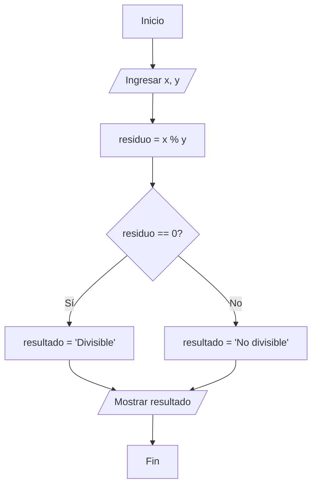
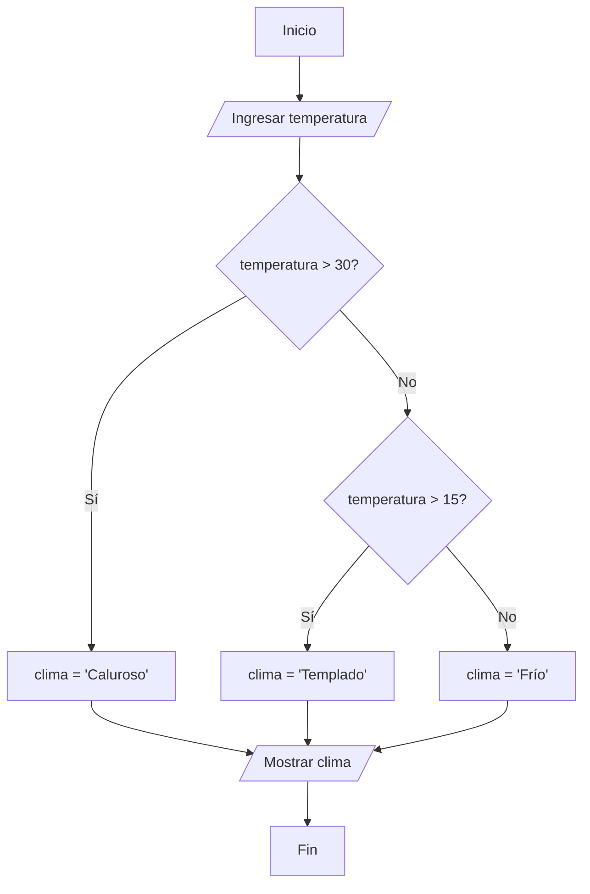

# Cuestionario Python Básico

---

## Módulo 1: Fundamentos de Programación y Algoritmos

### Pregunta 1
¿Cuál es la característica principal que define a un algoritmo?

A) Debe ser ejecutado en un computador  
B) Debe ser una secuencia finita y ordenada de pasos para resolver un problema  
C) Debe estar escrito en un lenguaje de programación específico  
D) Debe tener al menos 10 pasos para ser considerado válido  

<details>
<summary>Ver respuesta y justificación</summary>

**Respuesta correcta: B**

**Justificación:** Un algoritmo se define fundamentalmente como una secuencia de pasos finitos y ordenados diseñados para resolver un problema específico. Aunque puede implementarse en un computador, no es un requisito, y puede representarse de diversas formas (diagramas, pseudocódigo, etc.) sin estar atado a un lenguaje particular.

</details>

---

### Pregunta 2
Analizando el siguiente diagrama de flujo, ¿cuál es el valor de `resultado` si `x = 10` y `y = 3`?



A) "Divisible"  
B) "No divisible"  
C) 1  
D) 3.33  

<details>
<summary>Ver respuesta y justificación</summary>

**Respuesta correcta: B**

**Justificación:** El diagrama calcula el residuo de dividir x entre y usando el operador módulo (%). Para x=10 y y=3, 10 % 3 = 1. Como 1 es diferente de 0, la condición es falsa y el flujo se dirige a la rama "No", asignando "No divisible" a `resultado`. El diagrama de flujo ilustra cómo se utiliza una decisión lógica para determinar si un número es divisible por otro.

</details>

---

### Pregunta 3
¿Cuál de las siguientes afirmaciones sobre el pseudocódigo es correcta?

A) Es un lenguaje de programación que se puede ejecutar directamente en el computador  
B) Es una representación gráfica de un algoritmo utilizando figuras geométricas  
C) Es una descripción textual del flujo de un algoritmo que no sigue una sintaxis estricta de programación  
D) Es equivalente a un diagrama de flujo pero en formato digital  

<details>
<summary>Ver respuesta y justificación</summary>

**Respuesta correcta: C**

**Justificación:** El pseudocódigo es una representación textual de un algoritmo que utiliza un lenguaje cercano al natural (como español o inglés) y estructuras de control simples. A diferencia de los diagramas de flujo (que son gráficos), el pseudocódigo se escribe como texto pero no es directamente ejecutable como un lenguaje de programación.

</details>

---

### Pregunta 4
¿Qué símbolo se utiliza en un diagrama de flujo para representar una decisión o condición?

A) Óvalo  
B) Rectángulo  
C) Rombo  
D) Paralelogramo  

<details>
<summary>Ver respuesta y justificación</summary>

**Respuesta correcta: C**

**Justificación:** En los diagramas de flujo, el rombo es el símbolo estándar para representar decisiones o condiciones. El óvalo representa inicio/fin, el rectángulo representa procesos o cálculos, y el paralelogramo representa entrada/salida de datos. El rombo generalmente contiene una pregunta lógica que dirige el flujo hacia diferentes caminos según la respuesta.

</details>

---

### Pregunta 5
Dado el siguiente pseudocódigo, ¿cuál será el valor de `resultado`?

```
Inicio
    Leer a, b, c
    promedio = (a + b + c) / 3
    Si promedio >= 4.0 entonces
        resultado = "Aprobado"
    Sino
        resultado = "Reprobado"
    Fin Si
    Mostrar resultado
Fin
```

A) "Aprobado" si a=3.5, b=4.5, c=4.0  
B) "Reprobado" si a=4.5, b=3.0, c=5.0  
C) "Aprobado" si a=5.0, b=3.5, c=3.5  
D) "Reprobado" si a=4.0, b=4.0, c=3.0  

<details>
<summary>Ver respuesta y justificación</summary>

**Respuesta correcta: D**

**Justificación:** El pseudocódigo calcula el promedio de tres números y lo compara con 4.0. Para la opción A, promedio = (3.5 + 4.5 + 4.0)/3 = 4.0, por lo que sería "Aprobado". Para la opción B, promedio = (4.5 + 3.0 + 5.0)/3 = 4.16, sería "Aprobado". Para la opción C, promedio = (5.0 + 3.5 + 3.5)/3 = 4.0, sería "Aprobado". Para la opción D, promedio = (4.0 + 4.0 + 3.0)/3 = 3.66, que es menor que 4.0, resultando en "Reprobado".

</details>

---

### Pregunta 6
¿Cuál es el propósito principal de un diagrama de flujo?

A) Visualizar y reducir la complejidad de un algoritmo  
B) Escribir código ejecutable directamente  
C) Generar documentación automática para el programa  
D) Calcular el tiempo de ejecución de un programa  

<details>
<summary>Ver respuesta y justificación</summary>

**Respuesta correcta: A**

**Justificación:** El principal propósito de un diagrama de flujo es proporcionar una representación gráfica de los pasos de un algoritmo, lo que facilita su comprensión y reduce su complejidad al permitir visualizar el flujo de ejecución de manera clara. No es directamente ejecutable (requiere ser traducido a código), no genera documentación automática ni calcula tiempos de ejecución.

</details>

---

### Pregunta 7
Analizando el siguiente diagrama de flujo, ¿qué valor debe tener `temperatura` para que se muestre "Frío"?



A) 10  
B) 20  
C) 30  
D) 35  

<details>
<summary>Ver respuesta y justificación</summary>

**Respuesta correcta: A**

**Justificación:** Para que la salida sea "Frío", la temperatura debe ser 15 o menos. Las condiciones se evalúan en orden: primero se verifica si temperatura > 30 (sería "Caluroso"), luego si temperatura > 15 (sería "Templado"), y finalmente, si ninguna de estas condiciones se cumple, el flujo va a "Frío". De las opciones, solo 10 es menor o igual a 15. 20 daría "Templado", 30 también daría "Templado" (ya que 30 no es mayor que 30), y 35 daría "Caluroso".

</details>

---

### Pregunta 8
¿Cuál de los siguientes elementos NO es un símbolo estándar en los diagramas de flujo?

A) Óvalo para inicio/fin  
B) Rectángulo para procesos  
C) Círculo para decisiones  
D) Paralelogramo para entrada/salida  

<details>
<summary>Ver respuesta y justificación</summary>

**Respuesta correcta: C**

**Justificación:** El símbolo estándar para decisiones en los diagramas de flujo es el rombo, no el círculo. Los círculos pueden usarse como conectores en diagramas de flujo complejos, pero no son el símbolo principal para decisiones. El óvalo (inicio/fin), el rectángulo (procesos) y el paralelogramo (entrada/salida) son símbolos estándar correctos.

</details>

---

### Pregunta 9
¿Qué representa un rectángulo en un diagrama de flujo?

A) Una decisión lógica  
B) El inicio del programa  
C) Un proceso o cálculo  
D) La entrada o salida de datos  

<details>
<summary>Ver respuesta y justificación</summary>

**Respuesta correcta: C**

**Justificación:** En los diagramas de flujo, el rectángulo se utiliza para representar procesos o cálculos. Contiene las instrucciones que transforman los datos de entrada en salidas, como operaciones matemáticas o asignaciones. El rombo representa decisiones, el óvalo representa inicio/fin, y el paralelogramo representa entrada/salida.

</details>

---

### Pregunta 10
¿Cuál de las siguientes opciones describe correctamente un ciclo en un diagrama de flujo?

A) Una flecha que conecta símbolos de manera lineal  
B) Una ramificación que vuelve a un punto anterior del flujo  
C) Un símbolo rectangular que contiene una operación matemática  
D) Un paralelogramo que muestra datos de entrada  

<details>
<summary>Ver respuesta y justificación</summary>

**Respuesta correcta: B**

**Justificación:** Un ciclo en un diagrama de flujo se representa cuando el flujo de ejecución vuelve a un punto anterior, permitiendo que un conjunto de instrucciones se ejecute repetidamente hasta que se cumpla una condición de salida. Las flechas lineales representan secuencia, los rectángulos contienen procesos, y los paralelogramos son para entrada/salida.

</details>

---

## Módulo 2: Introducción a Python - Sintaxis Básica

### Pregunta 11
¿Qué imprime el siguiente código?

```python
print(type(3.0 + 2))
```

A) `<class 'int'>`  
B) `<class 'float'>`  
C) `<class 'str'>`  
D) `<class 'bool'>`  

<details>
<summary>Ver respuesta y justificación</summary>

**Respuesta correcta: B**

**Justificación:** En Python, cuando se realiza una operación entre un entero (`int`) y un decimal (`float`), el resultado se convierte automáticamente a `float` (decimal). La operación 3.0 + 2 = 5.0, que es un número decimal, por lo que `type()` retorna `<class 'float'>`. Esto demuestra la promoción de tipos en Python, donde el resultado de una operación adopta el tipo más preciso.

</details>

---

### Pregunta 12
¿Cuál de las siguientes opciones es una variable válida en Python?

A) `2variable`  
B) `mi-variable`  
C) `mi_variable`  
D) `variable 2`  

<details>
<summary>Ver respuesta y justificación</summary>

**Respuesta correcta: C**

**Justificación:** En Python, los nombres de variables deben comenzar con una letra o guión bajo, no pueden comenzar con un número ni contener espacios o guiones. `mi_variable` sigue la convención snake_case, que es la recomendada en Python. Las opciones A (`2variable`), B (`mi-variable`) y D (`variable 2`) son inválidas por comenzar con número, contener guión y contener espacio respectivamente.

</details>

---

### Pregunta 13
¿Cuál es el resultado de la siguiente expresión?

```python
5 * 2 + 3 ** 2 - 1
```

A) 18  
B) 25  
C) 22  
D) 20  

<details>
<summary>Ver respuesta y justificación</summary>

**Respuesta correcta: A**

**Justificación:** Según la precedencia de operadores en Python, las potencias (`**`) se resuelven primero, luego las multiplicaciones y divisiones, y finalmente las sumas y restas. El cálculo sería: 3 ** 2 = 9, luego 5 * 2 = 10, finalmente 10 + 9 - 1 = 18. Es importante recordar que la precedencia puede modificarse con paréntesis, pero en este caso no los hay.

</details>

---

### Pregunta 14
¿Qué imprime el siguiente código?

```python
nombre = "Carlos"
apellido = "García"
print(nombre + " " + apellido)
```

A) "CarlosGarcía"  
B) "Carlos García"  
C) "Carlos - García"  
D) "Carlos"  

<details>
<summary>Ver respuesta y justificación</summary>

**Respuesta correcta: B**

**Justificación:** El código utiliza el operador `+` para concatenar strings. `nombre + " " + apellido` combina el primer nombre, un espacio y el apellido, resultando en "Carlos García". Es importante notar que el espacio entre las comillas (`" "`) es un string que contiene un solo espacio, que es lo que separa las palabras.

</details>

---

### Pregunta 15
¿Cuál es la forma correcta de obtener el tipo de dato de una variable en Python?

A) `tipo(variable)`  
B) `type(variable)`  
C) `typeof(variable)`  
D) `getType(variable)`  

<details>
<summary>Ver respuesta y justificación</summary>

**Respuesta correcta: B**

**Justificación:** En Python, la función nativa para obtener el tipo de dato de una variable es `type()`. Las otras opciones corresponden a funciones de otros lenguajes: `typeof()` es de JavaScript, `tipo()` no existe en Python, y `getType()` es común en otros lenguajes como Java.

</details>

---

### Pregunta 16
¿Qué imprime el siguiente código?

```python
x = 5
y = 2.0
print(x / y)
print(x // y)
```

A) 2.5 y 2.0  
B) 2.5 y 2.5  
C) 2 y 2  
D) 2.5 y 2  

<details>
<summary>Ver respuesta y justificación</summary>

**Respuesta correcta: A**

**Justificación:** La división normal (`/`) siempre devuelve un valor `float`, por lo que 5 / 2.0 = 2.5. La división entera (`//`) devuelve el cociente entero de la división, truncando la parte decimal, y como se opera con un número decimal, el resultado también es un `float`: 5 // 2.0 = 2.0. Esto muestra la diferencia entre ambos tipos de división en Python.

</details>

---

### Pregunta 17
¿Cuál de las siguientes opciones muestra correctamente cómo usar `input()` para obtener un número entero?

A) `numero = int(input("Ingresa un número: "))`  
B) `numero = input(int("Ingresa un número: "))`  
C) `numero = input("Ingresa un número: ").int()`  
D) `numero = input("Ingresa un número: ")`  

<details>
<summary>Ver respuesta y justificación</summary>

**Respuesta correcta: A**

**Justificación:** `input()` siempre retorna un string. Para convertir este string a un número entero, se debe envolver con la función `int()`. La opción A hace esto correctamente: primero recibe el input como string y luego lo convierte a entero. Las otras opciones intentan convertir el mensaje o usar métodos incorrectos.

</details>

---

### Pregunta 18
¿Qué se imprime al ejecutar el siguiente código?

```python
mensaje = "Python es increíble"
print(mensaje.upper())
print(mensaje.lower())
print(mensaje)
```

A) "PYTHON ES INCREÍBLE", "python es increíble", "PYTHON ES INCREÍBLE"  
B) "PYTHON ES INCREÍBLE", "python es increíble", "Python es increíble"  
C) "python es increíble", "PYTHON ES INCREÍBLE", "Python es increíble"  
D) "Python es increíble", "PYTHON ES INCREÍBLE", "python es increíble"  

<details>
<summary>Ver respuesta y justificación</summary>

**Respuesta correcta: B**

**Justificación:** Los métodos `upper()` y `lower()` retornan nuevos strings sin modificar el original, ya que los strings en Python son inmutables. El primer `print()` muestra el mensaje en mayúsculas, el segundo en minúsculas, y el tercero muestra el string original sin cambios. Esto demuestra que los métodos de strings no modifican el objeto original sino que crean una nueva copia transformada.

</details>

---

### Pregunta 19
¿Cuál es la salida del siguiente código?

```python
numero = "15"
print(numero * 3)
```

A) 45  
B) 15  
C) "151515"  
D) 150  

<details>
<summary>Ver respuesta y justificación</summary>

**Respuesta correcta: C**

**Justificación:** El operador `*` aplicado a un string realiza la repetición (duplicación) del mismo. Como `numero` es un string ("15"), multiplicarlo por 3 produce "151515". Si `numero` hubiera sido un entero (15), el resultado habría sido 45. Es importante diferenciar entre strings y números, ya que Python trata estas operaciones de manera diferente.

</details>

---

### Pregunta 20
¿Cuál de las siguientes opciones es un comentario válido de múltiples líneas en Python?

A) 
```python
// Comentario
// de múltiples
// líneas
```

B) 
```python
/* Comentario
   de múltiples
   líneas */
```

C) 
```python
"""
Comentario
de múltiples
líneas
"""
```

D) 
```python
# Comentario
# de múltiples
# líneas
```

<details>
<summary>Ver respuesta y justificación</summary>

**Respuesta correcta: C**

**Justificación:** En Python, los comentarios de múltiples líneas se pueden crear utilizando tres comillas dobles (`"""`) o tres comillas simples (`'''`). Aunque también se pueden usar múltiples `#` (opción D), es técnicamente un comentario de una línea repetido, no un comentario de múltiples líneas en sentido estricto. Las opciones A y B son sintaxis de otros lenguajes (JavaScript, C++).

</details>

---

### Pregunta 21
¿Qué imprime el siguiente código?

```python
a = 10
b = 3
print(a % b)
print(a / b)
```

A) 3 y 3.33  
B) 1 y 3.33  
C) 1 y 3  
D) 3 y 3.33  

<details>
<summary>Ver respuesta y justificación</summary>

**Respuesta correcta: B**

**Justificación:** El operador `%` (módulo) devuelve el residuo de la división: 10 % 3 = 1 (ya que 3*3 = 9 y 10-9 = 1). La división normal `/` devuelve el cociente con decimales: 10 / 3 = 3.333... . La opción muestra ambos resultados correctamente, demostrando la diferencia entre el operador módulo y la división normal.

</details>

---

### Pregunta 22
¿Cuál es la forma correcta de usar la interpolación con f-strings en Python?

A) `print("Mi nombre es {nombre}".format(nombre))`  
B) `print(f"Mi nombre es {nombre}")`  
C) `print("Mi nombre es " + nombre)`  
D) `print("Mi nombre es %s" % nombre)`  

<details>
<summary>Ver respuesta y justificación</summary>

**Respuesta correcta: B**

**Justificación:** Los f-strings (cadenas f) son la forma más moderna y recomendada de interpolación en Python. Se crean anteponiendo una `f` antes del string y usando llaves `{}` para insertar variables. Aunque las otras opciones son válidas (A: `.format()`, C: concatenación, D: formato con `%`), la sintaxis de f-strings es más legible y eficiente.

</details>

---

### Pregunta 23
¿Qué imprime el siguiente código?

```python
print(3 * "ab")
print("3" + "3")
```

A) "ababab" y "6"  
B) "ababab" y "33"  
C) "ab" y "33"  
D) "ab" y "6"  

<details>
<summary>Ver respuesta y justificación</summary>

**Respuesta correcta: B**

**Justificación:** El operador `*` aplicado a un string lo repite: 3 * "ab" = "ababab". El operador `+` aplicado a strings los concatena: "3" + "3" = "33" (no los suma como números). Esto muestra la diferencia entre operaciones aritméticas y operaciones con strings, donde la multiplicación repite y la suma concatena.

</details>

---

### Pregunta 24
¿Cuál de las siguientes operaciones es válida en Python?

A) `"10" + 5`  
B) `10 + "5"`  
C) `10 * "5"`  
D) `"10" - 5`  

<details>
<summary>Ver respuesta y justificación</summary>

**Respuesta correcta: C**

**Justificación:** En Python, la multiplicación de un entero por un string es válida y repite el string el número de veces especificado: 10 * "5" = "5555555555". Las operaciones de suma y resta entre strings y números no son válidas (opciones A, B, D), ya que Python no permite mezclar tipos de datos de manera incompatible.

</details>

---

## Módulo 3: Estructuras de Datos

### Pregunta 25
¿Cuál es el resultado del siguiente código con listas?

```python
lista = [1, 2, 3, 4, 5]
lista[1:4] = []
print(lista)
```

A) `[1, 5]`  
B) `[1, 2, 3, 4, 5]`  
C) `[1]`  
D) `[1, 5]`  

<details>
<summary>Ver respuesta y justificación</summary>

**Respuesta correcta: A**

**Justificación:** El slicing `lista[1:4]` selecciona los elementos en las posiciones 1, 2 y 3 (que son 2, 3, 4). Al asignarle `[]`, se eliminan estos tres elementos de la lista, quedando solo el primer elemento (1) y el último (5). Esto muestra cómo el slicing puede utilizarse para eliminar elementos de una lista.

</details>

---

### Pregunta 26
¿Cuál de los siguientes métodos agrega un elemento en una posición específica de una lista?

A) `append()`  
B) `insert()`  
C) `add()`  
D) `push()`  

<details>
<summary>Ver respuesta y justificación</summary>

**Respuesta correcta: B**

**Justificación:** El método `insert(posición, elemento)` agrega un elemento en la posición especificada, desplazando los elementos posteriores. `append()` agrega al final de la lista, `add()` es para conjuntos (sets), y `push()` no es un método de listas en Python (es común en pilas de otros lenguajes).

</details>

---

### Pregunta 27
¿Qué imprime el siguiente código?

```python
mi_tupla = (1, 2, 3, 4)
a, b, c, d = mi_tupla
print(a * b + c - d)
```

A) 5  
B) 1  
C) 3  
D) 2  

<details>
<summary>Ver respuesta y justificación</summary>

**Respuesta correcta: B**

**Justificación:** El código desempaqueta la tupla en las variables a=1, b=2, c=3, d=4. La expresión a * b + c - d = 1 * 2 + 3 - 4 = 2 + 3 - 4 = 1. Este ejemplo demuestra cómo se puede desempaquetar una tupla y usar los valores en operaciones matemáticas.

</details>

---

### Pregunta 28
¿Cuál es la diferencia principal entre un set y una lista en Python?

A) Los sets son mutables, las listas son inmutables  
B) Los sets no permiten elementos duplicados, las listas sí  
C) Los sets son ordenados, las listas son desordenadas  
D) Los sets solo pueden contener números  

<details>
<summary>Ver respuesta y justificación</summary>

**Respuesta correcta: B**

**Justificación:** La principal diferencia es que los sets (conjuntos) no permiten elementos duplicados, mientras que las listas sí. Además, los sets son desordenados (no mantienen un orden de inserción como las listas). Tanto sets como listas son mutables. Los sets pueden contener cualquier tipo de dato hashable.

</details>

---

### Pregunta 29
¿Qué imprime el siguiente código con diccionarios?

```python
d = {"a": 1, "b": 2, "c": 3}
print(d.get("d", 0))
```

A) 0  
B) None  
C) Error  
D) "d"  

<details>
<summary>Ver respuesta y justificación</summary>

**Respuesta correcta: A**

**Justificación:** El método `get()` en diccionarios intenta obtener el valor asociado a la clave. Si la clave no existe, retorna el valor predeterminado especificado (en este caso 0) en lugar de lanzar un error. Como "d" no está en el diccionario, se retorna 0, lo que demuestra una forma segura de acceder a elementos de un diccionario.

</details>

---

### Pregunta 30
¿Cuál de las siguientes operaciones es válida para un set en Python?

A) `mi_set.append(4)`  
B) `mi_set.add(4)`  
C) `mi_set.insert(0, 4)`  
D) `mi_set.push(4)`  

<details>
<summary>Ver respuesta y justificación</summary>

**Respuesta correcta: B**

**Justificación:** El método para agregar elementos a un set es `add()`. Los sets no tienen orden, por lo que métodos como `append()`, `insert()` o `push()` (que dependen de una posición o del orden) no son aplicables. `append()` es para listas, `insert()` para listas, y `push()` no es un método estándar en Python para sets.

</details>

---

### Pregunta 31
¿Qué imprime el siguiente código?

```python
lista = [10, 20, 30, 40, 50]
print(lista[-3])
```

A) 20  
B) 30  
C) 40  
D) 10  

<details>
<summary>Ver respuesta y justificación</summary>

**Respuesta correcta: B**

**Justificación:** Los índices negativos en Python permiten acceder a los elementos desde el final de la lista. `-1` es el último elemento, `-2` el penúltimo, y `-3` es el tercero desde el final. En la lista [10, 20, 30, 40, 50], el elemento en la posición -3 es 30. Esto demuestra la flexibilidad de Python para acceder a elementos desde el final de una secuencia.

</details>

---

### Pregunta 32
¿Cuál de las siguientes opciones es la forma correcta de crear un diccionario vacío?

A) `d = {}`  
B) `d = []`  
C) `d = ()`  
D) `d = set()`  

<details>
<summary>Ver respuesta y justificación</summary>

**Respuesta correcta: A**

**Justificación:** En Python, un diccionario vacío se crea con `{}`. La opción B crea una lista vacía (`[]`), la C crea una tupla vacía (`()`), y la D crea un set vacío (`set()`). Es importante conocer estas diferencias ya que son estructuras de datos fundamentalmente diferentes.

</details>

---

### Pregunta 33
¿Qué imprime el siguiente código?

```python
a = [1, 2, 3, 4, 5]
b = a[:3]
b.append(10)
print(a)
print(b)
```

A) `[1, 2, 3, 4, 5]` y `[1, 2, 3, 10]`  
B) `[1, 2, 3, 4, 5, 10]` y `[1, 2, 3, 10]`  
C) `[1, 2, 3, 4, 5]` y `[1, 2, 3, 4, 5, 10]`  
D) `[1, 2, 3, 10]` y `[1, 2, 3, 4, 5]`  

<details>
<summary>Ver respuesta y justificación</summary>

**Respuesta correcta: A**

**Justificación:** El slicing `a[:3]` crea una copia superficial de los primeros 3 elementos de `a`. `b` es una nueva lista independiente, por lo que modificar `b` (agregando 10) no afecta a `a`. Esto demuestra la diferencia entre una asignación directa (que copia la referencia) y el slicing (que crea una nueva lista). `a` permanece sin cambios mientras `b` se modifica.

</details>

---

### Pregunta 34
¿Cuál de los siguientes métodos elimina el último elemento de una lista y lo retorna?

A) `remove()`  
B) `pop()`  
C) `delete()`  
D) `discard()`  

<details>
<summary>Ver respuesta y justificación</summary>

**Respuesta correcta: B**

**Justificación:** El método `pop()` elimina el último elemento de una lista (o un elemento en una posición específica si se especifica) y lo retorna. `remove()` elimina la primera ocurrencia de un valor específico pero no retorna nada. `delete` no es un método de listas, y `discard()` es para sets.

</details>

---

### Pregunta 35
¿Qué imprime el siguiente código?

```python
d1 = {"a": 1, "b": 2}
d2 = {"b": 3, "c": 4}
d1.update(d2)
print(d1)
```

A) `{"a": 1, "b": 3, "c": 4}`  
B) `{"a": 1, "b": 2, "c": 4}`  
C) `{"b": 3, "c": 4}`  
D) `{"a": 1, "b": 2}`  

<details>
<summary>Ver respuesta y justificación</summary>

**Respuesta correcta: A**

**Justificación:** El método `update()` fusiona dos diccionarios. Cuando hay claves duplicadas (como "b"), el valor del segundo diccionario sobreescribe al del primero. Por lo tanto, el diccionario resultante mantiene la clave "a" de d1, actualiza "b" al valor de d2, y agrega la nueva clave "c" de d2. Esto muestra cómo se manejan las colisiones al fusionar diccionarios.

</details>

---

### Pregunta 36
¿Cuál de las siguientes afirmaciones sobre las tuplas es correcta?

A) Las tuplas pueden modificarse después de ser creadas  
B) Las tuplas son más lentas que las listas para iterar  
C) Las tuplas pueden usarse como claves en diccionarios  
D) Las tuplas no pueden contener elementos de diferentes tipos  

<details>
<summary>Ver respuesta y justificación</summary>

**Respuesta correcta: C**

**Justificación:** Las tuplas son inmutables, lo que las hace hashables y por lo tanto pueden usarse como claves en diccionarios (a diferencia de las listas, que son mutables). Aunque son inmutables, son más rápidas que las listas para iterar, pueden contener elementos de diferentes tipos, y no pueden modificarse después de creadas.

</details>

---

### Pregunta 37
¿Qué imprime el siguiente código?

```python
frutas = ["manzana", "banana", "naranja", "manzana"]
print(len(set(frutas)))
```

A) 4  
B) 3  
C) 2  
D) 1  

<details>
<summary>Ver respuesta y justificación</summary>

**Respuesta correcta: B**

**Justificación:** El set elimina los elementos duplicados. La lista tiene 4 elementos, pero "manzana" aparece dos veces. Al convertirlo a set, los valores únicos son {"manzana", "banana", "naranja"}, que tienen un tamaño de 3. La función `len()` entonces retorna 3, lo que demuestra cómo los sets pueden usarse para contar elementos únicos.

</details>

---

### Pregunta 38
¿Cuál de los siguientes métodos retorna todas las claves de un diccionario?

A) `diccionario.values()`  
B) `diccionario.items()`  
C) `diccionario.keys()`  
D) `diccionario.get()`  

<details>
<summary>Ver respuesta y justificación</summary>

**Respuesta correcta: C**

**Justificación:** El método `keys()` retorna una vista de todas las claves de un diccionario. `values()` retorna los valores, `items()` retorna pares clave-valor, y `get()` retorna el valor asociado a una clave específica (o un valor por defecto). Cada método sirve para un propósito diferente en la iteración y manejo de diccionarios.

</details>

---

### Pregunta 39
¿Qué imprime el siguiente código?

```python
lista = [1, 2, 3]
tupla = (1, 2, 3)
lista[1] = 10
# tupla[1] = 10  # Esta línea está comentada
print(lista)
print(tupla)
```

A) `[10, 2, 3]` y `(1, 2, 3)`  
B) `[1, 10, 3]` y `(1, 2, 3)`  
C) `[1, 2, 3]` y `(10, 2, 3)`  
D) `[1, 10, 3]` y `(10, 2, 3)`  

<details>
<summary>Ver respuesta y justificación</summary>

**Respuesta correcta: B**

**Justificación:** Las listas son mutables, por lo que se puede modificar un elemento en una posición específica (`lista[1] = 10`). Las tuplas son inmutables, por lo que la línea `tupla[1] = 10` (que está comentada) lanzaría un error. La tupla permanece sin cambios. Esto demuestra la diferencia fundamental entre listas mutables y tuplas inmutables.

</details>

---

### Pregunta 40
¿Cuál es la salida del siguiente código?

```python
d = {"a": 1, "b": 2, "c": 3}
print(d.pop("b"))
print(d)
```

A) 2 y `{"a": 1, "c": 3}`  
B) 2 y `{"a": 1, "b": 2, "c": 3}`  
C) Error  
D) 1 y `{"b": 2, "c": 3}`  

<details>
<summary>Ver respuesta y justificación</summary>

**Respuesta correcta: A**

**Justificación:** El método `pop()` en diccionarios elimina la clave especificada y retorna su valor. En este caso, pop("b") elimina la clave "b" con valor 2 y retorna 2. El diccionario resultante ya no contiene la clave "b". Esto muestra cómo `pop()` permite obtener y eliminar elementos en una sola operación.

</details>

---

### Pregunta 41
¿Qué imprime el siguiente código?

```python
lista = [3, 1, 4, 1, 5, 9, 2]
lista.sort()
print(lista)
```

A) `[1, 1, 2, 3, 4, 5, 9]`  
B) `[9, 5, 4, 3, 2, 1, 1]`  
C) `[3, 1, 4, 1, 5, 9, 2]`  
D) `[1, 2, 3, 4, 5, 9]`  

<details>
<summary>Ver respuesta y justificación</summary>

**Respuesta correcta: A**

**Justificación:** El método `sort()` ordena la lista in-place (modifica la lista original) en orden ascendente. La lista original [3, 1, 4, 1, 5, 9, 2] se convierte en [1, 1, 2, 3, 4, 5, 9]. Es importante notar que sort modifica la lista original y retorna None, a diferencia de `sorted()` que retorna una nueva lista.

</details>

---

### Pregunta 42
¿Cuál de las siguientes afirmaciones sobre los diccionarios es correcta?

A) Los diccionarios mantienen el orden de inserción desde Python 3.7  
B) Las claves de un diccionario deben ser strings  
C) Los diccionarios no pueden contener listas como valores  
D) Los diccionarios son estructuras de datos inmutables  

<details>
<summary>Ver respuesta y justificación</summary>

**Respuesta correcta: A**

**Justificación:** Desde Python 3.7, los diccionarios preservan el orden de inserción de las claves. Las claves no están limitadas a strings (pueden ser números, tuplas, etc.), los valores pueden ser de cualquier tipo incluyendo listas, y los diccionarios son mutables. Esta característica de preservar el orden es importante para aplicaciones que dependen del orden de los elementos en un diccionario.

</details>

---

## Módulo 4: Control de Flujo - Condicionales

### Pregunta 43
¿Cuál es el resultado del siguiente código?

```python
x = 15
y = 10
if x > y:
    print("Mayor")
else:
    print("Menor o igual")
if x == y:
    print("Igual")
```

A) "Mayor"  
B) "Menor o igual" y "Igual"  
C) "Mayor" e "Igual"  
D) "Mayor" y "Igual"  

<details>
<summary>Ver respuesta y justificación</summary>

**Respuesta correcta: D**

**Justificación:** El código tiene dos estructuras condicionales independientes. La primera verifica si x > y (15 > 10 es verdadero), por lo que imprime "Mayor". La segunda es un if independiente que verifica si x == y (15 == 10 es falso), por lo que no imprime "Igual". El resultado final es solo "Mayor". Es importante notar que los ifs son independientes y no excluyentes.

</details>

---

### Pregunta 44
¿Cuál de las siguientes expresiones evalúa correctamente si un número está entre 10 y 20 (inclusive)?

A) `10 <= numero <= 20`  
B) `numero >= 10 and numero <= 20`  
C) `numero in range(10, 21)`  
D) Todas las anteriores  

<details>
<summary>Ver respuesta y justificación</summary>

**Respuesta correcta: D**

**Justificación:** Todas las opciones son válidas en Python. La opción A usa la sintaxis de comparación encadenada, la B usa `and` para combinar condiciones, y la C usa `in` con un rango. Cada enfoque tiene sus usos: la comparación encadenada es más legible, `and` es más explícito, y `range` es útil para verificar pertenencia a un conjunto de números. Todas son correctas para el rango inclusivo de 10 a 20.

</details>

---

### Pregunta 45
¿Qué imprime el siguiente código?

```python
edad = 25
if edad < 18:
    print("Menor de edad")
elif edad < 65:
    print("Adulto")
else:
    print("Jubilado")
```

A) "Menor de edad"  
B) "Adulto"  
C) "Jubilado"  
D) Error  

<details>
<summary>Ver respuesta y justificación</summary>

**Respuesta correcta: B**

**Justificación:** La estructura `if-elif-else` evalúa las condiciones en orden. Para edad=25, la primera condición (edad < 18) es falsa. La segunda condición (edad < 65) es verdadera, por lo que se ejecuta ese bloque e imprime "Adulto". La estructura `elif` permite encadenar condiciones mutuamente excluyentes.

</details>

---

### Pregunta 46
¿Cuál es el resultado de la siguiente prueba lógica?

```python
not (5 > 3 and 2 < 1)
```

A) True  
B) False  
C) Error  
D) None  

<details>
<summary>Ver respuesta y justificación</summary>

**Respuesta correcta: A**

**Justificación:** Primero se evalúa la expresión dentro de los paréntesis: 5 > 3 es True, 2 < 1 es False. True and False = False. Luego, el operador `not` invierte este resultado: not False = True. Esto demuestra la aplicación de operadores lógicos y de negación en Python.

</details>

---

### Pregunta 47
¿Qué imprime el siguiente código?

```python
x = 7
if x % 2 == 0:
    print("Par")
else:
    print("Impar")
if x % 3 == 0:
    print("Múltiplo de 3")
```

A) "Impar" y "Múltiplo de 3"  
B) "Par" y "Múltiplo de 3"  
C) "Impar" y "Par"  
D) "Impar"  

<details>
<summary>Ver respuesta y justificación</summary>

**Respuesta correcta: D**

**Justificación:** Para x=7, 7 % 2 = 1 (no es par), por lo que se imprime "Impar". El segundo if es independiente: 7 % 3 = 1 (no es múltiplo de 3), por lo que NO se imprime "Múltiplo de 3". Es crucial entender que los ifs son independientes a menos que se usen en estructura `if-elif-else`.

</details>

---

### Pregunta 48
¿Cuál de las siguientes opciones muestra la sintaxis correcta para un if con múltiples condiciones?

A) 
```python
if (x > 5) and (y < 10):
    print("OK")
```

B) 
```python
if x > 5 and y < 10:
    print("OK")
```

C) 
```python
if x > 5 && y < 10:
    print("OK")
```

D) A y B son correctas  

<details>
<summary>Ver respuesta y justificación</summary>

**Respuesta correcta: D**

**Justificación:** En Python, las condiciones compuestas pueden escribirse con o sin paréntesis alrededor de las subcondiciones (opciones A y B). Ambos son sintácticamente correctos. La opción C usa `&&`, que es la sintaxis de otros lenguajes como Java o JavaScript, pero no es válida en Python (donde se usa `and`). Esto muestra la flexibilidad sintáctica de Python para condiciones compuestas.

</details>

---

### Pregunta 49
¿Cuál es el resultado de este código?

```python
valor = 10
if valor > 5:
    resultado = "Alto"
elif valor > 15:
    resultado = "Muy alto"
else:
    resultado = "Bajo"
print(resultado)
```

A) "Alto"  
B) "Muy alto"  
C) "Bajo"  
D) Error  

<details>
<summary>Ver respuesta y justificación</summary>

**Respuesta correcta: A**

**Justificación:** Aunque valor=10 no cumple la segunda condición (10 > 15 es falso), ya ha cumplido la primera condición (10 > 5 es verdadero), por lo que la estructura `if-elif-else` ejecuta el bloque del primer `if` y sale, sin evaluar las condiciones siguientes. Esto demuestra el comportamiento de cortocircuito de las estructuras condicionales.

</details>

---

### Pregunta 50
¿Qué imprime el siguiente código?

```python
x = 4
y = 6
print(x < y and x != 4)
```

A) True  
B) False  
C) Error  
D) None  

<details>
<summary>Ver respuesta y justificación</summary>

**Respuesta correcta: B**

**Justificación:** La expresión x < y es verdadera (4 < 6). La expresión x != 4 es falsa (4 no es diferente de 4). True and False = False. Esto muestra que `and` requiere que ambas condiciones sean verdaderas para retornar True. Es un ejemplo común de evaluación de expresiones booleanas compuestas.

</details>

---

### Pregunta 51
¿Cuál es el resultado de este código?

```python
puntaje = 85
if puntaje >= 90:
    nota = "A"
elif puntaje >= 80:
    nota = "B"
elif puntaje >= 70:
    nota = "C"
else:
    nota = "F"
print(nota)
```

A) "A"  
B) "B"  
C) "C"  
D) "F"  

<details>
<summary>Ver respuesta y justificación</summary>

**Respuesta correcta: B**

**Justificación:** La estructura evalúa las condiciones en orden. Para puntaje=85, la primera condición (>= 90) es falsa. La segunda condición (>= 80) es verdadera, por lo que se asigna "B" y se sale de la estructura sin evaluar las condiciones siguientes. Esto muestra cómo `elif` permite categorizar valores en rangos.

</details>

---

### Pregunta 52
¿Cuál de las siguientes expresiones es equivalente a `not (x > 0 and y > 0)`?

A) `x <= 0 or y <= 0`  
B) `x <= 0 and y <= 0`  
C) `x > 0 or y > 0`  
D) `x <= 0 and y > 0`  

<details>
<summary>Ver respuesta y justificación</summary>

**Respuesta correcta: A**

**Justificación:** Aplicando las leyes de De Morgan, la negación de una conjunción (AND) es la disyunción (OR) de las negaciones. `not (x > 0 and y > 0)` es equivalente a `not (x > 0) or not (y > 0)`, que a su vez es `x <= 0 or y <= 0`. Esto demuestra la aplicación de lógica proposicional en la evaluación de condiciones.

</details>

---

## Módulo 5: Control de Flujo - Bucles

### Pregunta 53
¿Cuál es el número total de iteraciones en el siguiente código?

```python
contador = 0
for i in range(3):
    for j in range(4):
        contador += 1
print(contador)
```

A) 7  
B) 12  
C) 3  
D) 4  

<details>
<summary>Ver respuesta y justificación</summary>

**Respuesta correcta: B**

**Justificación:** El código tiene bucles anidados: el bucle externo itera 3 veces y el interno itera 4 veces por cada iteración del externo. El número total de iteraciones es 3 * 4 = 12. Esto demuestra cómo se multiplican las iteraciones en bucles anidados, lo que aumenta la complejidad computacional.

</details>

---

### Pregunta 54
¿Qué imprime el siguiente código?

```python
i = 0
while i < 5:
    i += 1
    if i == 3:
        continue
    print(i, end=" ")
```

A) `1 2 4 5`  
B) `1 2 3 4 5`  
C) `1 2 4 5 6`  
D) `2 3 4 5`  

<details>
<summary>Ver respuesta y justificación</summary>

**Respuesta correcta: A**

**Justificación:** El bucle `while` itera mientras i < 5. El `continue` salta la iteración actual cuando i es igual a 3, por lo que no se imprime el 3. El incremento i += 1 se ejecuta al inicio de cada iteración, por lo que los valores de i son 1, 2, 3, 4, 5. Cuando i=3, se salta el print, resultando en 1, 2, 4, 5. Esto muestra cómo `continue` afecta el flujo dentro de un bucle.

</details>

---

### Pregunta 55
¿Cuál de las siguientes opciones crea una lista con los números pares del 0 al 10?

A) `[x for x in range(11) if x % 2 == 0]`  
B) `[x for x in range(11) if x % 2 != 0]`  
C) `[x if x % 2 == 0 for x in range(11)]`  
D) `[x for x in range(0, 11, 2)]`  

<details>
<summary>Ver respuesta y justificación</summary>

**Respuesta correcta: D**

**Justificación:** La opción D utiliza el tercer argumento de `range()` (el paso) para generar directamente solo números pares del 0 al 10. La opción A también sería correcta, pero usa un filtro con `if` que es menos eficiente. La opción B genera números impares, la C tiene sintaxis incorrecta. Esto muestra diferentes formas de generar secuencias con list comprehensions y el parámetro `step` en `range()`.

</details>

---

### Pregunta 56
¿Cuál es el valor de `resultado` después de ejecutar este código?

```python
resultado = 0
for i in range(1, 6):
    resultado += i * 2
print(resultado)
```

A) 15  
B) 30  
C) 20  
D) 25  

<details>
<summary>Ver respuesta y justificación</summary>

**Respuesta correcta: B**

**Justificación:** El bucle itera con i=1, 2, 3, 4, 5. En cada iteración, se multiplica i por 2 y se suma al acumulador `resultado`. El cálculo es: (1*2) + (2*2) + (3*2) + (4*2) + (5*2) = 2 + 4 + 6 + 8 + 10 = 30. Esto muestra cómo se pueden usar contadores y acumuladores en bucles.

</details>

---

### Pregunta 57
¿Cuál es la salida del siguiente código?

```python
palabra = "Python"
for letra in palabra:
    print(letra, end="-")
```

A) `P-y-t-h-o-n-`  
B) `P-y-t-h-o-n`  
C) `P y t h o n`  
D) `Python`  

<details>
<summary>Ver respuesta y justificación</summary>

**Respuesta correcta: A**

**Justificación:** El bucle `for` itera sobre cada carácter del string "Python", imprimiendo cada letra seguida de un guión debido al parámetro `end="-"` en `print()`. Después de la última letra, también se imprime un guión porque `print()` imprime el carácter, luego el parámetro `end` que es "-". Esto muestra cómo los strings son iterables en Python y cómo usar `end` para controlar el formato de salida.

</details>

---

### Pregunta 58
¿Qué hace el siguiente código?

```python
for i in range(10):
    if i > 5:
        break
    print(i, end=" ")
```

A) Imprime 0 1 2 3 4 5  
B) Imprime 0 1 2 3 4 5 6 7 8 9  
C) Imprime 6 7 8 9  
D) Imprime 0 1 2 3 4 5 6  

<details>
<summary>Ver respuesta y justificación</summary>

**Respuesta correcta: A**

**Justificación:** El bucle `for` itera sobre el rango de 0 a 9. Cuando `i` es mayor que 5, la sentencia `break` termina el bucle inmediatamente, sin procesar más valores. Por lo tanto, solo se imprimen los valores 0, 1, 2, 3, 4, 5. Esto demuestra cómo `break` permite salir anticipadamente de un bucle cuando se cumple una condición.

</details>

---

### Pregunta 59
¿Cuál es el resultado de este código con un ciclo anidado?

```python
for i in range(3):
    for j in range(2):
        if i == j:
            continue
        print(i, j)
```

A) 0 1, 1 0, 2 0, 2 1  
B) 1 0, 2 0, 2 1  
C) 0 1, 1 0  
D) 0 0, 0 1, 1 0, 1 1, 2 0, 2 1  

<details>
<summary>Ver respuesta y justificación</summary>

**Respuesta correcta: A**

**Justificación:** Los bucles anidados generan todas las combinaciones de i (0,1,2) y j (0,1). El `continue` salta cuando i == j. Por lo tanto, se omiten los pares (0,0), (1,1) y no hay (2,2) porque j solo llega a 1. Los pares resultantes son: (0,1), (1,0), (2,0), (2,1). Esto muestra cómo se puede usar `continue` en bucles anidados para filtrar combinaciones específicas.

</details>

---

### Pregunta 60
¿Cuál de las siguientes opciones usa correctamente `enumerate()`?

A) 
```python
for i, valor in enumerate(lista):
    print(i, valor)
```

B) 
```python
for i in enumerate(lista):
    print(i)
```

C) 
```python
for i, valor in range(lista):
    print(i, valor)
```

D) 
```python
for i in enumerate(lista, start=1):
    print(i)
```

<details>
<summary>Ver respuesta y justificación</summary>

**Respuesta correcta: A**

**Justificación:** `enumerate()` retorna pares de (índice, valor) al iterar sobre un iterable. La forma correcta es desempaquetar estos pares en dos variables (i, valor). La opción A es correcta. La opción B no desempaqueta, la opción C usa `range()` incorrectamente, y la opción D es válida para cambiar el inicio pero no muestra la sintaxis completa con el valor.

</details>

---

### Pregunta 61
¿Qué imprime el siguiente código?

```python
acumulador = 0
for i in range(1, 4):
    for j in range(1, 3):
        acumulador += i * j
print(acumulador)
```

A) 18  
B) 12  
C) 24  
D) 36  

<details>
<summary>Ver respuesta y justificación</summary>

**Respuesta correcta: A**

**Justificación:** Los bucles anidados generan productos de i (1,2,3) y j (1,2). La suma de todos los productos: (1*1)+(1*2)+(2*1)+(2*2)+(3*1)+(3*2) = 1+2+2+4+3+6 = 18. Esto muestra cómo los acumuladores pueden acumular valores de bucles anidados, lo que es útil para cálculos como sumatorias.

</details>

---

### Pregunta 62
¿Cuál es el propósito de la función `range(5, 1, -1)`?

A) Genera los números 5, 4, 3, 2, 1  
B) Genera los números 5, 4, 3, 2  
C) Genera los números 5, 4, 3, 2, 1, 0  
D) Genera los números 1, 2, 3, 4, 5  

<details>
<summary>Ver respuesta y justificación</summary>

**Respuesta correcta: B**

**Justificación:** `range(inicio, fin, paso)` genera números desde `inicio` (incluido) hasta `fin` (excluido) incrementando por `paso`. Con paso negativo, la secuencia es descendente. `range(5, 1, -1)` genera: 5, 4, 3, 2 (se detiene antes de llegar a 1 porque es el límite inferior excluido). Esto muestra cómo usar `range()` con paso negativo para iterar hacia atrás.

</details>

---

### Pregunta 63
¿Qué imprime el siguiente código?

```python
contador = 0
while contador < 3:
    contador += 1
    if contador == 2:
        break
    print(contador, end=" ")
```

A) `1`  
B) `1 2`  
C) `1 2 3`  
D) `2`  

<details>
<summary>Ver respuesta y justificación</summary>

**Respuesta correcta: A**

**Justificación:** El bucle itera mientras contador < 3. En la primera iteración, contador se incrementa a 1, no es igual a 2, por lo que imprime "1". En la segunda iteración, contador se incrementa a 2, es igual a 2, por lo que `break` termina el bucle inmediatamente. Esto muestra cómo `break` puede detener la ejecución de un bucle incluso antes de que se complete el número de iteraciones esperado.

</details>

---

### Pregunta 64
¿Cuál de las siguientes opciones muestra un bucle `for` que itera sobre una lista de strings?

A) 
```python
for i in ["a", "b", "c"]:
    print(i)
```

B) 
```python
for i in range(["a", "b", "c"]):
    print(i)
```

C) 
```python
for i = 0 to len(["a", "b", "c"]):
    print(i)
```

D) 
```python
for i in "abc":
    print(i)
```

<details>
<summary>Ver respuesta y justificación</summary>

**Respuesta correcta: A**

**Justificación:** El bucle `for` en Python itera directamente sobre los elementos de un iterable, como una lista. La opción A itera sobre cada string en la lista. La opción B usa `range()` incorrectamente, la opción C usa sintaxis de otros lenguajes, y la opción D itera sobre caracteres de un string (no sobre una lista de strings). Esto muestra la flexibilidad del bucle `for` para iterar sobre diferentes tipos de iterables.

</details>

---

## Módulo 6: Funciones y Modularización

### Pregunta 65
¿Cuál es la salida del siguiente código?

```python
def potencia(base, exponente=2):
    return base ** exponente

print(potencia(3))
print(potencia(3, 3))
```

A) 9 y 27  
B) 6 y 27  
C) 9 y 9  
D) 27 y 9  

<details>
<summary>Ver respuesta y justificación</summary>

**Respuesta correcta: A**

**Justificación:** La función tiene un parámetro con valor por defecto `exponente=2`. En la primera llamada `potencia(3)`, solo se pasa un argumento, por lo que el exponente toma su valor por defecto (2), resultando en 3² = 9. En la segunda llamada `potencia(3, 3)`, se sobrescribe el valor por defecto con 3, resultando en 3³ = 27. Esto muestra el uso de parámetros opcionales en funciones.

</details>

---

### Pregunta 66
¿Qué imprime el siguiente código?

```python
def incrementar(x):
    x = x + 1
    return x

numero = 5
resultado = incrementar(numero)
print(numero)
print(resultado)
```

A) 5 y 6  
B) 6 y 6  
C) 5 y 5  
D) 6 y 5  

<details>
<summary>Ver respuesta y justificación</summary>

**Respuesta correcta: A**

**Justificación:** En Python, los números son inmutables. Cuando se pasa `numero` a la función, se pasa una copia del valor (no la referencia al objeto original). Modificar `x` dentro de la función no afecta a la variable `numero` fuera de ella. `numero` permanece como 5, mientras que `resultado` recibe el valor retornado (6). Esto demuestra la diferencia entre tipos mutables e inmutables en el paso de parámetros.

</details>

---

### Pregunta 67
¿Cuál de las siguientes opciones es la forma correcta de definir una función que retorna múltiples valores?

A) 
```python
def operaciones(a, b):
    return a + b
    return a - b
```

B) 
```python
def operaciones(a, b):
    return a + b, a - b
```

C) 
```python
def operaciones(a, b):
    return (a + b, a - b)
```

D) B y C son correctas  

<details>
<summary>Ver respuesta y justificación</summary>

**Respuesta correcta: D**

**Justificación:** En Python, múltiples valores de retorno se devuelven como una tupla. Tanto la opción B (que retorna valores separados por coma) como la C (que retorna explícitamente una tupla) son correctas. La opción A es incorrecta porque `return` termina la función, por lo que el segundo `return` nunca se ejecuta. Esto muestra la flexibilidad de Python para retornar múltiples valores.

</details>

---

### Pregunta 68
¿Qué hace el siguiente código?

```python
def aplicar_operacion(funcion, valor):
    return funcion(valor)

def duplicar(x):
    return x * 2

resultado = aplicar_operacion(duplicar, 5)
print(resultado)
```

A) 10  
B) 5  
C) 25  
D) Error  

<details>
<summary>Ver respuesta y justificación</summary>

**Respuesta correcta: A**

**Justificación:** Este código demuestra que las funciones en Python son objetos de primera clase, lo que significa que pueden pasarse como argumentos a otras funciones. La función `aplicar_operacion` recibe una función y un valor, y aplica la función al valor. `duplicar` se pasa como función y se aplica a 5, resultando en 10. Esto muestra el concepto de funciones de orden superior en Python.

</details>

---

### Pregunta 69
¿Cuál es el resultado de este código?

```python
def crear_saludo(saludo):
    def funcion_interna(nombre):
        return f"{saludo}, {nombre}!"
    return funcion_interna

saludo_cordobes = crear_saludo("¡Hola")
mensaje = saludo_cordobes("Juan")
print(mensaje)
```

A) "¡Hola, Juan!"  
B) "Hola Juan!"  
C) "¡Hola, Juan!"  
D) Error  

<details>
<summary>Ver respuesta y justificación</summary>

**Respuesta correcta: A**

**Justificación:** Este código implementa un closure (función que retorna otra función). `crear_saludo` retorna la función `funcion_interna` que conserva acceso al parámetro `saludo` incluso después de que `crear_saludo` ha terminado. Cuando se ejecuta `saludo_cordobes("Juan")`, retorna "¡Hola, Juan!". Esto demuestra el concepto de closures, donde una función "recuerda" el entorno en el que fue creada.

</details>

---

### Pregunta 70
¿Cuál de las siguientes opciones muestra correctamente el uso de `*args`?

A) 
```python
def sumar(*args):
    return sum(args)
```

B) 
```python
def sumar(args):
    return sum(*args)
```

C) 
```python
def sumar(**args):
    return sum(args)
```

D) 
```python
def sumar(*args):
    return args + args
```

<details>
<summary>Ver respuesta y justificación</summary>

**Respuesta correcta: A**

**Justificación:** `*args` permite pasar un número variable de argumentos posicionales a una función, que se reciben como una tupla. La opción A usa correctamente `*args` y la función `sum()` para sumar todos los argumentos. La opción B usa `*args` incorrectamente, la opción C usa `**kwargs` (para argumentos con nombre), y la opción D intenta concatenar tuplas.

</details>

---

### Pregunta 71
¿Qué imprime el siguiente código?

```python
contador = 0
def incrementar():
    contador += 1
    return contador

try:
    print(incrementar())
except UnboundLocalError:
    print("Error")
```

A) 1  
B) 0  
C) "Error"  
D) None  

<details>
<summary>Ver respuesta y justificación</summary>

**Respuesta correcta: C**

**Justificación:** Dentro de la función `incrementar()`, la variable `contador` se usa en el lado derecho de una asignación (`contador += 1`), por lo que Python la considera una variable local. Sin embargo, no está definida localmente antes de usarse, lo que genera un `UnboundLocalError`. Para corregir esto, se necesitaría declarar `global contador`. Este es un ejemplo común de la diferencia entre variables globales y locales.

</details>

---

### Pregunta 72
¿Cuál de las siguientes afirmaciones sobre `return` en Python es correcta?

A) Una función puede tener múltiples declaraciones `return`  
B) Si una función no tiene `return`, retorna 0  
C) `return` solo puede retornar un único valor  
D) `return` debe ser la última línea de la función  

<details>
<summary>Ver respuesta y justificación</summary>

**Respuesta correcta: A**

**Justificación:** Una función puede tener múltiples declaraciones `return` en diferentes ramas condicionales. Si no hay `return` explícito, retorna `None`. `return` puede retornar múltiples valores (como una tupla). `return` no necesariamente debe ser la última línea; puede aparecer en cualquier lugar y termina la ejecución de la función inmediatamente.

</details>

---

### Pregunta 73
¿Qué imprime el siguiente código con `**kwargs`?

```python
def mostrar_datos(**kwargs):
    for clave, valor in kwargs.items():
        print(f"{clave}: {valor}")

mostrar_datos(nombre="Ana", edad=30, ciudad="Madrid")
```

A) "nombre: Ana", "edad: 30", "ciudad: Madrid"  
B) {"nombre": "Ana", "edad": 30, "ciudad": "Madrid"}  
C) "nombre", "Ana", "edad", 30, "ciudad", "Madrid"  
D) Error  

<details>
<summary>Ver respuesta y justificación</summary>

**Respuesta correcta: A**

**Justificación:** `**kwargs` recibe argumentos con nombre como un diccionario. El código itera sobre `kwargs.items()` y formatea cada par clave-valor. La salida es el formato especificado en el `print()`. Esto muestra cómo `**kwargs` permite trabajar con un número variable de argumentos con nombre, lo cual es útil para funciones flexibles.

</details>

---

### Pregunta 74
¿Cuál es la ventaja principal de usar docstrings en funciones?

A) Hace el código más rápido  
B) Permite documentar el propósito y uso de la función  
C) Permite usar la función sin parámetros  
D) Hace que la función retorne strings  

<details>
<summary>Ver respuesta y justificación</summary>

**Respuesta correcta: B**

**Justificación:** Los docstrings son cadenas de documentación que describen el propósito, parámetros, retorno y otros detalles de una función. No afectan el rendimiento ni el comportamiento de la función, pero son fundamentales para la mantenibilidad del código y la generación de documentación automática. Los docstrings son una buena práctica de programación en Python.

</details>

---

### Pregunta 75
¿Qué imprime el siguiente código?

```python
def calcular(n):
    return n ** 2

def procesar(func, n):
    return func(n) + 10

print(procesar(calcular, 4))
```

A) 26  
B) 16  
C) 10  
D) 36  

<details>
<summary>Ver respuesta y justificación</summary>

**Respuesta correcta: A**

**Justificación:** La función `procesar` recibe una función como argumento y la aplica al valor `n`. Primero, `calcular(4)` retorna 16. Luego, `procesar` suma 10 a este resultado: 16 + 10 = 26. Esto demuestra el uso de funciones como ciudadanos de primera clase, pasándolas como argumentos a otras funciones.

</details>

---

### Pregunta 76
¿Cuál es el resultado de este código?

```python
def fibonacci(n):
    if n <= 1:
        return n
    return fibonacci(n-1) + fibonacci(n-2)

print(fibonacci(6))
```

A) 8  
B) 5  
C) 13  
D) 21  

<details>
<summary>Ver respuesta y justificación</summary>

**Respuesta correcta: A**

**Justificación:** La función implementa recursivamente la secuencia de Fibonacci. Los valores de la secuencia son: F(0)=0, F(1)=1, F(2)=1, F(3)=2, F(4)=3, F(5)=5, F(6)=8. El código calcula fibonacci(6) = fibonacci(5) + fibonacci(4) = 5 + 3 = 8. Esto muestra un ejemplo clásico de recursión, donde una función se llama a sí misma para resolver un problema más pequeño.

</details>

---

### Pregunta 77
¿Qué imprime el siguiente código?

```python
def contar_vocales(texto):
    vocales = "aeiou"
    count = 0
    for letra in texto.lower():
        if letra in vocales:
            count += 1
    return count

print(contar_vocales("Python es genial"))
```

A) 5  
B) 6  
C) 4  
D) 7  

<details>
<summary>Ver respuesta y justificación</summary>

**Respuesta correcta: A**

**Justificación:** La función cuenta vocales en un texto, ignorando mayúsculas. En "Python es genial" (sin espacios), las vocales son: 'o' en "Python", 'e' en "es", 'e' e 'i' en "genial" (contando solo la 'e' y la 'i' de 'genial'). Total: 1 + 1 + 2 = 5. Es un ejemplo de función que procesa strings y devuelve un resultado numérico.

</details>

---

### Pregunta 78
¿Cuál de las siguientes afirmaciones sobre la refactorización es correcta?

A) Refactorizar significa eliminar todas las funciones del código  
B) Refactorizar es reescribir el código para mejorar su estructura sin cambiar su comportamiento  
C) Refactorizar solo se aplica a programas con errores  
D) Refactorizar requiere cambiar completamente el algoritmo  

<details>
<summary>Ver respuesta y justificación</summary>

**Respuesta correcta: B**

**Justificación:** La refactorización es el proceso de reestructurar código existente para mejorar su legibilidad, reducir complejidad, y hacerlo más mantenible, pero sin cambiar su comportamiento externo. Puede incluir extraer código a funciones, renombrar variables, o simplificar estructuras. No se limita a códigos con errores ni requiere cambiar los algoritmos subyacentes.

</details>

---

## Módulo 7: Python Comprehensions

### Pregunta 79
¿Cuál de las siguientes opciones es equivalente al siguiente código?

```python
resultado = []
for i in range(10):
    if i % 2 == 0:
        resultado.append(i * 2)
```

A) `[i * 2 for i in range(10) if i % 2 == 0]`  
B) `[i * 2 for i in range(10) if i % 2 != 0]`  
C) `[i if i % 2 == 0 for i in range(10)]`  
D) `[i * 2 if i % 2 == 0 for i in range(10)]`  

<details>
<summary>Ver respuesta y justificación</summary>

**Respuesta correcta: A**

**Justificación:** El código original crea una lista con el doble de los números pares del 0 al 9 (0, 4, 8, 12, 16). La opción A es la traducción correcta a list comprehension: itera sobre range(10), filtra con `if i % 2 == 0`, y para cada elemento filtrado, aplica la operación `i * 2`. Las otras opciones tienen sintaxis incorrecta o filtran incorrectamente.

</details>

---

### Pregunta 80
¿Qué imprime el siguiente código?

```python
numeros = [1, 2, 3, 4, 5]
resultado = ["Par" if n % 2 == 0 else "Impar" for n in numeros]
print(resultado)
```

A) `["Impar", "Par", "Impar", "Par", "Impar"]`  
B) `["Par", "Impar", "Par", "Impar", "Par"]`  
C) `["Impar", "Impar", "Impar", "Impar", "Impar"]`  
D) `["Par", "Par", "Par", "Par", "Par"]`  

<details>
<summary>Ver respuesta y justificación</summary>

**Respuesta correcta: A**

**Justificación:** El list comprehension utiliza la sintaxis con `if...else` que evalúa cada elemento. Para 1 (impar): "Impar"; 2 (par): "Par"; 3 (impar): "Impar"; 4 (par): "Par"; 5 (impar): "Impar". Esto muestra cómo usar la estructura condicional dentro de un comprehension para clasificar elementos.

</details>

---

### Pregunta 81
¿Cuál es el resultado de este dictionary comprehension?

```python
cuadrados = {x: x**2 for x in range(1, 6)}
print(cuadrados[4])
```

A) 16  
B) 4  
C) 25  
D) 2  

<details>
<summary>Ver respuesta y justificación</summary>

**Respuesta correcta: A**

**Justificación:** El dictionary comprehension crea un diccionario donde las claves son los números del 1 al 5 y los valores son sus cuadrados. `cuadrados = {1:1, 2:4, 3:9, 4:16, 5:25}`. La clave 4 tiene el valor 16. Esto muestra cómo los dictionary comprehensions permiten crear diccionarios de manera concisa usando una sintaxis similar a los list comprehensions.

</details>

---

### Pregunta 82
¿Qué imprime el siguiente código?

```python
texto = "programacion"
letras_unicas = list({letra for letra in texto})
print(len(letras_unicas))
```

A) 13  
B) 8  
C) 9  
D) 10  

<details>
<summary>Ver respuesta y justificación</summary>

**Respuesta correcta: C**

**Justificación:** El código usa un set comprehension para obtener letras únicas de la palabra "programacion". Las letras únicas son: p, r, o, g, a, m, c, i, n (considerando que 'a' y 'o' se repiten). Contando: p, r, o, g, a, m, c, i, n = 9 letras únicas. La longitud total de la palabra es 13, y las letras repetidas son 'o' (2 veces), 'a' (2 veces), 'r' (2 veces). Por lo tanto, `len()` retorna 9.

</details>

---

### Pregunta 83
¿Cuál de las siguientes opciones es un set comprehension que filtra números pares?

A) `{x for x in range(10) if x % 2 == 0}`  
B) `[x for x in range(10) if x % 2 == 0]`  
C) `(x for x in range(10) if x % 2 == 0)`  
D) `{x if x % 2 == 0 for x in range(10)}`  

<details>
<summary>Ver respuesta y justificación</summary>

**Respuesta correcta: A**

**Justificación:** Un set comprehension se define con llaves `{}`. La opción A es correcta: crea un set con los números pares del 0 al 9. La opción B es un list comprehension (usa corchetes), la C es un generador (usa paréntesis), y la D tiene sintaxis incorrecta (falta el `if` en la posición correcta). Esto demuestra la diferencia entre comprehensions para diferentes estructuras de datos.

</details>

---

### Pregunta 84
¿Qué imprime el siguiente código?

```python
pares = [x for x in range(10) if x % 2 == 0]
impares = [x for x in range(10) if x % 2 != 0]
resultado = [str(x) for x in pares + impares]
print(len("".join(resultado)))
```

A) 10  
B) 20  
C) 8  
D) 12  

<details>
<summary>Ver respuesta y justificación</summary>

**Respuesta correcta: A**

**Justificación:** Primero, `pares` = [0,2,4,6,8] e `impares` = [1,3,5,7,9]. `pares + impares` = [0,2,4,6,8,1,3,5,7,9] (10 elementos). Luego, el comprehension convierte cada número a string: ["0","2","4","6","8","1","3","5","7","9"]. `"".join()` concatena estos strings en "0246813579", que tiene una longitud de 10. Esto muestra cómo encadenar comprehensions y métodos de strings.

</details>

---

### Pregunta 85
¿Cuál es la salida de este código?

```python
palabras = ["casa", "perro", "gato", "elefante"]
resultado = [palabra for palabra in palabras if len(palabra) > 4]
print(resultado[1])
```

A) "elefante"  
B) "casa"  
C) "perro"  
D) Error  

<details>
<summary>Ver respuesta y justificación</summary>

**Respuesta correcta: A**

**Justificación:** El list comprehension filtra palabras con longitud mayor a 4. "casa" (4) no cumple, "perro" (5) cumple, "gato" (4) no cumple, "elefante" (8) cumple. El resultado es ["perro", "elefante"]. El índice 1 corresponde al segundo elemento: "elefante". Esto muestra cómo combinar filtrado y acceso por índice en list comprehensions.

</details>

---

### Pregunta 86
¿Qué imprime el siguiente código?

```python
numeros = [1, 2, 3, 4, 5, 6, 7, 8, 9, 10]
pares_cuadrado = [x**2 for x in numeros if x % 2 == 0]
print(sum(pares_cuadrado))
```

A) 110  
B) 220  
C) 55  
D) 120  

<details>
<summary>Ver respuesta y justificación</summary>

**Respuesta correcta: A**

**Justificación:** El comprehension filtra números pares y los eleva al cuadrado. Los números pares en la lista son 2, 4, 6, 8, 10. Sus cuadrados son 4, 16, 36, 64, 100. La suma es 4 + 16 + 36 + 64 + 100 = 220. Esto muestra cómo los comprehensions pueden combinarse con funciones como `sum()` para realizar cálculos agregados.

</details>

---

## Módulo 8: Organización y Experiencia de Usuario

### Pregunta 87
¿Cuál es el propósito del bloque `if __name__ == "__main__":` en Python?

A) Ejecutar código solo cuando el script se importa como módulo  
B) Ejecutar código solo cuando el script se ejecuta directamente  
C) Evitar que el script se ejecute  
D) Definir el punto de entrada principal del programa  

<details>
<summary>Ver respuesta y justificación</summary>

**Respuesta correcta: B**

**Justificación:** `if __name__ == "__main__":` es una construcción común en Python que permite que un script pueda ser importado como módulo sin ejecutar el código principal. El código dentro de este bloque solo se ejecuta cuando el script se ejecuta directamente (no cuando se importa). Esto es fundamental para la modularización y la reutilización de código.

</details>

---

### Pregunta 88
¿Qué hace `time.sleep(2)` en Python?

A) Detiene la ejecución del programa por 2 segundos  
B) Ejecuta el código cada 2 segundos  
C) Mide el tiempo de ejecución de 2 segundos  
D) Acelera la ejecución del programa  

<details>
<summary>Ver respuesta y justificación</summary>

**Respuesta correcta: A**

**Justificación:** `time.sleep(segundos)` pausa la ejecución del programa el número de segundos especificado. Es útil para crear pausas en la experiencia de usuario, simular procesos lentos, o esperar eventos externos. Es importante para mejorar la experiencia de usuario en aplicaciones de consola.

</details>

---

### Pregunta 89
¿Cuál de las siguientes afirmaciones sobre la modularización es correcta?

A) Un módulo en Python es un archivo con extensión .py  
B) Los módulos solo pueden contener funciones, no variables  
C) La modularización dificulta la reutilización de código  
D) Los módulos no pueden importarse entre sí  

<details>
<summary>Ver respuesta y justificación</summary>

**Respuesta correcta: A**

**Justificación:** Un módulo en Python es simplemente un archivo con extensión `.py`. Puede contener funciones, clases, variables, y cualquier otro código Python. La modularización facilita la reutilización de código, la organización de proyectos grandes, y el trabajo en equipo, permitiendo importar módulos entre sí y usar su funcionalidad.

</details>

---

### Pregunta 90
¿Qué imprime el siguiente código si se ejecuta como `python programa.py`?

```python
# programa.py
def saludar():
    print("Hola desde el módulo")

if __name__ == "__main__":
    print("Ejecución principal")
    saludar()
```

A) "Ejecución principal" y "Hola desde el módulo"  
B) "Hola desde el módulo"  
C) "Ejecución principal"  
D) Nada  

<details>
<summary>Ver respuesta y justificación</summary>

**Respuesta correcta: A**

**Justificación:** Cuando se ejecuta directamente, `__name__` es igual a `"__main__"`, por lo que el bloque condicional se ejecuta. Imprime "Ejecución principal" y luego llama a `saludar()`, que imprime "Hola desde el módulo". Si se importara como módulo, nada de esto se ejecutaría. Esto demuestra el uso de `if __name__ == "__main__"` para controlar la ejecución.

</details>

---

### Pregunta 91
¿Cuál de las siguientes opciones es un alias correcto al importar un módulo?

A) `import math as m`  
B) `import math m`  
C) `import as math`  
D) `math import as m`  

<details>
<summary>Ver respuesta y justificación</summary>

**Respuesta correcta: A**

**Justificación:** La sintaxis correcta para dar un alias a un módulo en Python es `import nombre_modulo as alias`. Esto permite usar un nombre más corto o más conveniente para el módulo. Las otras opciones tienen la sintaxis incorrecta o el orden de las palabras clave no es válido.

</details>

---

### Pregunta 92
¿Qué hace el comando `os.system("cls")` en Python?

A) Limpia la pantalla en sistemas Windows  
B) Limpia la pantalla en sistemas Linux  
C) Detiene la ejecución del programa  
D) Crea un nuevo proceso  

<details>
<summary>Ver respuesta y justificación</summary>

**Respuesta correcta: A**

**Justificación:** `os.system()` ejecuta comandos del sistema operativo. En Windows, `"cls"` es el comando para limpiar la pantalla de la consola. En Linux/Mac, el comando equivalente sería `"clear"`. Esto es importante para mejorar la experiencia de usuario en aplicaciones de consola, permitiendo mantener la interfaz limpia.

</details>

---

### Pregunta 93
¿Cuál es la forma correcta de importar una función específica de un módulo?

A) `import modulo.funcion`  
B) `from modulo import funcion`  
C) `import funcion from modulo`  
D) `from modulo import *`  

<details>
<summary>Ver respuesta y justificación</summary>

**Respuesta correcta: B**

**Justificación:** La sintaxis correcta para importar una función específica de un módulo es `from modulo import funcion`. Esto permite usar la función directamente sin necesidad de prefijar el nombre del módulo. La opción A es incorrecta, la C invierte el orden, y la D importa todas las funciones, lo cual generalmente es desaconsejado para evitar conflictos de nombres.

</details>

---

### Pregunta 94
¿Qué imprime el siguiente código?

```python
import sys
print(sys.platform)
```

A) El nombre del sistema operativo  
B) La versión de Python  
C) La arquitectura del procesador  
D) El directorio actual  

<details>
<summary>Ver respuesta y justificación</summary>

**Respuesta correcta: A**

**Justificación:** `sys.platform` retorna una cadena que identifica el sistema operativo en el que se está ejecutando Python. Es útil para escribir código multiplataforma que se comporta de manera diferente según el sistema operativo. Por ejemplo, en Windows devuelve "win32", en Linux devuelve "linux", y en macOS devuelve "darwin".

</details>

---

### Pregunta 95
¿Cuál es la ventaja de usar módulos en un proyecto grande?

A) Permite organizar el código en archivos separados y reutilizables  
B) Hace que el código sea más difícil de mantener  
C) Aumenta el tiempo de ejecución del programa  
D) Limita las funcionalidades del programa  

<details>
<summary>Ver respuesta y justificación</summary>

**Respuesta correcta: A**

**Justificación:** La modularización es fundamental para proyectos grandes porque permite dividir el código en componentes lógicos y reutilizables, facilita el mantenimiento, permite el trabajo en equipo, y mejora la legibilidad del código. No afecta negativamente el rendimiento ni limita las funcionalidades.

</details>

---

### Pregunta 96
¿Qué imprime el siguiente código?

```python
import time
print("Inicio")
time.sleep(1)
print("Fin")
```

A) "Inicio" y "Fin" con 1 segundo de diferencia  
B) "Inicio" y "Fin" inmediatamente  
C) "Inicio" y "Fin" con 1 minuto de diferencia  
D) Error  

<details>
<summary>Ver respuesta y justificación</summary>

**Respuesta correcta: A**

**Justificación:** `time.sleep(1)` pausa la ejecución del programa por 1 segundo. Primero imprime "Inicio", luego espera 1 segundo, y finalmente imprime "Fin". Esto demuestra cómo usar `sleep()` para crear pausas en la ejecución, lo cual es útil para mejorar la experiencia de usuario o para simular procesos que toman tiempo.

</details>