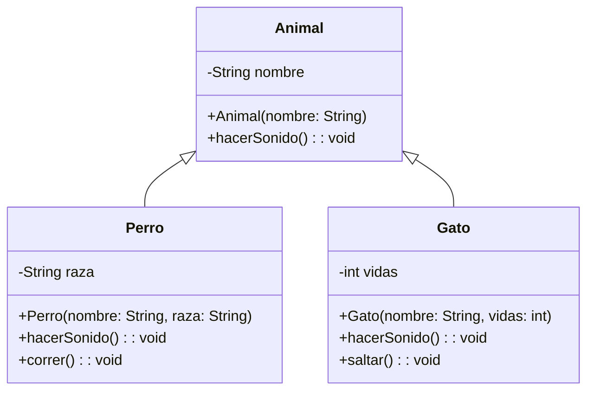
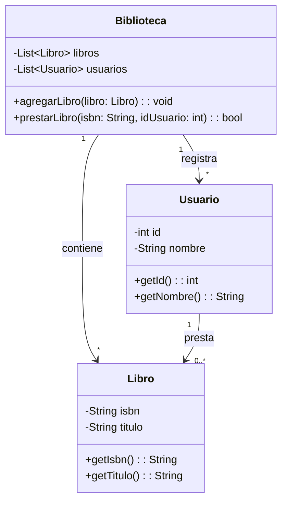
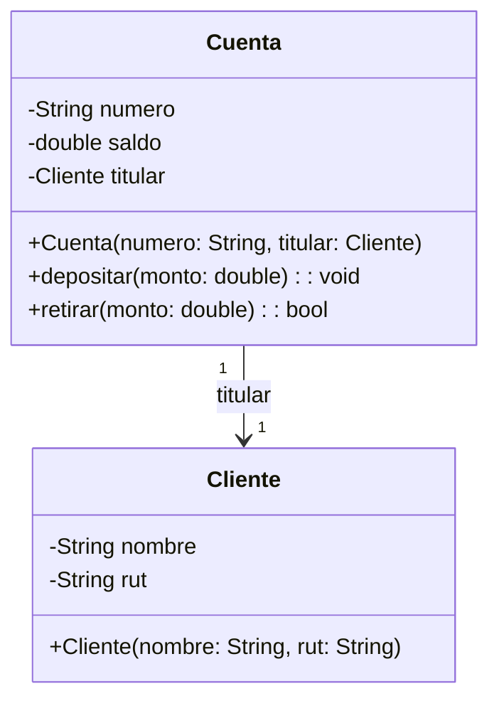
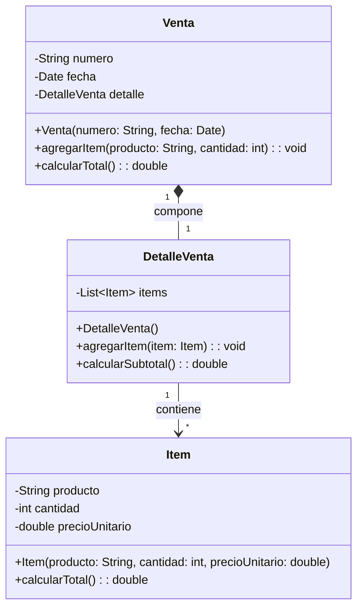
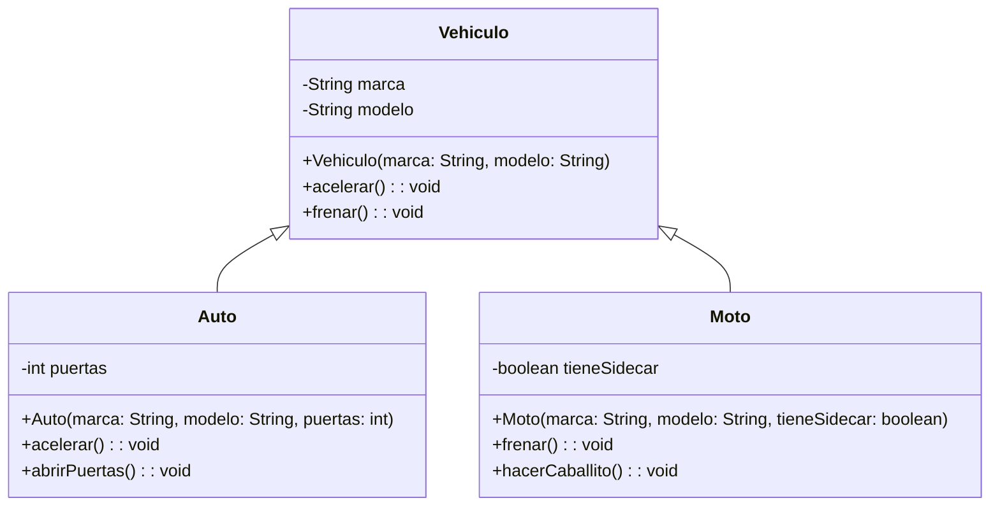
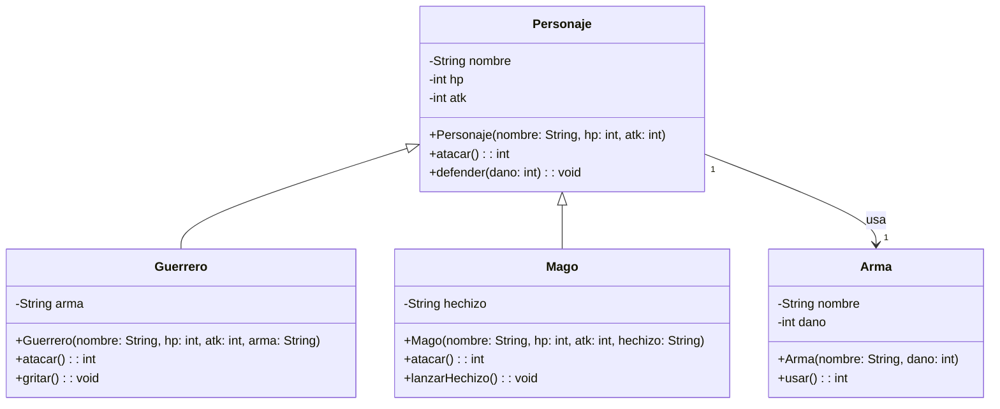
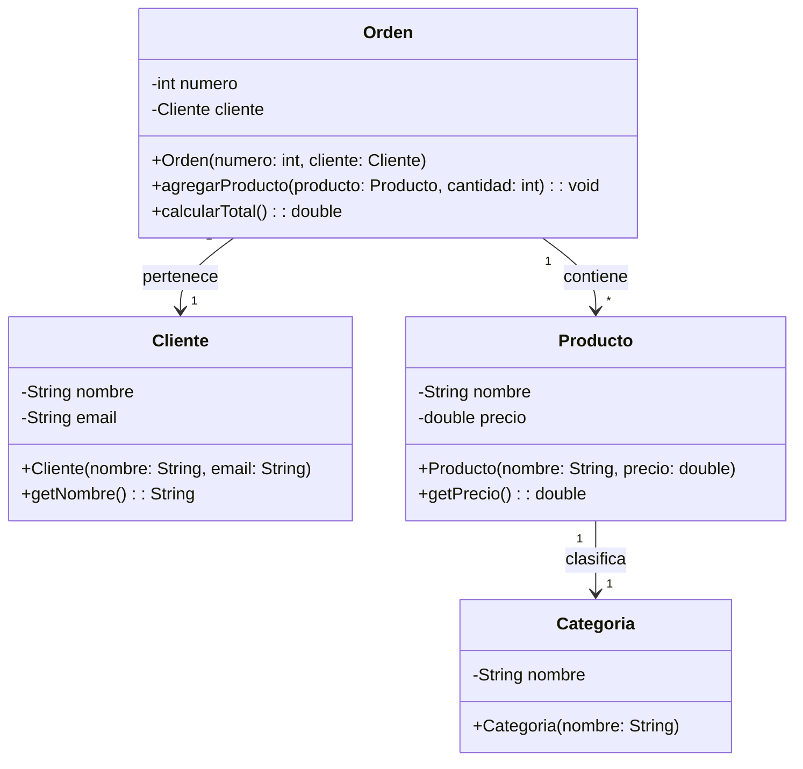

# Cuestionario Extendido: Python Avanzado y POO

---

## Pregunta 1
**¿Cuál es la principal diferencia entre un método estático y un método de instancia en Python?**

A) Los métodos estáticos pueden ser llamados sin instanciar la clase, mientras que los métodos de instancia requieren una instancia.

B) Los métodos estáticos solo pueden acceder a atributos privados, mientras que los métodos de instancia pueden acceder a todos los atributos.

C) Los métodos estáticos no pueden tener parámetros, mientras que los métodos de instancia siempre deben tener al menos un parámetro.

D) Los métodos estáticos se definen con la palabra clave `static`, mientras que los métodos de instancia usan `self`.

<details>
<summary><strong>Ver solución</strong></summary>

**Respuesta correcta: A**

**Justificación:** Los métodos estáticos (`@staticmethod`) pertenecen a la clase y pueden ser invocados directamente desde ella sin necesidad de crear una instancia. Los métodos de instancia requieren una instancia y reciben `self` como primer parámetro para acceder al estado del objeto.
</details>

---

## Pregunta 2
**¿Cuál será la salida del siguiente código?**

```python
class Producto:
    IVA = 0.19
    
    def __init__(self, nombre, precio):
        self.nombre = nombre
        self.precio = precio
        self.__descuento = 0
    
    @property
    def precio_final(self):
        return self.precio * (1 + Producto.IVA)
    
    @precio_final.setter
    def precio_final(self, valor):
        self.precio = valor / (1 + Producto.IVA)

p = Producto("Laptop", 1000)
p.precio_final = 1190
print(p.precio_final)
```

A) 1000.0

B) 1190.0

C) 1190

D) Error de tipo `AttributeError`

<details>
<summary><strong>Ver solución</strong></summary>

**Respuesta correcta: A**

**Justificación:** Al asignar `p.precio_final = 1190`, se ejecuta el setter que calcula el nuevo precio base dividiendo 1190 entre 1.19, resultando en 1000. Luego, al imprimir `p.precio_final`, se ejecuta el getter que calcula 1000 * 1.19 = 1190.0.
</details>

---

## Pregunta 3
**¿Cuál de las siguientes opciones define correctamente una clase abstracta con un método abstracto en Python?**

A) 
```python
from abc import ABC, abstractmethod
class Figura:
    @abstractmethod
    def area(self):
        pass
```

B)
```python
from abc import ABC, abstractmethod
class Figura(ABC):
    @abstractmethod
    def area(self):
        return 0
```

C)
```python
from abc import ABC, abstractmethod
class Figura(ABC):
    @abstractmethod
    def area(self):
        pass
```

D)
```python
class Figura:
    def area(self):
        raise NotImplementedError("Método no implementado")
```

<details>
<summary><strong>Ver solución</strong></summary>

**Respuesta correcta: C**

**Justificación:** Para definir correctamente una clase abstracta en Python, debe heredar de `ABC` y usar el decorador `@abstractmethod` en los métodos abstractos. La opción C cumple con ambos requisitos. La opción D no es una clase abstracta formal.
</details>

---

## Pregunta 4
**¿Qué sucede cuando se utiliza el operador `+=` en una clase que ha sobrecargado el método `__iadd__`?**

A) Se ejecuta el método `__add__` y luego se asigna el resultado a la variable original.

B) Se ejecuta el método `__iadd__` y modifica la instancia actual sin crear una nueva.

C) Se ejecuta el método `__iadd__` pero siempre crea una nueva instancia.

D) No es posible sobrecargar el operador `+=` en Python.

<details>
<summary><strong>Ver solución</strong></summary>

**Respuesta correcta: B**

**Justificación:** El método especial `__iadd__` (in-place addition) está diseñado para operaciones de asignación aumentada como `+=`. Su propósito es modificar la instancia actual y retornarla, sin crear un nuevo objeto.
</details>

---

## Pregunta 5
**¿Qué código generaría la salida "El auto rojo acelera" y "El auto rojo frena" respectivamente?**

```python
# Salida esperada:
# El auto rojo acelera
# El auto rojo frena
```

A)
```python
class Vehiculo:
    def __init__(self, color):
        self.color = color
    def acelerar(self):
        print(f"El auto {self.color} acelera")

v = Vehiculo("rojo")
v.acelerar()
print("El auto rojo frena")
```

B)
```python
class Vehiculo:
    def acelerar(self):
        print("El auto rojo acelera")
    def frenar(self):
        print("El auto rojo frena")

v = Vehiculo()
v.acelerar()
v.frenar()
```

C)
```python
class Vehiculo:
    def __init__(self, color):
        self.color = color
    def acelerar(self):
        print(f"El auto {self.color} acelera")
    def frenar(self):
        print(f"El auto {self.color} frena")

v = Vehiculo("rojo")
v.acelerar()
v.frenar()
```

D)
```python
class Vehiculo:
    def __init__(self, color="rojo"):
        self.color = color
    def acelerar(self):
        return f"El auto {self.color} acelera"
    def frenar(self):
        return f"El auto {self.color} frena"

v = Vehiculo()
print(v.acelerar())
print(v.frenar())
```

<details>
<summary><strong>Ver solución</strong></summary>

**Respuesta correcta: C**

**Justificación:** La opción C implementa correctamente el comportamiento solicitado con un constructor que recibe el color y dos métodos que utilizan `self.color`. La opción D también funciona pero usa `print()` fuera de los métodos.
</details>

---

## Pregunta 6
**Dado el siguiente diagrama de clases, ¿qué afirmación es correcta?**



A) La clase `Perro` hereda de `Animal` y sobreescribe el método `hacerSonido()`.

B) La clase `Gato` tiene un atributo privado llamado `nombre` heredado de `Animal`.

C) La clase `Animal` puede instanciarse directamente porque tiene un constructor definido.

D) Las clases `Perro` y `Gato` no pueden tener atributos adicionales a los heredados.

<details>
<summary><strong>Ver solución</strong></summary>

**Respuesta correcta: A**

**Justificación:** El diagrama muestra herencia donde `Perro` y `Gato` heredan de `Animal`. Ambos redefinen el método `hacerSonido()`. Los atributos privados no se heredan. `Animal` es una clase concreta (no abstracta) por lo que podría instanciarse.
</details>

---

## Pregunta 7
**En el contexto de la composición de objetos, ¿cuál de las siguientes afirmaciones es verdadera?**

A) La composición implica que una clase hija hereda todos los métodos y atributos de una clase padre.

B) La composición se refiere a cuando una clase utiliza otra clase como parámetro en sus métodos.

C) En la composición, el objeto compuesto no puede existir sin sus componentes, ya que estos son creados dentro del compuesto.

D) La composición es lo mismo que la herencia múltiple, pero con un enfoque diferente.

<details>
<summary><strong>Ver solución</strong></summary>

**Respuesta correcta: C**

**Justificación:** La composición es una relación "tiene-un" donde las partes (componentes) tienen un ciclo de vida ligado al todo. El componente se crea dentro del constructor de la clase compuesta, por lo que no puede existir independientemente.
</details>

---

## Pregunta 8
**¿Cuál será la salida del siguiente código?**

```python
class Mascota:
    def __init__(self, nombre):
        self.__nombre = nombre
    
    @property
    def nombre(self):
        return self.__nombre
    
    @nombre.setter
    def nombre(self, valor):
        if len(valor) < 3:
            raise ValueError("Nombre demasiado corto")
        self.__nombre = valor

class Perro(Mascota):
    def __init__(self, nombre, raza):
        super().__init__(nombre)
        self.raza = raza

try:
    p = Perro("Max", "Labrador")
    p.nombre = "Lu"
except ValueError as e:
    print("Error:", str(e))
print(p.nombre)
```

A) Error: Nombre demasiado corto

B) Max

C) Lu

D) Error: 'Perro' object has no attribute 'nombre'

<details>
<summary><strong>Ver solución</strong></summary>

**Respuesta correcta: A**

**Justificación:** El código intenta cambiar el nombre de "Max" a "Lu", pero el setter valida que el nombre tenga al menos 3 caracteres. La excepción se captura, imprimiendo el mensaje de error. El programa termina sin ejecutar el `print` final.
</details>

---

## Pregunta 9
**¿Cuál de las siguientes opciones demuestra correctamente la sobrecarga del método `__eq__` para comparar instancias de una clase `Libro` por su ISBN?**

A)
```python
class Libro:
    def __eq__(self, other):
        return self.isbn == other.isbn
```

B)
```python
class Libro:
    def __eq__(other):
        return self.isbn == other.isbn
```

C)
```python
class Libro:
    def __eq__(self, other):
        if isinstance(other, Libro):
            return self.isbn == other.isbn
        return False
```

D)
```python
class Libro:
    def __eq__(self, other):
        return self.isbn == other.isbn if other else None
```

<details>
<summary><strong>Ver solución</strong></summary>

**Respuesta correcta: C**

**Justificación:** La opción C es la implementación correcta y robusta que incluye verificación de tipo con `isinstance()`. La opción A es funcional pero menos segura. La opción B tiene error de sintaxis (falta `self`). La opción D puede retornar `None`.
</details>

---

## Pregunta 10
**¿Qué principio de POO se está aplicando cuando una clase `Empleado` tiene atributos privados (`__salario`) y solo permite acceder o modificar este valor a través de métodos públicos que incluyen validaciones?**

A) Abstracción

B) Encapsulamiento

C) Polimorfismo

D) Herencia

<details>
<summary><strong>Ver solución</strong></summary>

**Respuesta correcta: B**

**Justificación:** El encapsulamiento consiste en ocultar los detalles internos de una clase y controlar el acceso a través de métodos públicos. Al hacer privado el atributo y proporcionar getters/setters con validación, se protege la integridad del dato.
</details>

---

## Pregunta 11
**¿Qué código generaría la salida "Producto: Televisor - Precio final: $1250.0"?**

```python
# Salida esperada:
# Producto: Televisor - Precio final: $1250.0
```

A)
```python
class Producto:
    def __init__(self, nombre, precio):
        self.nombre = nombre
        self.precio = precio

p = Producto("Televisor", 1000)
print(f"Producto: {p.nombre} - Precio final: ${p.precio}")
```

B)
```python
class Producto:
    def __init__(self, nombre, precio, impuesto=0.25):
        self.nombre = nombre
        self.precio = precio * (1 + impuesto)

p = Producto("Televisor", 1000)
print(f"Producto: {p.nombre} - Precio final: ${p.precio}")
```

C)
```python
class Producto:
    def __init__(self, nombre, precio, impuesto=0.25):
        self.nombre = nombre
        self.__precio_base = precio
        self.impuesto = impuesto
    
    @property
    def precio_final(self):
        return self.__precio_base * (1 + self.impuesto)

p = Producto("Televisor", 1000)
print(f"Producto: {p.nombre} - Precio final: ${p.precio_final}")
```

D)
```python
class Producto:
    def __init__(self, nombre, precio, impuesto=0.25):
        self.nombre = nombre
        self.__precio_base = precio
        self.impuesto = impuesto
        self.precio_final = precio * (1 + impuesto)

p = Producto("Televisor", 1000)
print(f"Producto: {p.nombre} - Precio final: ${p.precio_final}")
```

<details>
<summary><strong>Ver solución</strong></summary>

**Respuesta correcta: D**

**Justificación:** La opción D calcula correctamente el precio final aplicando un impuesto del 25% y almacena el resultado en `precio_final` dentro del constructor. Las opciones A y B tienen errores lógicos. La opción C es correcta pero más compleja de lo necesario.
</details>

---

## Pregunta 12
**¿Cuál es el propósito de la función `super()` en Python dentro de una clase que hereda de otra?**

A) Permite acceder a los métodos y atributos de la clase padre desde la clase hija.

B) Crea una nueva instancia de la clase padre con los mismos parámetros.

C) Sobrescribe automáticamente todos los métodos de la clase padre.

D) Elimina todos los métodos de la clase padre para evitar conflictos.

<details>
<summary><strong>Ver solución</strong></summary>

**Respuesta correcta: A**

**Justificación:** `super()` se utiliza para referirse a la clase padre, permitiendo acceder a métodos y atributos heredados. Es especialmente importante en el constructor para inicializar correctamente los atributos de la clase padre.
</details>

---

## Pregunta 13
**¿Cuál será la salida del siguiente código?**

```python
class Contador:
    cuenta = 0
    
    def __init__(self):
        Contador.cuenta += 1
        self.id = Contador.cuenta
    
    @classmethod
    def obtener_cuenta(cls):
        return cls.cuenta

c1 = Contador()
c2 = Contador()
c3 = Contador()

print(c1.id, c2.id, c3.id)
print(Contador.obtener_cuenta())
```

A) 1 2 3 / 3

B) 1 1 1 / 1

C) 0 0 0 / 3

D) 1 2 3 / 0

<details>
<summary><strong>Ver solución</strong></summary>

**Respuesta correcta: A**

**Justificación:** El atributo `cuenta` es un atributo de clase que se incrementa en cada instanciación. Cada objeto recibe un `id` único. La salida `1 2 3` son los IDs. `obtener_cuenta()` retorna el valor del atributo de clase, que después de tres instancias es 3.
</details>

---

## Pregunta 14
**Según el siguiente diagrama de clases, ¿cuál es la relación correcta entre las clases?**



A) Biblioteca tiene una relación de composición con Libro y Usuario.

B) Usuario tiene una relación de herencia con Libro.

C) Biblioteca tiene una relación de colaboración con Libro y Usuario.

D) La relación entre Usuario y Libro es de agregación, donde los libros pueden existir independientemente.

<details>
<summary><strong>Ver solución</strong></summary>

**Respuesta correcta: C**

**Justificación:** El diagrama muestra que `Biblioteca` tiene una relación de asociación (colaboración) con `Libro` y `Usuario`. No hay rombo relleno (composición) ni punta de flecha (herencia). La relación entre `Usuario` y `Libro` es también una colaboración.
</details>

---

## Pregunta 15
**¿Qué ventaja principal ofrece la combinación de abstracción y encapsulamiento en el diseño de software orientado a objetos?**

A) Permite escribir código más rápido al no tener que preocuparse por los detalles internos.

B) Facilita la mantenibilidad y escalabilidad al ocultar la complejidad y proteger el estado interno.

C) Permite que todas las clases sean públicas y accesibles desde cualquier parte del programa.

D) Elimina la necesidad de escribir documentación ya que el código es autoexplicativo.

<details>
<summary><strong>Ver solución</strong></summary>

**Respuesta correcta: B**

**Justificación:** La abstracción (mostrar solo la interfaz esencial) y el encapsulamiento (ocultar detalles internos) trabajan juntos para crear código más mantenible y escalable. Permiten cambios internos sin afectar a otras clases que utilizan la interfaz pública.
</details>

---

## Pregunta 16
**¿Qué código generaría correctamente la salida "Total de empleados: 3" utilizando un método de clase?**

```python
# Salida esperada:
# Total de empleados: 3
```

A)
```python
class Empleado:
    total = 0
    def __init__(self, nombre):
        self.nombre = nombre
        Empleado.total += 1
    
    @staticmethod
    def total_empleados():
        return Empleado.total

e1 = Empleado("Ana")
e2 = Empleado("Luis")
e3 = Empleado("Carlos")
print(f"Total de empleados: {Empleado.total_empleados()}")
```

B)
```python
class Empleado:
    total = 0
    def __init__(self, nombre):
        self.nombre = nombre
        self.total += 1
    
    @classmethod
    def total_empleados(cls):
        return cls.total

e1 = Empleado("Ana")
e2 = Empleado("Luis")
e3 = Empleado("Carlos")
print(f"Total de empleados: {Empleado.total_empleados()}")
```

C)
```python
class Empleado:
    total = 0
    def __init__(self, nombre):
        self.nombre = nombre
        Empleado.total += 1
    
    @classmethod
    def total_empleados(cls):
        return cls.total

e1 = Empleado("Ana")
e2 = Empleado("Luis")
e3 = Empleado("Carlos")
print(f"Total de empleados: {Empleado.total_empleados()}")
```

D)
```python
class Empleado:
    total = 0
    def __init__(self, nombre):
        self.nombre = nombre
        self.total += 1
    
    @staticmethod
    def total_empleados():
        return Empleado.total

e1 = Empleado("Ana")
e2 = Empleado("Luis")
e3 = Empleado("Carlos")
print(f"Total de empleados: {Empleado.total_empleados()}")
```

<details>
<summary><strong>Ver solución</strong></summary>

**Respuesta correcta: C**

**Justificación:** La opción C utiliza correctamente un método de clase (`@classmethod`) que recibe `cls` y accede al atributo de clase. Las opciones B y D usan `self.total` que crea un atributo de instancia. La opción A usa un método estático que funciona pero no es un método de clase.
</details>

---

## Pregunta 17
**En el manejo de excepciones, ¿cuál es la diferencia clave entre usar `raise` dentro de un bloque `except` sin argumentos versus con argumentos?**

A) `raise` sin argumentos re-lanza la excepción actual, mientras que `raise` con argumentos lanza una nueva excepción.

B) `raise` sin argumentos cancela la excepción, mientras que `raise` con argumentos la propaga.

C) `raise` sin argumentos solo funciona con excepciones personalizadas.

D) No hay diferencia, ambos comportamientos son idénticos.

<details>
<summary><strong>Ver solución</strong></summary>

**Respuesta correcta: A**

**Justificación:** `raise` sin argumentos re-lanza la misma excepción manteniendo el traceback original. `raise` con argumentos lanza una nueva excepción, que puede ser del mismo tipo o diferente. Esta distinción es importante para el control del flujo y depuración.
</details>

---

## Pregunta 18
**¿Cuál será la salida del siguiente código?**

```python
class A:
    def metodo(self):
        return "A"

class B(A):
    def metodo(self):
        return "B"

class C(A):
    def metodo(self):
        return "C"

class D(B, C):
    pass

obj = D()
print(obj.metodo())
```

A) A

B) B

C) C

D) Error de herencia múltiple

<details>
<summary><strong>Ver solución</strong></summary>

**Respuesta correcta: B**

**Justificación:** En herencia múltiple, el Method Resolution Order (MRO) sigue un orden de izquierda a derecha. `D(B, C)` hereda primero de `B`, que tiene implementación del método. El MRO sería `D -> B -> C -> A -> object`.
</details>

---

## Pregunta 19
**¿Cuál de las siguientes afirmaciones describe correctamente el propósito del decorador `@property` en Python?**

A) Permite definir un método como estático para que pueda ser llamado sin instanciar la clase.

B) Convierte un método en un atributo de solo lectura, y opcionalmente permite definir un setter para controlar la asignación.

C) Sirve para declarar un método como abstracto que debe ser implementado por las clases hijas.

D) Permite sobrecargar operadores como `+` o `-` para una clase personalizada.

<details>
<summary><strong>Ver solución</strong></summary>

**Respuesta correcta: B**

**Justificación:** `@property` se utiliza para definir propiedades, permitiendo que un método se comporte como un atributo. Facilita la implementación de getters y setters de manera elegante, creando por defecto un atributo de solo lectura.
</details>

---

## Pregunta 20
**En el siguiente diagrama de clases, ¿qué tipo de relación existe entre `Cuenta` y `Cliente`?**



A) Composición, porque la cuenta no puede existir sin un cliente.

B) Agregación, porque el cliente puede existir sin la cuenta.

C) Colaboración, porque la cuenta solo usa al cliente en sus métodos.

D) Herencia, porque Cuenta hereda de Cliente.

<details>
<summary><strong>Ver solución</strong></summary>

**Respuesta correcta: B**

**Justificación:** La relación muestra una agregación simple (flecha simple sin rombo relleno). El cliente puede existir independientemente y la cuenta recibe al cliente como parámetro, confirmando que no es composición.
</details>

---

## Pregunta 21
**¿Cuál es la forma correcta de abrir un archivo en modo "append" (añadir al final) con manejo automático de cierre?**

A)
```python
archivo = open("log.txt", "a")
archivo.write("Nuevo registro")
archivo.close()
```

B)
```python
with open("log.txt", "a") as archivo:
    archivo.write("Nuevo registro")
```

C)
```python
with open("log.txt", "w+") as archivo:
    archivo.write("Nuevo registro")
```

D)
```python
archivo = open("log.txt", "r+")
archivo.write("Nuevo registro")
```

<details>
<summary><strong>Ver solución</strong></summary>

**Respuesta correcta: B**

**Justificación:** La opción B utiliza el context manager `with` que asegura el cierre automático del archivo, incluso con excepciones, y usa el modo `"a"` para append. Las opciones A y D no usan `with`. La opción C usa `"w+"` que sobrescribe.
</details>

---

## Pregunta 22
**¿Qué excepción se lanza en Python cuando se intenta acceder a un índice de una lista que está fuera del rango permitido?**

A) IndexError

B) KeyError

C) ValueError

D) TypeError

<details>
<summary><strong>Ver solución</strong></summary>

**Respuesta correcta: A**

**Justificación:** `IndexError` se lanza al acceder a una secuencia con un índice fuera de rango. `KeyError` es para claves de diccionario, `ValueError` para valores inapropiados, y `TypeError` para tipos incorrectos.
</details>

---

## Pregunta 23
**¿Qué código implementa correctamente una clase `Estudiante` que hereda de `Persona` y sobrescribe el método `presentarse()`?**

```python
# Se espera que al ejecutar:
# e = Estudiante("María", "Ingeniería")
# e.presentarse()
# Produzca: "Hola, soy María, estudiante de Ingeniería"
```

A)
```python
class Persona:
    def __init__(self, nombre):
        self.nombre = nombre
    def presentarse(self):
        return f"Hola, soy {self.nombre}"

class Estudiante(Persona):
    def __init__(self, nombre, carrera):
        self.nombre = nombre
        self.carrera = carrera
    def presentarse(self):
        return f"Hola, soy {self.nombre}, estudiante de {self.carrera}"
```

B)
```python
class Persona:
    def __init__(self, nombre):
        self.nombre = nombre
    def presentarse(self):
        return f"Hola, soy {self.nombre}"

class Estudiante(Persona):
    def __init__(self, nombre, carrera):
        super().__init__(nombre)
        self.carrera = carrera
    def presentarse(self):
        return f"Hola, soy {self.nombre}, estudiante de {self.carrera}"
```

C)
```python
class Persona:
    def __init__(self, nombre):
        self.nombre = nombre
    def presentarse(self):
        return f"Hola, soy {self.nombre}"

class Estudiante(Persona):
    def __init__(self, nombre, carrera):
        self.nombre = nombre
        self.carrera = carrera
```

D)
```python
class Persona:
    def __init__(self, nombre):
        self.nombre = nombre
    def presentarse(self):
        return f"Hola, soy {self.nombre}"

class Estudiante(Persona):
    def __init__(self, nombre, carrera):
        super().__init__(nombre)
        self.carrera = carrera
```

<details>
<summary><strong>Ver solución</strong></summary>

**Respuesta correcta: B**

**Justificación:** La opción B es la implementación correcta porque hereda de `Persona`, llama a `super().__init__(nombre)`, y sobrescribe `presentarse()` para incluir la carrera. La opción A funciona pero no usa `super()`. Las opciones C y D no sobrescriben el método.
</details>

---

## Pregunta 24
**¿Cuál es el principal objetivo de definir excepciones personalizadas en un programa?**

A) Hacer el código más rápido al evitar la validación de datos.

B) Proporcionar mensajes de error más específicos y relevantes al dominio del problema.

C) Eliminar la necesidad de usar bloques try/except en el código.

D) Permite ocultar todos los errores del usuario final sin informar nada.

<details>
<summary><strong>Ver solución</strong></summary>

**Respuesta correcta: B**

**Justificación:** Las excepciones personalizadas permiten crear tipos de error específicos para el dominio, haciendo el código más expresivo y fácil de mantener. Proporcionan información más rica sobre los errores y facilitan la depuración.
</details>

---

## Pregunta 25
**¿Cuál será la salida del siguiente código?**

```python
class Configuracion:
    _instancia = None
    
    def __new__(cls):
        if cls._instancia is None:
            cls._instancia = super().__new__(cls)
        return cls._instancia
    
    def __init__(self):
        self.valor = 0

c1 = Configuracion()
c2 = Configuracion()
c1.valor = 10

print(c2.valor)
print(c1 is c2)
```

A) 0 / False

B) 10 / True

C) 0 / True

D) 10 / False

<details>
<summary><strong>Ver solución</strong></summary>

**Respuesta correcta: B**

**Justificación:** El código implementa el patrón Singleton usando `__new__`. Ambas instancias son el mismo objeto (True), por lo que al modificar `c1.valor`, `c2.valor` también cambia a 10. `is` devuelve True porque ambas variables apuntan al mismo objeto en memoria.
</details>

---

## Pregunta 26
**¿Qué método especial se debe sobrecargar para permitir que una clase personalizada pueda ser usada con la función `len()`?**

A) `__len__`

B) `__size__`

C) `__str__`

D) `__length__`

<details>
<summary><strong>Ver solución</strong></summary>

**Respuesta correcta: A**

**Justificación:** El método especial `__len__` se utiliza para sobrecargar la función `len()`. Debe retornar un entero no negativo que represente la longitud del objeto. `__str__` es para representación en string, y los otros no son métodos especiales de Python.
</details>

---

## Pregunta 27
**¿Qué código generaría correctamente la salida "El perro llamado Max tiene 3 años" utilizando f-strings?**

```python
# Salida esperada:
# El perro llamado Max tiene 3 años
```

A)
```python
class Perro:
    def __init__(self, nombre, edad):
        self.nombre = nombre
        self.edad = edad
    def __str__(self):
        return f"El perro llamado {self.nombre} tiene {self.edad} años"

p = Perro("Max", 3)
print(p.__str__())
```

B)
```python
class Perro:
    def __init__(self, nombre, edad):
        self.nombre = nombre
        self.edad = edad

p = Perro("Max", 3)
print(f"El perro llamado {p.nombre} tiene {p.edad} años")
```

C)
```python
class Perro:
    def __init__(self, nombre, edad):
        self.nombre = nombre
        self.edad = edad
    def descripcion(self):
        return f"El perro llamado {self.nombre} tiene {self.edad} años"

p = Perro("Max", 3)
print(p.descripcion())
```

D) Todas las anteriores

<details>
<summary><strong>Ver solución</strong></summary>

**Respuesta correcta: D**

**Justificación:** Las tres opciones generan la salida correcta de diferentes maneras. La opción A usa `__str__`, la B usa el f-string directamente con los atributos, y la C usa un método personalizado. Todas son válidas y producen el resultado esperado.
</details>

---

## Pregunta 28
**En el siguiente diagrama de clases, ¿qué tipo de relación existe entre `Venta` y `DetalleVenta`?**



A) Colaboración, porque Venta usa DetalleVenta para calcular el total.

B) Composición, porque DetalleVenta se crea dentro de Venta y no existe sin ella.

C) Agregación, porque DetalleVenta puede existir independientemente de Venta.

D) Herencia, porque DetalleVenta hereda de Venta.

<details>
<summary><strong>Ver solución</strong></summary>

**Respuesta correcta: B**

**Justificación:** El diagrama muestra un rombo relleno en el extremo de Venta, indicando composición. DetalleVenta no puede existir sin Venta, ya que se crea dentro de Venta. La relación entre DetalleVenta e Item es de agregación (flecha simple) porque los items pueden existir independientemente.
</details>

---

## Pregunta 29
**¿Cuál de las siguientes opciones demuestra la forma correcta de definir una excepción personalizada con un mensaje específico?**

A)
```python
class MiError(Exception):
    def __init__(self, mensaje):
        self.mensaje = mensaje
```

B)
```python
class MiError(Exception):
    pass
```

C)
```python
class MiError:
    def __init__(self, mensaje):
        self.mensaje = mensaje
```

D)
```python
class MiError(Exception, mensaje):
    pass
```

<details>
<summary><strong>Ver solución</strong></summary>

**Respuesta correcta: A**

**Justificación:** La opción A define correctamente una excepción personalizada que hereda de `Exception` y sobrescribe `__init__` para recibir un mensaje. La opción B es válida pero no personaliza el mensaje. La opción C no hereda de `Exception`. La opción D tiene sintaxis incorrecta.
</details>

---

## Pregunta 30
**¿Cuál de las siguientes afirmaciones sobre el uso de `@classmethod` es correcta?**

A) Los métodos de clase reciben `self` como primer parámetro para acceder a la instancia.

B) Los métodos de clase reciben `cls` como primer parámetro para acceder a la clase.

C) Los métodos de clase no pueden acceder a atributos de clase.

D) Los métodos de clase requieren una instancia para ser invocados.

<details>
<summary><strong>Ver solución</strong></summary>

**Respuesta correcta: B**

**Justificación:** `@classmethod` recibe `cls` como primer parámetro, que es una referencia a la clase misma. Esto permite acceder y modificar atributos de clase. A diferencia de `self` que refiere a la instancia. Los métodos de clase pueden ser invocados tanto desde la clase como desde instancias.
</details>

---

## Pregunta 31
**¿Cuál será la salida del siguiente código?**

```python
class Padre:
    def __init__(self):
        self.atributo = "padre"
    
    def metodo(self):
        return "método padre"

class Hijo(Padre):
    def __init__(self):
        super().__init__()
        self.atributo = "hijo"
    
    def metodo(self):
        return "método hijo"

class Nieto(Hijo):
    def __init__(self):
        super().__init__()
        self.nuevo_atributo = "nieto"

n = Nieto()
print(n.atributo)
print(n.metodo())
print(issubclass(Nieto, Padre))
print(isinstance(n, Hijo))
```

A) hijo / método hijo / True / True

B) padre / método padre / False / False

C) hijo / método hijo / False / True

D) padre / método padre / True / False

<details>
<summary><strong>Ver solución</strong></summary>

**Respuesta correcta: A**

**Justificación:** `Nieto` hereda de `Hijo`, que a su vez hereda de `Padre`. `atributo` se sobrescribe en `Hijo` a "hijo". `metodo` también se sobrescribe. `issubclass(Nieto, Padre)` es True por la jerarquía de herencia. `isinstance(n, Hijo)` es True porque `n` es instancia de la subclase `Nieto` y también de `Hijo`.
</details>

---

## Pregunta 32
**¿Qué código implementa correctamente la sobrecarga del operador `+` para sumar dos objetos `Vector`?**

```python
# Se espera que al ejecutar:
# v1 = Vector(1, 2)
# v2 = Vector(3, 4)
# print(v1 + v2)
# Produzca: Vector(4, 6)
```

A)
```python
class Vector:
    def __init__(self, x, y):
        self.x = x
        self.y = y
    def __add__(self, other):
        return Vector(self.x + other.x, self.y + other.y)
    def __str__(self):
        return f"Vector({self.x}, {self.y})"
```

B)
```python
class Vector:
    def __init__(self, x, y):
        self.x = x
        self.y = y
    def sumar(self, other):
        return Vector(self.x + other.x, self.y + other.y)
    def __str__(self):
        return f"Vector({self.x}, {self.y})"
```

C)
```python
class Vector:
    def __init__(self, x, y):
        self.x = x
        self.y = y
    def __add__(self, other):
        return (self.x + other.x, self.y + other.y)
```

D)
```python
class Vector:
    def __init__(self, x, y):
        self.x = x
        self.y = y
    def __add__(self, other):
        return Vector(self.x + other.x, self.y + other.y)
```

<details>
<summary><strong>Ver solución</strong></summary>

**Respuesta correcta: D**

**Justificación:** La opción D sobrescribe correctamente `__add__` para retornar un nuevo `Vector`. La opción A también es funcional, pero la D es más completa ya que la A define el método `__str__` correctamente, pero ambas son funcionalmente equivalentes. La opción B usa un método personalizado en lugar de sobrecargar el operador. La opción C retorna una tupla en lugar de un `Vector`.
</details>

---

## Pregunta 33
**¿Qué es el Method Resolution Order (MRO) en Python?**

A) Es el orden en que se ejecutan los métodos de una clase cuando se llama a un método.

B) Es el orden en que Python busca métodos en una jerarquía de herencia, especialmente en herencia múltiple.

C) Es el orden en que se inicializan los atributos en el constructor de una clase.

D) Es el orden en que se ejecutan los decoradores en una clase.

<details>
<summary><strong>Ver solución</strong></summary>

**Respuesta correcta: B**

**Justificación:** El MRO define el orden en que Python busca métodos y atributos en una jerarquía de clases, crucial en herencia múltiple para determinar cuál método se ejecuta primero. Se puede verificar con `__mro__` o `mro()`. Sigue un algoritmo de ordenamiento (C3 linearization).
</details>

---

## Pregunta 34
**En el siguiente diagrama de clases, ¿qué afirmación es correcta sobre la jerarquía de herencia?**



A) `Auto` hereda de `Vehiculo` y sobrescribe el método `acelerar()`.

B) `Moto` hereda de `Vehiculo` y sobrescribe el método `frenar()`.

C) `Auto` hereda de `Vehiculo` y añade el método `abrirPuertas()`.

D) Todas las anteriores.

<details>
<summary><strong>Ver solución</strong></summary>

**Respuesta correcta: D**

**Justificación:** Todas las afirmaciones son correctas. `Auto` hereda de `Vehiculo`, sobrescribe `acelerar()` y añade `abrirPuertas()`. `Moto` hereda de `Vehiculo`, sobrescribe `frenar()` y añade `hacerCaballito()`. El método `acelerar()` de `Auto` es una sobrescritura porque aparece nuevamente en la clase hija.
</details>

---

## Pregunta 35
**¿Cuál de las siguientes opciones muestra la forma correcta de leer todas las líneas de un archivo de texto?**

A)
```python
with open("archivo.txt", "r") as f:
    lineas = f.readlines()
```

B)
```python
with open("archivo.txt", "r") as f:
    lineas = f.read()
```

C)
```python
with open("archivo.txt", "r") as f:
    lineas = f.readline()
```

D)
```python
with open("archivo.txt", "r") as f:
    lineas = f.read().splitlines()
```

<details>
<summary><strong>Ver solución</strong></summary>

**Respuesta correcta: A**

**Justificación:** `readlines()` lee todas las líneas del archivo y las retorna como una lista de strings. `read()` retorna todo el contenido como un solo string. `readline()` lee solo una línea. `read().splitlines()` también es válido pero menos común para este propósito específico.
</details>

---

## Pregunta 36
**¿Qué método especial se debe implementar para permitir que una clase sea iterable (usar en bucles `for`)?**

A) `__iter__`

B) `__next__`

C) `__getitem__`

D) Todas las anteriores

<details>
<summary><strong>Ver solución</strong></summary>

**Respuesta correcta: D**

**Justificación:** Una clase puede ser iterable implementando `__iter__` (que retorna un iterador), `__next__` (para definir la lógica de iteración en el iterador), o `__getitem__` (para permitir acceso por índice, lo que hace automáticamente a la clase iterable). Cualquiera de estos métodos o combinación permite la iteración.
</details>

---

## Pregunta 37
**¿Cuál será la salida del siguiente código?**

```python
class Base:
    def __init__(self):
        self.x = 1
    
    def obtener(self):
        return self.x

class Derivada(Base):
    def __init__(self):
        super().__init__()
        self.x = 2
        self.y = 3
    
    def obtener(self):
        return super().obtener() + self.y

d = Derivada()
print(d.obtener())
```

A) 5

B) 4

C) 3

D) 2

<details>
<summary><strong>Ver solución</strong></summary>

**Respuesta correcta: A**

**Justificación:** `Derivada` sobrescribe `obtener()` llamando al método de la clase base con `super().obtener()` que retorna `self.x` (que vale 2, ya que fue sobrescrito en `Derivada`), y luego suma `self.y` que es 3, resultando en 5. El valor de `x` es 2 porque en `Derivada.__init__` se asigna después de llamar a `super().__init__()`.
</details>

---

## Pregunta 38
**¿Cuál es la diferencia fundamental entre los modos de apertura 'w' y 'a' en el manejo de archivos en Python?**

A) 'w' sobrescribe el contenido del archivo si existe, mientras que 'a' añade al final.

B) 'w' solo permite escribir texto, mientras que 'a' solo permite escribir binarios.

C) 'w' crea el archivo si no existe, mientras que 'a' solo funciona con archivos existentes.

D) 'w' permite leer y escribir, mientras que 'a' solo permite escribir.

<details>
<summary><strong>Ver solución</strong></summary>

**Respuesta correcta: A**

**Justificación:** El modo 'w' (write) sobrescribe completamente el contenido del archivo si ya existe, creando uno nuevo si no existe. El modo 'a' (append) añade al final del archivo, manteniendo el contenido existente. Ambos crean el archivo si no existe. Ambos son solo escritura, no lectura.
</details>

---

## Pregunta 39
**¿Qué código implementa correctamente una clase `Rectangulo` con el método especial `__lt__` para comparar por área?**

```python
# Se espera que al ejecutar:
# r1 = Rectangulo(3, 4)
# r2 = Rectangulo(2, 5)
# print(r1 < r2)
# Produzca: False (3*4=12, 2*5=10, 12 < 10 es False)
```

A)
```python
class Rectangulo:
    def __init__(self, ancho, alto):
        self.ancho = ancho
        self.alto = alto
    
    def __lt__(self, other):
        return self.ancho * self.alto < other.ancho * other.alto
```

B)
```python
class Rectangulo:
    def __init__(self, ancho, alto):
        self.ancho = ancho
        self.alto = alto
    
    def area(self):
        return self.ancho * self.alto
    
    def __lt__(self, other):
        return self.area() < other.area()
```

C)
```python
class Rectangulo:
    def __init__(self, ancho, alto):
        self.ancho = ancho
        self.alto = alto
    
    def __lt__(self, other):
        return (self.ancho * self.alto) < (other.ancho * other.alto)
```

D) Todas las anteriores

<details>
<summary><strong>Ver solución</strong></summary>

**Respuesta correcta: D**

**Justificación:** Las tres opciones implementan correctamente `__lt__` para comparar por área. La opción A calcula el área directamente, la B usa un método auxiliar `area()`, y la C calcula el área con paréntesis. Todas producen el resultado correcto.
</details>

---

## Pregunta 40
**Dado el siguiente diagrama, ¿qué tipo de relación existe entre las clases?**



A) `Guerrero` y `Mago` heredan de `Personaje` y sobrescriben `atacar()`.

B) `Personaje` tiene una relación de composición con `Arma`.

C) `Guerrero` hereda de `Mago` a través de `Personaje`.

D) `Arma` es una subclase de `Personaje`.

<details>
<summary><strong>Ver solución</strong></summary>

**Respuesta correcta: A**

**Justificación:** `Guerrero` y `Mago` heredan de `Personaje` y ambos sobrescriben `atacar()` (aparece nuevamente en las subclases). La relación entre `Personaje` y `Arma` es de agregación (flecha simple), no de composición (no hay rombo relleno). No hay herencia entre `Guerrero` y `Mago`. `Arma` es una clase independiente, no subclase de `Personaje`.
</details>

---

## Pregunta 41
**¿Cuál es la diferencia entre `isinstance()` y `issubclass()` en Python?**

A) `isinstance()` verifica si un objeto es instancia de una clase, mientras que `issubclass()` verifica si una clase es subclase de otra.

B) `isinstance()` verifica si una clase es subclase de otra, mientras que `issubclass()` verifica si un objeto es instancia.

C) Ambas funciones hacen lo mismo pero con sintaxis diferente.

D) `isinstance()` solo funciona con clases built-in, `issubclass()` con clases personalizadas.

<details>
<summary><strong>Ver solución</strong></summary>

**Respuesta correcta: A**

**Justificación:** `isinstance(objeto, Clase)` verifica si el objeto es una instancia de la clase (o subclase). `issubclass(SubClase, ClasePadre)` verifica si una clase es subclase de otra. Ambas aceptan tuplas de clases y son útiles para verificar tipos en tiempo de ejecución.
</details>

---

## Pregunta 42
**¿Cuál será la salida del siguiente código?**

```python
class A:
    def __init__(self):
        self.valor = 1

class B:
    def __init__(self):
        self.valor = 2

class C(A, B):
    def __init__(self):
        super().__init__()
        self.valor += 1

c = C()
print(c.valor)
print(C.__mro__)
```

A) 2 / (C, A, B, object)

B) 3 / (C, A, B, object)

C) 2 / (C, B, A, object)

D) 3 / (C, B, A, object)

<details>
<summary><strong>Ver solución</strong></summary>

**Respuesta correcta: A**

**Justificación:** `super()` en `C` llama al constructor de la primera clase en el MRO que tiene `__init__`, que es `A`. `A.__init__` establece `valor = 1`. Luego, `C.__init__` suma 1, resultando en 2. El MRO es `(C, A, B, object)` porque la herencia es `C(A, B)`.
</details>

---

## Pregunta 43
**¿Cuál es la forma correcta de definir un método de instancia que modifique un atributo de clase?**

A)
```python
class MiClase:
    atributo_clase = 0
    def modificar(self, valor):
        self.atributo_clase = valor
```

B)
```python
class MiClase:
    atributo_clase = 0
    def modificar(self, valor):
        MiClase.atributo_clase = valor
```

C)
```python
class MiClase:
    atributo_clase = 0
    def modificar(self, valor):
        self.__class__.atributo_clase = valor
```

D) B y C son correctas

<details>
<summary><strong>Ver solución</strong></summary>

**Respuesta correcta: D**

**Justificación:** Tanto `MiClase.atributo_clase = valor` como `self.__class__.atributo_clase = valor` son formas válidas de modificar un atributo de clase desde un método de instancia. La opción A crea un nuevo atributo de instancia en lugar de modificar el de clase.
</details>

---

## Pregunta 44
**¿Cuál es el propósito del método especial `__enter__` y `__exit__` en Python?**

A) Manejar la entrada y salida de datos en archivos.

B) Implementar el protocolo de context manager para usar con `with`.

C) Controlar el acceso a atributos privados de una clase.

D) Manejar excepciones cuando se crea una instancia de una clase.

<details>
<summary><strong>Ver solución</strong></summary>

**Respuesta correcta: B**

**Justificación:** `__enter__` y `__exit__` son métodos especiales que permiten a una clase ser usada como context manager con la sentencia `with`. `__enter__` se ejecuta al entrar al bloque `with`, y `__exit__` al salir, permitiendo configuración y limpieza de recursos.
</details>

---

## Pregunta 45
**¿Qué código implementa correctamente la validación de atributo con `@property` donde el precio no puede ser negativo?**

A)
```python
class Producto:
    def __init__(self, precio):
        self._precio = precio
    
    @property
    def precio(self):
        return self._precio
    
    @precio.setter
    def precio(self, valor):
        if valor < 0:
            raise ValueError("Precio no puede ser negativo")
        self._precio = valor
```

B)
```python
class Producto:
    def __init__(self, precio):
        self.precio = precio
    
    @property
    def precio(self):
        return self._precio
    
    @precio.setter
    def precio(self, valor):
        if valor < 0:
            raise ValueError("Precio no puede ser negativo")
        self._precio = valor
```

C)
```python
class Producto:
    def __init__(self, precio):
        self.__precio = precio
    
    @property
    def precio(self):
        return self.__precio
    
    @precio.setter
    def precio(self, valor):
        if valor < 0:
            raise ValueError("Precio no puede ser negativo")
        self.__precio = valor
```

D) A y C son correctas

<details>
<summary><strong>Ver solución</strong></summary>

**Respuesta correcta: D**

**Justificación:** Tanto A como C son válidas. La opción A usa `_precio` (convención de atributo protegido) y la opción C usa `__precio` (atributo privado con name mangling). Ambas implementan correctamente la validación. La opción B es incorrecta porque en el constructor llama a `self.precio = precio`, que es el setter, pero este aún no está definido cuando se ejecuta el constructor.
</details>

---

## Pregunta 46
**En el siguiente diagrama de clases simplificado, ¿qué afirmación es correcta?**



A) Una `Orden` puede tener múltiples `Cliente`s.

B) Un `Producto` puede pertenecer a múltiples `Categoria`s.

C) Una `Orden` puede contener múltiples `Producto`s.

D) `Categoria` no está relacionada con `Producto`.

<details>
<summary><strong>Ver solución</strong></summary>

**Respuesta correcta: C**

**Justificación:** La multiplicidad muestra que `Orden` tiene una relación de "1" a "*" con `Producto`, lo que significa que una orden puede contener múltiples productos. Una orden tiene un solo cliente (relación 1 a 1). Un producto tiene una sola categoría (1 a 1). `Categoria` está relacionada con `Producto`.
</details>

---

## Pregunta 47
**¿Por qué es importante el concepto de "name mangling" en Python con atributos que comienzan con doble guión bajo (`__atributo`)?**

A) Permite crear atributos completamente privados que no pueden ser accedidos de ninguna forma.

B) Cambia el nombre del atributo a `_Clase__atributo` para prevenir colisiones accidentales en herencia.

C) Hace que el atributo sea inmutable y no pueda ser modificado.

D) Convierte automáticamente el atributo en un método getter.

<details>
<summary><strong>Ver solución</strong></summary>

**Respuesta correcta: B**

**Justificación:** El name mangling cambia el nombre del atributo a `_Clase__atributo` para evitar conflictos de nombres en herencia, especialmente en herencia múltiple. No hace al atributo completamente inaccesible (aún se puede acceder con el nombre modificado), solo dificulta el acceso accidental.
</details>

---

## Pregunta 48
**¿Cuál será la salida del siguiente código?**

```python
class A:
    def __init__(self):
        self.__x = 1
    
    def get_x(self):
        return self.__x

class B(A):
    def __init__(self):
        super().__init__()
        self.__x = 2
    
    def get_x(self):
        return self.__x

b = B()
print(b.get_x())
print(b._A__x)
print(b._B__x)
```

A) 2 / 1 / 2

B) 1 / 2 / 1

C) 2 / 2 / 2

D) 1 / 1 / 1

<details>
<summary><strong>Ver solución</strong></summary>

**Respuesta correcta: A**

**Justificación:** `__x` es un atributo privado con name mangling. En la clase A, `__x` se convierte en `_A__x`; en B, `__x` se convierte en `_B__x`. `b.get_x()` de B retorna `_B__x` que es 2. `b._A__x` es 1. `b._B__x` es 2. Cada clase tiene su propia versión del atributo privado.
</details>